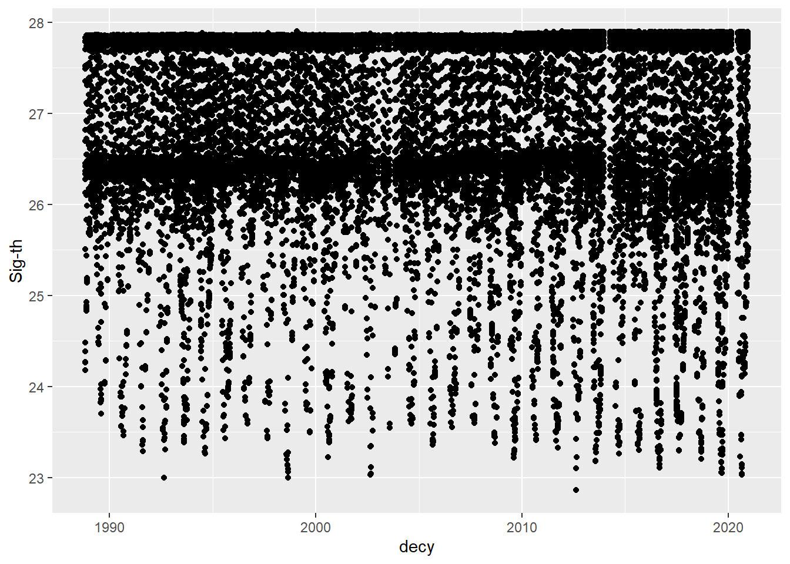
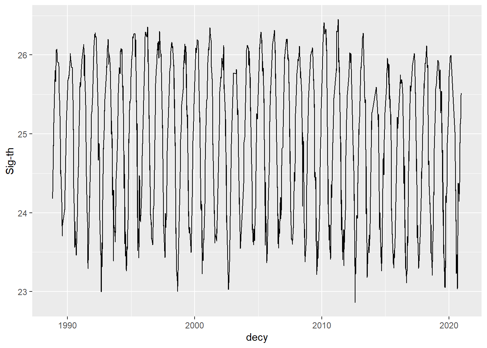
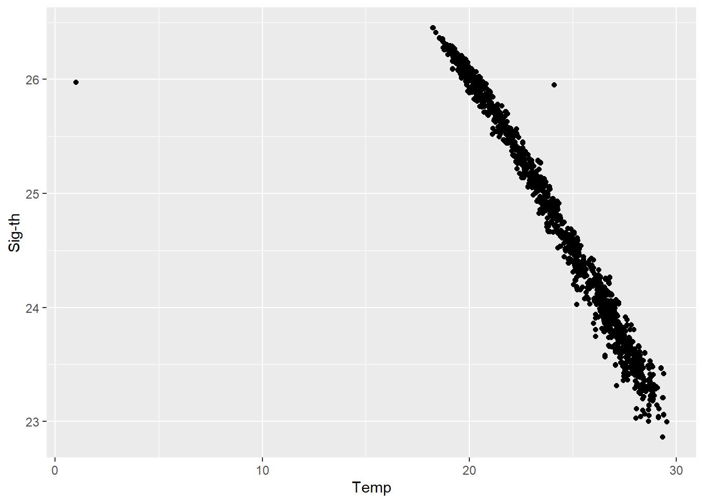

## Load required libraries

```r
library(prettydoc)
library(tidyverse)
library(gsw)
library(readr)
```

## Now we need to import our data

```r
hydrostation_bottle <- read_delim("hydrostation_bottle.txt", 
    delim = "\t", escape_double = FALSE, 
    col_names = FALSE, trim_ws = TRUE, skip = 31)

hydrostation_bottle_names <- read_csv("hydrostation_bottle.txt", 
    skip = 30)

colnames(hydrostation_bottle) = colnames(hydrostation_bottle_names)
#view(hydrostation_bottle)
```

## Hydrostation S Discrete Bottle Data for years 1955 through December 2020.

### Variable Names and Units

- yyyymmdd = Year Month Day   
- decy   = Decimal Year     
- time   = Time (hhmm)      
- latN   = Latitude (Deg N) 
- lonW   = Longitude (Deg W)
- Depth  = Depth (m)                  
-Temp   = Temperature ITS-90 (C) 
- Pres   = CTD Pressure (dbar)   
- CTD_S  = CTD Salinity (PSS-78)      
- Sal1   = Salinity-1 (PSS-78)        
- Sig-th = Sigma-Theta (kg/m^3)       
- O2(1)  = Oxygen-1 (umol/kg)          
- OxFixT = Oxygen Fix Temp (C)        
- Anom1  = Oxy Anomaly-1 (umol/kg)    
Quality flags
- -999  = No data
- 0 = Less than detection limit

```r
# lets first plot the data
hydrostation_bottle %>% 
  filter(`Sig-th`!= -999) %>% # filter out -999 no data flag
  ggplot()+geom_point(aes(x=decy, y = `Sig-th`)) # hard to interpret even w no -999s
```



```r
hydrostation_bottle %>% 
  filter(`Sig-th`!= -999 & Depth <20) %>% # filter out -999 no data flag and by upper 20m
  ggplot()+geom_line(aes(x=decy, y = `Sig-th`)) # line shows seasonality 
```



```r
# clear seasonal signal for sigma-theta, lets see how this compares to temp
hydrostation_bottle %>% 
  filter(`Sig-th`!= -999 & Depth <20) %>% # filter out -999 no data flag and by upper 20m
  ggplot()+geom_point(aes(x=Temp, y = `Sig-th`))
```




## TEOS-10 Toolbox in Package Seacarb


```r
?gsw #launches documentation for gibbs seawater toolbox
```

```
## starting httpd help server ... done
```

```r
? gsw_sigma0 # lets check this function 
# it says we need absolute salinity and conservative temperature

#first we need absolute salinity

?gsw_SA_from_SP
#practical salinity
#sea pressure(dbar)
#longitude
#latitude

#plot our pressure data - its missing before 1980s
hydrostation_bottle %>% 
  ggplot()+geom_point(aes(x=decy,y=Pres))
```


```r
#we have depth for the time series
hydrostation_bottle %>% 
  ggplot()+
  geom_point(aes(x=decy, y=Depth))
```


```r
#adds a pressure column from depth and latN columns from/to hydrostation bottle
hydrostation_bottle = 
  hydrostation_bottle %>% 
  mutate(Pres_gsw = gsw_p_from_z(Depth*-1,latN,))

hydrostation_bottle %>% 
  ggplot()+geom_point(aes(x=Pres,y=Pres_gsw))
```

```
## Warning: Removed 3 rows containing missing values (`geom_point()`).
```


```r
# we see strong 1:1 agreement between measured pressure and calculated pressure

hydrostation_bottle %>% 
  ggplot()+geom_point(aes(x=decy,y=latN))
```


```r
hydrostation_bottle = 
  hydrostation_bottle %>% 
  mutate(Pres_gsw = gsw_p_from_z(Depth*-1,latN,)) %>% 
  mutate(S_abs_gsw=gsw_SA_from_SP(Sal1,Pres_gsw,360-lonW,latN))
#plot it
hydrostation_bottle %>% 
  filter(Sal1!=-999) %>% 
  ggplot()+
  geom_point(aes(x=Sal1,y=S_abs_gsw))
```


```r
# now we need to calculate conservative temperature
# we need absolute salinity, insitu temp (ITS-90), and sea pressure
hydroS =
  hydrostation_bottle %>% 
  filter(Sal1!=-999) %>%
  mutate(Pres_gsw = gsw_p_from_z(Depth*-1,latN,)) %>% 
  mutate(S_abs_gsw=gsw_SA_from_SP(Sal1,Pres_gsw,360-lonW,latN)) %>% 
  mutate(T_cons_gsw = gsw_CT_from_t(S_abs_gsw,Temp,Pres_gsw))

hydroS %>% 
  filter(Temp!= -999) %>% 
  ggplot()+
  geom_point(aes(x=Temp, y =T_cons_gsw))
```


```r
#add line to calculate conservative temperature
hydroS =
  hydrostation_bottle %>% 
  filter(Sal1!=-999) %>%
  mutate(Pres_gsw = gsw_p_from_z(Depth*-1,latN,)) %>% 
  mutate(S_abs_gsw=gsw_SA_from_SP(Sal1,Pres_gsw,360-lonW,latN)) %>% 
  mutate(T_cons_gsw = gsw_CT_from_t(S_abs_gsw,Temp,Pres_gsw)) %>% 
  mutate(Sig_th_gsw = gsw_sigma0(S_abs_gsw,T_cons_gsw))

hydroS %>% 
  filter(`Sig-th`!= -999) %>% 
  ggplot()+
  geom_point(aes(x=`Sig-th`, y=Sig_th_gsw))
```


```r
hydroS %>% 
  filter(Sig_th_gsw<0)
```

```
## # A tibble: 544 × 19
##         Id yyyymmd  decy  time  latN  lonW Depth  Pres  Temp CTD_S  Sal1 Sig-t…¹
##      <dbl>   <dbl> <dbl> <dbl> <dbl> <dbl> <dbl> <dbl> <dbl> <dbl> <dbl>   <dbl>
##  1  6.00e9  1.96e7 1955.  1703  32.2  64.4   495  -999  -999  -999  36.3    -999
##  2  6.00e9  1.96e7 1955.  1601  32.1  64.3   144  -999  -999  -999  36.6    -999
##  3  6.00e9  1.96e7 1956.  1704  32.1  64.3   873  -999  -999  -999  35.4    -999
##  4  6.00e9  1.96e7 1956.  1704  32.1  64.3    50  -999  -999  -999  36.2    -999
##  5  6.00e9  1.96e7 1956.  1704  32.1  64.3   244  -999  -999  -999  36.5    -999
##  6  6.00e9  1.96e7 1956.  1704  32.1  64.3   685  -999  -999  -999  36.0    -999
##  7  6.00e9  1.96e7 1956.  1705  32.2  64.3    50  -999  -999  -999  36.4    -999
##  8  6.00e9  1.96e7 1957.  1703  32.1  64.3  2024  -999  -999  -999  35.0    -999
##  9  6.00e9  1.96e7 1958.  1504  32.0  64.4   961  -999  -999  -999  35.2    -999
## 10  6.01e9  1.96e7 1958.  1705  32.2  64.2   553  -999  -999  -999  36.1    -999
## # … with 534 more rows, 7 more variables: `O2(1)` <dbl>, OxFix <dbl>,
## #   Anom1 <dbl>, Pres_gsw <dbl>, S_abs_gsw <dbl>, T_cons_gsw <dbl>,
## #   Sig_th_gsw <dbl>, and abbreviated variable name ¹​`Sig-th`
```

```r
  #view()


# how to replace data in a line without making this many dataframes (i.e. select and/or filters)
hydroS_correctedS_a =
  hydroS %>% 
  filter(Sig_th_gsw<0) %>%
  mutate(S_abs_gsw=gsw_SA_from_SP(CTD_S,Pres_gsw,360-lonW,latN)) %>% 
  mutate(T_cons_gsw = gsw_CT_from_t(S_abs_gsw,Temp,Pres_gsw)) %>% 
  mutate(Sig_th_gsw = gsw_sigma0(S_abs_gsw,T_cons_gsw)) 


hydroS_correctedS_b =
  hydroS %>% 
  filter(Sig_th_gsw>0)

hydroS_corrected = rbind(hydroS_correctedS_a, hydroS_correctedS_b)

hydroS_corrected %>% 
  filter(`Sig-th`!= -999) %>% 
  ggplot()+
  geom_point(aes(x=`Sig-th`, y=Sig_th_gsw))
```


```r
## Next day
hydroS_corrected %>% 
  ggplot()+
  geom_point(aes(x=Sig_th_gsw, y = Depth))+
  scale_y_reverse()+
  scale_x_continuous(position ="top")+
  xlab(expression(paste(sigma[theta]," (kg m"^"-3",")")))+
  ylab("Depth(m)")
```

```
## Warning: Removed 543 rows containing missing values (`geom_point()`).
```


# Has surface sigma theta decreased over time?


```r
hydroS_shallow = hydroS_corrected %>% 
  filter(Depth<30)

sig_theta_tm = lm(Sig_th_gsw~decy,data =  hydroS_shallow) # y (Sig) is a function of x(decy), lm(y~x,data = data )
summary(sig_theta_tm)
```

```
## 
## Call:
## lm(formula = Sig_th_gsw ~ decy, data = hydroS_shallow)
## 
## Residuals:
##     Min      1Q  Median      3Q     Max 
## -2.5789 -0.8683  0.1070  0.8819  1.5805 
## 
## Coefficients:
##               Estimate Std. Error t value Pr(>|t|)    
## (Intercept) 33.4047230  1.6704055  19.998  < 2e-16 ***
## decy        -0.0042378  0.0008387  -5.053 4.59e-07 ***
## ---
## Signif. codes:  0 '***' 0.001 '**' 0.01 '*' 0.05 '.' 0.1 ' ' 1
## 
## Residual standard error: 0.9401 on 3410 degrees of freedom
##   (56 observations deleted due to missingness)
## Multiple R-squared:  0.007431,	Adjusted R-squared:  0.00714 
## F-statistic: 25.53 on 1 and 3410 DF,  p-value: 4.587e-07
```

```r
library(plotly)
```

```
## 
## Attaching package: 'plotly'
```

```
## The following object is masked from 'package:ggplot2':
## 
##     last_plot
```

```
## The following object is masked from 'package:stats':
## 
##     filter
```

```
## The following object is masked from 'package:graphics':
## 
##     layout
```

```r
plot = hydroS_shallow %>% 
  ggplot()+
  geom_point(aes(x=decy, y=Sig_th_gsw))+
  geom_line(aes(x=decy, y=Sig_th_gsw))+
  geom_smooth(aes(x=decy, y=Sig_th_gsw),method = "lm")+
  theme_classic()
ggplotly(plot)
```

```
## `geom_smooth()` using formula = 'y ~ x'
```

```
## Warning: Removed 56 rows containing non-finite values (`stat_smooth()`).
```

```{=html}
<div class="plotly html-widget html-fill-item-overflow-hidden html-fill-item" id="htmlwidget-ebe37f83b90e337cb510" style="width:672px;height:480px;"></div>
<script type="application/json" data-for="htmlwidget-ebe37f83b90e337cb510">{"x":{"data":[{"x":[1961.6812,1962.7715,1964.2317,1964.514,1970.3497,1973.7743,1974.0564,1974.0757,1974.2346,1975.599,1975.599,1976.61,1976.788,1977.7635,1978.936,1982.3973,1982.8329,1983.0849,1983.6959,1983.7342,1983.7726,1983.811,1983.8685,1983.8877,1983.8932,1983.9342,1983.989,1984.0712,1984.0712,1984.1096,1984.1096,1984.1836,1984.1836,1984.2521,1984.2521,1984.2712,1984.2712,1984.326,1984.326,1984.4027,1984.4027,1984.7945,1985.0976,1985.1249,1985.6921,1985.7743,1986.0921,1986.2595,1986.3058,1986.3414,1986.3798,1986.4071,1986.4428,1986.514,1986.7276,1987.3058,2018.69241,1955.0869,1955.0869,1955.1251,1955.1251,1955.1909,1955.1909,1955.2757,1955.2757,1955.3361,1955.3361,1955.3909,1955.4621,1955.4621,1955.5087,1955.5577,1955.5577,1955.5934,1955.5934,1955.6434,1955.6434,1955.6732,1955.6732,1955.7034,1955.7034,1955.7554,1955.7554,1955.8403,1955.8403,1955.895,1955.895,1955.947,1955.947,1956.0814,1956.0814,1956.1581,1956.1581,1956.1991,1956.1991,1956.4868,1956.4868,1956.5609,1956.5609,1956.5964,1956.5964,1956.654,1956.654,1956.7111,1956.7111,1956.8538,1956.8538,1956.8866,1956.8866,1956.9277,1956.9277,1956.9688,1956.9688,1957.0675,1957.0675,1957.3524,1957.3524,1957.3909,1957.3909,1957.4265,1957.4265,1957.4647,1957.4647,1957.525,1957.525,1957.5551,1957.5551,1957.599,1957.599,1957.6401,1957.6401,1957.6784,1957.6784,1957.7524,1957.7524,1957.7524,1957.7961,1957.7961,1957.7961,1957.8435,1957.8435,1957.8435,1957.884,1957.884,1957.884,1957.9992,1957.9992,1957.9992,1958.0376,1958.0376,1958.0376,1958.1143,1958.1143,1958.1143,1958.1444,1958.21,1958.21,1958.21,1958.288,1958.288,1958.288,1958.3332,1958.3332,1958.3332,1958.3799,1958.3799,1958.3799,1958.4241,1958.4241,1958.4241,1958.4622,1958.4622,1958.4622,1958.4841,1958.4841,1958.5005,1958.5005,1958.5005,1958.5257,1958.5257,1958.5444,1958.5444,1958.5444,1958.5936,1958.5936,1958.5936,1958.6292,1958.6292,1958.6292,1958.6622,1958.6622,1958.6622,1958.7058,1958.7058,1958.7058,1958.7525,1958.7525,1958.7525,1958.7934,1958.7934,1958.7934,1958.8346,1958.8346,1958.8346,1958.8483,1958.8483,1958.8483,1958.8704,1958.8704,1958.8704,1958.9198,1958.9198,1958.9198,1958.9551,1958.9551,1958.9551,1959.0045,1959.0045,1959.0045,1959.0426,1959.0426,1959.0426,1959.0517,1959.0517,1959.0517,1959.0811,1959.0811,1959.0811,1959.1195,1959.1195,1959.1195,1959.155,1959.155,1959.155,1959.251,1959.251,1959.251,1959.2924,1959.2924,1959.2924,1959.3041,1959.3418,1959.3418,1959.3418,1959.3775,1959.3775,1959.3775,1959.4047,1959.4047,1959.4047,1959.446,1959.446,1959.4844,1959.4844,1959.4844,1959.5225,1959.5225,1959.5225,1959.5556,1959.5556,1959.5556,1959.5938,1959.5938,1959.5938,1959.6401,1959.6401,1959.6401,1959.7035,1959.7035,1959.7035,1959.7638,1959.7638,1959.7638,1959.8216,1959.8216,1959.8216,1959.857,1959.857,1959.857,1959.8982,1959.9398,1959.9398,1959.9398,1959.9716,1959.9716,1959.9716,1960.0129,1960.0129,1960.0129,1960.0732,1960.0732,1960.0732,1960.1139,1960.1139,1960.1139,1960.1337,1960.1523,1960.1523,1960.1523,1960.1824,1960.1824,1960.1824,1960.2263,1960.2263,1960.2263,1960.2372,1960.2372,1960.2372,1960.2646,1960.2646,1960.2646,1960.3003,1960.3003,1960.3003,1960.355,1960.355,1960.355,1960.3965,1960.3965,1960.3965,1960.4483,1960.4483,1960.4483,1960.4895,1960.4895,1960.4895,1960.525,1960.525,1960.525,1960.5688,1960.5688,1960.5688,1960.6128,1960.6128,1960.6128,1960.6594,1960.6594,1960.6594,1960.7059,1960.7059,1960.7059,1960.7495,1960.7495,1960.7495,1960.7662,1960.7662,1960.7662,1960.8154,1960.8154,1960.8154,1960.8651,1960.8651,1960.8651,1960.8976,1960.8976,1960.8976,1960.9366,1960.9366,1960.9366,1960.9716,1960.9716,1960.9716,1961.0073,1961.0073,1961.0073,1961.051,1961.051,1961.051,1961.1058,1961.1058,1961.1058,1961.1386,1961.1386,1961.1386,1961.1498,1961.1498,1961.1498,1961.2046,1961.2046,1961.2046,1961.2785,1961.2785,1961.2785,1961.3334,1961.3334,1961.3334,1961.3909,1961.3909,1961.3909,1961.432,1961.432,1961.432,1961.4538,1961.4538,1961.4538,1961.5031,1961.5031,1961.5031,1961.5279,1961.5279,1961.5279,1961.599,1961.599,1961.599,1961.6401,1961.6401,1961.6401,1961.6812,1961.6812,1961.7223,1961.7223,1961.7223,1961.7606,1961.7606,1961.7606,1961.8129,1961.8129,1961.8129,1961.8538,1961.8538,1961.8538,1961.8976,1961.8976,1961.9469,1961.9469,1961.9743,1961.9743,1962.0099,1962.0099,1962.0509,1962.0509,1962.0849,1962.0849,1962.1359,1962.1359,1962.1743,1962.1743,1962.2154,1962.2154,1962.2646,1962.2646,1962.3085,1962.3085,1962.3469,1962.3469,1962.3853,1962.3853,1962.4236,1962.4236,1962.4674,1962.4674,1962.5086,1962.5086,1962.5441,1962.5441,1962.5768,1962.5768,1962.6207,1962.6207,1962.6591,1962.6591,1962.6948,1962.6948,1962.7361,1962.7361,1962.7715,1962.8264,1962.8264,1962.8591,1962.8591,1962.892,1962.892,1962.9442,1962.9442,1963.0099,1963.0099,1963.0428,1963.0428,1963.114,1963.114,1963.155,1963.155,1963.1934,1963.1934,1963.2317,1963.2317,1963.2893,1963.2893,1963.3276,1963.3276,1963.3742,1963.3742,1963.4235,1963.4235,1963.4701,1963.4701,1963.5002,1963.5002,1963.5605,1963.5605,1963.599,1963.599,1963.6401,1963.6401,1963.6948,1963.6948,1963.7469,1963.8235,1963.8235,1963.8675,1963.8675,1963.9002,1963.9002,1963.9475,1963.9475,1964.0153,1964.0153,1964.0674,1964.0674,1964.1112,1964.1112,1964.1523,1964.1523,1964.1852,1964.1852,1964.2317,1964.2647,1964.2647,1964.3002,1964.3002,1964.3524,1964.3524,1964.3824,1964.3824,1964.4427,1964.4427,1964.4783,1964.4783,1964.514,1964.5498,1964.5498,1964.5934,1964.5934,1964.6454,1964.6454,1964.7085,1964.7085,1964.7468,1964.7468,1964.788,1964.788,1964.8263,1964.8263,1964.8646,1964.8646,1964.9139,1964.9139,1964.9523,1964.9523,1964.9906,1964.9906,1965.04,1965.04,1965.0948,1965.0948,1965.1304,1965.1304,1965.1687,1965.1687,1965.229,1965.229,1965.2619,1965.2619,1965.3002,1965.3002,1965.3441,1965.3441,1965.399,1965.399,1965.4372,1965.4372,1965.4812,1965.4812,1965.5139,1965.5139,1965.5579,1965.5579,1965.6127,1965.6127,1965.6428,1965.6428,1965.7002,1965.7002,1965.7606,1965.7606,1965.8427,1965.8427,1965.9495,1965.9495,1965.9908,1965.9908,1966.029,1966.029,1966.0674,1966.0674,1966.1168,1966.1168,1966.1605,1966.1605,1966.1879,1966.1879,1966.243,1966.243,1966.2783,1966.2783,1966.3139,1966.3139,1966.3769,1966.3769,1966.4346,1966.4346,1966.4702,1966.4702,1966.5058,1966.5058,1966.536,1966.536,1966.5664,1966.5664,1966.6099,1966.6099,1966.6593,1966.6593,1966.7195,1966.7195,1966.7579,1966.7579,1966.7962,1966.7962,1966.8427,1966.8427,1966.8948,1966.8948,1966.9304,1966.9688,1967.0071,1967.0071,1967.0456,1967.0456,1967.0865,1967.0865,1967.1249,1967.1249,1967.1605,1967.1605,1967.1989,1967.1989,1967.24,1967.24,1967.3332,1967.3332,1967.3879,1967.3879,1967.4127,1967.4127,1967.4867,1967.4867,1967.5251,1967.5251,1967.5798,1967.5798,1967.6291,1967.6291,1967.7359,1967.7359,1967.7824,1967.7824,1967.8591,1967.8591,1967.892,1967.892,1967.9523,1967.9523,1968.0483,1968.0483,1968.1002,1968.1002,1968.2127,1968.2127,1968.3359,1968.3359,1968.44,1968.44,1968.4975,1968.4975,1968.5742,1968.5742,1968.6538,1968.6538,1968.8098,1968.8098,1968.9771,1968.9771,1969.062,1969.062,1969.1688,1969.1688,1969.2265,1969.2539,1969.2539,1969.2922,1969.2922,1969.3416,1969.3416,1969.4018,1969.4018,1969.4374,1969.4374,1969.4758,1969.4758,1969.514,1969.514,1969.5524,1969.5524,1969.5935,1969.5935,1969.6291,1969.6291,1969.6511,1969.6511,1969.6511,1969.7333,1969.7333,1969.788,1969.788,1969.8483,1969.8483,1969.9058,1969.9058,1969.9426,1969.9426,1970.0138,1970.0138,1970.1086,1970.1086,1970.1469,1970.1469,1970.1937,1970.1937,1970.2493,1970.2493,1970.2839,1970.2839,1970.3497,1970.4045,1970.4045,1970.4373,1970.4373,1970.4997,1970.4997,1970.4997,1970.4997,1970.5416,1970.5416,1970.5716,1970.5716,1970.6182,1970.6182,1970.6457,1970.6457,1970.6894,1970.6894,1970.725,1970.725,1970.7606,1970.7606,1970.8814,1970.8814,1970.9168,1970.9168,1970.9553,1970.9553,1971.2045,1971.2045,1971.2785,1971.2785,1971.3168,1971.3168,1971.3607,1971.3607,1971.3963,1971.3963,1971.432,1971.432,1971.4703,1971.4703,1971.5087,1971.5087,1971.5114,1971.5114,1971.547,1971.547,1971.5936,1971.5936,1971.6292,1971.6292,1971.6621,1971.6621,1971.7034,1971.7034,1971.7498,1971.7498,1971.7827,1971.7827,1971.8346,1971.8346,1971.8977,1971.8977,1972.1258,1972.1258,1972.1611,1972.1611,1972.2595,1972.2595,1972.2978,1972.2978,1972.3251,1972.3251,1972.3607,1972.3607,1972.4321,1972.4321,1972.4895,1972.4895,1972.5306,1972.5306,1972.6021,1972.6021,1972.665,1972.665,1972.7006,1972.7006,1972.7361,1972.7361,1972.7745,1972.7745,1972.81,1972.81,1972.8402,1972.8402,1972.9088,1972.9088,1972.9444,1972.9444,1972.9881,1972.9881,1973.0292,1973.0292,1973.1032,1973.1032,1973.1416,1973.1416,1973.1935,1973.1935,1973.2895,1973.2895,1973.3333,1973.3333,1973.391,1973.391,1973.4292,1973.4292,1973.5416,1973.5416,1973.5688,1973.5688,1973.6018,1973.6018,1973.6731,1973.6731,1973.7743,1973.8702,1973.8702,1973.9032,1973.9032,1974.0183,1974.0183,1974.0564,1974.0757,1974.2346,1974.3087,1974.3087,1974.5935,1974.5935,1974.7361,1974.7361,1975.0839,1975.0839,1975.1142,1975.1142,1975.1558,1975.1558,1975.2539,1975.2539,1975.4017,1975.4017,1975.432,1975.432,1975.4593,1975.4593,1975.5142,1975.5142,1975.5688,1975.5688,1975.6346,1975.6346,1975.6702,1975.6702,1975.7688,1975.7688,1975.9031,1975.9031,1975.9388,1975.9388,1976.114,1976.114,1976.114,1976.1662,1976.1662,1976.1662,1976.2017,1976.2017,1976.2621,1976.2621,1976.3032,1976.3032,1976.3443,1976.3443,1976.3744,1976.3744,1976.4209,1976.4209,1976.4784,1976.4784,1976.547,1976.547,1976.5717,1976.5717,1976.61,1976.684,1976.684,1976.7416,1976.7416,1976.788,1976.8457,1976.8457,1976.8787,1976.8787,1976.9141,1976.9141,1976.9635,1976.9635,1977.1087,1977.1087,1977.1469,1977.1469,1977.1991,1977.1991,1977.2429,1977.2429,1977.2429,1977.2759,1977.2759,1977.358,1977.358,1977.4183,1977.4183,1977.495,1977.495,1977.5307,1977.5307,1977.6046,1977.6046,1977.6621,1977.6621,1977.7196,1977.7196,1977.7635,1977.8813,1977.8813,1977.9498,1977.9498,1978.0128,1978.0128,1978.051,1978.051,1978.1991,1978.1991,1978.2402,1978.2402,1978.314,1978.3524,1978.3524,1978.5332,1978.5332,1978.5827,1978.5827,1978.6209,1978.6209,1978.6675,1978.6675,1978.7171,1978.7171,1978.8018,1978.8018,1978.8867,1978.8867,1978.936,1980.2521,1980.2959,1980.3589,1980.4055,1980.4822,1980.5397,1980.6521,1980.7123,1980.7699,1980.8411,1980.8849,1980.9178,1980.9644,1981.0384,1981.074,1981.1342,1981.2411,1981.2932,1981.3644,1981.474,1981.5699,1981.9616,1982.0795,1982.0959,1982.1699,1982.2027,1982.2493,1982.3014,1982.337,1982.3973,1982.3973,1982.4575,1982.4575,1982.4575,1982.4904,1982.4904,1982.4904,1982.5288,1982.5288,1982.5288,1982.6027,1982.6027,1982.6027,1982.6712,1982.6712,1982.6712,1982.6986,1982.6986,1982.6986,1982.7397,1982.7397,1982.7397,1982.7616,1982.7616,1982.7616,1982.8329,1982.8329,1982.9178,1982.9178,1982.9178,1983.0712,1983.0712,1983.0712,1983.0849,1983.0849,1983.1452,1983.1452,1983.1452,1983.1507,1983.1507,1983.1507,1983.1781,1983.1781,1983.1781,1983.2055,1983.2055,1983.2055,1983.2438,1983.2438,1983.2438,1983.2767,1983.2767,1983.3507,1983.3507,1983.3507,1983.4329,1983.4329,1983.4329,1983.4493,1983.4493,1983.4493,1983.474,1983.474,1983.474,1983.5151,1983.5151,1983.5507,1983.5507,1983.5507,1983.5836,1983.5836,1983.5836,1983.6301,1983.6301,1983.6301,1983.6959,1983.6959,1983.7342,1983.7342,1983.7726,1983.7726,1983.811,1983.811,1983.8685,1983.8685,1983.8877,1983.8877,1983.8932,1983.8932,1983.9342,1983.9342,1983.989,1983.989,1984.0712,1984.1096,1984.1836,1984.2521,1984.2712,1984.326,1984.4027,1984.4849,1984.4849,1984.4849,1984.4877,1984.4877,1984.4877,1984.5205,1984.5205,1984.5205,1984.5589,1984.5589,1984.5589,1984.6,1984.6,1984.6,1984.6219,1984.6219,1984.6219,1984.6575,1984.6575,1984.6575,1984.6932,1984.6932,1984.6932,1984.6959,1984.6959,1984.6959,1984.7534,1984.7534,1984.7534,1984.7945,1984.7945,1984.8356,1984.8356,1984.8356,1984.8767,1984.8767,1984.8767,1984.8822,1984.8822,1984.8822,1984.9123,1984.9123,1984.9123,1984.9607,1984.9607,1984.9607,1985.0045,1985.0045,1985.0045,1985.0976,1985.0976,1985.1168,1985.1168,1985.1168,1985.1249,1985.1249,1985.158,1985.158,1985.158,1985.2017,1985.2017,1985.2017,1985.2482,1985.2482,1985.2482,1985.2758,1985.2758,1985.2758,1985.3138,1985.3138,1985.3138,1985.3306,1985.3306,1985.4047,1985.4047,1985.4047,1985.4814,1985.4814,1985.4814,1985.5195,1985.5195,1985.5195,1985.5551,1985.5551,1985.5551,1985.6182,1985.6182,1985.6182,1985.6483,1985.6483,1985.6483,1985.6921,1985.6921,1985.7743,1985.7743,1985.7853,1985.7853,1985.7853,1985.8455,1985.8455,1985.8455,1985.8509,1985.8509,1985.8509,1985.8675,1985.8675,1985.8675,1985.9031,1985.9031,1985.9031,1985.9279,1985.9279,1985.9279,1985.9589,1985.9589,1985.9589,1986.0456,1986.0456,1986.0456,1986.0795,1986.0795,1986.0795,1986.0921,1986.0921,1986.2595,1986.2595,1986.3058,1986.3058,1986.3222,1986.3222,1986.3222,1986.3414,1986.3414,1986.3798,1986.3798,1986.4071,1986.4071,1986.4428,1986.4428,1986.4767,1986.4767,1986.4767,1986.514,1986.514,1986.5342,1986.5342,1986.5342,1986.5918,1986.5918,1986.5918,1986.6127,1986.6127,1986.6127,1986.651,1986.651,1986.651,1986.6976,1986.6976,1986.6976,1986.7276,1986.7276,1986.7524,1986.7524,1986.7524,1986.8456,1986.8456,1986.8456,1986.8895,1986.8895,1986.8895,1986.903,1986.903,1986.903,1987.0595,1987.0595,1987.0595,1987.1342,1987.1342,1987.1342,1987.1797,1987.1797,1987.1797,1987.2372,1987.2372,1987.2372,1987.2894,1987.2894,1987.2894,1987.3058,1987.3058,1987.347,1987.347,1987.347,1987.399,1987.399,1987.399,1987.4346,1987.4346,1987.4346,1987.484,1987.484,1987.484,1987.5142,1987.5142,1987.5142,1987.5443,1987.5443,1987.5443,1987.6268,1987.6268,1987.6268,1987.6276,1987.6276,1987.6276,1987.6539,1987.6539,1987.6539,1987.6648,1987.6648,1987.6648,1987.7991,1987.7991,1987.7991,1987.8164,1987.8164,1987.8164,1987.8621,1987.8621,1987.8621,1987.8758,1987.8758,1987.8758,1987.8977,1987.8977,1987.8977,1987.9059,1987.9059,1987.9059,1987.9224,1987.9224,1987.9224,1988.03973,1988.03973,1988.03973,1988.06705,1988.06705,1988.06705,1988.06779,1988.06779,1988.06779,1988.06779,1988.10819,1988.10819,1988.10819,1988.14632,1988.14632,1988.14632,1988.18503,1988.18503,1988.18503,1988.1855,1988.1855,1988.1855,1988.1855,1988.22857,1988.22857,1988.22857,1988.2548,1988.2548,1988.2548,1988.33425,1988.33425,1988.33425,1988.36005,1988.36005,1988.36005,1988.36073,1988.36073,1988.36073,1988.39041,1988.39041,1988.39041,1988.44783,1988.44783,1988.44783,1988.44863,1988.44863,1988.44863,1988.44863,1988.52329,1988.52329,1988.52329,1988.55184,1988.55184,1988.55184,1988.55234,1988.55234,1988.55234,1988.55234,1988.61918,1988.61918,1988.61918,1988.64495,1988.64495,1988.64495,1988.64543,1988.64543,1988.64543,1988.64543,1988.64543,1988.71898,1988.71898,1988.71898,1988.71952,1988.71952,1988.71952,1988.71952,1988.81809,1988.81809,1988.81809,1988.87845,1988.87845,1988.87871,1988.87871,1988.87871,1988.87871,1988.91398,1988.91398,1988.91398,1988.99085,1988.99085,1988.99085,1989.02082,1989.02082,1989.02082,1989.04809,1989.04809,1989.04809,1989.1112,1989.1112,1989.1112,1989.16063,1989.16063,1989.16063,1989.20172,1989.20172,1989.20172,1989.31672,1989.31672,1989.31672,1989.33858,1989.33858,1989.33858,1989.38786,1989.38786,1989.38786,1989.44817,1989.44817,1989.44817,1989.48656,1989.48656,1989.48656,1989.55305,1989.55305,1989.55305,1989.57966,1989.57966,1989.57966,1989.57983,1989.57983,1989.57983,1989.57983,1989.75777,1989.75777,1989.75777,1989.80264,1989.80264,1989.80264,1989.90818,1989.90818,1989.90818,1990.02046,1990.02046,1990.02046,1990.06425,1990.06425,1990.06425,1990.08894,1990.08894,1990.08894,1990.1795,1990.21525,1990.21525,1990.21525,1990.2523,1990.2523,1990.2523,1990.31091,1990.31091,1990.31091,1990.35434,1990.35434,1990.35434,1990.43166,1990.43166,1990.43166,1990.476,1990.476,1990.476,1990.52717,1990.52717,1990.52717,1990.5629,1990.5629,1990.5629,1990.59624,1990.59624,1990.59624,1990.62025,1990.62025,1990.62025,1990.67518,1990.67518,1990.67518,1990.71901,1990.71901,1990.7888,1990.7888,1990.80683,1990.80683,1990.80683,1990.83447,1990.83447,1990.83447,1990.88887,1990.88887,1990.94733,1990.94733,1990.94733,1990.96012,1990.98793,1990.98793,1990.98793,1991.01768,1991.01768,1991.01768,1991.06158,1991.06158,1991.06158,1991.13955,1991.13955,1991.13955,1991.21936,1991.21936,1991.26701,1991.26701,1991.26701,1991.30851,1991.30851,1991.30851,1991.32494,1991.32961,1991.3496,1991.3496,1991.3496,1991.40975,1991.40975,1991.40975,1991.43994,1991.43994,1991.4669,1991.4669,1991.54017,1991.54017,1991.54017,1991.57436,1991.57436,1991.57436,1991.60387,1991.60387,1991.60387,1991.61748,1991.61748,1991.71368,1991.71368,1991.71368,1991.7853,1991.7853,1991.7853,1991.85346,1991.85346,1991.85346,1991.8837,1991.8837,1991.90028,1991.90028,1991.90028,1991.9469,1991.9469,1991.9469,1992.03427,1992.03427,1992.07722,1992.07722,1992.07722,1992.12997,1992.12997,1992.12997,1992.15364,1992.15364,1992.15364,1992.19353,1992.19353,1992.19353,1992.25091,1992.25091,1992.25091,1992.28006,1992.28006,1992.28006,1992.30827,1992.30827,1992.30827,1992.41493,1992.41493,1992.41493,1992.46207,1992.46207,1992.49477,1992.49477,1992.53627,1992.53627,1992.53627,1992.56852,1992.56852,1992.56852,1992.63218,1992.63218,1992.63218,1992.66747,1992.66747,1992.66747,1992.70883,1992.70883,1992.70883,1992.74147,1992.74147,1992.74147,1992.76054,1992.76054,1992.76054,1992.78833,1992.78833,1992.78833,1992.82313,1992.82313,1992.82313,1992.86644,1992.89443,1992.89443,1992.89443,1992.93532,1993.03676,1993.03676,1993.03676,1993.07008,1993.07008,1993.07008,1993.11134,1993.11134,1993.11134,1993.14972,1993.14972,1993.24503,1993.24503,1993.29064,1993.29064,1993.29064,1993.31682,1993.31682,1993.31682,1993.35732,1993.35732,1993.35732,1993.44273,1993.44273,1993.44273,1993.49163,1993.49163,1993.49163,1993.5321,1993.5321,1993.5321,1993.56867,1993.56867,1993.56867,1993.6097,1993.6097,1993.6097,1993.62603,1993.62603,1993.62603,1993.68674,1993.68674,1993.68674,1993.70462,1993.70462,1993.73877,1993.73877,1993.73877,1993.78182,1993.78182,1993.78182,1993.81501,1993.81501,1993.81501,1993.85744,1993.85744,1993.85744,1993.93408,1993.93408,1993.93408,1993.96867,1993.96867,1993.96867,1994.03383,1994.03383,1994.03383,1994.06411,1994.06411,1994.06411,1994.12635,1994.12635,1994.12635,1994.16163,1994.16163,1994.16163,1994.21836,1994.21836,1994.21836,1994.25905,1994.25905,1994.25905,1994.29871,1994.29871,1994.29871,1994.33704,1994.33704,1994.33704,1994.37624,1994.37624,1994.37624,1994.43126,1994.43126,1994.43126,1994.45237,1994.45237,1994.45237,1994.49313,1994.49313,1994.49313,1994.54837,1994.54837,1994.60963,1994.60963,1994.60963,1994.62855,1994.62855,1994.62855,1994.66634,1994.66634,1994.66634,1994.68374,1994.68374,1994.68374,1994.72083,1994.72083,1994.72083,1994.75167,1994.75167,1994.80268,1994.80268,1994.80268,1994.83239,1994.83239,1994.83239,1994.87414,1994.87414,1994.87414,1994.9087,1994.9087,1994.9087,1994.94396,1994.94396,1994.94396,1994.96835,1994.96835,1994.96835,1995.0303,1995.0303,1995.0303,1995.08774,1995.08774,1995.08774,1995.12355,1995.12355,1995.12355,1995.15851,1995.15851,1995.15851,1995.20626,1995.20626,1995.20626,1995.2768,1995.2768,1995.2768,1995.31682,1995.31682,1995.31682,1995.3607,1995.3607,1995.3607,1995.39561,1995.39561,1995.39561,1995.45022,1995.45022,1995.45022,1995.47198,1995.47198,1995.49193,1995.49193,1995.49193,1995.52981,1995.52981,1995.52981,1995.55207,1995.55207,1995.55207,1995.60731,1995.60731,1995.60731,1995.64057,1995.64057,1995.64057,1995.66696,1995.66696,1995.66696,1995.70186,1995.70186,1995.70186,1995.74095,1995.74095,1995.74095,1995.77588,1995.77588,1995.77588,1995.83111,1995.83111,1995.83111,1995.86301,1995.86301,1995.86301,1995.87959,1995.87959,1995.87959,1996.08493,1996.08493,1996.08493,1996.09995,1996.09995,1996.09995,1996.12202,1996.12202,1996.12202,1996.15796,1996.15796,1996.15796,1996.19961,1996.19961,1996.19961,1996.23464,1996.23464,1996.23464,1996.28454,1996.28454,1996.28454,1996.30589,1996.30589,1996.30589,1996.34874,1996.34874,1996.34874,1996.40657,1996.40657,1996.40657,1996.44472,1996.44472,1996.44472,1996.49964,1996.49964,1996.49964,1996.52281,1996.52281,1996.52281,1996.5663,1996.5663,1996.5663,1996.60146,1996.60146,1996.60146,1996.67477,1996.67477,1996.67477,1996.74907,1996.74907,1996.74907,1996.77648,1996.77648,1996.77648,1996.81522,1996.81522,1996.8495,1996.8495,1996.8495,1996.86448,1996.86448,1996.86448,1996.90532,1996.90532,1996.90532,1996.92174,1996.92174,1996.92174,1996.94989,1996.94989,1996.94989,1996.96777,1996.96777,1996.96777,1997.01763,1997.01763,1997.01763,1997.03873,1997.03873,1997.03873,1997.07717,1997.07717,1997.07717,1997.11209,1997.11209,1997.11209,1997.13598,1997.13598,1997.13598,1997.17567,1997.17567,1997.17567,1997.21436,1997.21436,1997.21436,1997.27213,1997.27213,1997.27213,1997.34611,1997.34611,1997.34611,1997.44528,1997.44528,1997.44528,1997.53997,1997.53997,1997.53997,1997.61485,1997.61485,1997.61485,1997.656,1997.656,1997.656,1997.69477,1997.69477,1997.72723,1997.72723,1997.72723,1997.76776,1997.76776,1997.76776,1997.82927,1997.82927,1997.82927,1997.86695,1997.86695,1997.86695,1997.93656,1997.93656,1997.93656,1998.04051,1998.04051,1998.04051,1998.08121,1998.08121,1998.08121,1998.12005,1998.12005,1998.12005,1998.1627,1998.1627,1998.1627,1998.19105,1998.19105,1998.19105,1998.23249,1998.23249,1998.23249,1998.26633,1998.26633,1998.26633,1998.34732,1998.34732,1998.34732,1998.36917,1998.36917,1998.39902,1998.39902,1998.4181,1998.4181,1998.4181,1998.45648,1998.45648,1998.45648,1998.52207,1998.52207,1998.52207,1998.56879,1998.56879,1998.56879,1998.59347,1998.59347,1998.59347,1998.61307,1998.61307,1998.61307,1998.65372,1998.65372,1998.65372,1998.84264,1998.84264,1998.84264,1998.89542,1998.89542,1998.89542,1998.93831,1998.93831,1998.93831,1998.97162,1998.97162,1998.97162,1999.07496,1999.07496,1999.07496,1999.11908,1999.11908,1999.11908,1999.14728,1999.14728,1999.14728,1999.21076,1999.21076,1999.21076,1999.22774,1999.22774,1999.22774,1999.26997,1999.26997,1999.26997,1999.30623,1999.30623,1999.30623,1999.34129,1999.34129,1999.34129,1999.36328,1999.36328,1999.36328,1999.4213,1999.4213,1999.4213,1999.47291,1999.47291,1999.47291,1999.51378,1999.51378,1999.51378,1999.53312,1999.53312,1999.53312,1999.55771,1999.55771,1999.55771,1999.5895,1999.5895,1999.5895,1999.71001,1999.71001,1999.71001,1999.74402,1999.74402,1999.74402,1999.78215,1999.78215,1999.78215,1999.86184,1999.86184,1999.86184,1999.91409,1999.91409,1999.91409,1999.94188,1999.94188,1999.94188,1999.96889,1999.96889,1999.96889,2000.08083,2000.08083,2000.08083,2000.12741,2000.12741,2000.12741,2000.14701,2000.14701,2000.14701,2000.20152,2000.20152,2000.20152,2000.23982,2000.23982,2000.23982,2000.28009,2000.28009,2000.28009,2000.36078,2000.36078,2000.36078,2000.3908,2000.3908,2000.3908,2000.43116,2000.43116,2000.43116,2000.47286,2000.47286,2000.47286,2000.50346,2000.50346,2000.50346,2000.52749,2000.52749,2000.52749,2000.56075,2000.56075,2000.56075,2000.6046,2000.6046,2000.6046,2000.63778,2000.63778,2000.63778,2000.67857,2000.67857,2000.67857,2000.78379,2000.78379,2000.90088,2000.90088,2000.90088,2000.94456,2000.94456,2000.94456,2000.97116,2000.97116,2000.97116,2001.03175,2001.03175,2001.03175,2001.08536,2001.08536,2001.10583,2001.10583,2001.10583,2001.18753,2001.18753,2001.18753,2001.22138,2001.22138,2001.22138,2001.25907,2001.25907,2001.29222,2001.31707,2001.31707,2001.31707,2001.37413,2001.37413,2001.37413,2001.40759,2001.40759,2001.40759,2001.42933,2001.42933,2001.42933,2001.54178,2001.54178,2001.54178,2001.59638,2001.59638,2001.59638,2001.70095,2001.70095,2001.70095,2001.7389,2001.7389,2001.7389,2001.7689,2001.7689,2001.7689,2001.94662,2001.94662,2001.94662,2001.96892,2001.96892,2001.96892,2002.04558,2002.04558,2002.04558,2002.06188,2002.06188,2002.06188,2002.1172,2002.1172,2002.1172,2002.25388,2002.25388,2002.25388,2002.27574,2002.27574,2002.27574,2002.29184,2002.29184,2002.3684,2002.3684,2002.3684,2002.38794,2002.38794,2002.38794,2002.42088,2002.42088,2002.42088,2002.46741,2002.46741,2002.46741,2002.49786,2002.49786,2002.49786,2002.63241,2002.63241,2002.63241,2002.66203,2002.66203,2002.66203,2002.77174,2002.77174,2002.77174,2002.87311,2002.87311,2002.87311,2003.04033,2003.04033,2003.04033,2003.2837,2003.2837,2003.2837,2003.34409,2003.34409,2003.34409,2003.39053,2003.39053,2003.39053,2003.50339,2003.50339,2003.50339,2003.57533,2003.57533,2003.57533,2003.84024,2003.84024,2003.84024,2003.87833,2003.87833,2003.87833,2003.91705,2003.91705,2003.91705,2004.07022,2004.07022,2004.07022,2004.11997,2004.11997,2004.11997,2004.15494,2004.15494,2004.15494,2004.20664,2004.20664,2004.20664,2004.24785,2004.24785,2004.24785,2004.2696,2004.2696,2004.2696,2004.31056,2004.31056,2004.31056,2004.35714,2004.35714,2004.35714,2004.38155,2004.38155,2004.38155,2004.45277,2004.45277,2004.45277,2004.51261,2004.51261,2004.51261,2004.53209,2004.53209,2004.53209,2004.5699,2004.5699,2004.5699,2004.63056,2004.63056,2004.63056,2004.65467,2004.65467,2004.65467,2004.70824,2004.70824,2004.70824,2004.76399,2004.76399,2004.76399,2004.78032,2004.78032,2004.78032,2004.81594,2004.81594,2004.81594,2004.87058,2004.87058,2004.87058,2004.91475,2004.91475,2004.91475,2004.9409,2004.9409,2004.9409,2005.08161,2005.08161,2005.10322,2005.10322,2005.15194,2005.15194,2005.15194,2005.18028,2005.18028,2005.18028,2005.2205,2005.2205,2005.2205,2005.25939,2005.25939,2005.25939,2005.29498,2005.29498,2005.29498,2005.33355,2005.33355,2005.33355,2005.3716,2005.3716,2005.3716,2005.43183,2005.43183,2005.43183,2005.45331,2005.45331,2005.45331,2005.48936,2005.48936,2005.48936,2005.54442,2005.54442,2005.54442,2005.56891,2005.56891,2005.56891,2005.60198,2005.60198,2005.60198,2005.66473,2005.66473,2005.66473,2005.69494,2005.69494,2005.69494,2005.72226,2005.72226,2005.72226,2005.78271,2005.78271,2005.78271,2005.85683,2005.85683,2005.85683,2005.89978,2005.89978,2005.89978,2005.93348,2005.93348,2005.93348,2005.94189,2005.94189,2005.94962,2005.94962,2006.08071,2006.1033,2006.1033,2006.1033,2006.12495,2006.12495,2006.25655,2006.25655,2006.25655,2006.31696,2006.31696,2006.31696,2006.3504,2006.3504,2006.48191,2006.48191,2006.48191,2006.5148,2006.5148,2006.5148,2006.54152,2006.54152,2006.54152,2006.56634,2006.56634,2006.56634,2006.59899,2006.59899,2006.59899,2006.64554,2006.64554,2006.64554,2006.6757,2006.6757,2006.6757,2006.70613,2006.70613,2006.71689,2006.71689,2006.71689,2006.73873,2006.73873,2006.73873,2006.7718,2006.7718,2006.7718,2006.79697,2006.79697,2006.79697,2006.82722,2006.82722,2006.82722,2006.84853,2006.84853,2006.84853,2006.90922,2006.90922,2006.90922,2006.93546,2006.93546,2006.93546,2007.06729,2007.10633,2007.1389,2007.17733,2007.17733,2007.2127,2007.2127,2007.2127,2007.251,2007.251,2007.251,2007.28218,2007.28218,2007.28218,2007.32769,2007.32769,2007.32769,2007.36867,2007.36867,2007.36867,2007.40984,2007.40984,2007.40984,2007.44987,2007.44987,2007.44987,2007.46225,2007.46225,2007.46225,2007.48942,2007.4898,2007.4898,2007.56041,2007.56041,2007.56041,2007.61155,2007.61155,2007.61155,2007.69532,2007.69532,2007.75874,2007.75874,2007.75874,2007.83422,2007.83422,2007.85522,2007.85522,2007.85522,2007.8781,2007.92594,2007.92594,2007.92594,2007.94437,2007.94437,2007.94437,2008.03764,2008.03764,2008.03764,2008.10001,2008.10001,2008.10001,2008.12484,2008.12484,2008.12484,2008.14387,2008.14387,2008.14387,2008.2021,2008.2021,2008.2021,2008.23349,2008.23349,2008.23349,2008.3072,2008.3072,2008.3072,2008.32634,2008.32634,2008.32634,2008.41567,2008.41567,2008.41567,2008.46175,2008.46175,2008.47187,2008.47187,2008.47187,2008.49622,2008.49622,2008.49622,2008.53699,2008.53699,2008.53699,2008.55455,2008.55455,2008.55455,2008.59489,2008.59489,2008.59489,2008.61082,2008.61082,2008.65288,2008.65288,2008.65288,2008.68973,2008.68973,2008.76452,2008.76452,2008.76452,2008.79095,2008.79095,2008.79095,2008.8252,2008.8252,2008.86605,2008.86605,2008.86605,2008.88958,2008.95262,2008.95262,2008.95262,2009.10311,2009.10311,2009.10311,2009.14584,2009.17255,2009.17255,2009.17255,2009.20482,2009.20482,2009.20482,2009.24585,2009.24585,2009.24585,2009.27784,2009.27784,2009.27784,2009.34248,2009.34248,2009.34248,2009.36646,2009.36646,2009.36646,2009.41794,2009.41794,2009.41794,2009.44875,2009.44875,2009.44875,2009.50319,2009.50319,2009.50319,2009.50526,2009.50526,2009.50526,2009.5309,2009.5309,2009.5309,2009.58795,2009.58795,2009.58795,2009.61529,2009.61529,2009.61529,2009.64863,2009.64863,2009.64863,2009.68968,2009.68968,2009.68968,2009.76915,2009.76915,2009.76915,2009.79464,2009.79464,2009.79464,2009.8289,2009.8289,2009.8289,2009.8586,2009.8586,2009.89718,2009.89718,2009.89718,2009.93357,2009.93357,2009.93357,2009.95503,2009.95503,2009.95503,2009.95687,2009.95687,2010.08973,2010.08973,2010.08973,2010.14434,2010.14434,2010.14434,2010.18244,2010.18244,2010.18244,2010.22341,2010.22341,2010.22341,2010.26176,2010.26176,2010.26176,2010.26176,2010.30011,2010.30011,2010.30011,2010.33631,2010.33631,2010.33631,2010.36045,2010.36045,2010.36045,2010.47794,2010.47794,2010.47794,2010.5111,2010.5111,2010.5111,2010.56881,2010.56881,2010.56881,2010.60971,2010.60971,2010.60971,2010.63166,2010.63166,2010.63166,2010.6728,2010.6728,2010.6728,2010.74204,2010.74204,2010.74204,2010.76988,2010.76988,2010.76988,2010.79608,2010.79608,2010.79608,2010.83894,2010.83894,2010.83894,2010.86645,2010.86645,2010.86645,2010.91609,2010.91609,2010.91609,2010.93322,2010.93322,2010.93322,2010.94142,2010.94142,2010.94142,2011.1669,2011.1669,2011.1669,2011.16976,2011.16976,2011.16976,2011.22889,2011.22889,2011.22889,2011.26678,2011.26678,2011.26678,2011.3176,2011.3176,2011.3176,2011.37143,2011.37143,2011.37143,2011.38466,2011.38466,2011.38466,2011.45091,2011.45091,2011.45091,2011.46114,2011.46114,2011.46114,2011.49752,2011.49752,2011.49752,2011.49798,2011.49798,2011.49815,2011.49815,2011.49828,2011.49828,2011.49835,2011.49835,2011.52489,2011.52489,2011.52489,2011.54431,2011.54512,2011.54512,2011.54512,2011.54566,2011.62651,2011.62651,2011.62651,2011.64261,2011.64261,2011.64261,2011.66998,2011.66998,2011.66998,2011.67053,2011.67053,2011.67065,2011.67071,2011.67075,2011.67079,2011.70882,2011.70882,2011.70882,2011.73579,2011.73579,2011.73579,2011.7589,2011.7589,2011.7589,2011.7989,2011.7989,2011.7989,2011.84571,2011.84571,2011.84571,2011.8761,2011.8761,2011.8761,2011.89199,2011.89199,2011.89199,2011.91451,2011.91451,2011.91451,2011.93354,2011.93354,2011.93354,2011.94602,2011.94602,2011.99378,2011.99378,2011.99378,2012.10877,2012.10877,2012.10877,2012.1922,2012.24022,2012.24022,2012.24022,2012.24022,2012.24022,2012.24022,2012.27569,2012.27569,2012.27569,2012.49196,2012.49196,2012.49196,2012.52652,2012.52652,2012.52652,2012.61684,2012.61684,2012.61684,2012.63373,2012.63373,2012.63373,2012.65686,2012.65686,2012.65686,2012.69588,2012.69588,2012.69588,2012.73247,2012.73247,2012.73247,2012.78203,2012.78203,2012.78203,2012.80756,2012.80756,2012.8329,2012.8329,2012.8329,2012.91159,2012.91159,2012.91159,2012.942,2012.942,2012.942,2012.95196,2012.95196,2012.95196,2013.05719,2013.05719,2013.05719,2013.08197,2013.08197,2013.08197,2013.12001,2013.12001,2013.12001,2013.15842,2013.15842,2013.15842,2013.20087,2013.20087,2013.23639,2013.23639,2013.23639,2013.25956,2013.25956,2013.25956,2013.30889,2013.30889,2013.30889,2013.36658,2013.36658,2013.36658,2013.40434,2013.40434,2013.40434,2013.45174,2013.45174,2013.45174,2013.47845,2013.47845,2013.47845,2013.50596,2013.50596,2013.50596,2013.56352,2013.56352,2013.56352,2013.5824,2013.5824,2013.5824,2013.60612,2013.60612,2013.60612,2013.70874,2013.70874,2013.70874,2013.73362,2013.73362,2013.73362,2013.74577,2013.74577,2013.74577,2013.78223,2013.78223,2013.78223,2013.7965,2013.7965,2013.7965,2013.82725,2013.82725,2013.82725,2013.82833,2013.82833,2013.82833,2013.82882,2013.82931,2013.82931,2013.82931,2013.88294,2013.88294,2013.90092,2013.90092,2013.90092,2013.93645,2013.93645,2013.93645,2013.9491,2013.9491,2013.9491,2014.27396,2014.27396,2014.27396,2014.4426,2014.4426,2014.4426,2014.51964,2014.51964,2014.51964,2014.57164,2014.57164,2014.57164,2014.63163,2014.63163,2014.63163,2014.6709,2014.6709,2014.6709,2014.69836,2014.69836,2014.69836,2014.72769,2014.72769,2014.72769,2014.74232,2014.74232,2014.81881,2014.81881,2014.81881,2014.8599,2014.8599,2014.8599,2014.8945,2014.8945,2014.8945,2014.93945,2014.93945,2014.96375,2014.96375,2014.96375,2015.08752,2015.08752,2015.08752,2015.09881,2015.13647,2015.13647,2015.13647,2015.16913,2015.16913,2015.16913,2015.19175,2015.19175,2015.19175,2015.27512,2015.27512,2015.27512,2015.30876,2015.30876,2015.30876,2015.35815,2015.35815,2015.35815,2015.42094,2015.42094,2015.42094,2015.45691,2015.45691,2015.45691,2015.48382,2015.48382,2015.48382,2015.53363,2015.53363,2015.53363,2015.62659,2015.62659,2015.62659,2015.65671,2015.65671,2015.65671,2015.68701,2015.68701,2015.68701,2015.70479,2015.70479,2015.74338,2015.74338,2015.91599,2015.91599,2015.93402,2015.93402,2015.93402,2015.95371,2015.95371,2015.95371,2015.97015,2015.97015,2015.97015,2016.182,2016.182,2016.182,2016.19286,2016.19286,2016.19286,2016.22331,2016.22331,2016.22331,2016.26374,2016.26374,2016.26374,2016.28614,2016.28614,2016.28614,2016.34799,2016.34799,2016.4345,2016.4345,2016.4345,2016.44902,2016.44902,2016.44902,2016.49607,2016.49607,2016.49607,2016.51251,2016.51285,2016.51319,2016.51355,2016.51395,2016.51395,2016.51395,2016.51448,2016.51482,2016.55444,2016.55444,2016.5757,2016.5757,2016.5757,2016.62482,2016.62482,2016.62482,2016.6632,2016.6632,2016.6632,2016.71847,2016.71847,2016.71847,2016.73662,2016.73662,2016.73662,2016.75138,2016.75138,2016.79732,2016.79732,2016.79732,2016.83833,2016.83833,2016.83833,2016.88216,2016.88216,2016.88216,2016.94719,2016.94719,2016.94719,2016.9642,2016.9642,2016.9642,2017.01396,2017.01396,2017.01396,2017.1248,2017.1248,2017.26893,2017.26893,2017.26893,2017.29251,2017.29251,2017.29251,2017.34992,2017.34992,2017.34992,2017.40756,2017.40756,2017.40756,2017.44657,2017.44657,2017.44657,2017.49076,2017.49076,2017.49076,2017.50597,2017.50597,2017.50597,2017.5416,2017.5416,2017.5416,2017.61898,2017.61898,2017.61898,2017.66549,2017.66549,2017.66549,2017.70737,2017.70737,2017.70737,2017.71947,2017.71947,2017.71947,2017.73628,2017.73628,2017.73628,2017.80133,2017.80133,2017.80133,2017.80133,2017.80133,2017.82887,2017.82887,2017.82887,2017.82887,2017.84883,2017.84883,2017.84883,2017.87669,2017.87669,2017.87669,2017.90614,2017.90614,2017.90614,2017.92543,2017.92543,2017.92543,2017.9449,2017.9449,2017.9449,2017.96892,2017.96892,2017.96892,2018.02777,2018.02777,2018.02777,2018.04772,2018.04772,2018.11899,2018.11899,2018.11899,2018.16087,2018.16087,2018.16087,2018.20291,2018.20291,2018.20291,2018.23112,2018.23112,2018.29161,2018.29161,2018.29161,2018.31412,2018.31412,2018.31412,2018.38874,2018.38874,2018.38874,2018.40693,2018.40693,2018.44333,2018.44333,2018.44333,2018.48979,2018.48979,2018.48979,2018.54787,2018.54787,2018.54787,2018.57772,2018.57772,2018.61346,2018.61346,2018.61346,2018.67867,2018.67867,2018.67867,2018.69241,2018.69241,2018.7309,2018.7309,2018.7309,2018.74178,2018.74178,2018.74178,2018.77602,2018.77602,2018.77602,2018.79418,2018.79418,2018.79418,2018.8458,2018.8458,2018.8458,2018.94411,2018.94411,2018.94411,2018.96028,2018.96028,2018.96028,2019.0182,2019.0182,2019.0182,2019.037,2019.037,2019.037,2019.12896,2019.12896,2019.12896,2019.18907,2019.18907,2019.18907,2019.27046,2019.27046,2019.27046,2019.3003,2019.3003,2019.3003,2019.35884,2019.35884,2019.35884,2019.40145,2019.40145,2019.40145,2019.42784,2019.42784,2019.42784,2019.50897,2019.50897,2019.50897,2019.53387,2019.53387,2019.53387,2019.57449,2019.57449,2019.62465,2019.62465,2019.62465,2019.65676,2019.65676,2019.68462,2019.68462,2019.68462,2019.70906,2019.70906,2019.70906,2019.73955,2019.73955,2019.77262,2019.77262,2019.77262,2019.80231,2019.80231,2019.80231,2019.85144,2019.85144,2019.85144,2019.87407,2019.87407,2019.87407,2019.90668,2019.90668,2019.90668,2019.93946,2019.93946,2019.93946,2019.96332,2019.96332,2019.96332,2020.01676,2020.01676,2020.01676,2020.05662,2020.05662,2020.05662,2020.10011,2020.10011,2020.10011,2020.15553,2020.15553,2020.15553,2020.46454,2020.46454,2020.51352,2020.51352,2020.51352,2020.53131,2020.53131,2020.57335,2020.57335,2020.57335,2020.62493,2020.62493,2020.62493,2020.64472,2020.64472,2020.64472,2020.70946,2020.70946,2020.70946,2020.73589,2020.73589,2020.73589,2020.77183,2020.77183,2020.77183,2020.78873,2020.78873,2020.78873,2020.8273,2020.8273,2020.8273,2020.87157,2020.87157,2020.87157,2020.89482,2020.89482,2020.89482,2020.92027,2020.92027,2020.92027,2020.94126,2020.94126,2020.94126,2020.94946,2020.94946,2020.94946,2020.95836,2020.95836,2020.95836],"y":[null,null,null,null,null,null,null,null,null,null,null,null,null,null,null,null,null,null,null,null,null,null,null,null,null,null,null,null,null,null,null,null,null,null,null,null,null,null,null,null,null,null,null,null,null,null,null,null,null,null,null,null,null,null,null,null,23.3098846110677,26.11431960696,26.1049320359045,26.1796601409883,26.1889921766681,26.2218152264077,26.2513770680048,26.204958477078,26.3278972585531,25.6433842622403,25.8756192638846,25.5377405765021,24.8156559803217,25.3650977500783,25.2264857058665,23.7584616081637,25.1308652302409,23.4320745484914,24.5382567416923,23.7061734678725,23.9292093221927,23.2460843148028,23.4424926069509,23.8130982148649,24.0155537722314,23.8153356418974,23.9560747740807,24.4784869486955,24.4927465780684,25.0679861788781,25.0982172142092,25.5233412805967,25.5625810813526,26.2044171065131,26.2467991128196,26.1811458852312,26.2178790026055,26.0942989828491,26.1710132331646,24.5156430563104,24.9561078864531,23.957706847555,24.7850159306961,23.8268325113369,24.3745877270405,23.7259022525666,23.9614478769427,23.7003752124749,23.9976293762832,24.6709871307319,24.7919173043178,25.0416808371654,25.0680165628355,25.2109151939844,25.2208864883826,25.4746404737064,25.4690300768168,25.8146800841371,25.8198128492004,25.4994412671201,25.6016847001445,25.5479113565796,25.6816509527739,24.7559265816951,25.5766602522572,24.5135985750157,25.1084811182029,23.8767809241621,24.3618902672322,23.6376000553961,23.9619631695765,24.3046530849804,24.1300267344834,23.7994036337348,23.9400686383323,23.3293320976464,23.5889658722843,24.0197372348664,24.0640922509265,24.1008007823243,24.3918393285351,24.4694870698638,24.4570189141068,24.401991649572,24.4144794511212,24.4395621135209,24.5331256729417,25.3278985289212,24.73854430652,25.4830500794353,25.5368699265111,25.5536958166047,25.7394005856847,25.7542767561602,25.77414495272,26.1375332963501,26.1581053790426,26.1476006589319,26.3174909198347,26.3628319945778,26.3518380865235,26.3661711202144,26.2829060941058,26.2547038327352,26.3155215432164,25.8202692563443,25.966889862563,26.0334121181047,25.518498713695,25.6122492046743,25.7223197103517,24.7976681565406,25.3546694864651,25.4660392355477,24.5221820487068,24.5273356737309,25.1520722650168,23.9036907291885,24.5246542905095,23.8591131437661,24.1310218376661,24.424451462517,23.3574190575622,24.136477302163,23.2376150429309,23.2570544570782,23.9034962734194,23.3614107342153,23.4305804287335,23.7242422442134,23.3371912713195,23.2870076505338,23.3416650343671,23.3074202402763,23.2982002168208,23.36265296136,23.5140916647382,23.6556721754908,23.5168355981427,23.5033472159848,23.5939052440252,23.5883563464583,24.031397003891,24.0483992163283,24.0720834994988,24.4610570365119,24.4767698329565,24.4581068256712,24.5767685864121,24.7590412925385,24.6614932456637,25.0904409635111,24.8605506244064,24.8650127409874,24.8321297094001,24.8768951399757,24.9420043204918,25.1549021327692,25.1183373333361,25.0791004101893,25.5101788836489,25.4947633239594,25.4741220139474,25.7934606387266,25.8073392655806,25.7950400979917,25.7701482372179,25.770153380289,25.7977739228854,25.9529146802906,25.9454290161254,25.9936059611643,26.1235764643352,26.1249543550841,26.1166587184125,26.0755748025172,26.0649921360894,26.058187565254,26.049113099964,26.1332717135376,26.170244005307,25.881687454646,25.8870712069024,25.9168100613288,25.9324007818848,25.6826600004324,25.7136662293947,25.7348648040579,25.5142670449982,25.579730861803,25.7476729279781,25.6684950525287,25.718409149498,25.947327357816,24.7474606638204,24.9210063634996,24.4263539462177,24.5736976451094,24.7385613759068,23.9886710896805,24.5834595715303,24.9577693742192,23.641049515664,23.7467341401211,24.2065214781339,23.7505296456976,23.891676867955,23.8889185883417,23.8090801564796,23.8170489528434,23.6163038895463,23.7414517360166,23.7549273502107,23.8548950831142,24.1665061974697,24.2614099234227,24.2883840985389,24.5080494001147,24.5426851201066,24.5798376643149,24.5994856433956,24.5977953022832,24.6499106657486,25.0044521484385,25.3163397591704,25.3035724763299,25.3105958512681,25.4692215199068,25.4121743858284,25.4366388811511,25.6897625236627,25.7205934389031,25.7421796696842,25.9144819825156,25.9226172750075,25.9294140174502,26.0592296019454,26.0792081628381,26.0825484468889,26.0049287172421,26.08936537768,26.1236346254411,26.0924678930687,26.2140625725144,26.2168727176061,26.2149746427458,26.1699285624579,26.2091058455346,26.2097958946777,26.1828373866476,26.2360638922148,26.2426798894207,26.1660545392717,26.2308210376877,26.2283410769803,25.7824121171793,25.9694409553404,26.0482084156013,25.5015138383756,25.6632075127407,25.7482419554199,25.2822003076685,25.4649312341855,25.6653740947918,25.0897165067031,25.1417992659387,25.7366600537571,23.9458728115468,24.0421191844,25.0471931390423,23.8575746630339,23.8813826852249,24.6018560968971,23.6459269138442,23.6188684850097,23.9556108203343,23.4110481212255,23.4149824957834,24.2645455476741,23.3182425116914,23.378579063792,23.4225625933842,23.2381914124493,23.3077258671265,23.8777422875347,23.8002986160525,23.8182776167077,23.8265136953202,23.9126521604916,23.9413882881341,23.9489202770058,24.2576303461015,24.266702065516,24.2669934425292,24.6737512610327,24.7184448891239,24.7297812576755,25.1297473896313,25.1390627157427,25.1284840994899,25.40871087699,25.3995661895433,25.3995613432583,25.6003460119932,25.5964297211165,25.5987357626989,25.6901943390224,25.7037194228544,25.6910994995833,25.8775423362235,25.8955377749655,25.9061707070232,26.1214087048986,26.1213809322419,26.1315543693997,26.1709406974007,26.2018489196766,26.1968912176919,26.0483474398086,26.1097774679581,26.1481550999351,26.1160138037103,26.1066376105853,26.1059960133912,26.0090276375847,26.0563290928608,26.0653758760491,25.9183476151745,25.9275972574278,25.9310866047531,25.5508206869963,25.6132551615092,25.6779459177146,24.8582511548386,25.1245352029862,25.3008453771483,24.5367214081209,24.5455649930425,25.0883393796846,24.1563278156518,24.3899487418234,25.4520385407504,24.5526862820127,24.0101544754768,25.1458905666382,23.0651125925278,23.3132533052193,23.4229839828126,23.1118444784374,23.3087063407937,23.5178631431443,23.3843042025264,23.5596366635009,23.5448817170832,23.6077120301616,23.6834544514206,23.9228391499311,23.8990843843166,23.9336994136042,24.127118707923,24.1199319215632,24.1273145828479,24.3383118450115,24.3489835786222,24.3849236753636,24.6173842495191,24.6294775256501,25.2259857602016,25.2277205575651,25.4644730467135,25.4282229429916,25.6287282581393,25.5949290146082,25.8348475866446,25.8368151440234,25.8623903373593,25.8558727816126,25.8093860334463,25.8152394709612,25.8961253443053,25.8820408975123,25.9811907634839,25.991903575057,26.1686337292804,26.1636410760541,26.1852087998057,26.19805240552,25.7735770100894,25.8769976253104,25.5732470797932,25.8624954113698,24.961374283256,25.743832636914,24.7628793602087,24.8739495972072,24.5284976975088,24.5934373321882,24.0450590511473,24.4490889396964,23.6686471389448,23.9121056900088,23.6878192954899,23.7551225017847,23.4381103281521,23.5492841306774,23.4042811253931,23.4771666486203,23.6343232634828,23.6865069491323,23.8683466088013,24.3371907521494,24.4081223973521,24.6903058909313,24.6888251296616,24.9698634288022,24.9764582965017,25.2137337013364,25.2078904683203,25.8055732657915,25.8286374701697,25.9688045240334,26.005489297256,26.0923245644085,26.0694385721113,26.0364442078235,26.0369076450909,26.2067712025071,26.2004237334415,26.2345720802427,26.2336447974947,26.2996006415819,26.3011919102664,26.2839509293024,26.2865996238254,25.7482963111904,25.8439757090118,25.1695794389543,25.4177749024786,24.7703905926389,24.948399552504,24.3769483334327,24.7801835694954,23.9186298961795,24.6165010226591,23.5762920419048,24.2341000207907,23.5735360562844,23.6854473666659,23.6854792191356,23.7236479470919,24.1235627547451,24.5783900331355,24.5995228196907,25.0897604372715,25.1106571864048,25.4664825412838,25.4690925634241,25.6991048113537,25.6896928446813,25.8570567325285,25.8491236255581,26.054384503846,26.0755405761906,26.2006749324121,26.2053483503578,26.3462715330465,26.3269236739552,26.2516181814563,26.2776544602846,26.4098197551009,26.4544726708361,26.460106075567,26.2020106195098,26.2999201613461,26.1449755694421,26.2444972150081,25.5735811114491,25.8167656212427,25.2473833759811,25.202132716953,24.5597293887777,25.0793041712375,24.5512784784748,23.5497663595173,24.62777872881,23.9483383729538,24.0510313326445,23.6996442989511,24.035435626791,23.983226794261,24.0321751366903,24.1007993215635,24.3900175806816,24.1811653906307,24.2022371085611,24.5352900560065,24.5300217241693,24.8461159635324,24.9069439638545,25.2161201871586,25.2113701705518,25.5511039036321,25.5795849263573,25.7525328752065,25.7944601228119,26.0586664970886,26.1128864978082,26.24513739385,26.2721257355574,26.2061140904834,26.213276792444,26.2887776035943,26.3476337726681,26.223940210999,26.3068219024412,26.2495654024947,26.3116532468055,26.3018806042605,26.3151000880835,25.9390782042819,26.0254572122487,25.3597547092936,25.8420288401041,24.4308920100154,25.727324413677,24.4344317730206,24.8262958044229,24.0312810835792,24.5005154800601,23.7882011929471,24.4001469534574,23.5448180853988,23.9524908998587,23.5919215747421,23.7986518029179,23.9357283811595,23.9848067828608,24.7410589777969,24.726886126291,25.0208758612691,25.0134965124887,25.3948027821871,25.3928691552983,25.5914963033717,25.6825017033984,25.7740283554679,25.7832456362632,26.0789065391582,26.1094500806212,26.3569732460755,26.3720346714972,26.3457466630678,26.3783655914983,26.3551739772029,26.3513725588346,26.3742786774676,26.3600842910673,26.3186708849646,26.3682491758291,26.2022202736584,26.3501520952127,25.6949739271834,25.8102851393762,24.9524395613937,25.3757186626412,24.5366330379852,25.2393114866379,24.5829843464812,24.6866150695598,24.1568436356088,24.9646492657603,24.3022817389317,24.0567110817842,23.3085569423898,24.0972380297619,23.4104124598197,23.5326412049467,23.8394742910889,23.8763512076176,23.9738313952835,24.1211343312732,24.1830438907316,24.2958180447044,24.5661765329971,24.60210104011,25.2577736146163,25.2772926397597,25.5458175450503,25.6409095925055,25.8751419835619,25.8657435232287,25.9442012183431,25.9932165795756,25.9106569575038,25.9387661491194,25.9780044757965,26.0188122256795,26.0879072478494,26.0981046839825,26.015034139821,26.1102421455887,26.1481278789431,26.1816322771208,26.2355872366875,26.282240874571,25.5050586006093,25.9755957414977,25.6303588318408,25.9492703222052,24.7014752194484,25.4767436198824,24.1755729239335,25.4529793927532,23.9012202846668,24.8906361340819,23.457258185899,23.8615471040422,23.7353121513432,23.7378408737774,24.1365325671709,24.1578591937246,24.6923660747793,24.7619933602996,24.9311367387361,24.9390904648169,25.4601316057729,25.3917682566344,26.1086472449356,26.1203605671037,26.1981247189083,26.1989339889849,26.2937414735784,26.3932809381874,26.0949643345266,26.1646245969284,24.9676673065878,25.6340695271624,23.9678588060495,25.384693889366,23.3929453621623,24.5481593121785,23.3814920665293,23.460557459632,24.4981474358426,24.5296761909099,25.7249809119526,25.6975584411796,26.1996407473798,26.2151521965816,26.4484711742821,26.4301508914243,26.4839613123377,26.3109384227414,26.4028094356956,26.3158932562287,26.3090593899838,25.9553794620481,25.9647024297578,25.4946753950314,25.6906975663044,25.0896931405962,25.3839573008822,24.191386021691,24.9003368212711,23.6095632090252,24.6208260290528,23.2046799066886,24.1493852301794,23.6412476190915,24.507702462319,23.2099414010357,24.0744641922886,23.6924438881027,23.6368143045838,23.6535824442607,23.7385905059517,23.8638072993007,24.1624944421637,24.1850506622659,24.9802099550921,25.0270392391049,25.4882996920196,25.4519005163161,25.7470107247721,25.7309606577053,26.0196168667078,26.0326489041092,26.3970148627664,26.4269902048325,26.4636913265922,26.4742356153581,26.4457751197056,26.4635390655701,26.2117127183424,26.2355659543882,26.3551161779749,26.3976483088454,25.7969137194937,25.2215630069234,25.6444904363302,25.2440927907514,25.6397351512558,24.4399789822407,24.2353748401531,24.629670115552,24.8248944864963,24.0324037224361,24.4547472848465,23.6347509566045,25.1783733204409,23.6058786065073,24.1649198506923,23.4452548897606,23.7396192552239,23.492389271504,23.9647034963857,23.4715800984827,23.4904534449068,23.5664101789845,23.7588907812863,25.1005788591958,25.1006100690399,25.4319710143861,25.4622501164049,25.7515341235946,25.7477582291183,26.2373080564369,26.3136097526992,26.2305442668162,26.2509014060981,26.0316957486345,26.1931472431918,26.029536058222,26.0453679393879,25.4382409574837,25.6280211370042,24.9573539204566,25.3811319161177,24.5384740803711,24.8976009419748,23.9272889681467,24.7976163070043,23.8206079430126,25.1150415349616,23.8393026066235,24.7410913951589,23.7650670537691,24.9190760472729,23.63314864865,23.9146612624977,23.4098666832462,23.619570377202,23.3050119777605,23.5224667040308,23.8949968876093,24.169716253087,23.696982333887,23.9446630134493,24.2659854753988,24.3376696305008,24.9610214012494,24.8852466041576,25.8809782122066,25.9476599113721,25.9827743555663,25.8698490081276,26.1223428587314,26.1783691359849,26.0451845180048,26.2424176907664,25.8681308194152,25.890679268847,25.780289954258,25.8408591361283,24.6652676215317,25.6301763240158,24.7048071353056,24.9035852302545,24.0230380304083,24.7047146623177,23.6262554829052,23.7680351192115,23.6795691173552,24.1580530178312,23.5117739021965,23.9408401798985,23.5607287999086,23.5933426551957,23.8569179666102,23.99779947847,24.2463597991789,24.3324734888554,24.4132835451178,24.4194641529705,25.0160110049817,25.0683741978089,25.1714962857309,25.1652339725297,25.4237933693987,25.4708012574333,25.7526146349392,25.803162379166,25.9330240956983,25.9367445332391,26.0665746136738,26.077320200616,25.888587884476,26.0890846457894,26.0431424122396,26.0994360690286,25.7604842955195,25.783162354966,25.2233527078306,25.6653740947918,24.8756234734115,25.3148166985882,23.9588811963032,24.9068518667348,23.9358734795792,24.2882028724248,23.6421640705012,24.5421523803702,23.5348006060267,23.764870931516,24.0360690862324,25.1859162292337,25.2216178124916,25.4764011635823,25.4903033504806,25.6161122668125,25.7358201281127,25.9594331861308,25.9206814651905,25.8576693921354,25.9324423450519,25.9639200419931,24.0385524736205,24.462461574818,23.9307495092946,23.6704367362943,25.7768620420068,25.876808554033,25.9110495138782,25.9363876612724,25.9447887165072,25.9832452032297,26.0097894724618,26.021632062859,24.7550936540508,25.0396176164757,24.503494232147,24.5666543903108,24.5689236826004,24.8550721991096,24.5335613450575,24.7350298510671,24.1178037975376,24.7552872150966,23.6912735051628,23.8559312169408,23.6078038950446,23.8212698693363,24.1750612120136,24.235250134029,24.7528968967038,24.875090017696,25.1519132617721,25.1649517368201,25.9850662502431,25.9711635012779,25.9790246942953,26.0281240194247,26.0895470445248,26.1027540529237,26.0352569088209,26.0749764567106,26.0080851636753,26.09898606809,25.7685769993873,26.1559247212863,25.7354792953852,25.7902136486805,25.0805306705465,25.6425176210444,24.8514534137387,25.3152375497586,24.3945646422112,24.8006059023521,23.9388698470485,24.4141207631931,23.796318687013,24.0533686476001,23.7474687962128,24.0436959990809,24.6142926091331,23.9532970091019,24.0862064286991,24.2429689372182,24.7690806259989,24.8721844050156,24.9779186847672,24.9735510568187,25.1009806140132,25.1320854357007,25.4667542618245,25.497070684989,26.240363611206,26.2458313857346,26.2253379134318,26.3056252659533,26.1289348285056,26.249919916982,26.1626738161144,26.2378907147438,26.2409076543977,26.1395812968346,26.1325771607935,25.8654397615633,25.8908513075955,24.9676976282956,25.9088379309785,24.1069094619284,25.4274874684947,23.6439220472512,24.7939276171078,23.2699587291035,24.2540340094736,22.9708212569407,23.4184516467578,23.714948320822,23.8222299441528,24.1129926160322,24.7603300810442,24.7603188136559,25.3167559843694,25.3262466276944,25.7030607340141,25.7094725750601,25.8230316877632,25.8441299356482,26.1579508522786,26.2590685980879,26.0821636765327,26.2652322653016,25.7960889116162,25.9979499227106,26.0564043515583,23.721115957899,25.5373993426572,23.3832543621136,24.1973595861507,23.3245873019572,23.6884414284073,23.5051021573199,23.6589595832784,23.8070420437857,23.8632230378937,24.2211057043787,24.2373381021546,24.5809218169027,24.5920688608051,25.0880639383024,26.2245338233374,26.0935969551081,25.8673219575307,25.4746784921383,24.7385656216777,23.6922919892083,23.655722576536,23.4748531866617,23.6253265771109,24.5431253868494,25.1609761732495,25.4395636453874,25.6327860540971,26.1093852721026,26.137478826588,26.1210208512621,26.4076761673236,26.1709407280466,25.6384245501752,24.7562200428479,24.0124271334221,25.7074651306964,26.2329426679228,26.1258836172808,26.1588530948304,26.0294584449364,26.1037223309659,25.7282445317639,25.7097734790045,24.5624346944426,25.2163424445716,24.4967128518249,24.6596129133361,24.8798249727624,24.0085245835758,24.1040791822959,24.1378099375361,23.5946336820341,23.9082274821711,23.9121500853155,23.5774607066782,23.5781897078883,23.7002499812193,23.4967197824174,23.6206636110712,23.6850584504899,23.4332472468718,24.1693208485669,24.2904433819456,23.7051808614916,23.7181555475059,23.8686279648028,23.7725324720444,23.7542490654339,23.8413586525959,24.4444616697565,24.4533135110123,24.9263433098729,24.9774525726386,24.9880582847579,25.8461678260446,25.8237712683706,25.8309817146344,25.7731970805453,25.7839854825588,26.0626060539164,26.1546423252391,26.1507428005705,26.1332957897962,26.1963295492892,26.2026288220732,26.1045008408887,26.2170479615854,26.2118124063054,26.1273992275235,26.1790026335375,26.174151637209,26.1047184119675,26.1559336475932,26.2028370782455,26.1596329872634,26.2184628305849,25.5229931146121,25.7429757772154,25.7825867563422,24.4967162523294,24.7989704187714,25.4668205966329,24.2982701516412,24.4616894464557,25.3291471978443,23.8346156840577,24.28533211577,24.684490937384,23.8816281695706,24.4935304977337,23.7849276209953,23.7211472026133,23.9406589894564,23.0537472362959,23.512373715447,23.8319318513238,23.5547500775085,23.4183334854474,23.5602315065297,23.4514549118821,23.5468794768688,23.5793246953161,23.5729474758724,23.5575965969202,23.6110223182003,24.2647316633447,24.1934904456491,24.7861102812453,24.8338528346026,25.0832041698047,25.0533698260117,25.095313699378,25.0882096499345,25.2493442329419,25.1829200009188,25.4091797876217,25.4054081535762,25.6878323597516,25.9828628686321,25.9424027399675,25.9989499341161,26.0606057839971,25.9330615338843,24.865914873971,24.8537536031902,24.8301622259478,24.9227262977354,24.8157590833296,24.8677525445187,24.9211056678987,24.2233729877837,24.3428698420084,24.3735984125492,23.3211887191279,23.9238621046168,24.6336367998438,23.751809223497,23.7867130013791,24.5129413558579,23.4966568718977,23.7064085453455,24.774085352253,23.5573804130194,23.6402917714373,24.0152811842315,23.999797951696,23.9908953297023,24.0285758375837,23.9251180931655,23.9862037959628,24.0060257569362,24.3980029041084,24.3757184955348,24.4905308758734,24.9286182728247,24.8258896428806,24.773203418411,24.7834742418538,24.8058958133252,25.2060490659208,25.1979501407825,25.1551084153011,25.2914144433723,25.2460096561761,25.2562387711753,25.5362278400889,25.5417413551659,25.5432337004154,25.6814662666659,25.6603510664954,25.6342402234541,25.6803225885301,25.7066575770446,25.7166732452936,26.1320901132437,26.129421860767,26.1901796096547,26.2089176427646,26.1979646353623,26.1425065056203,26.2248467756751,26.1542681727165,26.1523954062868,26.1467884470042,26.1447988913269,26.18476894132,26.1996127049918,26.1763209373398,26.2277299165262,26.2432735280938,26.0664265996759,26.1138449435257,26.1171169385386,25.9136836393868,26.0417596864434,26.0449562464592,25.9178355418226,26.0711196173177,25.0538604670608,25.2853103173352,25.3899290739007,24.1378242573282,24.2607734029307,24.9535921438969,23.8605715298671,23.882726905197,24.3817797473612,23.7867470139632,23.9515721555607,24.0128360911888,23.8202092826544,23.8506666358967,23.8935463216642,23.3917788443715,23.6763266378409,23.7420839234144,23.6115370383533,23.665071273994,24.0725777157706,24.0446664885853,24.0766779402218,24.1711020753955,24.1351979324982,24.4009525068061,24.4001343392065,24.4185989607745,24.5346725714267,24.6442798601861,24.5255017806212,24.7478354676052,24.7325445925951,24.7927385764453,25.0774290046443,25.0991070806572,25.0707537081303,25.2024734100905,25.1916182722666,25.1893897714103,25.437350787294,25.4807896068803,25.4778061848974,25.5917281126617,25.5861295109642,25.6114224465109,25.8629422665911,25.8614733103491,25.8813315757291,24.9288259372759,24.8532762690054,25.9444735002025,25.9908387876389,25.529389814604,25.8618387239057,25.9125946245936,25.9153644958958,25.9606015693591,25.8572085503047,25.8641629049023,25.6763532526531,25.8451471619931,25.5833593544603,25.7992024018213,24.920620053826,25.3927512801913,24.5026721393306,24.5305872460865,25.0309106719947,24.0368447267515,25.2653058950873,23.9212148913043,24.0550698801087,24.1641505563923,23.2752990806813,23.6322240290477,24.0564958437819,23.0850535820475,23.4047850552779,23.810443111639,23.5202104054799,23.5304317877882,23.5672249822502,23.8826328530786,23.8776360332712,23.9254662390786,23.96788300121,23.9871504882311,24.0572485174944,24.055203179229,24.0738051812496,24.735592647138,24.7900870885646,24.8139816497464,24.957181706558,24.9606799183196,24.9801217112004,25.0453215289861,25.044348367014,25.0559088947325,25.7789313559742,25.8083888889416,25.8255613303431,26.1181744890687,26.1225967772987,26.1266599694779,26.1340562888067,26.1452974958127,26.1797751650649,26.2119521539692,26.2071988471751,26.2716604130442,26.0570702431273,26.1468249301306,26.1702905358097,25.9548065939969,25.9786356882244,25.6795701557933,25.7696705337135,25.910721306886,25.2208277994378,25.3471974249362,25.1063078596676,24.9136428652639,24.9677187241853,25.1331407099028,24.3030781759733,24.4957839800998,24.6465526493262,23.8614061131515,24.4941740382826,24.8128240629521,23.7898126112259,23.8047992950731,24.8591374183004,24.1224466113592,24.2273448884973,24.286690390112,24.2300606225438,24.2368718628616,24.2532149692902,24.1038471307879,24.2014980378574,24.2443405865934,23.9191566576833,24.0474462678701,24.2789803801813,23.7384470825126,23.91777369276,23.9639351764084,24.1020360030252,24.0979502150096,24.1881099925038,24.5640504479738,24.6325399319951,24.6455211937555,24.8019590008273,24.7891720676266,24.7982642893207,25.2499204288204,25.2371337849434,25.5208142670281,25.3030611784106,25.3304250214012,25.3358199342883,25.3134602413479,25.338160933172,25.3318769031891,25.9141430744385,25.9111385146175,25.9233425969951,25.9489668684805,25.9573448745089,25.9634905794267,25.948650466313,25.9473201157746,25.9604477363889,25.9862949134179,25.9582969491814,26.0455320212618,26.0454775308433,26.0107792718238,26.0478011007399,26.0612587529006,26.1726854211454,26.1950834532852,26.1983373736889,26.1620432225818,26.1731623830497,26.1847728901575,26.1932362253449,26.1483473651633,26.1704145995832,26.1687712944563,26.0049194412527,26.138535957853,26.1713757520497,26.0447612929836,26.0547952095096,26.0887663793171,25.5268660581178,25.9039319642995,26.0162984332019,25.6463688211043,25.8174646957864,25.892103788909,24.9885305301154,25.4705644670184,26.0759511276815,24.9841079625814,24.9889951247064,25.7925967984856,24.9881317058578,24.9846896742083,24.9937670058168,24.9935987486658,24.1487194841698,24.3435436555831,24.819371026317,23.7303845765942,24.1415140840411,24.4391992509575,23.6514405180895,23.7017733885074,24.1496351779501,24.2381734671769,23.1814735289981,23.41939847505,24.1885913227093,23.3090790210882,23.3679803260275,23.4795945167751,23.3370195941468,23.3482782169648,23.3760694611642,23.3965724970071,24.14354606452,23.4530426862021,23.4751738980683,23.4921874860469,23.4555697556598,23.4551273898503,23.4770186458042,23.4969869798335,24.1775975841936,24.2634567699163,24.2711030222024,24.8315772815577,24.858590038994,24.8439639441501,24.8524665631396,24.8454561484155,24.8629653689675,25.1434141621041,25.1401447350486,25.1475798402785,25.6909439208287,25.6867008425534,25.6912311421345,25.8205418384223,25.8045359765406,25.7854208492147,25.6834612720556,25.670521898872,25.6643327368893,26.0746967066607,26.0666247880081,26.0521423846399,26.0945305025307,26.0791363402902,26.03581108191,26.016962703731,25.9894713720557,25.9140917221571,25.9208670921967,25.8966986420137,25.8618061600694,25.7555262487567,25.716052058656,25.5223033521611,25.426146358644,25.3320724281934,25.2282402157157,25.600800449273,24.6456885988832,24.4882044906499,25.0653215108148,24.5395011674118,24.4616365704758,25.1283192059068,23.9708837696628,23.8248516699817,24.0209830911615,23.842739263823,23.7035138783941,24.7059994207495,23.9151785626791,23.8616157853183,23.8406802904648,24.0511340867693,24.0381881751514,24.0324805965192,24.2904803386364,24.2800930835065,24.2825533549869,25.1713324053567,25.1677339795144,25.1688064017869,25.6837237712368,25.6799611917156,25.6810322300762,25.7240108497565,25.7181013560692,25.701982933828,25.7471624976793,25.7439933791102,25.7359992806512,25.9255005829489,26.1014796879654,26.0209481718191,25.9909930070617,25.9858963688848,25.9401370751607,25.9362686785976,25.8974902612329,25.8694859259681,25.8422082098259,25.8691728615534,25.8486888008472,25.8474522914782,25.3083319796749,25.2236284661562,25.044397723764,25.4550846990339,25.0580268376559,24.3091343846645,25.144478289589,23.9304545542726,23.8885873739746,25.1157372165342,23.5612572363638,23.5621900117167,24.0069716750208,23.8849419680487,23.7717773061348,24.0015156168795,23.7123582154981,23.6753466804087,24.0475654384438,23.5083203227939,23.4596099669359,23.7555429322388,23.757196004406,24.1341611527816,24.2362291602494,24.4443842905882,24.4435115513652,24.4418086649353,24.5978098591568,24.5827677469742,24.5777574975964,25.0961229305756,25.1023470266282,25.504048724983,25.4991873884003,25.5031253070938,25.6006963114116,25.6610275788742,25.6527385695151,25.5941957180851,25.6340216046881,25.6289172775157,25.6144791455747,25.8203351863833,25.8188782549457,25.817504862513,25.9602727942438,25.9543068578387,25.9522760609166,26.0721393408116,26.0731613021953,26.1492343228297,26.1349315727061,26.0931553118514,26.0953022849105,26.020794551401,25.7362033655436,25.8224592827703,26.0027611946425,26.1823940771865,25.921087551304,25.6786604997283,25.4943762260743,25.3988960586476,25.365063589838,25.3765898683409,24.8970937440079,25.279223964975,24.4621433726707,24.4748376837128,23.9954707376679,24.0020570869053,24.2024250023308,23.7715295557734,23.3551021508858,23.6299231280402,23.5512070387576,23.2895781097412,23.4103922589583,23.393716786046,24.2259800707391,24.2124856563623,24.1834158140539,24.5950427517059,24.5951420841429,24.5994136707104,24.9555354746344,24.9492923779505,24.9410086213347,25.2521625235051,25.2532333362653,25.28845201939,25.2795739760545,25.2782355568431,25.4563678425322,25.4574762022708,25.4560595381356,25.98538416253,25.9806929649503,26.1227133336363,26.1233145494716,26.1242576548657,26.2732615787136,26.2643390501562,26.2448950669052,26.2234095983549,26.2238359942894,26.224504135258,26.288259884172,26.2821554485204,26.2468192532235,26.241496414649,26.2342552659588,26.229882198023,26.1616414722341,26.0540315796834,26.0548736616072,26.0886659981131,25.918679931121,25.8922580406879,25.6975024836181,25.1743549853772,24.6634901326288,24.8794925395157,24.874042739827,24.783743686932,24.7104712239018,24.3970791893248,24.0253737773555,23.9040898750286,24.1283607223113,23.5420650326146,23.5195009212616,23.8496771987776,23.4080220452068,22.9952940870882,23.596568432528,23.4788675999606,23.438485388508,23.866921302091,23.6211506451876,23.3103510766273,23.9675259862358,23.7675316017783,23.7862446255755,24.170777188021,24.1612649011922,24.1622129868101,24.5116728125734,24.4954665203177,24.4881158792552,24.8245350841066,24.819654396696,24.8040357721268,25.0433331619872,25.3022750556308,25.2998802076925,25.299389541889,25.4442581616856,25.75337160597,25.7474225094043,25.7471913228903,25.866838343069,25.8612172316357,25.8382895639209,26.088324543163,26.0867072050683,26.0866762273042,26.1169989116609,26.1203863981907,26.0366790856478,26.0310306209028,25.9708935241686,25.9715796571811,25.971768868435,25.9234973805274,25.9143298916417,25.9125923434656,25.8065788204494,25.7976121625682,25.7994774957858,25.1099019401602,24.9940080296776,25.3833603109035,24.8910662455341,24.9093500733873,25.1246803155541,24.2234523307807,24.457546840024,24.9602735567983,24.0337119913538,24.0782903873087,24.7731183829751,23.4127867766177,23.6674503717743,24.9560407152608,23.8034879995225,23.8455806847163,23.8832200273577,23.7481784143425,23.7461692456653,23.8082036766474,23.7698549062898,23.7752455820857,23.6298194230668,23.7434435254903,23.7997092989906,24.079703718792,24.0775372253534,24.1744288471091,24.4270287191403,24.4285662703753,24.5046989137852,24.6361360321139,24.6378205396056,24.6388159918304,24.9328331278455,24.9290395388571,24.9284497710867,25.518939228695,25.5198610083576,25.5224486524778,25.757428938645,25.758335423375,25.7579747998745,25.8196421167677,25.8330126111591,25.8375060256444,25.7679055203571,25.7658698907414,25.7660730386463,26.0506835261046,26.0468909127567,26.0468437796255,26.085098777048,26.0810890046785,26.0812162040722,26.0123123995229,26.0785127317004,26.1239014548285,25.7497394069728,25.7521430457246,25.7589592645802,25.4261807176233,25.6138877883182,25.8442870231452,25.2602308787684,25.2596643492427,25.2615896252053,24.308725102097,24.7054999369709,25.1663353314552,24.4962769548526,24.4960964013203,25.0763111356791,23.6063638651607,24.0736440038011,24.8457563335719,23.7301635829858,25.2558211912078,23.2777847197422,23.5090043335767,24.5724290973417,23.261895705471,23.3251144225311,24.1919415097584,23.5692970706991,23.5684956894733,23.5698040888063,23.5290164979156,23.5420435595908,23.5807700411293,23.7868550880296,23.7851441416892,23.7852119789995,23.9045762456867,23.9057799182611,24.9374652601423,24.9374271986965,24.9379637441673,24.9752442816239,24.9721382107473,24.9720462527955,25.3032548263377,25.2975193160171,25.3013853013722,25.3986447933362,25.3979265131156,25.4018432599564,25.4364264478475,25.4359546984645,25.4396557297869,25.7253320411248,25.7237871859222,25.7248839097283,25.9473138004139,25.9451174212729,25.9429209488919,26.0455053554099,26.0437717287816,26.0460440838215,26.2335490894575,26.2344302729425,26.234570691005,26.2160529322098,26.2167107404091,26.2148712352812,26.2675395182321,26.2674169599466,26.2680237353904,26.2737696836741,26.2735717641499,26.2738137704878,25.9775909168375,26.0137988923166,26.0270206314717,26.1900736167993,26.1943985698322,26.2638844957305,25.4051875786749,25.4292896032571,25.7738766178272,24.6680931281919,24.7176492794681,25.8020498832345,24.5813978834456,25.7604790730054,23.9389040647068,24.287130576098,25.4821892434095,23.518729273273,23.6704922221181,25.3509613378264,23.6878787141736,23.7984605771757,25.2653642847592,23.4258612099464,23.5595604080526,25.0702455482754,24.3227809285925,24.4726086272842,24.59139027069,24.3858233952717,24.4214270400328,24.4420608928676,23.9015965591686,23.9033811644605,23.9481363048163,23.879840592057,23.9555510322165,23.9919772164437,24.0301086341026,24.0514125515103,24.1738587082716,24.3148358012693,24.3153473678169,24.3152664342476,24.72193128502,24.7210213061303,24.7189940943279,24.8750302642127,24.8730870346471,24.8708522461889,26.1607650767835,26.1696860927584,26.2202642114282,26.2346670928562,26.235298068648,26.234894331956,26.2906554947226,26.2940988077237,26.2979650758141,26.2745288454573,26.2714125959239,26.2716983005041,26.2457258616762,26.2418776098855,26.2392547270244,26.233240440994,26.228897722701,26.2674747864066,26.3486677961323,26.3545875051625,26.3715864605181,25.9179164977022,26.0782210409993,26.1597450864813,25.8929081460694,25.8955881083227,25.8973326414791,25.1928494678409,25.2405263468302,25.2925170206174,24.5407774123883,24.6023757580872,25.2409537468334,24.3270932478745,24.3335410443631,25.3011020407803,23.9689772751882,23.9851215937286,24.7596805463004,23.8428835605084,23.880218336294,24.0390187202545,23.6708771252061,23.6806107196353,24.5075934106908,23.5929424660541,23.5930872474414,23.6309458516259,24.0363861502062,24.0499011493434,24.0546282005898,24.0455896485335,24.08429219498,24.0911638563484,24.4473630959956,24.5600765933048,24.8204531367119,24.8161620799381,24.8177197630166,24.9211405772569,24.9198181317454,24.91985103302,25.557757811355,25.5632550065038,25.5672765194286,25.6270519569628,25.6387252302166,25.6537974941343,25.7382640623082,25.7378145491805,25.7384632410713,25.8235576924048,25.8240690914786,25.8232933874103,25.9353500079972,25.9384671211703,25.9592480800795,26.0055645514178,26.0012247513375,26.0000892058088,26.1498070901243,26.155263644825,26.1675161686949,26.0627561582519,26.0843050885212,26.0981279880109,26.1442895080586,26.1723021901018,26.1879799479659,25.962968202115,25.9638170807159,25.972875473409,26.2993167584282,26.2986013799048,26.2995670393234,26.0681056453177,26.0674179536259,26.0685837564783,25.9792868135539,26.0173038248474,26.0234747588063,25.0749380489412,25.1148576794124,25.2028466360662,23.8315704346855,23.8427541102905,25.0609972693821,23.5137480947418,23.5161528075224,24.67855599932,23.430298866511,23.4339125286701,23.4495950125627,23.9892371034769,24.0397181653402,23.8149913173856,23.9037857998277,23.9369180779182,23.9435713872923,23.9442393344882,23.9438896039948,24.7434469532127,24.784653289428,24.7974474987882,24.9459306376802,24.945941689364,24.947017222149,25.3353708387788,25.332680972748,25.3279885022148,25.7938625499235,25.7975567255066,25.8516831151594,25.8672746556861,25.8679245731653,25.8695727129202,26.0445762189975,26.0492367968791,26.0533998444535,26.144355718691,26.1418831454775,26.1419970666823,26.1639343812408,26.1581067186594,26.1693944688345,26.0964663547129,26.0934041421756,26.0940601558407,26.1138134718794,26.112115230517,26.1130812637828,25.8608311821879,25.8778932378268,25.9186873506608,25.5692309757494,25.9229151800246,25.3245477583466,25.4401003275414,25.0047756600386,25.0983683726929,25.3545579648544,24.8501626301049,24.8942815907087,25.0087204309168,23.7363013810534,23.8133036679239,24.8026199342507,23.2561497193401,23.2515915733588,24.6932082840735,23.1941401354148,23.2411240686415,23.5195586887966,23.1345076698008,23.1381608877347,23.5710325283069,22.9997050200361,23.0613833534419,23.2731609670665,24.5099975764408,24.5189109988389,24.5577532840864,24.9327563549809,24.9301035810686,24.9323344792303,25.1121091536015,25.1140960777782,25.1489348326488,25.3364073160305,25.3736752702716,25.3809817360498,25.5592626302052,25.5557125586192,25.5613141282493,25.8438254417906,25.8239819236082,25.8211255950916,25.9314139141925,25.9302757141534,25.9267044949333,26.1410523997649,26.1405662441673,26.1406872516677,25.8960844641929,26.03514623605,26.0804494801107,26.095234773753,26.1142987811584,26.1379132928337,25.8788279167134,26.0465005783374,26.0583795719851,25.5824658178958,25.7651328910258,26.0471016592062,25.3033315552129,25.3638156050522,25.5341972024298,25.0716865017271,25.2429773817657,25.339300577077,24.2754341394609,24.4158316062155,25.3034056043366,23.9537307819847,24.0218262865706,24.9638603309293,23.790279845593,23.8223663723159,24.6466220655072,23.7448316802808,23.7465594758816,24.4351776924032,23.8107223615879,23.8119104552411,24.3028077345953,23.4942862888365,23.4932702503761,23.5074045195146,23.7346334811878,23.7314204882988,23.7393278726398,24.1958495134543,24.1960869929289,24.1983273643955,24.9094369456516,24.9113723298499,24.9144147529414,25.155193215088,25.1561112730506,25.1605140889405,25.380921754338,25.3776795380847,25.3786607068596,25.5196236005213,25.5248650958004,25.5349028690714,26.0907783191055,26.0890536107263,26.0894962568641,26.0315044020304,26.0417606391813,26.0443054187394,26.0627735620385,26.0621598890559,26.0624920340451,26.1806584181559,26.1964584127697,26.2073883295902,26.1806682955996,26.1883507634354,26.1984674740415,26.0896403729751,26.0889753835643,26.0897208688168,25.2744149443661,25.2857791936819,25.3844655861599,25.1476134462232,25.2128282867272,25.4616835991405,24.8273366944059,24.8264600079133,25.4975114492686,24.0531110171437,24.1534683792281,24.5940111365969,24.0268762765295,24.0413154465423,24.6370175747702,24.0921099737625,24.1045306226076,24.1652551314683,23.5562916236684,23.7793419963509,24.1455636695196,23.2222572124314,23.4974338027947,24.7559864247169,23.3872669359271,23.3887763211769,23.4754339910594,23.6137771974866,23.614084911179,23.6340148211932,24.1073211730893,24.10888695267,25.3241242231493,25.3236346195624,25.32392574146,25.4283911531145,25.4264579672026,25.4254389744015,25.4402558734171,25.4401220995712,25.4460081482018,25.9076966072205,25.9072555426171,25.9070041323671,26.0778682351126,26.0796391331808,26.0607057548054,26.0633574014635,26.0739469481096,26.3446438183644,26.3458817591993,26.3429913125949,26.2695350348083,26.2711522548752,26.2920328958728,26.2180794531384,26.2211434781761,26.182668303418,25.8408678156766,25.8494739994078,25.9957196202085,25.6997503235191,25.705051713833,25.7186061119319,25.2487895242018,25.3176389320195,25.7643096190573,24.8570609355434,24.8816681352964,25.405141641555,23.9864730331807,24.0328629146024,24.1392125526593,23.613599911133,23.7315034392245,23.8284305553063,23.6552441113914,23.6972780052512,23.7154168458545,23.6391648833089,23.7372681637768,23.874730086443,23.9018392885802,23.9003314008436,23.9011640708787,25.3202624583357,25.3230281202984,25.3378735839733,25.5395393899387,25.5389800456537,25.5405792504844,25.7123643850161,25.7205110040341,25.7270127328902,25.7080188477298,25.7073416732071,25.7073224576857,25.9571469569125,25.9602024931676,25.9714593339791,25.8072194094379,26.0080100522534,26.1051899433455,24.7979992076525,26.1048669538604,26.1117742669724,25.628219909614,25.6672464184433,25.4085852088378,25.4105920114771,25.4160439955576,25.2929230598945,25.3000228564154,25.5848261632339,24.9754923889664,25.1913029735076,25.5589318639493,24.3460447215114,24.6085331453628,24.7498198401745,23.8752825596276,23.9669057350037,24.5255996121964,22.3390392410269,23.0256938745648,23.1719112966219,23.0413227136078,23.1124825127885,23.3501501300003,23.5176698901467,23.6534589023887,23.7062976098475,24.8723151896659,24.8718659878814,24.8726913415028,25.7731975869237,25.7727054862664,25.7966694005083,25.762549229117,25.8175926934368,25.8452198103421,25.2461121992637,25.3259952865944,25.4018067735233,25.2639043669012,25.3022711131096,25.3113268642176,24.1087058859321,24.1951315534568,24.852319170197,23.5464522190808,23.5474354918657,23.5923691625565,24.3543205480439,24.3685168549871,24.4005929177144,24.8735278727547,24.8905278996003,24.9024736119964,24.9508325204229,24.9512140013685,24.955266420495,26.0600275799138,26.061122822525,26.0591826273539,26.109850537606,26.1230677820472,26.1323937917637,26.120782253171,26.1194944196304,26.1201928995638,26.083797006655,26.0934670859781,26.1050841764859,25.8728541024129,25.9707212117762,25.9835023552337,26.0491747587591,26.0543151713002,26.0686755542729,25.8638351533593,25.9633009355903,25.9884655857068,25.5812367977142,25.7210316759008,25.7512589782693,25.2912285250823,25.3379416843704,25.749949700875,24.8221064744143,24.8241797090502,25.4314964840121,24.1833453646898,24.2347391941255,24.5291003570064,23.775188794451,23.8559070388379,24.5192860404281,23.6299618936507,23.6835471692497,24.2108552325685,23.5918763988028,23.7919764767621,23.8697778566545,23.6661409944695,23.6642384055285,23.8093761880859,23.6461728567112,23.6439219504233,23.64214016619,24.0139030168405,24.0431205887414,24.1383323330986,24.0501293191383,24.0492621441588,24.050898762426,24.5263781205126,24.5305584129444,24.5290579792629,25.2440770282847,25.2453993452916,25.2398797524413,25.1870043883614,25.1871133615966,25.2155102732092,25.3526074261442,25.350945659751,25.3505606764038,26.0953991029292,26.0925381570523,26.0772513755423,26.0776749466911,26.2050641689734,26.2050808675601,26.2067219084145,26.2651098673848,26.2582531261608,26.2560664607183,26.2899262637727,26.2917811999419,26.2930027993655,26.1505719559341,26.178806618728,26.1945490883252,26.0256758303053,26.0266832731554,26.0316509164404,25.7986245146978,25.9235167278869,25.9833577658185,25.7415143277901,25.8364514199029,25.8873287356828,25.3937760224587,25.4495301117702,25.4941494506068,24.9276960005348,24.9297526098742,25.0488838352271,24.5394905015669,24.583121536547,25.4335956039706,23.5955901710856,24.37887127729,25.219531592873,23.9595365970442,23.9648380397723,25.0571266931106,23.7578767422805,23.8753433791636,24.9225766106636,23.3613560615476,23.42453999027,24.0848454659788,23.4093615748308,23.4753121097673,23.8874530849558,23.5785925516059,23.6980063789869,23.7636478772324,24.1077495409972,24.1485655556721,24.2060874717406,24.6353482110073,24.6380117763945,24.6462387912229,25.1555580222232,25.1547693701004,25.1561025514104,25.3651015739399,25.3641686192966,25.3644156689224,25.5464167678742,25.5385095017346,25.4897817813842,25.5001409136121,25.8264711135275,26.0621706745005,26.0690179472131,26.0743689626192,26.1463799955445,26.1528000889473,26.3000001900402,26.3178041186959,26.3822261574082,26.0269310879683,26.0680969443674,26.1703363893039,25.7164680364115,25.7647114727415,24.316376276432,24.3346806887409,25.201041660682,23.9584653242777,23.9833390527858,24.6979614364079,23.6079138675432,23.7041342137044,25.2139544490485,23.8480796572496,23.9156867284299,24.5977072429937,23.5510733489475,23.6982733271012,24.5639145678867,23.6926751703367,23.7950364711311,25.3571640322634,23.7361542243983,23.7389720277287,24.4024834687923,24.0477821432628,24.8096172974351,24.0745171244878,24.1301534960999,24.6403113995266,24.145317762433,24.1952083886104,24.3163559073098,23.9201342372364,23.9643657442214,23.9851197064481,24.0286688109572,24.0323035422875,24.0312869899349,24.5971803998232,24.5963892412474,24.5953919715312,24.8203607036385,24.8117824574792,24.8153050324568,24.8249016778261,24.8226764073574,24.8209956622702,25.0844092024649,25.0857058710733,25.1031936943086,25.9439653826953,26.0688288992408,26.1031111855509,26.1638513860078,26.1661254593412,26.2019678288066,26.1991525020135,26.2034832376173,26.1430384012526,26.2028909394485,26.21601286186,26.0582493702575,26.0609380004103,26.1054164364662,25.9482401475705,26.0142265374004,26.1982152116857,25.9281652788402,25.9450978986672,25.9563395175967,25.6510838910681,25.6620412547638,25.6927445866511,25.179283192093,25.1829831062698,25.3856926094575,24.968216314544,25.0708273120097,25.3973580874133,25.2877488305262,24.6177776316538,24.7864841009377,24.0140937450658,24.0247573090753,24.5608215032016,23.6621364778524,23.6724864689368,24.574460368553,23.5978400507706,23.6908060466233,23.8084795951777,23.8062624609196,23.807176930989,24.5171644099228,24.5152839824127,24.4024480973724,24.3986003792784,24.4017445327449,24.6251007389278,25.2580406693808,25.2567335320114,25.2561176950126,25.308112913988,25.355442342136,25.3619889316624,25.7639780481522,25.7611394008861,25.7602503151622,25.8644717859561,25.8666063669216,25.8854701480241,25.9349667132019,25.9450298241973,25.9552357380164,25.9297850328164,25.9264145184941,25.9425344367346,26.0238243004508,26.0243032356771,26.023262254256,26.1148350375454,26.1151036021558,26.115572481079,25.7077611972131,25.7083846845712,25.7105889098759,25.7636077580348,25.7938611216712,25.7987740235264,25.5441484350413,25.5410588604116,25.6349272001244,24.8645028631424,25.4474425178287,24.9286605645912,25.0226494554688,25.2794475825226,24.0803292747007,24.3083072477004,25.1026124511568,24.6329400353645,24.6639271158158,24.6847925530953,24.5079852158799,24.5879790701542,24.928966260775,23.8766613108481,23.9176170209798,24.4273439048441,23.8692647106134,23.8676562841905,23.4891124503168,23.7759433975477,23.7910067583906,23.3699509529799,24.1351364656466,23.6560116089511,23.6652353368228,23.7846801450994,24.3417166253091,24.3446182850996,24.3555908826088,24.4898704682705,24.531248089824,24.9119049709816,24.914904634566,24.9116844057953,25.016021513374,25.4631889130005,25.4591837370244,25.4684052203074,26.0021373322752,26.0032660379109,26.0021616448641,26.0044074364678,26.0482139946751,26.045496308129,26.0445651081106,26.0392598363242,26.0401419963644,26.0519637006544,26.0936062046908,26.0921193073073,26.0962361312525,25.9859334397768,25.9834480094719,25.9847260448601,25.6776294210897,25.7069305280374,25.9924307016402,25.564426289086,25.5638148829219,25.6351276532077,25.1030564415021,25.1906722433375,25.4457901458202,24.5105730456792,24.516327516601,24.9693614471335,24.3012244739839,24.4113847234523,25.0285238309159,24.4504285401752,24.4514513966715,24.5452061198052,23.6610981820704,23.9409679084546,24.5086942631688,23.2133743675344,23.2533827812423,23.59304220789,23.2831985969785,23.3080816539904,23.749565647979,23.5336506758691,23.639303684071,23.7453018687264,23.4190311465535,23.4201812585339,23.5978014596262,23.7579651785438,23.7572907648066,23.830985334245,23.9169260394932,23.9124588044729,23.920095069949,24.0914598816678,24.0896522022797,24.0884778350016,24.5755747930127,24.57820343966,24.8080991346308,24.8067603903701,24.8169185739614,25.1153891559723,25.110257087139,25.1110477445709,25.3218654145653,25.3273333598852,25.3299272541631,25.4718158829896,25.473227415783,26.1628741539487,26.1632197850502,26.1682554228589,26.3657712692852,26.3645287156055,26.3639689244096,26.4106723829821,26.410871301435,26.4116954341953,26.2683050839894,26.2652243578668,26.273521198736,26.2895823314502,26.2939023531064,26.2959166973642,26.2939067932584,26.3273321308775,26.3270479256621,26.3389423892743,26.1281097550821,26.2246361167577,26.2638840595985,26.0595435783646,26.0698164398684,26.1609960088929,24.1269141642863,24.4314468762195,25.497002060313,24.1114545222756,24.1787252059119,25.2369431232639,23.6546042655916,23.6656620893051,24.0497505373346,23.8033749685899,23.8415698306626,24.4942520936511,23.5360904311509,23.5865033614371,24.5559342175561,23.4099029020097,23.4229552156567,23.4882603989545,24.267832331727,24.2673643688129,24.290449531499,24.1944317833813,24.1954805541843,24.2033572026653,24.3981609881935,24.4037233240688,24.4032972317507,24.6640819906154,24.6648092502369,24.6580836900403,24.8873314555954,24.8881548247273,24.885695876776,25.2346568119563,25.2334551140923,25.2281836105681,25.3821924035424,25.3791082130035,25.3823742996155,25.4540207951711,25.452138887691,25.4527772357483,25.8904585923469,25.8882593933449,25.910842928803,26.3033691657388,26.3045333807804,26.3013859515729,26.2910501225983,26.2975152004838,26.3084798312573,26.4545473277567,26.4540792399368,26.4618813526954,25.9143733103317,26.0942330437097,26.2366527966735,25.7819158065067,25.8495555503591,25.8686015028416,25.4997946947271,25.5238984289508,25.7626944301687,25.0350159961783,25.0555449388748,25.0977855907445,24.9360265137486,24.9734681826783,25.3460106785196,24.3346353875211,24.4285107082303,25.0192090339765,24.181257691386,24.8943246827489,24.5383183170081,24.8803593133662,24.1859512347605,24.6029691441981,24.08317598708,24.4727431027234,23.782095444836,23.8539389231752,24.7182880018038,24.2613082579305,24.2723238477383,24.2722733214659,24.8337231680841,24.1683952509773,23.5048926199162,23.5084808814356,23.8920113037345,23.4041255507998,23.5174215285442,25.3121471445631,23.6958798286934,23.6984849543511,23.7082740646885,23.6447577664219,23.6472543393232,23.6445993195247,23.6692163860338,23.6802485395481,23.6704025875125,23.7786705147457,23.7835078426052,23.793311642473,23.5413441501373,23.5468521635216,23.6591633950444,23.6280699768945,23.6243363923709,23.6327297852459,23.7827724801442,23.7877495223095,23.7940936236993,24.0241003287474,24.0430559489153,24.0301688862583,24.4231423323645,24.4239612338245,24.4451234265114,24.7245864057484,24.7377847291357,24.734500991756,24.9241009860625,24.9242492917069,24.9207781595139,25.1315331222972,25.1315057611603,25.1314740314119,25.2072367260757,25.1784542638707,25.5155580086057,25.4837249662776,25.4689241276637,24.2176570211825,25.7102861701344,25.7351307237113,26.0295397898094,25.9066358391576,25.905533966197,25.9049441601719,25.903651336268,25.9002559460969,25.8237323531985,26.0198126899336,26.0176998444915,26.0194815291682,24.665032035366,24.7374360634585,24.9703668284196,24.1606509783335,24.2423147874053,24.5464684656072,22.8615877233617,23.1110750285994,23.7291597327248,23.4273493546343,23.4423017803662,24.1217720898233,23.2238506505802,23.2339946938222,24.0064534794171,23.6328632866079,23.6396205889072,23.6602632638502,23.8598055515263,23.8868254144364,23.9055854596598,23.9314667068915,23.9325637498707,23.9335388056877,24.0706392782879,24.0790306048266,24.3797839451702,24.3791573175722,24.3814427949001,25.0574076002185,25.0574649793055,25.0571808962891,25.1358816759148,25.1342764619221,25.1738073691565,24.7140114621495,25.2051232397273,25.213425070219,25.8077997312348,25.8080430070593,25.8073882518192,25.8346417542111,25.8500678641096,25.8600365865564,25.2285421906345,25.9833868814478,25.9930905477322,26.0804076194149,26.0830115218298,26.0844461323127,26.2173468099113,26.2064749150657,25.5050823698557,26.2586533085371,26.2549929571423,26.2752659212938,26.2790822547977,26.2978702447051,25.8695444771354,25.8739897370679,26.014374855147,25.4631224242883,25.4708274673874,25.5753212845671,25.3929388503825,25.3927481857354,25.4021314326264,24.8018977709212,24.8043143649954,25.0648242214384,24.4788684990981,24.5650147956501,24.9015193191156,24.0066961174243,24.031623249607,25.1313625069333,23.1788832562542,23.3098562683899,24.2121559006657,23.2801665224811,23.3477899333949,23.8670076398863,23.4100603610876,23.4874849533495,24.251785597593,23.6045338128295,23.6649963221531,23.8129035859386,23.669984768639,23.7173502169566,23.7657715749301,23.5662059846956,23.5730900034951,23.5973301690079,23.7429410791989,23.7474028909803,23.7676103270119,23.8033741838793,23.8565105219864,23.9016403997535,24.1511979741567,24.1530129677942,24.1518931878497,24.1297675072217,24.1275747474144,24.1265795436336,24.0752067159904,24.1998311489724,24.2031438096772,24.2165970145611,24.8266430056231,24.8296789238761,25.1647116000779,25.164032542873,25.1654681777529,25.2620627416316,25.270081067323,25.292771383848,25.275211529645,25.2776886654647,25.2753025176842,25.6038601339792,25.5889818473238,25.5864229318495,25.0914309496886,25.2501739910163,25.3663887816099,23.7888821395302,23.9938786816491,24.9468645204329,23.9925360626501,24.0018503066278,24.0475736170927,23.437630100438,23.4490262269504,23.5108333624737,23.4335826746908,23.5615162976302,23.6300221784053,23.2597708594109,23.354561984406,23.658136516864,23.5317448305211,23.5715981635567,23.5865219906873,23.5623140656567,23.5656479863511,24.6755164750875,24.6776217273471,24.6792689778044,24.7050431916634,24.7548498838792,24.7689012169913,24.921028498798,24.9217197312175,24.9219377284585,25.0547286838973,25.0533956829058,25.2631699399403,25.2862257560409,25.2683805223226,25.651007509796,25.6452348079222,25.6453214857863,25.7709077715613,25.8258580184372,25.8324486657039,25.8426496908662,25.9596048854119,25.9582037969897,25.9591713315115,25.9021324412142,25.8988954775252,25.9715855768345,25.623978723035,25.8818901496179,25.935222888513,25.4377967420082,25.6451181523391,25.7154950783231,25.3283037825911,25.4453563514007,25.5439744990863,25.1078306553272,25.2536597559456,25.3097221385876,24.5841786746689,24.7339953730495,25.2877444484909,24.0251464502589,24.0563236501985,25.1724124020482,23.7255046928655,23.7346195082952,24.6185696602458,23.3623909638742,23.3797725659608,23.5007539295714,23.3045058109336,23.477577868777,23.736666893096,23.4337976942943,23.4342068782348,23.4713163531875,23.4222619251112,23.6009787991987,23.6700524205656,23.6847169902262,25.067008145809,25.066603810026,25.2125824108268,25.2095765109043,25.2095873875817,25.0729531892764,25.0692300137596,25.0699723432997,25.1222649764716,25.122988784264,25.1215652988462,25.7457311532787,25.7478361844837,25.747297971478,25.6838985921552,25.6880677255763,25.6901640754322,25.6366804962324,25.6370962856536,25.6368123916129,25.686448040612,25.6877411285013,25.6894027007154,25.6412311436538,25.6592760890617,25.6715801437697,25.5158895771428,25.5217706864933,24.3679265114267,24.3672816424107,24.9244522961924,24.7125366551577,24.708733720279,24.8720101144354,24.1721320112122,24.2805305517893,24.4469270540358,23.8102282639879,23.8489411270762,23.8542667062426,23.8635067948975,23.8845368569042,23.8853466432606,24.4182473810465,23.9043389669106,23.9239306194343,23.4908402939725,23.6250136090014,23.2954189995772,23.3330259409712,23.8153165822287,23.2708668738924,23.4430470759672,23.7200074228942,23.1080962333508,23.1451780487025,23.3514515415247,23.3043944021457,23.296803886704,23.3001140542307,23.5036536221916,23.5070421577374,23.5039077318412,23.6147353152426,23.6307920760935,24.5248235101053,24.5231332548519,24.5252956800566,24.7787719684752,24.7768053276609,24.7771824926442,25.1753196775624,25.1724202412493,25.1734588668162,25.5997064076844,25.5997761859114,25.6013483607787,25.6093366761545,25.6170355751681,25.6203266552841,25.5424370369437,25.5839345617558,25.6196477638962,25.8726228372566,25.8968099957538,26.0205563687946,26.0183393252198,26.025460601086,25.9414203835856,25.9426942081818,26.0125960550479,25.5202387369022,25.5246974175184,25.5384906048232,24.910483715687,24.9147792499191,25.2922893844673,24.5270590225384,24.6894715605363,25.1863809820074,24.019197056248,24.0931311691495,25.0412409092512,23.7722703894541,23.8288216445081,24.7464292272325,23.6200338884438,23.6243805549528,24.9472601309894,23.2958268065637,23.2979771437501,23.4459484973552,23.4731645646616,23.4686854427158,23.4695850530666,23.6111738673482,23.6101414269656,23.610010815014,23.6243370064998,23.6355754577993,23.7081871827631,23.6840824902245,23.6888680133521,23.6995622982759,24.1824814865643,24.1830270526084,24.1831679625823,24.1854676209707,24.2050992363138,24.5171676686225,24.5168869834797,24.5223031721018,24.5233512083771,24.3996934557269,24.4283009667681,24.472498304571,24.5697330637813,24.5688765868429,24.5673201939474,24.7570569964057,24.7807988998702,24.8060428576196,24.9974840362208,24.9951434542922,24.9933307374797,25.1062380842709,25.1044022730166,25.1056824665588,25.3430056173224,25.3419646414966,25.3530802487542,25.6189611887644,25.6162327709364,25.6141345986114,25.5728822756228,25.5718148206417,25.8848717944788,25.8929151229745,25.8942991812803,25.8917166970759,25.891453935521,25.8904584225272,26.0413505750153,26.0412165636665,26.0398028955708,26.1160784284893,26.116244095846,25.8393069438434,25.8414962686941,25.9100903566855,25.8701744438542,25.8711532700256,25.8703771160069,24.607404951116,24.6629178107057,25.1626476418048,24.6865783063097,25.2584203266101,24.3362218712896,24.3407091365159,24.9127582624928,24.1066486284001,24.1204329936902,24.400351605068,23.8587212172094,23.8568115016558,24.5907451550308,23.4890731107164,23.8610698566838,23.4921907955746,23.5154317072572,23.8510931130292,23.2069935330928,23.2964545657327,23.4645135833915,23.3774268207931,23.3916418565932,23.6358789003075,23.6359554686536,23.6543519320529,23.6442791606647,23.7685662063604,23.7889819095853,24.2109789885267,24.2145035567851,24.2005284453835,24.2243440520276,24.2333507273233,24.2560884709303,24.8178434616539,24.8165440805512,24.8165840046449,25.4489574344834,25.4492960038658,25.4513920367474,25.576387423775,25.5748957948706,25.5746766464367,25.6348900752571,25.6346871655169,25.6352181578393,25.7293864727283,25.7316276342719,25.7320511287169,25.9323478815279,25.9339630418581,25.9333413878569,25.9085401524212,25.9087741361802,25.911195071948,25.574711198406,25.7040495776396,25.7609318961408,25.811380822207,25.8146046756094,25.8395233123117,25.2669409156852,25.2663479162725,25.3057279654749,25.5147318400197,25.5430016056509,25.5521850823616,25.0125021544432,25.1321371634697,25.4142346655881,24.0239430873912,24.2551832127785,24.9720855764474,23.8409453568685,24.0404953638649,24.9419806006515,23.4973335735583,23.7261528074407,23.2690345606266,23.3121172927816,23.4694722662546,23.0622940031705,23.1727020943133,23.0522005912879,23.0533993386762,23.0982152213965,23.2504269811496,23.2895966579795,23.3081954372515,24.2121623946537,24.2124276742397,24.1267635904994,24.1267720752417,24.1255058762422,24.2438580148105,24.2431087388311,24.2439050890098,24.4092445866534,24.4848547014253,24.5029695581961,24.8792126920264,24.8845460225295,24.897494984295,25.0895581685973,25.0879635935823,25.0976765894486,25.2141130818204,25.2143881160905,25.212586128403,25.4081874434066,25.407047362904,25.4079844101468,25.7274766867033,25.7276000352358,25.726323765743,25.8965711891515,25.8957943697462,25.9024084548864,25.9710452157194,25.9745851522728,25.9790417341346,25.9953846670212,25.9946147457169,26.005510581457,25.0249413798306,25.3711900563128,24.279478940017,24.3047033777395,25.0262530220657,23.9180867435089,24.3843770302558,23.2320297801837,23.235037581648,24.4668906697257,23.4184698165097,23.4686617400249,23.9593203753261,23.0362135070314,23.0409964286748,23.1427453417905,24.1987466636979,24.3303934422595,24.381766846664,24.2520736488752,24.2524891326987,24.2517013723038,24.3664858677128,24.3669508252863,24.3694728777257,24.1416516323586,24.2069460764685,24.2638927312498,24.382697872401,24.3829444237033,24.4370375045594,24.885998604793,24.8772320810224,24.8774411456957,25.092464884066,25.0945298920767,25.1268236326562,25.1907527796404,25.1850912932218,25.210916877629,25.4398007085088,25.4406444020674,25.4396383200758,25.4901624562631,25.4884418210502,25.4880920081675,25.5128366025478,25.5136206482412,25.5217894291627],"text":["decy: 1961.681<br />Sig_th_gsw:       NA","decy: 1962.772<br />Sig_th_gsw:       NA","decy: 1964.232<br />Sig_th_gsw:       NA","decy: 1964.514<br />Sig_th_gsw:       NA","decy: 1970.350<br />Sig_th_gsw:       NA","decy: 1973.774<br />Sig_th_gsw:       NA","decy: 1974.056<br />Sig_th_gsw:       NA","decy: 1974.076<br />Sig_th_gsw:       NA","decy: 1974.235<br />Sig_th_gsw:       NA","decy: 1975.599<br />Sig_th_gsw:       NA","decy: 1975.599<br />Sig_th_gsw:       NA","decy: 1976.610<br />Sig_th_gsw:       NA","decy: 1976.788<br />Sig_th_gsw:       NA","decy: 1977.764<br />Sig_th_gsw:       NA","decy: 1978.936<br />Sig_th_gsw:       NA","decy: 1982.397<br />Sig_th_gsw:       NA","decy: 1982.833<br />Sig_th_gsw:       NA","decy: 1983.085<br />Sig_th_gsw:       NA","decy: 1983.696<br />Sig_th_gsw:       NA","decy: 1983.734<br />Sig_th_gsw:       NA","decy: 1983.773<br />Sig_th_gsw:       NA","decy: 1983.811<br />Sig_th_gsw:       NA","decy: 1983.869<br />Sig_th_gsw:       NA","decy: 1983.888<br />Sig_th_gsw:       NA","decy: 1983.893<br />Sig_th_gsw:       NA","decy: 1983.934<br />Sig_th_gsw:       NA","decy: 1983.989<br />Sig_th_gsw:       NA","decy: 1984.071<br />Sig_th_gsw:       NA","decy: 1984.071<br />Sig_th_gsw:       NA","decy: 1984.110<br />Sig_th_gsw:       NA","decy: 1984.110<br />Sig_th_gsw:       NA","decy: 1984.184<br />Sig_th_gsw:       NA","decy: 1984.184<br />Sig_th_gsw:       NA","decy: 1984.252<br />Sig_th_gsw:       NA","decy: 1984.252<br />Sig_th_gsw:       NA","decy: 1984.271<br />Sig_th_gsw:       NA","decy: 1984.271<br />Sig_th_gsw:       NA","decy: 1984.326<br />Sig_th_gsw:       NA","decy: 1984.326<br />Sig_th_gsw:       NA","decy: 1984.403<br />Sig_th_gsw:       NA","decy: 1984.403<br />Sig_th_gsw:       NA","decy: 1984.794<br />Sig_th_gsw:       NA","decy: 1985.098<br />Sig_th_gsw:       NA","decy: 1985.125<br />Sig_th_gsw:       NA","decy: 1985.692<br />Sig_th_gsw:       NA","decy: 1985.774<br />Sig_th_gsw:       NA","decy: 1986.092<br />Sig_th_gsw:       NA","decy: 1986.259<br />Sig_th_gsw:       NA","decy: 1986.306<br />Sig_th_gsw:       NA","decy: 1986.341<br />Sig_th_gsw:       NA","decy: 1986.380<br />Sig_th_gsw:       NA","decy: 1986.407<br />Sig_th_gsw:       NA","decy: 1986.443<br />Sig_th_gsw:       NA","decy: 1986.514<br />Sig_th_gsw:       NA","decy: 1986.728<br />Sig_th_gsw:       NA","decy: 1987.306<br />Sig_th_gsw:       NA","decy: 2018.692<br />Sig_th_gsw: 23.30988","decy: 1955.087<br />Sig_th_gsw: 26.11432","decy: 1955.087<br />Sig_th_gsw: 26.10493","decy: 1955.125<br />Sig_th_gsw: 26.17966","decy: 1955.125<br />Sig_th_gsw: 26.18899","decy: 1955.191<br />Sig_th_gsw: 26.22182","decy: 1955.191<br />Sig_th_gsw: 26.25138","decy: 1955.276<br />Sig_th_gsw: 26.20496","decy: 1955.276<br />Sig_th_gsw: 26.32790","decy: 1955.336<br />Sig_th_gsw: 25.64338","decy: 1955.336<br />Sig_th_gsw: 25.87562","decy: 1955.391<br />Sig_th_gsw: 25.53774","decy: 1955.462<br />Sig_th_gsw: 24.81566","decy: 1955.462<br />Sig_th_gsw: 25.36510","decy: 1955.509<br />Sig_th_gsw: 25.22649","decy: 1955.558<br />Sig_th_gsw: 23.75846","decy: 1955.558<br />Sig_th_gsw: 25.13087","decy: 1955.593<br />Sig_th_gsw: 23.43207","decy: 1955.593<br />Sig_th_gsw: 24.53826","decy: 1955.643<br />Sig_th_gsw: 23.70617","decy: 1955.643<br />Sig_th_gsw: 23.92921","decy: 1955.673<br />Sig_th_gsw: 23.24608","decy: 1955.673<br />Sig_th_gsw: 23.44249","decy: 1955.703<br />Sig_th_gsw: 23.81310","decy: 1955.703<br />Sig_th_gsw: 24.01555","decy: 1955.755<br />Sig_th_gsw: 23.81534","decy: 1955.755<br />Sig_th_gsw: 23.95607","decy: 1955.840<br />Sig_th_gsw: 24.47849","decy: 1955.840<br />Sig_th_gsw: 24.49275","decy: 1955.895<br />Sig_th_gsw: 25.06799","decy: 1955.895<br />Sig_th_gsw: 25.09822","decy: 1955.947<br />Sig_th_gsw: 25.52334","decy: 1955.947<br />Sig_th_gsw: 25.56258","decy: 1956.081<br />Sig_th_gsw: 26.20442","decy: 1956.081<br />Sig_th_gsw: 26.24680","decy: 1956.158<br />Sig_th_gsw: 26.18115","decy: 1956.158<br />Sig_th_gsw: 26.21788","decy: 1956.199<br />Sig_th_gsw: 26.09430","decy: 1956.199<br />Sig_th_gsw: 26.17101","decy: 1956.487<br />Sig_th_gsw: 24.51564","decy: 1956.487<br />Sig_th_gsw: 24.95611","decy: 1956.561<br />Sig_th_gsw: 23.95771","decy: 1956.561<br />Sig_th_gsw: 24.78502","decy: 1956.596<br />Sig_th_gsw: 23.82683","decy: 1956.596<br />Sig_th_gsw: 24.37459","decy: 1956.654<br />Sig_th_gsw: 23.72590","decy: 1956.654<br />Sig_th_gsw: 23.96145","decy: 1956.711<br />Sig_th_gsw: 23.70038","decy: 1956.711<br />Sig_th_gsw: 23.99763","decy: 1956.854<br />Sig_th_gsw: 24.67099","decy: 1956.854<br />Sig_th_gsw: 24.79192","decy: 1956.887<br />Sig_th_gsw: 25.04168","decy: 1956.887<br />Sig_th_gsw: 25.06802","decy: 1956.928<br />Sig_th_gsw: 25.21092","decy: 1956.928<br />Sig_th_gsw: 25.22089","decy: 1956.969<br />Sig_th_gsw: 25.47464","decy: 1956.969<br />Sig_th_gsw: 25.46903","decy: 1957.068<br />Sig_th_gsw: 25.81468","decy: 1957.068<br />Sig_th_gsw: 25.81981","decy: 1957.352<br />Sig_th_gsw: 25.49944","decy: 1957.352<br />Sig_th_gsw: 25.60168","decy: 1957.391<br />Sig_th_gsw: 25.54791","decy: 1957.391<br />Sig_th_gsw: 25.68165","decy: 1957.427<br />Sig_th_gsw: 24.75593","decy: 1957.427<br />Sig_th_gsw: 25.57666","decy: 1957.465<br />Sig_th_gsw: 24.51360","decy: 1957.465<br />Sig_th_gsw: 25.10848","decy: 1957.525<br />Sig_th_gsw: 23.87678","decy: 1957.525<br />Sig_th_gsw: 24.36189","decy: 1957.555<br />Sig_th_gsw: 23.63760","decy: 1957.555<br />Sig_th_gsw: 23.96196","decy: 1957.599<br />Sig_th_gsw: 24.30465","decy: 1957.599<br />Sig_th_gsw: 24.13003","decy: 1957.640<br />Sig_th_gsw: 23.79940","decy: 1957.640<br />Sig_th_gsw: 23.94007","decy: 1957.678<br />Sig_th_gsw: 23.32933","decy: 1957.678<br />Sig_th_gsw: 23.58897","decy: 1957.752<br />Sig_th_gsw: 24.01974","decy: 1957.752<br />Sig_th_gsw: 24.06409","decy: 1957.752<br />Sig_th_gsw: 24.10080","decy: 1957.796<br />Sig_th_gsw: 24.39184","decy: 1957.796<br />Sig_th_gsw: 24.46949","decy: 1957.796<br />Sig_th_gsw: 24.45702","decy: 1957.843<br />Sig_th_gsw: 24.40199","decy: 1957.843<br />Sig_th_gsw: 24.41448","decy: 1957.843<br />Sig_th_gsw: 24.43956","decy: 1957.884<br />Sig_th_gsw: 24.53313","decy: 1957.884<br />Sig_th_gsw: 25.32790","decy: 1957.884<br />Sig_th_gsw: 24.73854","decy: 1957.999<br />Sig_th_gsw: 25.48305","decy: 1957.999<br />Sig_th_gsw: 25.53687","decy: 1957.999<br />Sig_th_gsw: 25.55370","decy: 1958.038<br />Sig_th_gsw: 25.73940","decy: 1958.038<br />Sig_th_gsw: 25.75428","decy: 1958.038<br />Sig_th_gsw: 25.77414","decy: 1958.114<br />Sig_th_gsw: 26.13753","decy: 1958.114<br />Sig_th_gsw: 26.15811","decy: 1958.114<br />Sig_th_gsw: 26.14760","decy: 1958.144<br />Sig_th_gsw: 26.31749","decy: 1958.210<br />Sig_th_gsw: 26.36283","decy: 1958.210<br />Sig_th_gsw: 26.35184","decy: 1958.210<br />Sig_th_gsw: 26.36617","decy: 1958.288<br />Sig_th_gsw: 26.28291","decy: 1958.288<br />Sig_th_gsw: 26.25470","decy: 1958.288<br />Sig_th_gsw: 26.31552","decy: 1958.333<br />Sig_th_gsw: 25.82027","decy: 1958.333<br />Sig_th_gsw: 25.96689","decy: 1958.333<br />Sig_th_gsw: 26.03341","decy: 1958.380<br />Sig_th_gsw: 25.51850","decy: 1958.380<br />Sig_th_gsw: 25.61225","decy: 1958.380<br />Sig_th_gsw: 25.72232","decy: 1958.424<br />Sig_th_gsw: 24.79767","decy: 1958.424<br />Sig_th_gsw: 25.35467","decy: 1958.424<br />Sig_th_gsw: 25.46604","decy: 1958.462<br />Sig_th_gsw: 24.52218","decy: 1958.462<br />Sig_th_gsw: 24.52734","decy: 1958.462<br />Sig_th_gsw: 25.15207","decy: 1958.484<br />Sig_th_gsw: 23.90369","decy: 1958.484<br />Sig_th_gsw: 24.52465","decy: 1958.501<br />Sig_th_gsw: 23.85911","decy: 1958.501<br />Sig_th_gsw: 24.13102","decy: 1958.501<br />Sig_th_gsw: 24.42445","decy: 1958.526<br />Sig_th_gsw: 23.35742","decy: 1958.526<br />Sig_th_gsw: 24.13648","decy: 1958.544<br />Sig_th_gsw: 23.23762","decy: 1958.544<br />Sig_th_gsw: 23.25705","decy: 1958.544<br />Sig_th_gsw: 23.90350","decy: 1958.594<br />Sig_th_gsw: 23.36141","decy: 1958.594<br />Sig_th_gsw: 23.43058","decy: 1958.594<br />Sig_th_gsw: 23.72424","decy: 1958.629<br />Sig_th_gsw: 23.33719","decy: 1958.629<br />Sig_th_gsw: 23.28701","decy: 1958.629<br />Sig_th_gsw: 23.34167","decy: 1958.662<br />Sig_th_gsw: 23.30742","decy: 1958.662<br />Sig_th_gsw: 23.29820","decy: 1958.662<br />Sig_th_gsw: 23.36265","decy: 1958.706<br />Sig_th_gsw: 23.51409","decy: 1958.706<br />Sig_th_gsw: 23.65567","decy: 1958.706<br />Sig_th_gsw: 23.51684","decy: 1958.753<br />Sig_th_gsw: 23.50335","decy: 1958.753<br />Sig_th_gsw: 23.59391","decy: 1958.753<br />Sig_th_gsw: 23.58836","decy: 1958.793<br />Sig_th_gsw: 24.03140","decy: 1958.793<br />Sig_th_gsw: 24.04840","decy: 1958.793<br />Sig_th_gsw: 24.07208","decy: 1958.835<br />Sig_th_gsw: 24.46106","decy: 1958.835<br />Sig_th_gsw: 24.47677","decy: 1958.835<br />Sig_th_gsw: 24.45811","decy: 1958.848<br />Sig_th_gsw: 24.57677","decy: 1958.848<br />Sig_th_gsw: 24.75904","decy: 1958.848<br />Sig_th_gsw: 24.66149","decy: 1958.870<br />Sig_th_gsw: 25.09044","decy: 1958.870<br />Sig_th_gsw: 24.86055","decy: 1958.870<br />Sig_th_gsw: 24.86501","decy: 1958.920<br />Sig_th_gsw: 24.83213","decy: 1958.920<br />Sig_th_gsw: 24.87690","decy: 1958.920<br />Sig_th_gsw: 24.94200","decy: 1958.955<br />Sig_th_gsw: 25.15490","decy: 1958.955<br />Sig_th_gsw: 25.11834","decy: 1958.955<br />Sig_th_gsw: 25.07910","decy: 1959.005<br />Sig_th_gsw: 25.51018","decy: 1959.005<br />Sig_th_gsw: 25.49476","decy: 1959.005<br />Sig_th_gsw: 25.47412","decy: 1959.043<br />Sig_th_gsw: 25.79346","decy: 1959.043<br />Sig_th_gsw: 25.80734","decy: 1959.043<br />Sig_th_gsw: 25.79504","decy: 1959.052<br />Sig_th_gsw: 25.77015","decy: 1959.052<br />Sig_th_gsw: 25.77015","decy: 1959.052<br />Sig_th_gsw: 25.79777","decy: 1959.081<br />Sig_th_gsw: 25.95291","decy: 1959.081<br />Sig_th_gsw: 25.94543","decy: 1959.081<br />Sig_th_gsw: 25.99361","decy: 1959.120<br />Sig_th_gsw: 26.12358","decy: 1959.120<br />Sig_th_gsw: 26.12495","decy: 1959.120<br />Sig_th_gsw: 26.11666","decy: 1959.155<br />Sig_th_gsw: 26.07557","decy: 1959.155<br />Sig_th_gsw: 26.06499","decy: 1959.155<br />Sig_th_gsw: 26.05819","decy: 1959.251<br />Sig_th_gsw: 26.04911","decy: 1959.251<br />Sig_th_gsw: 26.13327","decy: 1959.251<br />Sig_th_gsw: 26.17024","decy: 1959.292<br />Sig_th_gsw: 25.88169","decy: 1959.292<br />Sig_th_gsw: 25.88707","decy: 1959.292<br />Sig_th_gsw: 25.91681","decy: 1959.304<br />Sig_th_gsw: 25.93240","decy: 1959.342<br />Sig_th_gsw: 25.68266","decy: 1959.342<br />Sig_th_gsw: 25.71367","decy: 1959.342<br />Sig_th_gsw: 25.73486","decy: 1959.378<br />Sig_th_gsw: 25.51427","decy: 1959.378<br />Sig_th_gsw: 25.57973","decy: 1959.378<br />Sig_th_gsw: 25.74767","decy: 1959.405<br />Sig_th_gsw: 25.66850","decy: 1959.405<br />Sig_th_gsw: 25.71841","decy: 1959.405<br />Sig_th_gsw: 25.94733","decy: 1959.446<br />Sig_th_gsw: 24.74746","decy: 1959.446<br />Sig_th_gsw: 24.92101","decy: 1959.484<br />Sig_th_gsw: 24.42635","decy: 1959.484<br />Sig_th_gsw: 24.57370","decy: 1959.484<br />Sig_th_gsw: 24.73856","decy: 1959.523<br />Sig_th_gsw: 23.98867","decy: 1959.523<br />Sig_th_gsw: 24.58346","decy: 1959.523<br />Sig_th_gsw: 24.95777","decy: 1959.556<br />Sig_th_gsw: 23.64105","decy: 1959.556<br />Sig_th_gsw: 23.74673","decy: 1959.556<br />Sig_th_gsw: 24.20652","decy: 1959.594<br />Sig_th_gsw: 23.75053","decy: 1959.594<br />Sig_th_gsw: 23.89168","decy: 1959.594<br />Sig_th_gsw: 23.88892","decy: 1959.640<br />Sig_th_gsw: 23.80908","decy: 1959.640<br />Sig_th_gsw: 23.81705","decy: 1959.640<br />Sig_th_gsw: 23.61630","decy: 1959.704<br />Sig_th_gsw: 23.74145","decy: 1959.704<br />Sig_th_gsw: 23.75493","decy: 1959.704<br />Sig_th_gsw: 23.85490","decy: 1959.764<br />Sig_th_gsw: 24.16651","decy: 1959.764<br />Sig_th_gsw: 24.26141","decy: 1959.764<br />Sig_th_gsw: 24.28838","decy: 1959.822<br />Sig_th_gsw: 24.50805","decy: 1959.822<br />Sig_th_gsw: 24.54269","decy: 1959.822<br />Sig_th_gsw: 24.57984","decy: 1959.857<br />Sig_th_gsw: 24.59949","decy: 1959.857<br />Sig_th_gsw: 24.59780","decy: 1959.857<br />Sig_th_gsw: 24.64991","decy: 1959.898<br />Sig_th_gsw: 25.00445","decy: 1959.940<br />Sig_th_gsw: 25.31634","decy: 1959.940<br />Sig_th_gsw: 25.30357","decy: 1959.940<br />Sig_th_gsw: 25.31060","decy: 1959.972<br />Sig_th_gsw: 25.46922","decy: 1959.972<br />Sig_th_gsw: 25.41217","decy: 1959.972<br />Sig_th_gsw: 25.43664","decy: 1960.013<br />Sig_th_gsw: 25.68976","decy: 1960.013<br />Sig_th_gsw: 25.72059","decy: 1960.013<br />Sig_th_gsw: 25.74218","decy: 1960.073<br />Sig_th_gsw: 25.91448","decy: 1960.073<br />Sig_th_gsw: 25.92262","decy: 1960.073<br />Sig_th_gsw: 25.92941","decy: 1960.114<br />Sig_th_gsw: 26.05923","decy: 1960.114<br />Sig_th_gsw: 26.07921","decy: 1960.114<br />Sig_th_gsw: 26.08255","decy: 1960.134<br />Sig_th_gsw: 26.00493","decy: 1960.152<br />Sig_th_gsw: 26.08937","decy: 1960.152<br />Sig_th_gsw: 26.12363","decy: 1960.152<br />Sig_th_gsw: 26.09247","decy: 1960.182<br />Sig_th_gsw: 26.21406","decy: 1960.182<br />Sig_th_gsw: 26.21687","decy: 1960.182<br />Sig_th_gsw: 26.21497","decy: 1960.226<br />Sig_th_gsw: 26.16993","decy: 1960.226<br />Sig_th_gsw: 26.20911","decy: 1960.226<br />Sig_th_gsw: 26.20980","decy: 1960.237<br />Sig_th_gsw: 26.18284","decy: 1960.237<br />Sig_th_gsw: 26.23606","decy: 1960.237<br />Sig_th_gsw: 26.24268","decy: 1960.265<br />Sig_th_gsw: 26.16605","decy: 1960.265<br />Sig_th_gsw: 26.23082","decy: 1960.265<br />Sig_th_gsw: 26.22834","decy: 1960.300<br />Sig_th_gsw: 25.78241","decy: 1960.300<br />Sig_th_gsw: 25.96944","decy: 1960.300<br />Sig_th_gsw: 26.04821","decy: 1960.355<br />Sig_th_gsw: 25.50151","decy: 1960.355<br />Sig_th_gsw: 25.66321","decy: 1960.355<br />Sig_th_gsw: 25.74824","decy: 1960.397<br />Sig_th_gsw: 25.28220","decy: 1960.397<br />Sig_th_gsw: 25.46493","decy: 1960.397<br />Sig_th_gsw: 25.66537","decy: 1960.448<br />Sig_th_gsw: 25.08972","decy: 1960.448<br />Sig_th_gsw: 25.14180","decy: 1960.448<br />Sig_th_gsw: 25.73666","decy: 1960.489<br />Sig_th_gsw: 23.94587","decy: 1960.489<br />Sig_th_gsw: 24.04212","decy: 1960.489<br />Sig_th_gsw: 25.04719","decy: 1960.525<br />Sig_th_gsw: 23.85757","decy: 1960.525<br />Sig_th_gsw: 23.88138","decy: 1960.525<br />Sig_th_gsw: 24.60186","decy: 1960.569<br />Sig_th_gsw: 23.64593","decy: 1960.569<br />Sig_th_gsw: 23.61887","decy: 1960.569<br />Sig_th_gsw: 23.95561","decy: 1960.613<br />Sig_th_gsw: 23.41105","decy: 1960.613<br />Sig_th_gsw: 23.41498","decy: 1960.613<br />Sig_th_gsw: 24.26455","decy: 1960.659<br />Sig_th_gsw: 23.31824","decy: 1960.659<br />Sig_th_gsw: 23.37858","decy: 1960.659<br />Sig_th_gsw: 23.42256","decy: 1960.706<br />Sig_th_gsw: 23.23819","decy: 1960.706<br />Sig_th_gsw: 23.30773","decy: 1960.706<br />Sig_th_gsw: 23.87774","decy: 1960.749<br />Sig_th_gsw: 23.80030","decy: 1960.749<br />Sig_th_gsw: 23.81828","decy: 1960.749<br />Sig_th_gsw: 23.82651","decy: 1960.766<br />Sig_th_gsw: 23.91265","decy: 1960.766<br />Sig_th_gsw: 23.94139","decy: 1960.766<br />Sig_th_gsw: 23.94892","decy: 1960.815<br />Sig_th_gsw: 24.25763","decy: 1960.815<br />Sig_th_gsw: 24.26670","decy: 1960.815<br />Sig_th_gsw: 24.26699","decy: 1960.865<br />Sig_th_gsw: 24.67375","decy: 1960.865<br />Sig_th_gsw: 24.71844","decy: 1960.865<br />Sig_th_gsw: 24.72978","decy: 1960.898<br />Sig_th_gsw: 25.12975","decy: 1960.898<br />Sig_th_gsw: 25.13906","decy: 1960.898<br />Sig_th_gsw: 25.12848","decy: 1960.937<br />Sig_th_gsw: 25.40871","decy: 1960.937<br />Sig_th_gsw: 25.39957","decy: 1960.937<br />Sig_th_gsw: 25.39956","decy: 1960.972<br />Sig_th_gsw: 25.60035","decy: 1960.972<br />Sig_th_gsw: 25.59643","decy: 1960.972<br />Sig_th_gsw: 25.59874","decy: 1961.007<br />Sig_th_gsw: 25.69019","decy: 1961.007<br />Sig_th_gsw: 25.70372","decy: 1961.007<br />Sig_th_gsw: 25.69110","decy: 1961.051<br />Sig_th_gsw: 25.87754","decy: 1961.051<br />Sig_th_gsw: 25.89554","decy: 1961.051<br />Sig_th_gsw: 25.90617","decy: 1961.106<br />Sig_th_gsw: 26.12141","decy: 1961.106<br />Sig_th_gsw: 26.12138","decy: 1961.106<br />Sig_th_gsw: 26.13155","decy: 1961.139<br />Sig_th_gsw: 26.17094","decy: 1961.139<br />Sig_th_gsw: 26.20185","decy: 1961.139<br />Sig_th_gsw: 26.19689","decy: 1961.150<br />Sig_th_gsw: 26.04835","decy: 1961.150<br />Sig_th_gsw: 26.10978","decy: 1961.150<br />Sig_th_gsw: 26.14816","decy: 1961.205<br />Sig_th_gsw: 26.11601","decy: 1961.205<br />Sig_th_gsw: 26.10664","decy: 1961.205<br />Sig_th_gsw: 26.10600","decy: 1961.278<br />Sig_th_gsw: 26.00903","decy: 1961.278<br />Sig_th_gsw: 26.05633","decy: 1961.278<br />Sig_th_gsw: 26.06538","decy: 1961.333<br />Sig_th_gsw: 25.91835","decy: 1961.333<br />Sig_th_gsw: 25.92760","decy: 1961.333<br />Sig_th_gsw: 25.93109","decy: 1961.391<br />Sig_th_gsw: 25.55082","decy: 1961.391<br />Sig_th_gsw: 25.61326","decy: 1961.391<br />Sig_th_gsw: 25.67795","decy: 1961.432<br />Sig_th_gsw: 24.85825","decy: 1961.432<br />Sig_th_gsw: 25.12454","decy: 1961.432<br />Sig_th_gsw: 25.30085","decy: 1961.454<br />Sig_th_gsw: 24.53672","decy: 1961.454<br />Sig_th_gsw: 24.54556","decy: 1961.454<br />Sig_th_gsw: 25.08834","decy: 1961.503<br />Sig_th_gsw: 24.15633","decy: 1961.503<br />Sig_th_gsw: 24.38995","decy: 1961.503<br />Sig_th_gsw: 25.45204","decy: 1961.528<br />Sig_th_gsw: 24.55269","decy: 1961.528<br />Sig_th_gsw: 24.01015","decy: 1961.528<br />Sig_th_gsw: 25.14589","decy: 1961.599<br />Sig_th_gsw: 23.06511","decy: 1961.599<br />Sig_th_gsw: 23.31325","decy: 1961.599<br />Sig_th_gsw: 23.42298","decy: 1961.640<br />Sig_th_gsw: 23.11184","decy: 1961.640<br />Sig_th_gsw: 23.30871","decy: 1961.640<br />Sig_th_gsw: 23.51786","decy: 1961.681<br />Sig_th_gsw: 23.38430","decy: 1961.681<br />Sig_th_gsw: 23.55964","decy: 1961.722<br />Sig_th_gsw: 23.54488","decy: 1961.722<br />Sig_th_gsw: 23.60771","decy: 1961.722<br />Sig_th_gsw: 23.68345","decy: 1961.761<br />Sig_th_gsw: 23.92284","decy: 1961.761<br />Sig_th_gsw: 23.89908","decy: 1961.761<br />Sig_th_gsw: 23.93370","decy: 1961.813<br />Sig_th_gsw: 24.12712","decy: 1961.813<br />Sig_th_gsw: 24.11993","decy: 1961.813<br />Sig_th_gsw: 24.12731","decy: 1961.854<br />Sig_th_gsw: 24.33831","decy: 1961.854<br />Sig_th_gsw: 24.34898","decy: 1961.854<br />Sig_th_gsw: 24.38492","decy: 1961.898<br />Sig_th_gsw: 24.61738","decy: 1961.898<br />Sig_th_gsw: 24.62948","decy: 1961.947<br />Sig_th_gsw: 25.22599","decy: 1961.947<br />Sig_th_gsw: 25.22772","decy: 1961.974<br />Sig_th_gsw: 25.46447","decy: 1961.974<br />Sig_th_gsw: 25.42822","decy: 1962.010<br />Sig_th_gsw: 25.62873","decy: 1962.010<br />Sig_th_gsw: 25.59493","decy: 1962.051<br />Sig_th_gsw: 25.83485","decy: 1962.051<br />Sig_th_gsw: 25.83682","decy: 1962.085<br />Sig_th_gsw: 25.86239","decy: 1962.085<br />Sig_th_gsw: 25.85587","decy: 1962.136<br />Sig_th_gsw: 25.80939","decy: 1962.136<br />Sig_th_gsw: 25.81524","decy: 1962.174<br />Sig_th_gsw: 25.89613","decy: 1962.174<br />Sig_th_gsw: 25.88204","decy: 1962.215<br />Sig_th_gsw: 25.98119","decy: 1962.215<br />Sig_th_gsw: 25.99190","decy: 1962.265<br />Sig_th_gsw: 26.16863","decy: 1962.265<br />Sig_th_gsw: 26.16364","decy: 1962.309<br />Sig_th_gsw: 26.18521","decy: 1962.309<br />Sig_th_gsw: 26.19805","decy: 1962.347<br />Sig_th_gsw: 25.77358","decy: 1962.347<br />Sig_th_gsw: 25.87700","decy: 1962.385<br />Sig_th_gsw: 25.57325","decy: 1962.385<br />Sig_th_gsw: 25.86250","decy: 1962.424<br />Sig_th_gsw: 24.96137","decy: 1962.424<br />Sig_th_gsw: 25.74383","decy: 1962.467<br />Sig_th_gsw: 24.76288","decy: 1962.467<br />Sig_th_gsw: 24.87395","decy: 1962.509<br />Sig_th_gsw: 24.52850","decy: 1962.509<br />Sig_th_gsw: 24.59344","decy: 1962.544<br />Sig_th_gsw: 24.04506","decy: 1962.544<br />Sig_th_gsw: 24.44909","decy: 1962.577<br />Sig_th_gsw: 23.66865","decy: 1962.577<br />Sig_th_gsw: 23.91211","decy: 1962.621<br />Sig_th_gsw: 23.68782","decy: 1962.621<br />Sig_th_gsw: 23.75512","decy: 1962.659<br />Sig_th_gsw: 23.43811","decy: 1962.659<br />Sig_th_gsw: 23.54928","decy: 1962.695<br />Sig_th_gsw: 23.40428","decy: 1962.695<br />Sig_th_gsw: 23.47717","decy: 1962.736<br />Sig_th_gsw: 23.63432","decy: 1962.736<br />Sig_th_gsw: 23.68651","decy: 1962.772<br />Sig_th_gsw: 23.86835","decy: 1962.826<br />Sig_th_gsw: 24.33719","decy: 1962.826<br />Sig_th_gsw: 24.40812","decy: 1962.859<br />Sig_th_gsw: 24.69031","decy: 1962.859<br />Sig_th_gsw: 24.68883","decy: 1962.892<br />Sig_th_gsw: 24.96986","decy: 1962.892<br />Sig_th_gsw: 24.97646","decy: 1962.944<br />Sig_th_gsw: 25.21373","decy: 1962.944<br />Sig_th_gsw: 25.20789","decy: 1963.010<br />Sig_th_gsw: 25.80557","decy: 1963.010<br />Sig_th_gsw: 25.82864","decy: 1963.043<br />Sig_th_gsw: 25.96880","decy: 1963.043<br />Sig_th_gsw: 26.00549","decy: 1963.114<br />Sig_th_gsw: 26.09232","decy: 1963.114<br />Sig_th_gsw: 26.06944","decy: 1963.155<br />Sig_th_gsw: 26.03644","decy: 1963.155<br />Sig_th_gsw: 26.03691","decy: 1963.193<br />Sig_th_gsw: 26.20677","decy: 1963.193<br />Sig_th_gsw: 26.20042","decy: 1963.232<br />Sig_th_gsw: 26.23457","decy: 1963.232<br />Sig_th_gsw: 26.23364","decy: 1963.289<br />Sig_th_gsw: 26.29960","decy: 1963.289<br />Sig_th_gsw: 26.30119","decy: 1963.328<br />Sig_th_gsw: 26.28395","decy: 1963.328<br />Sig_th_gsw: 26.28660","decy: 1963.374<br />Sig_th_gsw: 25.74830","decy: 1963.374<br />Sig_th_gsw: 25.84398","decy: 1963.424<br />Sig_th_gsw: 25.16958","decy: 1963.424<br />Sig_th_gsw: 25.41777","decy: 1963.470<br />Sig_th_gsw: 24.77039","decy: 1963.470<br />Sig_th_gsw: 24.94840","decy: 1963.500<br />Sig_th_gsw: 24.37695","decy: 1963.500<br />Sig_th_gsw: 24.78018","decy: 1963.561<br />Sig_th_gsw: 23.91863","decy: 1963.561<br />Sig_th_gsw: 24.61650","decy: 1963.599<br />Sig_th_gsw: 23.57629","decy: 1963.599<br />Sig_th_gsw: 24.23410","decy: 1963.640<br />Sig_th_gsw: 23.57354","decy: 1963.640<br />Sig_th_gsw: 23.68545","decy: 1963.695<br />Sig_th_gsw: 23.68548","decy: 1963.695<br />Sig_th_gsw: 23.72365","decy: 1963.747<br />Sig_th_gsw: 24.12356","decy: 1963.823<br />Sig_th_gsw: 24.57839","decy: 1963.823<br />Sig_th_gsw: 24.59952","decy: 1963.868<br />Sig_th_gsw: 25.08976","decy: 1963.868<br />Sig_th_gsw: 25.11066","decy: 1963.900<br />Sig_th_gsw: 25.46648","decy: 1963.900<br />Sig_th_gsw: 25.46909","decy: 1963.947<br />Sig_th_gsw: 25.69910","decy: 1963.947<br />Sig_th_gsw: 25.68969","decy: 1964.015<br />Sig_th_gsw: 25.85706","decy: 1964.015<br />Sig_th_gsw: 25.84912","decy: 1964.067<br />Sig_th_gsw: 26.05438","decy: 1964.067<br />Sig_th_gsw: 26.07554","decy: 1964.111<br />Sig_th_gsw: 26.20067","decy: 1964.111<br />Sig_th_gsw: 26.20535","decy: 1964.152<br />Sig_th_gsw: 26.34627","decy: 1964.152<br />Sig_th_gsw: 26.32692","decy: 1964.185<br />Sig_th_gsw: 26.25162","decy: 1964.185<br />Sig_th_gsw: 26.27765","decy: 1964.232<br />Sig_th_gsw: 26.40982","decy: 1964.265<br />Sig_th_gsw: 26.45447","decy: 1964.265<br />Sig_th_gsw: 26.46011","decy: 1964.300<br />Sig_th_gsw: 26.20201","decy: 1964.300<br />Sig_th_gsw: 26.29992","decy: 1964.352<br />Sig_th_gsw: 26.14498","decy: 1964.352<br />Sig_th_gsw: 26.24450","decy: 1964.382<br />Sig_th_gsw: 25.57358","decy: 1964.382<br />Sig_th_gsw: 25.81677","decy: 1964.443<br />Sig_th_gsw: 25.24738","decy: 1964.443<br />Sig_th_gsw: 25.20213","decy: 1964.478<br />Sig_th_gsw: 24.55973","decy: 1964.478<br />Sig_th_gsw: 25.07930","decy: 1964.514<br />Sig_th_gsw: 24.55128","decy: 1964.550<br />Sig_th_gsw: 23.54977","decy: 1964.550<br />Sig_th_gsw: 24.62778","decy: 1964.593<br />Sig_th_gsw: 23.94834","decy: 1964.593<br />Sig_th_gsw: 24.05103","decy: 1964.645<br />Sig_th_gsw: 23.69964","decy: 1964.645<br />Sig_th_gsw: 24.03544","decy: 1964.708<br />Sig_th_gsw: 23.98323","decy: 1964.708<br />Sig_th_gsw: 24.03218","decy: 1964.747<br />Sig_th_gsw: 24.10080","decy: 1964.747<br />Sig_th_gsw: 24.39002","decy: 1964.788<br />Sig_th_gsw: 24.18117","decy: 1964.788<br />Sig_th_gsw: 24.20224","decy: 1964.826<br />Sig_th_gsw: 24.53529","decy: 1964.826<br />Sig_th_gsw: 24.53002","decy: 1964.865<br />Sig_th_gsw: 24.84612","decy: 1964.865<br />Sig_th_gsw: 24.90694","decy: 1964.914<br />Sig_th_gsw: 25.21612","decy: 1964.914<br />Sig_th_gsw: 25.21137","decy: 1964.952<br />Sig_th_gsw: 25.55110","decy: 1964.952<br />Sig_th_gsw: 25.57958","decy: 1964.991<br />Sig_th_gsw: 25.75253","decy: 1964.991<br />Sig_th_gsw: 25.79446","decy: 1965.040<br />Sig_th_gsw: 26.05867","decy: 1965.040<br />Sig_th_gsw: 26.11289","decy: 1965.095<br />Sig_th_gsw: 26.24514","decy: 1965.095<br />Sig_th_gsw: 26.27213","decy: 1965.130<br />Sig_th_gsw: 26.20611","decy: 1965.130<br />Sig_th_gsw: 26.21328","decy: 1965.169<br />Sig_th_gsw: 26.28878","decy: 1965.169<br />Sig_th_gsw: 26.34763","decy: 1965.229<br />Sig_th_gsw: 26.22394","decy: 1965.229<br />Sig_th_gsw: 26.30682","decy: 1965.262<br />Sig_th_gsw: 26.24957","decy: 1965.262<br />Sig_th_gsw: 26.31165","decy: 1965.300<br />Sig_th_gsw: 26.30188","decy: 1965.300<br />Sig_th_gsw: 26.31510","decy: 1965.344<br />Sig_th_gsw: 25.93908","decy: 1965.344<br />Sig_th_gsw: 26.02546","decy: 1965.399<br />Sig_th_gsw: 25.35975","decy: 1965.399<br />Sig_th_gsw: 25.84203","decy: 1965.437<br />Sig_th_gsw: 24.43089","decy: 1965.437<br />Sig_th_gsw: 25.72732","decy: 1965.481<br />Sig_th_gsw: 24.43443","decy: 1965.481<br />Sig_th_gsw: 24.82630","decy: 1965.514<br />Sig_th_gsw: 24.03128","decy: 1965.514<br />Sig_th_gsw: 24.50052","decy: 1965.558<br />Sig_th_gsw: 23.78820","decy: 1965.558<br />Sig_th_gsw: 24.40015","decy: 1965.613<br />Sig_th_gsw: 23.54482","decy: 1965.613<br />Sig_th_gsw: 23.95249","decy: 1965.643<br />Sig_th_gsw: 23.59192","decy: 1965.643<br />Sig_th_gsw: 23.79865","decy: 1965.700<br />Sig_th_gsw: 23.93573","decy: 1965.700<br />Sig_th_gsw: 23.98481","decy: 1965.761<br />Sig_th_gsw: 24.74106","decy: 1965.761<br />Sig_th_gsw: 24.72689","decy: 1965.843<br />Sig_th_gsw: 25.02088","decy: 1965.843<br />Sig_th_gsw: 25.01350","decy: 1965.949<br />Sig_th_gsw: 25.39480","decy: 1965.949<br />Sig_th_gsw: 25.39287","decy: 1965.991<br />Sig_th_gsw: 25.59150","decy: 1965.991<br />Sig_th_gsw: 25.68250","decy: 1966.029<br />Sig_th_gsw: 25.77403","decy: 1966.029<br />Sig_th_gsw: 25.78325","decy: 1966.067<br />Sig_th_gsw: 26.07891","decy: 1966.067<br />Sig_th_gsw: 26.10945","decy: 1966.117<br />Sig_th_gsw: 26.35697","decy: 1966.117<br />Sig_th_gsw: 26.37203","decy: 1966.160<br />Sig_th_gsw: 26.34575","decy: 1966.160<br />Sig_th_gsw: 26.37837","decy: 1966.188<br />Sig_th_gsw: 26.35517","decy: 1966.188<br />Sig_th_gsw: 26.35137","decy: 1966.243<br />Sig_th_gsw: 26.37428","decy: 1966.243<br />Sig_th_gsw: 26.36008","decy: 1966.278<br />Sig_th_gsw: 26.31867","decy: 1966.278<br />Sig_th_gsw: 26.36825","decy: 1966.314<br />Sig_th_gsw: 26.20222","decy: 1966.314<br />Sig_th_gsw: 26.35015","decy: 1966.377<br />Sig_th_gsw: 25.69497","decy: 1966.377<br />Sig_th_gsw: 25.81029","decy: 1966.435<br />Sig_th_gsw: 24.95244","decy: 1966.435<br />Sig_th_gsw: 25.37572","decy: 1966.470<br />Sig_th_gsw: 24.53663","decy: 1966.470<br />Sig_th_gsw: 25.23931","decy: 1966.506<br />Sig_th_gsw: 24.58298","decy: 1966.506<br />Sig_th_gsw: 24.68662","decy: 1966.536<br />Sig_th_gsw: 24.15684","decy: 1966.536<br />Sig_th_gsw: 24.96465","decy: 1966.566<br />Sig_th_gsw: 24.30228","decy: 1966.566<br />Sig_th_gsw: 24.05671","decy: 1966.610<br />Sig_th_gsw: 23.30856","decy: 1966.610<br />Sig_th_gsw: 24.09724","decy: 1966.659<br />Sig_th_gsw: 23.41041","decy: 1966.659<br />Sig_th_gsw: 23.53264","decy: 1966.719<br />Sig_th_gsw: 23.83947","decy: 1966.719<br />Sig_th_gsw: 23.87635","decy: 1966.758<br />Sig_th_gsw: 23.97383","decy: 1966.758<br />Sig_th_gsw: 24.12113","decy: 1966.796<br />Sig_th_gsw: 24.18304","decy: 1966.796<br />Sig_th_gsw: 24.29582","decy: 1966.843<br />Sig_th_gsw: 24.56618","decy: 1966.843<br />Sig_th_gsw: 24.60210","decy: 1966.895<br />Sig_th_gsw: 25.25777","decy: 1966.895<br />Sig_th_gsw: 25.27729","decy: 1966.930<br />Sig_th_gsw: 25.54582","decy: 1966.969<br />Sig_th_gsw: 25.64091","decy: 1967.007<br />Sig_th_gsw: 25.87514","decy: 1967.007<br />Sig_th_gsw: 25.86574","decy: 1967.046<br />Sig_th_gsw: 25.94420","decy: 1967.046<br />Sig_th_gsw: 25.99322","decy: 1967.086<br />Sig_th_gsw: 25.91066","decy: 1967.086<br />Sig_th_gsw: 25.93877","decy: 1967.125<br />Sig_th_gsw: 25.97800","decy: 1967.125<br />Sig_th_gsw: 26.01881","decy: 1967.160<br />Sig_th_gsw: 26.08791","decy: 1967.160<br />Sig_th_gsw: 26.09810","decy: 1967.199<br />Sig_th_gsw: 26.01503","decy: 1967.199<br />Sig_th_gsw: 26.11024","decy: 1967.240<br />Sig_th_gsw: 26.14813","decy: 1967.240<br />Sig_th_gsw: 26.18163","decy: 1967.333<br />Sig_th_gsw: 26.23559","decy: 1967.333<br />Sig_th_gsw: 26.28224","decy: 1967.388<br />Sig_th_gsw: 25.50506","decy: 1967.388<br />Sig_th_gsw: 25.97560","decy: 1967.413<br />Sig_th_gsw: 25.63036","decy: 1967.413<br />Sig_th_gsw: 25.94927","decy: 1967.487<br />Sig_th_gsw: 24.70148","decy: 1967.487<br />Sig_th_gsw: 25.47674","decy: 1967.525<br />Sig_th_gsw: 24.17557","decy: 1967.525<br />Sig_th_gsw: 25.45298","decy: 1967.580<br />Sig_th_gsw: 23.90122","decy: 1967.580<br />Sig_th_gsw: 24.89064","decy: 1967.629<br />Sig_th_gsw: 23.45726","decy: 1967.629<br />Sig_th_gsw: 23.86155","decy: 1967.736<br />Sig_th_gsw: 23.73531","decy: 1967.736<br />Sig_th_gsw: 23.73784","decy: 1967.782<br />Sig_th_gsw: 24.13653","decy: 1967.782<br />Sig_th_gsw: 24.15786","decy: 1967.859<br />Sig_th_gsw: 24.69237","decy: 1967.859<br />Sig_th_gsw: 24.76199","decy: 1967.892<br />Sig_th_gsw: 24.93114","decy: 1967.892<br />Sig_th_gsw: 24.93909","decy: 1967.952<br />Sig_th_gsw: 25.46013","decy: 1967.952<br />Sig_th_gsw: 25.39177","decy: 1968.048<br />Sig_th_gsw: 26.10865","decy: 1968.048<br />Sig_th_gsw: 26.12036","decy: 1968.100<br />Sig_th_gsw: 26.19812","decy: 1968.100<br />Sig_th_gsw: 26.19893","decy: 1968.213<br />Sig_th_gsw: 26.29374","decy: 1968.213<br />Sig_th_gsw: 26.39328","decy: 1968.336<br />Sig_th_gsw: 26.09496","decy: 1968.336<br />Sig_th_gsw: 26.16462","decy: 1968.440<br />Sig_th_gsw: 24.96767","decy: 1968.440<br />Sig_th_gsw: 25.63407","decy: 1968.497<br />Sig_th_gsw: 23.96786","decy: 1968.497<br />Sig_th_gsw: 25.38469","decy: 1968.574<br />Sig_th_gsw: 23.39295","decy: 1968.574<br />Sig_th_gsw: 24.54816","decy: 1968.654<br />Sig_th_gsw: 23.38149","decy: 1968.654<br />Sig_th_gsw: 23.46056","decy: 1968.810<br />Sig_th_gsw: 24.49815","decy: 1968.810<br />Sig_th_gsw: 24.52968","decy: 1968.977<br />Sig_th_gsw: 25.72498","decy: 1968.977<br />Sig_th_gsw: 25.69756","decy: 1969.062<br />Sig_th_gsw: 26.19964","decy: 1969.062<br />Sig_th_gsw: 26.21515","decy: 1969.169<br />Sig_th_gsw: 26.44847","decy: 1969.169<br />Sig_th_gsw: 26.43015","decy: 1969.226<br />Sig_th_gsw: 26.48396","decy: 1969.254<br />Sig_th_gsw: 26.31094","decy: 1969.254<br />Sig_th_gsw: 26.40281","decy: 1969.292<br />Sig_th_gsw: 26.31589","decy: 1969.292<br />Sig_th_gsw: 26.30906","decy: 1969.342<br />Sig_th_gsw: 25.95538","decy: 1969.342<br />Sig_th_gsw: 25.96470","decy: 1969.402<br />Sig_th_gsw: 25.49468","decy: 1969.402<br />Sig_th_gsw: 25.69070","decy: 1969.437<br />Sig_th_gsw: 25.08969","decy: 1969.437<br />Sig_th_gsw: 25.38396","decy: 1969.476<br />Sig_th_gsw: 24.19139","decy: 1969.476<br />Sig_th_gsw: 24.90034","decy: 1969.514<br />Sig_th_gsw: 23.60956","decy: 1969.514<br />Sig_th_gsw: 24.62083","decy: 1969.552<br />Sig_th_gsw: 23.20468","decy: 1969.552<br />Sig_th_gsw: 24.14939","decy: 1969.593<br />Sig_th_gsw: 23.64125","decy: 1969.593<br />Sig_th_gsw: 24.50770","decy: 1969.629<br />Sig_th_gsw: 23.20994","decy: 1969.629<br />Sig_th_gsw: 24.07446","decy: 1969.651<br />Sig_th_gsw: 23.69244","decy: 1969.651<br />Sig_th_gsw: 23.63681","decy: 1969.651<br />Sig_th_gsw: 23.65358","decy: 1969.733<br />Sig_th_gsw: 23.73859","decy: 1969.733<br />Sig_th_gsw: 23.86381","decy: 1969.788<br />Sig_th_gsw: 24.16249","decy: 1969.788<br />Sig_th_gsw: 24.18505","decy: 1969.848<br />Sig_th_gsw: 24.98021","decy: 1969.848<br />Sig_th_gsw: 25.02704","decy: 1969.906<br />Sig_th_gsw: 25.48830","decy: 1969.906<br />Sig_th_gsw: 25.45190","decy: 1969.943<br />Sig_th_gsw: 25.74701","decy: 1969.943<br />Sig_th_gsw: 25.73096","decy: 1970.014<br />Sig_th_gsw: 26.01962","decy: 1970.014<br />Sig_th_gsw: 26.03265","decy: 1970.109<br />Sig_th_gsw: 26.39701","decy: 1970.109<br />Sig_th_gsw: 26.42699","decy: 1970.147<br />Sig_th_gsw: 26.46369","decy: 1970.147<br />Sig_th_gsw: 26.47424","decy: 1970.194<br />Sig_th_gsw: 26.44578","decy: 1970.194<br />Sig_th_gsw: 26.46354","decy: 1970.249<br />Sig_th_gsw: 26.21171","decy: 1970.249<br />Sig_th_gsw: 26.23557","decy: 1970.284<br />Sig_th_gsw: 26.35512","decy: 1970.284<br />Sig_th_gsw: 26.39765","decy: 1970.350<br />Sig_th_gsw: 25.79691","decy: 1970.405<br />Sig_th_gsw: 25.22156","decy: 1970.405<br />Sig_th_gsw: 25.64449","decy: 1970.437<br />Sig_th_gsw: 25.24409","decy: 1970.437<br />Sig_th_gsw: 25.63974","decy: 1970.500<br />Sig_th_gsw: 24.43998","decy: 1970.500<br />Sig_th_gsw: 24.23537","decy: 1970.500<br />Sig_th_gsw: 24.62967","decy: 1970.500<br />Sig_th_gsw: 24.82489","decy: 1970.542<br />Sig_th_gsw: 24.03240","decy: 1970.542<br />Sig_th_gsw: 24.45475","decy: 1970.572<br />Sig_th_gsw: 23.63475","decy: 1970.572<br />Sig_th_gsw: 25.17837","decy: 1970.618<br />Sig_th_gsw: 23.60588","decy: 1970.618<br />Sig_th_gsw: 24.16492","decy: 1970.646<br />Sig_th_gsw: 23.44525","decy: 1970.646<br />Sig_th_gsw: 23.73962","decy: 1970.689<br />Sig_th_gsw: 23.49239","decy: 1970.689<br />Sig_th_gsw: 23.96470","decy: 1970.725<br />Sig_th_gsw: 23.47158","decy: 1970.725<br />Sig_th_gsw: 23.49045","decy: 1970.761<br />Sig_th_gsw: 23.56641","decy: 1970.761<br />Sig_th_gsw: 23.75889","decy: 1970.881<br />Sig_th_gsw: 25.10058","decy: 1970.881<br />Sig_th_gsw: 25.10061","decy: 1970.917<br />Sig_th_gsw: 25.43197","decy: 1970.917<br />Sig_th_gsw: 25.46225","decy: 1970.955<br />Sig_th_gsw: 25.75153","decy: 1970.955<br />Sig_th_gsw: 25.74776","decy: 1971.205<br />Sig_th_gsw: 26.23731","decy: 1971.205<br />Sig_th_gsw: 26.31361","decy: 1971.278<br />Sig_th_gsw: 26.23054","decy: 1971.278<br />Sig_th_gsw: 26.25090","decy: 1971.317<br />Sig_th_gsw: 26.03170","decy: 1971.317<br />Sig_th_gsw: 26.19315","decy: 1971.361<br />Sig_th_gsw: 26.02954","decy: 1971.361<br />Sig_th_gsw: 26.04537","decy: 1971.396<br />Sig_th_gsw: 25.43824","decy: 1971.396<br />Sig_th_gsw: 25.62802","decy: 1971.432<br />Sig_th_gsw: 24.95735","decy: 1971.432<br />Sig_th_gsw: 25.38113","decy: 1971.470<br />Sig_th_gsw: 24.53847","decy: 1971.470<br />Sig_th_gsw: 24.89760","decy: 1971.509<br />Sig_th_gsw: 23.92729","decy: 1971.509<br />Sig_th_gsw: 24.79762","decy: 1971.511<br />Sig_th_gsw: 23.82061","decy: 1971.511<br />Sig_th_gsw: 25.11504","decy: 1971.547<br />Sig_th_gsw: 23.83930","decy: 1971.547<br />Sig_th_gsw: 24.74109","decy: 1971.594<br />Sig_th_gsw: 23.76507","decy: 1971.594<br />Sig_th_gsw: 24.91908","decy: 1971.629<br />Sig_th_gsw: 23.63315","decy: 1971.629<br />Sig_th_gsw: 23.91466","decy: 1971.662<br />Sig_th_gsw: 23.40987","decy: 1971.662<br />Sig_th_gsw: 23.61957","decy: 1971.703<br />Sig_th_gsw: 23.30501","decy: 1971.703<br />Sig_th_gsw: 23.52247","decy: 1971.750<br />Sig_th_gsw: 23.89500","decy: 1971.750<br />Sig_th_gsw: 24.16972","decy: 1971.783<br />Sig_th_gsw: 23.69698","decy: 1971.783<br />Sig_th_gsw: 23.94466","decy: 1971.835<br />Sig_th_gsw: 24.26599","decy: 1971.835<br />Sig_th_gsw: 24.33767","decy: 1971.898<br />Sig_th_gsw: 24.96102","decy: 1971.898<br />Sig_th_gsw: 24.88525","decy: 1972.126<br />Sig_th_gsw: 25.88098","decy: 1972.126<br />Sig_th_gsw: 25.94766","decy: 1972.161<br />Sig_th_gsw: 25.98277","decy: 1972.161<br />Sig_th_gsw: 25.86985","decy: 1972.259<br />Sig_th_gsw: 26.12234","decy: 1972.259<br />Sig_th_gsw: 26.17837","decy: 1972.298<br />Sig_th_gsw: 26.04518","decy: 1972.298<br />Sig_th_gsw: 26.24242","decy: 1972.325<br />Sig_th_gsw: 25.86813","decy: 1972.325<br />Sig_th_gsw: 25.89068","decy: 1972.361<br />Sig_th_gsw: 25.78029","decy: 1972.361<br />Sig_th_gsw: 25.84086","decy: 1972.432<br />Sig_th_gsw: 24.66527","decy: 1972.432<br />Sig_th_gsw: 25.63018","decy: 1972.489<br />Sig_th_gsw: 24.70481","decy: 1972.489<br />Sig_th_gsw: 24.90359","decy: 1972.531<br />Sig_th_gsw: 24.02304","decy: 1972.531<br />Sig_th_gsw: 24.70471","decy: 1972.602<br />Sig_th_gsw: 23.62626","decy: 1972.602<br />Sig_th_gsw: 23.76804","decy: 1972.665<br />Sig_th_gsw: 23.67957","decy: 1972.665<br />Sig_th_gsw: 24.15805","decy: 1972.701<br />Sig_th_gsw: 23.51177","decy: 1972.701<br />Sig_th_gsw: 23.94084","decy: 1972.736<br />Sig_th_gsw: 23.56073","decy: 1972.736<br />Sig_th_gsw: 23.59334","decy: 1972.774<br />Sig_th_gsw: 23.85692","decy: 1972.774<br />Sig_th_gsw: 23.99780","decy: 1972.810<br />Sig_th_gsw: 24.24636","decy: 1972.810<br />Sig_th_gsw: 24.33247","decy: 1972.840<br />Sig_th_gsw: 24.41328","decy: 1972.840<br />Sig_th_gsw: 24.41946","decy: 1972.909<br />Sig_th_gsw: 25.01601","decy: 1972.909<br />Sig_th_gsw: 25.06837","decy: 1972.944<br />Sig_th_gsw: 25.17150","decy: 1972.944<br />Sig_th_gsw: 25.16523","decy: 1972.988<br />Sig_th_gsw: 25.42379","decy: 1972.988<br />Sig_th_gsw: 25.47080","decy: 1973.029<br />Sig_th_gsw: 25.75261","decy: 1973.029<br />Sig_th_gsw: 25.80316","decy: 1973.103<br />Sig_th_gsw: 25.93302","decy: 1973.103<br />Sig_th_gsw: 25.93674","decy: 1973.142<br />Sig_th_gsw: 26.06657","decy: 1973.142<br />Sig_th_gsw: 26.07732","decy: 1973.194<br />Sig_th_gsw: 25.88859","decy: 1973.194<br />Sig_th_gsw: 26.08908","decy: 1973.290<br />Sig_th_gsw: 26.04314","decy: 1973.290<br />Sig_th_gsw: 26.09944","decy: 1973.333<br />Sig_th_gsw: 25.76048","decy: 1973.333<br />Sig_th_gsw: 25.78316","decy: 1973.391<br />Sig_th_gsw: 25.22335","decy: 1973.391<br />Sig_th_gsw: 25.66537","decy: 1973.429<br />Sig_th_gsw: 24.87562","decy: 1973.429<br />Sig_th_gsw: 25.31482","decy: 1973.542<br />Sig_th_gsw: 23.95888","decy: 1973.542<br />Sig_th_gsw: 24.90685","decy: 1973.569<br />Sig_th_gsw: 23.93587","decy: 1973.569<br />Sig_th_gsw: 24.28820","decy: 1973.602<br />Sig_th_gsw: 23.64216","decy: 1973.602<br />Sig_th_gsw: 24.54215","decy: 1973.673<br />Sig_th_gsw: 23.53480","decy: 1973.673<br />Sig_th_gsw: 23.76487","decy: 1973.774<br />Sig_th_gsw: 24.03607","decy: 1973.870<br />Sig_th_gsw: 25.18592","decy: 1973.870<br />Sig_th_gsw: 25.22162","decy: 1973.903<br />Sig_th_gsw: 25.47640","decy: 1973.903<br />Sig_th_gsw: 25.49030","decy: 1974.018<br />Sig_th_gsw: 25.61611","decy: 1974.018<br />Sig_th_gsw: 25.73582","decy: 1974.056<br />Sig_th_gsw: 25.95943","decy: 1974.076<br />Sig_th_gsw: 25.92068","decy: 1974.235<br />Sig_th_gsw: 25.85767","decy: 1974.309<br />Sig_th_gsw: 25.93244","decy: 1974.309<br />Sig_th_gsw: 25.96392","decy: 1974.593<br />Sig_th_gsw: 24.03855","decy: 1974.593<br />Sig_th_gsw: 24.46246","decy: 1974.736<br />Sig_th_gsw: 23.93075","decy: 1974.736<br />Sig_th_gsw: 23.67044","decy: 1975.084<br />Sig_th_gsw: 25.77686","decy: 1975.084<br />Sig_th_gsw: 25.87681","decy: 1975.114<br />Sig_th_gsw: 25.91105","decy: 1975.114<br />Sig_th_gsw: 25.93639","decy: 1975.156<br />Sig_th_gsw: 25.94479","decy: 1975.156<br />Sig_th_gsw: 25.98325","decy: 1975.254<br />Sig_th_gsw: 26.00979","decy: 1975.254<br />Sig_th_gsw: 26.02163","decy: 1975.402<br />Sig_th_gsw: 24.75509","decy: 1975.402<br />Sig_th_gsw: 25.03962","decy: 1975.432<br />Sig_th_gsw: 24.50349","decy: 1975.432<br />Sig_th_gsw: 24.56665","decy: 1975.459<br />Sig_th_gsw: 24.56892","decy: 1975.459<br />Sig_th_gsw: 24.85507","decy: 1975.514<br />Sig_th_gsw: 24.53356","decy: 1975.514<br />Sig_th_gsw: 24.73503","decy: 1975.569<br />Sig_th_gsw: 24.11780","decy: 1975.569<br />Sig_th_gsw: 24.75529","decy: 1975.635<br />Sig_th_gsw: 23.69127","decy: 1975.635<br />Sig_th_gsw: 23.85593","decy: 1975.670<br />Sig_th_gsw: 23.60780","decy: 1975.670<br />Sig_th_gsw: 23.82127","decy: 1975.769<br />Sig_th_gsw: 24.17506","decy: 1975.769<br />Sig_th_gsw: 24.23525","decy: 1975.903<br />Sig_th_gsw: 24.75290","decy: 1975.903<br />Sig_th_gsw: 24.87509","decy: 1975.939<br />Sig_th_gsw: 25.15191","decy: 1975.939<br />Sig_th_gsw: 25.16495","decy: 1976.114<br />Sig_th_gsw: 25.98507","decy: 1976.114<br />Sig_th_gsw: 25.97116","decy: 1976.114<br />Sig_th_gsw: 25.97902","decy: 1976.166<br />Sig_th_gsw: 26.02812","decy: 1976.166<br />Sig_th_gsw: 26.08955","decy: 1976.166<br />Sig_th_gsw: 26.10275","decy: 1976.202<br />Sig_th_gsw: 26.03526","decy: 1976.202<br />Sig_th_gsw: 26.07498","decy: 1976.262<br />Sig_th_gsw: 26.00809","decy: 1976.262<br />Sig_th_gsw: 26.09899","decy: 1976.303<br />Sig_th_gsw: 25.76858","decy: 1976.303<br />Sig_th_gsw: 26.15592","decy: 1976.344<br />Sig_th_gsw: 25.73548","decy: 1976.344<br />Sig_th_gsw: 25.79021","decy: 1976.374<br />Sig_th_gsw: 25.08053","decy: 1976.374<br />Sig_th_gsw: 25.64252","decy: 1976.421<br />Sig_th_gsw: 24.85145","decy: 1976.421<br />Sig_th_gsw: 25.31524","decy: 1976.478<br />Sig_th_gsw: 24.39456","decy: 1976.478<br />Sig_th_gsw: 24.80061","decy: 1976.547<br />Sig_th_gsw: 23.93887","decy: 1976.547<br />Sig_th_gsw: 24.41412","decy: 1976.572<br />Sig_th_gsw: 23.79632","decy: 1976.572<br />Sig_th_gsw: 24.05337","decy: 1976.610<br />Sig_th_gsw: 23.74747","decy: 1976.684<br />Sig_th_gsw: 24.04370","decy: 1976.684<br />Sig_th_gsw: 24.61429","decy: 1976.742<br />Sig_th_gsw: 23.95330","decy: 1976.742<br />Sig_th_gsw: 24.08621","decy: 1976.788<br />Sig_th_gsw: 24.24297","decy: 1976.846<br />Sig_th_gsw: 24.76908","decy: 1976.846<br />Sig_th_gsw: 24.87218","decy: 1976.879<br />Sig_th_gsw: 24.97792","decy: 1976.879<br />Sig_th_gsw: 24.97355","decy: 1976.914<br />Sig_th_gsw: 25.10098","decy: 1976.914<br />Sig_th_gsw: 25.13209","decy: 1976.964<br />Sig_th_gsw: 25.46675","decy: 1976.964<br />Sig_th_gsw: 25.49707","decy: 1977.109<br />Sig_th_gsw: 26.24036","decy: 1977.109<br />Sig_th_gsw: 26.24583","decy: 1977.147<br />Sig_th_gsw: 26.22534","decy: 1977.147<br />Sig_th_gsw: 26.30563","decy: 1977.199<br />Sig_th_gsw: 26.12893","decy: 1977.199<br />Sig_th_gsw: 26.24992","decy: 1977.243<br />Sig_th_gsw: 26.16267","decy: 1977.243<br />Sig_th_gsw: 26.23789","decy: 1977.243<br />Sig_th_gsw: 26.24091","decy: 1977.276<br />Sig_th_gsw: 26.13958","decy: 1977.276<br />Sig_th_gsw: 26.13258","decy: 1977.358<br />Sig_th_gsw: 25.86544","decy: 1977.358<br />Sig_th_gsw: 25.89085","decy: 1977.418<br />Sig_th_gsw: 24.96770","decy: 1977.418<br />Sig_th_gsw: 25.90884","decy: 1977.495<br />Sig_th_gsw: 24.10691","decy: 1977.495<br />Sig_th_gsw: 25.42749","decy: 1977.531<br />Sig_th_gsw: 23.64392","decy: 1977.531<br />Sig_th_gsw: 24.79393","decy: 1977.605<br />Sig_th_gsw: 23.26996","decy: 1977.605<br />Sig_th_gsw: 24.25403","decy: 1977.662<br />Sig_th_gsw: 22.97082","decy: 1977.662<br />Sig_th_gsw: 23.41845","decy: 1977.720<br />Sig_th_gsw: 23.71495","decy: 1977.720<br />Sig_th_gsw: 23.82223","decy: 1977.764<br />Sig_th_gsw: 24.11299","decy: 1977.881<br />Sig_th_gsw: 24.76033","decy: 1977.881<br />Sig_th_gsw: 24.76032","decy: 1977.950<br />Sig_th_gsw: 25.31676","decy: 1977.950<br />Sig_th_gsw: 25.32625","decy: 1978.013<br />Sig_th_gsw: 25.70306","decy: 1978.013<br />Sig_th_gsw: 25.70947","decy: 1978.051<br />Sig_th_gsw: 25.82303","decy: 1978.051<br />Sig_th_gsw: 25.84413","decy: 1978.199<br />Sig_th_gsw: 26.15795","decy: 1978.199<br />Sig_th_gsw: 26.25907","decy: 1978.240<br />Sig_th_gsw: 26.08216","decy: 1978.240<br />Sig_th_gsw: 26.26523","decy: 1978.314<br />Sig_th_gsw: 25.79609","decy: 1978.352<br />Sig_th_gsw: 25.99795","decy: 1978.352<br />Sig_th_gsw: 26.05640","decy: 1978.533<br />Sig_th_gsw: 23.72112","decy: 1978.533<br />Sig_th_gsw: 25.53740","decy: 1978.583<br />Sig_th_gsw: 23.38325","decy: 1978.583<br />Sig_th_gsw: 24.19736","decy: 1978.621<br />Sig_th_gsw: 23.32459","decy: 1978.621<br />Sig_th_gsw: 23.68844","decy: 1978.668<br />Sig_th_gsw: 23.50510","decy: 1978.668<br />Sig_th_gsw: 23.65896","decy: 1978.717<br />Sig_th_gsw: 23.80704","decy: 1978.717<br />Sig_th_gsw: 23.86322","decy: 1978.802<br />Sig_th_gsw: 24.22111","decy: 1978.802<br />Sig_th_gsw: 24.23734","decy: 1978.887<br />Sig_th_gsw: 24.58092","decy: 1978.887<br />Sig_th_gsw: 24.59207","decy: 1978.936<br />Sig_th_gsw: 25.08806","decy: 1980.252<br />Sig_th_gsw: 26.22453","decy: 1980.296<br />Sig_th_gsw: 26.09360","decy: 1980.359<br />Sig_th_gsw: 25.86732","decy: 1980.406<br />Sig_th_gsw: 25.47468","decy: 1980.482<br />Sig_th_gsw: 24.73857","decy: 1980.540<br />Sig_th_gsw: 23.69229","decy: 1980.652<br />Sig_th_gsw: 23.65572","decy: 1980.712<br />Sig_th_gsw: 23.47485","decy: 1980.770<br />Sig_th_gsw: 23.62533","decy: 1980.841<br />Sig_th_gsw: 24.54313","decy: 1980.885<br />Sig_th_gsw: 25.16098","decy: 1980.918<br />Sig_th_gsw: 25.43956","decy: 1980.964<br />Sig_th_gsw: 25.63279","decy: 1981.038<br />Sig_th_gsw: 26.10939","decy: 1981.074<br />Sig_th_gsw: 26.13748","decy: 1981.134<br />Sig_th_gsw: 26.12102","decy: 1981.241<br />Sig_th_gsw: 26.40768","decy: 1981.293<br />Sig_th_gsw: 26.17094","decy: 1981.364<br />Sig_th_gsw: 25.63842","decy: 1981.474<br />Sig_th_gsw: 24.75622","decy: 1981.570<br />Sig_th_gsw: 24.01243","decy: 1981.962<br />Sig_th_gsw: 25.70747","decy: 1982.080<br />Sig_th_gsw: 26.23294","decy: 1982.096<br />Sig_th_gsw: 26.12588","decy: 1982.170<br />Sig_th_gsw: 26.15885","decy: 1982.203<br />Sig_th_gsw: 26.02946","decy: 1982.249<br />Sig_th_gsw: 26.10372","decy: 1982.301<br />Sig_th_gsw: 25.72824","decy: 1982.337<br />Sig_th_gsw: 25.70977","decy: 1982.397<br />Sig_th_gsw: 24.56243","decy: 1982.397<br />Sig_th_gsw: 25.21634","decy: 1982.457<br />Sig_th_gsw: 24.49671","decy: 1982.457<br />Sig_th_gsw: 24.65961","decy: 1982.457<br />Sig_th_gsw: 24.87982","decy: 1982.490<br />Sig_th_gsw: 24.00852","decy: 1982.490<br />Sig_th_gsw: 24.10408","decy: 1982.490<br />Sig_th_gsw: 24.13781","decy: 1982.529<br />Sig_th_gsw: 23.59463","decy: 1982.529<br />Sig_th_gsw: 23.90823","decy: 1982.529<br />Sig_th_gsw: 23.91215","decy: 1982.603<br />Sig_th_gsw: 23.57746","decy: 1982.603<br />Sig_th_gsw: 23.57819","decy: 1982.603<br />Sig_th_gsw: 23.70025","decy: 1982.671<br />Sig_th_gsw: 23.49672","decy: 1982.671<br />Sig_th_gsw: 23.62066","decy: 1982.671<br />Sig_th_gsw: 23.68506","decy: 1982.699<br />Sig_th_gsw: 23.43325","decy: 1982.699<br />Sig_th_gsw: 24.16932","decy: 1982.699<br />Sig_th_gsw: 24.29044","decy: 1982.740<br />Sig_th_gsw: 23.70518","decy: 1982.740<br />Sig_th_gsw: 23.71816","decy: 1982.740<br />Sig_th_gsw: 23.86863","decy: 1982.762<br />Sig_th_gsw: 23.77253","decy: 1982.762<br />Sig_th_gsw: 23.75425","decy: 1982.762<br />Sig_th_gsw: 23.84136","decy: 1982.833<br />Sig_th_gsw: 24.44446","decy: 1982.833<br />Sig_th_gsw: 24.45331","decy: 1982.918<br />Sig_th_gsw: 24.92634","decy: 1982.918<br />Sig_th_gsw: 24.97745","decy: 1982.918<br />Sig_th_gsw: 24.98806","decy: 1983.071<br />Sig_th_gsw: 25.84617","decy: 1983.071<br />Sig_th_gsw: 25.82377","decy: 1983.071<br />Sig_th_gsw: 25.83098","decy: 1983.085<br />Sig_th_gsw: 25.77320","decy: 1983.085<br />Sig_th_gsw: 25.78399","decy: 1983.145<br />Sig_th_gsw: 26.06261","decy: 1983.145<br />Sig_th_gsw: 26.15464","decy: 1983.145<br />Sig_th_gsw: 26.15074","decy: 1983.151<br />Sig_th_gsw: 26.13330","decy: 1983.151<br />Sig_th_gsw: 26.19633","decy: 1983.151<br />Sig_th_gsw: 26.20263","decy: 1983.178<br />Sig_th_gsw: 26.10450","decy: 1983.178<br />Sig_th_gsw: 26.21705","decy: 1983.178<br />Sig_th_gsw: 26.21181","decy: 1983.206<br />Sig_th_gsw: 26.12740","decy: 1983.206<br />Sig_th_gsw: 26.17900","decy: 1983.206<br />Sig_th_gsw: 26.17415","decy: 1983.244<br />Sig_th_gsw: 26.10472","decy: 1983.244<br />Sig_th_gsw: 26.15593","decy: 1983.244<br />Sig_th_gsw: 26.20284","decy: 1983.277<br />Sig_th_gsw: 26.15963","decy: 1983.277<br />Sig_th_gsw: 26.21846","decy: 1983.351<br />Sig_th_gsw: 25.52299","decy: 1983.351<br />Sig_th_gsw: 25.74298","decy: 1983.351<br />Sig_th_gsw: 25.78259","decy: 1983.433<br />Sig_th_gsw: 24.49672","decy: 1983.433<br />Sig_th_gsw: 24.79897","decy: 1983.433<br />Sig_th_gsw: 25.46682","decy: 1983.449<br />Sig_th_gsw: 24.29827","decy: 1983.449<br />Sig_th_gsw: 24.46169","decy: 1983.449<br />Sig_th_gsw: 25.32915","decy: 1983.474<br />Sig_th_gsw: 23.83462","decy: 1983.474<br />Sig_th_gsw: 24.28533","decy: 1983.474<br />Sig_th_gsw: 24.68449","decy: 1983.515<br />Sig_th_gsw: 23.88163","decy: 1983.515<br />Sig_th_gsw: 24.49353","decy: 1983.551<br />Sig_th_gsw: 23.78493","decy: 1983.551<br />Sig_th_gsw: 23.72115","decy: 1983.551<br />Sig_th_gsw: 23.94066","decy: 1983.584<br />Sig_th_gsw: 23.05375","decy: 1983.584<br />Sig_th_gsw: 23.51237","decy: 1983.584<br />Sig_th_gsw: 23.83193","decy: 1983.630<br />Sig_th_gsw: 23.55475","decy: 1983.630<br />Sig_th_gsw: 23.41833","decy: 1983.630<br />Sig_th_gsw: 23.56023","decy: 1983.696<br />Sig_th_gsw: 23.45145","decy: 1983.696<br />Sig_th_gsw: 23.54688","decy: 1983.734<br />Sig_th_gsw: 23.57932","decy: 1983.734<br />Sig_th_gsw: 23.57295","decy: 1983.773<br />Sig_th_gsw: 23.55760","decy: 1983.773<br />Sig_th_gsw: 23.61102","decy: 1983.811<br />Sig_th_gsw: 24.26473","decy: 1983.811<br />Sig_th_gsw: 24.19349","decy: 1983.869<br />Sig_th_gsw: 24.78611","decy: 1983.869<br />Sig_th_gsw: 24.83385","decy: 1983.888<br />Sig_th_gsw: 25.08320","decy: 1983.888<br />Sig_th_gsw: 25.05337","decy: 1983.893<br />Sig_th_gsw: 25.09531","decy: 1983.893<br />Sig_th_gsw: 25.08821","decy: 1983.934<br />Sig_th_gsw: 25.24934","decy: 1983.934<br />Sig_th_gsw: 25.18292","decy: 1983.989<br />Sig_th_gsw: 25.40918","decy: 1983.989<br />Sig_th_gsw: 25.40541","decy: 1984.071<br />Sig_th_gsw: 25.68783","decy: 1984.110<br />Sig_th_gsw: 25.98286","decy: 1984.184<br />Sig_th_gsw: 25.94240","decy: 1984.252<br />Sig_th_gsw: 25.99895","decy: 1984.271<br />Sig_th_gsw: 26.06061","decy: 1984.326<br />Sig_th_gsw: 25.93306","decy: 1984.403<br />Sig_th_gsw: 24.86591","decy: 1984.485<br />Sig_th_gsw: 24.85375","decy: 1984.485<br />Sig_th_gsw: 24.83016","decy: 1984.485<br />Sig_th_gsw: 24.92273","decy: 1984.488<br />Sig_th_gsw: 24.81576","decy: 1984.488<br />Sig_th_gsw: 24.86775","decy: 1984.488<br />Sig_th_gsw: 24.92111","decy: 1984.521<br />Sig_th_gsw: 24.22337","decy: 1984.521<br />Sig_th_gsw: 24.34287","decy: 1984.521<br />Sig_th_gsw: 24.37360","decy: 1984.559<br />Sig_th_gsw: 23.32119","decy: 1984.559<br />Sig_th_gsw: 23.92386","decy: 1984.559<br />Sig_th_gsw: 24.63364","decy: 1984.600<br />Sig_th_gsw: 23.75181","decy: 1984.600<br />Sig_th_gsw: 23.78671","decy: 1984.600<br />Sig_th_gsw: 24.51294","decy: 1984.622<br />Sig_th_gsw: 23.49666","decy: 1984.622<br />Sig_th_gsw: 23.70641","decy: 1984.622<br />Sig_th_gsw: 24.77409","decy: 1984.658<br />Sig_th_gsw: 23.55738","decy: 1984.658<br />Sig_th_gsw: 23.64029","decy: 1984.658<br />Sig_th_gsw: 24.01528","decy: 1984.693<br />Sig_th_gsw: 23.99980","decy: 1984.693<br />Sig_th_gsw: 23.99090","decy: 1984.693<br />Sig_th_gsw: 24.02858","decy: 1984.696<br />Sig_th_gsw: 23.92512","decy: 1984.696<br />Sig_th_gsw: 23.98620","decy: 1984.696<br />Sig_th_gsw: 24.00603","decy: 1984.753<br />Sig_th_gsw: 24.39800","decy: 1984.753<br />Sig_th_gsw: 24.37572","decy: 1984.753<br />Sig_th_gsw: 24.49053","decy: 1984.794<br />Sig_th_gsw: 24.92862","decy: 1984.794<br />Sig_th_gsw: 24.82589","decy: 1984.836<br />Sig_th_gsw: 24.77320","decy: 1984.836<br />Sig_th_gsw: 24.78347","decy: 1984.836<br />Sig_th_gsw: 24.80590","decy: 1984.877<br />Sig_th_gsw: 25.20605","decy: 1984.877<br />Sig_th_gsw: 25.19795","decy: 1984.877<br />Sig_th_gsw: 25.15511","decy: 1984.882<br />Sig_th_gsw: 25.29141","decy: 1984.882<br />Sig_th_gsw: 25.24601","decy: 1984.882<br />Sig_th_gsw: 25.25624","decy: 1984.912<br />Sig_th_gsw: 25.53623","decy: 1984.912<br />Sig_th_gsw: 25.54174","decy: 1984.912<br />Sig_th_gsw: 25.54323","decy: 1984.961<br />Sig_th_gsw: 25.68147","decy: 1984.961<br />Sig_th_gsw: 25.66035","decy: 1984.961<br />Sig_th_gsw: 25.63424","decy: 1985.005<br />Sig_th_gsw: 25.68032","decy: 1985.005<br />Sig_th_gsw: 25.70666","decy: 1985.005<br />Sig_th_gsw: 25.71667","decy: 1985.098<br />Sig_th_gsw: 26.13209","decy: 1985.098<br />Sig_th_gsw: 26.12942","decy: 1985.117<br />Sig_th_gsw: 26.19018","decy: 1985.117<br />Sig_th_gsw: 26.20892","decy: 1985.117<br />Sig_th_gsw: 26.19796","decy: 1985.125<br />Sig_th_gsw: 26.14251","decy: 1985.125<br />Sig_th_gsw: 26.22485","decy: 1985.158<br />Sig_th_gsw: 26.15427","decy: 1985.158<br />Sig_th_gsw: 26.15240","decy: 1985.158<br />Sig_th_gsw: 26.14679","decy: 1985.202<br />Sig_th_gsw: 26.14480","decy: 1985.202<br />Sig_th_gsw: 26.18477","decy: 1985.202<br />Sig_th_gsw: 26.19961","decy: 1985.248<br />Sig_th_gsw: 26.17632","decy: 1985.248<br />Sig_th_gsw: 26.22773","decy: 1985.248<br />Sig_th_gsw: 26.24327","decy: 1985.276<br />Sig_th_gsw: 26.06643","decy: 1985.276<br />Sig_th_gsw: 26.11384","decy: 1985.276<br />Sig_th_gsw: 26.11712","decy: 1985.314<br />Sig_th_gsw: 25.91368","decy: 1985.314<br />Sig_th_gsw: 26.04176","decy: 1985.314<br />Sig_th_gsw: 26.04496","decy: 1985.331<br />Sig_th_gsw: 25.91784","decy: 1985.331<br />Sig_th_gsw: 26.07112","decy: 1985.405<br />Sig_th_gsw: 25.05386","decy: 1985.405<br />Sig_th_gsw: 25.28531","decy: 1985.405<br />Sig_th_gsw: 25.38993","decy: 1985.481<br />Sig_th_gsw: 24.13782","decy: 1985.481<br />Sig_th_gsw: 24.26077","decy: 1985.481<br />Sig_th_gsw: 24.95359","decy: 1985.520<br />Sig_th_gsw: 23.86057","decy: 1985.520<br />Sig_th_gsw: 23.88273","decy: 1985.520<br />Sig_th_gsw: 24.38178","decy: 1985.555<br />Sig_th_gsw: 23.78675","decy: 1985.555<br />Sig_th_gsw: 23.95157","decy: 1985.555<br />Sig_th_gsw: 24.01284","decy: 1985.618<br />Sig_th_gsw: 23.82021","decy: 1985.618<br />Sig_th_gsw: 23.85067","decy: 1985.618<br />Sig_th_gsw: 23.89355","decy: 1985.648<br />Sig_th_gsw: 23.39178","decy: 1985.648<br />Sig_th_gsw: 23.67633","decy: 1985.648<br />Sig_th_gsw: 23.74208","decy: 1985.692<br />Sig_th_gsw: 23.61154","decy: 1985.692<br />Sig_th_gsw: 23.66507","decy: 1985.774<br />Sig_th_gsw: 24.07258","decy: 1985.774<br />Sig_th_gsw: 24.04467","decy: 1985.785<br />Sig_th_gsw: 24.07668","decy: 1985.785<br />Sig_th_gsw: 24.17110","decy: 1985.785<br />Sig_th_gsw: 24.13520","decy: 1985.845<br />Sig_th_gsw: 24.40095","decy: 1985.845<br />Sig_th_gsw: 24.40013","decy: 1985.845<br />Sig_th_gsw: 24.41860","decy: 1985.851<br />Sig_th_gsw: 24.53467","decy: 1985.851<br />Sig_th_gsw: 24.64428","decy: 1985.851<br />Sig_th_gsw: 24.52550","decy: 1985.868<br />Sig_th_gsw: 24.74784","decy: 1985.868<br />Sig_th_gsw: 24.73254","decy: 1985.868<br />Sig_th_gsw: 24.79274","decy: 1985.903<br />Sig_th_gsw: 25.07743","decy: 1985.903<br />Sig_th_gsw: 25.09911","decy: 1985.903<br />Sig_th_gsw: 25.07075","decy: 1985.928<br />Sig_th_gsw: 25.20247","decy: 1985.928<br />Sig_th_gsw: 25.19162","decy: 1985.928<br />Sig_th_gsw: 25.18939","decy: 1985.959<br />Sig_th_gsw: 25.43735","decy: 1985.959<br />Sig_th_gsw: 25.48079","decy: 1985.959<br />Sig_th_gsw: 25.47781","decy: 1986.046<br />Sig_th_gsw: 25.59173","decy: 1986.046<br />Sig_th_gsw: 25.58613","decy: 1986.046<br />Sig_th_gsw: 25.61142","decy: 1986.080<br />Sig_th_gsw: 25.86294","decy: 1986.080<br />Sig_th_gsw: 25.86147","decy: 1986.080<br />Sig_th_gsw: 25.88133","decy: 1986.092<br />Sig_th_gsw: 24.92883","decy: 1986.092<br />Sig_th_gsw: 24.85328","decy: 1986.259<br />Sig_th_gsw: 25.94447","decy: 1986.259<br />Sig_th_gsw: 25.99084","decy: 1986.306<br />Sig_th_gsw: 25.52939","decy: 1986.306<br />Sig_th_gsw: 25.86184","decy: 1986.322<br />Sig_th_gsw: 25.91259","decy: 1986.322<br />Sig_th_gsw: 25.91536","decy: 1986.322<br />Sig_th_gsw: 25.96060","decy: 1986.341<br />Sig_th_gsw: 25.85721","decy: 1986.341<br />Sig_th_gsw: 25.86416","decy: 1986.380<br />Sig_th_gsw: 25.67635","decy: 1986.380<br />Sig_th_gsw: 25.84515","decy: 1986.407<br />Sig_th_gsw: 25.58336","decy: 1986.407<br />Sig_th_gsw: 25.79920","decy: 1986.443<br />Sig_th_gsw: 24.92062","decy: 1986.443<br />Sig_th_gsw: 25.39275","decy: 1986.477<br />Sig_th_gsw: 24.50267","decy: 1986.477<br />Sig_th_gsw: 24.53059","decy: 1986.477<br />Sig_th_gsw: 25.03091","decy: 1986.514<br />Sig_th_gsw: 24.03684","decy: 1986.514<br />Sig_th_gsw: 25.26531","decy: 1986.534<br />Sig_th_gsw: 23.92121","decy: 1986.534<br />Sig_th_gsw: 24.05507","decy: 1986.534<br />Sig_th_gsw: 24.16415","decy: 1986.592<br />Sig_th_gsw: 23.27530","decy: 1986.592<br />Sig_th_gsw: 23.63222","decy: 1986.592<br />Sig_th_gsw: 24.05650","decy: 1986.613<br />Sig_th_gsw: 23.08505","decy: 1986.613<br />Sig_th_gsw: 23.40479","decy: 1986.613<br />Sig_th_gsw: 23.81044","decy: 1986.651<br />Sig_th_gsw: 23.52021","decy: 1986.651<br />Sig_th_gsw: 23.53043","decy: 1986.651<br />Sig_th_gsw: 23.56722","decy: 1986.698<br />Sig_th_gsw: 23.88263","decy: 1986.698<br />Sig_th_gsw: 23.87764","decy: 1986.698<br />Sig_th_gsw: 23.92547","decy: 1986.728<br />Sig_th_gsw: 23.96788","decy: 1986.728<br />Sig_th_gsw: 23.98715","decy: 1986.752<br />Sig_th_gsw: 24.05725","decy: 1986.752<br />Sig_th_gsw: 24.05520","decy: 1986.752<br />Sig_th_gsw: 24.07381","decy: 1986.846<br />Sig_th_gsw: 24.73559","decy: 1986.846<br />Sig_th_gsw: 24.79009","decy: 1986.846<br />Sig_th_gsw: 24.81398","decy: 1986.889<br />Sig_th_gsw: 24.95718","decy: 1986.889<br />Sig_th_gsw: 24.96068","decy: 1986.889<br />Sig_th_gsw: 24.98012","decy: 1986.903<br />Sig_th_gsw: 25.04532","decy: 1986.903<br />Sig_th_gsw: 25.04435","decy: 1986.903<br />Sig_th_gsw: 25.05591","decy: 1987.060<br />Sig_th_gsw: 25.77893","decy: 1987.060<br />Sig_th_gsw: 25.80839","decy: 1987.060<br />Sig_th_gsw: 25.82556","decy: 1987.134<br />Sig_th_gsw: 26.11817","decy: 1987.134<br />Sig_th_gsw: 26.12260","decy: 1987.134<br />Sig_th_gsw: 26.12666","decy: 1987.180<br />Sig_th_gsw: 26.13406","decy: 1987.180<br />Sig_th_gsw: 26.14530","decy: 1987.180<br />Sig_th_gsw: 26.17978","decy: 1987.237<br />Sig_th_gsw: 26.21195","decy: 1987.237<br />Sig_th_gsw: 26.20720","decy: 1987.237<br />Sig_th_gsw: 26.27166","decy: 1987.289<br />Sig_th_gsw: 26.05707","decy: 1987.289<br />Sig_th_gsw: 26.14682","decy: 1987.289<br />Sig_th_gsw: 26.17029","decy: 1987.306<br />Sig_th_gsw: 25.95481","decy: 1987.306<br />Sig_th_gsw: 25.97864","decy: 1987.347<br />Sig_th_gsw: 25.67957","decy: 1987.347<br />Sig_th_gsw: 25.76967","decy: 1987.347<br />Sig_th_gsw: 25.91072","decy: 1987.399<br />Sig_th_gsw: 25.22083","decy: 1987.399<br />Sig_th_gsw: 25.34720","decy: 1987.399<br />Sig_th_gsw: 25.10631","decy: 1987.435<br />Sig_th_gsw: 24.91364","decy: 1987.435<br />Sig_th_gsw: 24.96772","decy: 1987.435<br />Sig_th_gsw: 25.13314","decy: 1987.484<br />Sig_th_gsw: 24.30308","decy: 1987.484<br />Sig_th_gsw: 24.49578","decy: 1987.484<br />Sig_th_gsw: 24.64655","decy: 1987.514<br />Sig_th_gsw: 23.86141","decy: 1987.514<br />Sig_th_gsw: 24.49417","decy: 1987.514<br />Sig_th_gsw: 24.81282","decy: 1987.544<br />Sig_th_gsw: 23.78981","decy: 1987.544<br />Sig_th_gsw: 23.80480","decy: 1987.544<br />Sig_th_gsw: 24.85914","decy: 1987.627<br />Sig_th_gsw: 24.12245","decy: 1987.627<br />Sig_th_gsw: 24.22734","decy: 1987.627<br />Sig_th_gsw: 24.28669","decy: 1987.628<br />Sig_th_gsw: 24.23006","decy: 1987.628<br />Sig_th_gsw: 24.23687","decy: 1987.628<br />Sig_th_gsw: 24.25321","decy: 1987.654<br />Sig_th_gsw: 24.10385","decy: 1987.654<br />Sig_th_gsw: 24.20150","decy: 1987.654<br />Sig_th_gsw: 24.24434","decy: 1987.665<br />Sig_th_gsw: 23.91916","decy: 1987.665<br />Sig_th_gsw: 24.04745","decy: 1987.665<br />Sig_th_gsw: 24.27898","decy: 1987.799<br />Sig_th_gsw: 23.73845","decy: 1987.799<br />Sig_th_gsw: 23.91777","decy: 1987.799<br />Sig_th_gsw: 23.96394","decy: 1987.816<br />Sig_th_gsw: 24.10204","decy: 1987.816<br />Sig_th_gsw: 24.09795","decy: 1987.816<br />Sig_th_gsw: 24.18811","decy: 1987.862<br />Sig_th_gsw: 24.56405","decy: 1987.862<br />Sig_th_gsw: 24.63254","decy: 1987.862<br />Sig_th_gsw: 24.64552","decy: 1987.876<br />Sig_th_gsw: 24.80196","decy: 1987.876<br />Sig_th_gsw: 24.78917","decy: 1987.876<br />Sig_th_gsw: 24.79826","decy: 1987.898<br />Sig_th_gsw: 25.24992","decy: 1987.898<br />Sig_th_gsw: 25.23713","decy: 1987.898<br />Sig_th_gsw: 25.52081","decy: 1987.906<br />Sig_th_gsw: 25.30306","decy: 1987.906<br />Sig_th_gsw: 25.33043","decy: 1987.906<br />Sig_th_gsw: 25.33582","decy: 1987.922<br />Sig_th_gsw: 25.31346","decy: 1987.922<br />Sig_th_gsw: 25.33816","decy: 1987.922<br />Sig_th_gsw: 25.33188","decy: 1988.040<br />Sig_th_gsw: 25.91414","decy: 1988.040<br />Sig_th_gsw: 25.91114","decy: 1988.040<br />Sig_th_gsw: 25.92334","decy: 1988.067<br />Sig_th_gsw: 25.94897","decy: 1988.067<br />Sig_th_gsw: 25.95734","decy: 1988.067<br />Sig_th_gsw: 25.96349","decy: 1988.068<br />Sig_th_gsw: 25.94865","decy: 1988.068<br />Sig_th_gsw: 25.94732","decy: 1988.068<br />Sig_th_gsw: 25.96045","decy: 1988.068<br />Sig_th_gsw: 25.98629","decy: 1988.108<br />Sig_th_gsw: 25.95830","decy: 1988.108<br />Sig_th_gsw: 26.04553","decy: 1988.108<br />Sig_th_gsw: 26.04548","decy: 1988.146<br />Sig_th_gsw: 26.01078","decy: 1988.146<br />Sig_th_gsw: 26.04780","decy: 1988.146<br />Sig_th_gsw: 26.06126","decy: 1988.185<br />Sig_th_gsw: 26.17269","decy: 1988.185<br />Sig_th_gsw: 26.19508","decy: 1988.185<br />Sig_th_gsw: 26.19834","decy: 1988.186<br />Sig_th_gsw: 26.16204","decy: 1988.186<br />Sig_th_gsw: 26.17316","decy: 1988.186<br />Sig_th_gsw: 26.18477","decy: 1988.186<br />Sig_th_gsw: 26.19324","decy: 1988.229<br />Sig_th_gsw: 26.14835","decy: 1988.229<br />Sig_th_gsw: 26.17041","decy: 1988.229<br />Sig_th_gsw: 26.16877","decy: 1988.255<br />Sig_th_gsw: 26.00492","decy: 1988.255<br />Sig_th_gsw: 26.13854","decy: 1988.255<br />Sig_th_gsw: 26.17138","decy: 1988.334<br />Sig_th_gsw: 26.04476","decy: 1988.334<br />Sig_th_gsw: 26.05480","decy: 1988.334<br />Sig_th_gsw: 26.08877","decy: 1988.360<br />Sig_th_gsw: 25.52687","decy: 1988.360<br />Sig_th_gsw: 25.90393","decy: 1988.360<br />Sig_th_gsw: 26.01630","decy: 1988.361<br />Sig_th_gsw: 25.64637","decy: 1988.361<br />Sig_th_gsw: 25.81746","decy: 1988.361<br />Sig_th_gsw: 25.89210","decy: 1988.390<br />Sig_th_gsw: 24.98853","decy: 1988.390<br />Sig_th_gsw: 25.47056","decy: 1988.390<br />Sig_th_gsw: 26.07595","decy: 1988.448<br />Sig_th_gsw: 24.98411","decy: 1988.448<br />Sig_th_gsw: 24.98900","decy: 1988.448<br />Sig_th_gsw: 25.79260","decy: 1988.449<br />Sig_th_gsw: 24.98813","decy: 1988.449<br />Sig_th_gsw: 24.98469","decy: 1988.449<br />Sig_th_gsw: 24.99377","decy: 1988.449<br />Sig_th_gsw: 24.99360","decy: 1988.523<br />Sig_th_gsw: 24.14872","decy: 1988.523<br />Sig_th_gsw: 24.34354","decy: 1988.523<br />Sig_th_gsw: 24.81937","decy: 1988.552<br />Sig_th_gsw: 23.73038","decy: 1988.552<br />Sig_th_gsw: 24.14151","decy: 1988.552<br />Sig_th_gsw: 24.43920","decy: 1988.552<br />Sig_th_gsw: 23.65144","decy: 1988.552<br />Sig_th_gsw: 23.70177","decy: 1988.552<br />Sig_th_gsw: 24.14964","decy: 1988.552<br />Sig_th_gsw: 24.23817","decy: 1988.619<br />Sig_th_gsw: 23.18147","decy: 1988.619<br />Sig_th_gsw: 23.41940","decy: 1988.619<br />Sig_th_gsw: 24.18859","decy: 1988.645<br />Sig_th_gsw: 23.30908","decy: 1988.645<br />Sig_th_gsw: 23.36798","decy: 1988.645<br />Sig_th_gsw: 23.47959","decy: 1988.645<br />Sig_th_gsw: 23.33702","decy: 1988.645<br />Sig_th_gsw: 23.34828","decy: 1988.645<br />Sig_th_gsw: 23.37607","decy: 1988.645<br />Sig_th_gsw: 23.39657","decy: 1988.645<br />Sig_th_gsw: 24.14355","decy: 1988.719<br />Sig_th_gsw: 23.45304","decy: 1988.719<br />Sig_th_gsw: 23.47517","decy: 1988.719<br />Sig_th_gsw: 23.49219","decy: 1988.720<br />Sig_th_gsw: 23.45557","decy: 1988.720<br />Sig_th_gsw: 23.45513","decy: 1988.720<br />Sig_th_gsw: 23.47702","decy: 1988.720<br />Sig_th_gsw: 23.49699","decy: 1988.818<br />Sig_th_gsw: 24.17760","decy: 1988.818<br />Sig_th_gsw: 24.26346","decy: 1988.818<br />Sig_th_gsw: 24.27110","decy: 1988.878<br />Sig_th_gsw: 24.83158","decy: 1988.878<br />Sig_th_gsw: 24.85859","decy: 1988.879<br />Sig_th_gsw: 24.84396","decy: 1988.879<br />Sig_th_gsw: 24.85247","decy: 1988.879<br />Sig_th_gsw: 24.84546","decy: 1988.879<br />Sig_th_gsw: 24.86297","decy: 1988.914<br />Sig_th_gsw: 25.14341","decy: 1988.914<br />Sig_th_gsw: 25.14014","decy: 1988.914<br />Sig_th_gsw: 25.14758","decy: 1988.991<br />Sig_th_gsw: 25.69094","decy: 1988.991<br />Sig_th_gsw: 25.68670","decy: 1988.991<br />Sig_th_gsw: 25.69123","decy: 1989.021<br />Sig_th_gsw: 25.82054","decy: 1989.021<br />Sig_th_gsw: 25.80454","decy: 1989.021<br />Sig_th_gsw: 25.78542","decy: 1989.048<br />Sig_th_gsw: 25.68346","decy: 1989.048<br />Sig_th_gsw: 25.67052","decy: 1989.048<br />Sig_th_gsw: 25.66433","decy: 1989.111<br />Sig_th_gsw: 26.07470","decy: 1989.111<br />Sig_th_gsw: 26.06662","decy: 1989.111<br />Sig_th_gsw: 26.05214","decy: 1989.161<br />Sig_th_gsw: 26.09453","decy: 1989.161<br />Sig_th_gsw: 26.07914","decy: 1989.161<br />Sig_th_gsw: 26.03581","decy: 1989.202<br />Sig_th_gsw: 26.01696","decy: 1989.202<br />Sig_th_gsw: 25.98947","decy: 1989.202<br />Sig_th_gsw: 25.91409","decy: 1989.317<br />Sig_th_gsw: 25.92087","decy: 1989.317<br />Sig_th_gsw: 25.89670","decy: 1989.317<br />Sig_th_gsw: 25.86181","decy: 1989.339<br />Sig_th_gsw: 25.75553","decy: 1989.339<br />Sig_th_gsw: 25.71605","decy: 1989.339<br />Sig_th_gsw: 25.52230","decy: 1989.388<br />Sig_th_gsw: 25.42615","decy: 1989.388<br />Sig_th_gsw: 25.33207","decy: 1989.388<br />Sig_th_gsw: 25.22824","decy: 1989.448<br />Sig_th_gsw: 25.60080","decy: 1989.448<br />Sig_th_gsw: 24.64569","decy: 1989.448<br />Sig_th_gsw: 24.48820","decy: 1989.487<br />Sig_th_gsw: 25.06532","decy: 1989.487<br />Sig_th_gsw: 24.53950","decy: 1989.487<br />Sig_th_gsw: 24.46164","decy: 1989.553<br />Sig_th_gsw: 25.12832","decy: 1989.553<br />Sig_th_gsw: 23.97088","decy: 1989.553<br />Sig_th_gsw: 23.82485","decy: 1989.580<br />Sig_th_gsw: 24.02098","decy: 1989.580<br />Sig_th_gsw: 23.84274","decy: 1989.580<br />Sig_th_gsw: 23.70351","decy: 1989.580<br />Sig_th_gsw: 24.70600","decy: 1989.580<br />Sig_th_gsw: 23.91518","decy: 1989.580<br />Sig_th_gsw: 23.86162","decy: 1989.580<br />Sig_th_gsw: 23.84068","decy: 1989.758<br />Sig_th_gsw: 24.05113","decy: 1989.758<br />Sig_th_gsw: 24.03819","decy: 1989.758<br />Sig_th_gsw: 24.03248","decy: 1989.803<br />Sig_th_gsw: 24.29048","decy: 1989.803<br />Sig_th_gsw: 24.28009","decy: 1989.803<br />Sig_th_gsw: 24.28255","decy: 1989.908<br />Sig_th_gsw: 25.17133","decy: 1989.908<br />Sig_th_gsw: 25.16773","decy: 1989.908<br />Sig_th_gsw: 25.16881","decy: 1990.020<br />Sig_th_gsw: 25.68372","decy: 1990.020<br />Sig_th_gsw: 25.67996","decy: 1990.020<br />Sig_th_gsw: 25.68103","decy: 1990.064<br />Sig_th_gsw: 25.72401","decy: 1990.064<br />Sig_th_gsw: 25.71810","decy: 1990.064<br />Sig_th_gsw: 25.70198","decy: 1990.089<br />Sig_th_gsw: 25.74716","decy: 1990.089<br />Sig_th_gsw: 25.74399","decy: 1990.089<br />Sig_th_gsw: 25.73600","decy: 1990.179<br />Sig_th_gsw: 25.92550","decy: 1990.215<br />Sig_th_gsw: 26.10148","decy: 1990.215<br />Sig_th_gsw: 26.02095","decy: 1990.215<br />Sig_th_gsw: 25.99099","decy: 1990.252<br />Sig_th_gsw: 25.98590","decy: 1990.252<br />Sig_th_gsw: 25.94014","decy: 1990.252<br />Sig_th_gsw: 25.93627","decy: 1990.311<br />Sig_th_gsw: 25.89749","decy: 1990.311<br />Sig_th_gsw: 25.86949","decy: 1990.311<br />Sig_th_gsw: 25.84221","decy: 1990.354<br />Sig_th_gsw: 25.86917","decy: 1990.354<br />Sig_th_gsw: 25.84869","decy: 1990.354<br />Sig_th_gsw: 25.84745","decy: 1990.432<br />Sig_th_gsw: 25.30833","decy: 1990.432<br />Sig_th_gsw: 25.22363","decy: 1990.432<br />Sig_th_gsw: 25.04440","decy: 1990.476<br />Sig_th_gsw: 25.45508","decy: 1990.476<br />Sig_th_gsw: 25.05803","decy: 1990.476<br />Sig_th_gsw: 24.30913","decy: 1990.527<br />Sig_th_gsw: 25.14448","decy: 1990.527<br />Sig_th_gsw: 23.93045","decy: 1990.527<br />Sig_th_gsw: 23.88859","decy: 1990.563<br />Sig_th_gsw: 25.11574","decy: 1990.563<br />Sig_th_gsw: 23.56126","decy: 1990.563<br />Sig_th_gsw: 23.56219","decy: 1990.596<br />Sig_th_gsw: 24.00697","decy: 1990.596<br />Sig_th_gsw: 23.88494","decy: 1990.596<br />Sig_th_gsw: 23.77178","decy: 1990.620<br />Sig_th_gsw: 24.00152","decy: 1990.620<br />Sig_th_gsw: 23.71236","decy: 1990.620<br />Sig_th_gsw: 23.67535","decy: 1990.675<br />Sig_th_gsw: 24.04757","decy: 1990.675<br />Sig_th_gsw: 23.50832","decy: 1990.675<br />Sig_th_gsw: 23.45961","decy: 1990.719<br />Sig_th_gsw: 23.75554","decy: 1990.719<br />Sig_th_gsw: 23.75720","decy: 1990.789<br />Sig_th_gsw: 24.13416","decy: 1990.789<br />Sig_th_gsw: 24.23623","decy: 1990.807<br />Sig_th_gsw: 24.44438","decy: 1990.807<br />Sig_th_gsw: 24.44351","decy: 1990.807<br />Sig_th_gsw: 24.44181","decy: 1990.834<br />Sig_th_gsw: 24.59781","decy: 1990.834<br />Sig_th_gsw: 24.58277","decy: 1990.834<br />Sig_th_gsw: 24.57776","decy: 1990.889<br />Sig_th_gsw: 25.09612","decy: 1990.889<br />Sig_th_gsw: 25.10235","decy: 1990.947<br />Sig_th_gsw: 25.50405","decy: 1990.947<br />Sig_th_gsw: 25.49919","decy: 1990.947<br />Sig_th_gsw: 25.50313","decy: 1990.960<br />Sig_th_gsw: 25.60070","decy: 1990.988<br />Sig_th_gsw: 25.66103","decy: 1990.988<br />Sig_th_gsw: 25.65274","decy: 1990.988<br />Sig_th_gsw: 25.59420","decy: 1991.018<br />Sig_th_gsw: 25.63402","decy: 1991.018<br />Sig_th_gsw: 25.62892","decy: 1991.018<br />Sig_th_gsw: 25.61448","decy: 1991.062<br />Sig_th_gsw: 25.82034","decy: 1991.062<br />Sig_th_gsw: 25.81888","decy: 1991.062<br />Sig_th_gsw: 25.81750","decy: 1991.140<br />Sig_th_gsw: 25.96027","decy: 1991.140<br />Sig_th_gsw: 25.95431","decy: 1991.140<br />Sig_th_gsw: 25.95228","decy: 1991.219<br />Sig_th_gsw: 26.07214","decy: 1991.219<br />Sig_th_gsw: 26.07316","decy: 1991.267<br />Sig_th_gsw: 26.14923","decy: 1991.267<br />Sig_th_gsw: 26.13493","decy: 1991.267<br />Sig_th_gsw: 26.09316","decy: 1991.309<br />Sig_th_gsw: 26.09530","decy: 1991.309<br />Sig_th_gsw: 26.02079","decy: 1991.309<br />Sig_th_gsw: 25.73620","decy: 1991.325<br />Sig_th_gsw: 25.82246","decy: 1991.330<br />Sig_th_gsw: 26.00276","decy: 1991.350<br />Sig_th_gsw: 26.18239","decy: 1991.350<br />Sig_th_gsw: 25.92109","decy: 1991.350<br />Sig_th_gsw: 25.67866","decy: 1991.410<br />Sig_th_gsw: 25.49438","decy: 1991.410<br />Sig_th_gsw: 25.39890","decy: 1991.410<br />Sig_th_gsw: 25.36506","decy: 1991.440<br />Sig_th_gsw: 25.37659","decy: 1991.440<br />Sig_th_gsw: 24.89709","decy: 1991.467<br />Sig_th_gsw: 25.27922","decy: 1991.467<br />Sig_th_gsw: 24.46214","decy: 1991.540<br />Sig_th_gsw: 24.47484","decy: 1991.540<br />Sig_th_gsw: 23.99547","decy: 1991.540<br />Sig_th_gsw: 24.00206","decy: 1991.574<br />Sig_th_gsw: 24.20243","decy: 1991.574<br />Sig_th_gsw: 23.77153","decy: 1991.574<br />Sig_th_gsw: 23.35510","decy: 1991.604<br />Sig_th_gsw: 23.62992","decy: 1991.604<br />Sig_th_gsw: 23.55121","decy: 1991.604<br />Sig_th_gsw: 23.28958","decy: 1991.617<br />Sig_th_gsw: 23.41039","decy: 1991.617<br />Sig_th_gsw: 23.39372","decy: 1991.714<br />Sig_th_gsw: 24.22598","decy: 1991.714<br />Sig_th_gsw: 24.21249","decy: 1991.714<br />Sig_th_gsw: 24.18342","decy: 1991.785<br />Sig_th_gsw: 24.59504","decy: 1991.785<br />Sig_th_gsw: 24.59514","decy: 1991.785<br />Sig_th_gsw: 24.59941","decy: 1991.853<br />Sig_th_gsw: 24.95554","decy: 1991.853<br />Sig_th_gsw: 24.94929","decy: 1991.853<br />Sig_th_gsw: 24.94101","decy: 1991.884<br />Sig_th_gsw: 25.25216","decy: 1991.884<br />Sig_th_gsw: 25.25323","decy: 1991.900<br />Sig_th_gsw: 25.28845","decy: 1991.900<br />Sig_th_gsw: 25.27957","decy: 1991.900<br />Sig_th_gsw: 25.27824","decy: 1991.947<br />Sig_th_gsw: 25.45637","decy: 1991.947<br />Sig_th_gsw: 25.45748","decy: 1991.947<br />Sig_th_gsw: 25.45606","decy: 1992.034<br />Sig_th_gsw: 25.98538","decy: 1992.034<br />Sig_th_gsw: 25.98069","decy: 1992.077<br />Sig_th_gsw: 26.12271","decy: 1992.077<br />Sig_th_gsw: 26.12331","decy: 1992.077<br />Sig_th_gsw: 26.12426","decy: 1992.130<br />Sig_th_gsw: 26.27326","decy: 1992.130<br />Sig_th_gsw: 26.26434","decy: 1992.130<br />Sig_th_gsw: 26.24490","decy: 1992.154<br />Sig_th_gsw: 26.22341","decy: 1992.154<br />Sig_th_gsw: 26.22384","decy: 1992.154<br />Sig_th_gsw: 26.22450","decy: 1992.194<br />Sig_th_gsw: 26.28826","decy: 1992.194<br />Sig_th_gsw: 26.28216","decy: 1992.194<br />Sig_th_gsw: 26.24682","decy: 1992.251<br />Sig_th_gsw: 26.24150","decy: 1992.251<br />Sig_th_gsw: 26.23426","decy: 1992.251<br />Sig_th_gsw: 26.22988","decy: 1992.280<br />Sig_th_gsw: 26.16164","decy: 1992.280<br />Sig_th_gsw: 26.05403","decy: 1992.280<br />Sig_th_gsw: 26.05487","decy: 1992.308<br />Sig_th_gsw: 26.08867","decy: 1992.308<br />Sig_th_gsw: 25.91868","decy: 1992.308<br />Sig_th_gsw: 25.89226","decy: 1992.415<br />Sig_th_gsw: 25.69750","decy: 1992.415<br />Sig_th_gsw: 25.17435","decy: 1992.415<br />Sig_th_gsw: 24.66349","decy: 1992.462<br />Sig_th_gsw: 24.87949","decy: 1992.462<br />Sig_th_gsw: 24.87404","decy: 1992.495<br />Sig_th_gsw: 24.78374","decy: 1992.495<br />Sig_th_gsw: 24.71047","decy: 1992.536<br />Sig_th_gsw: 24.39708","decy: 1992.536<br />Sig_th_gsw: 24.02537","decy: 1992.536<br />Sig_th_gsw: 23.90409","decy: 1992.569<br />Sig_th_gsw: 24.12836","decy: 1992.569<br />Sig_th_gsw: 23.54207","decy: 1992.569<br />Sig_th_gsw: 23.51950","decy: 1992.632<br />Sig_th_gsw: 23.84968","decy: 1992.632<br />Sig_th_gsw: 23.40802","decy: 1992.632<br />Sig_th_gsw: 22.99529","decy: 1992.667<br />Sig_th_gsw: 23.59657","decy: 1992.667<br />Sig_th_gsw: 23.47887","decy: 1992.667<br />Sig_th_gsw: 23.43849","decy: 1992.709<br />Sig_th_gsw: 23.86692","decy: 1992.709<br />Sig_th_gsw: 23.62115","decy: 1992.709<br />Sig_th_gsw: 23.31035","decy: 1992.741<br />Sig_th_gsw: 23.96753","decy: 1992.741<br />Sig_th_gsw: 23.76753","decy: 1992.741<br />Sig_th_gsw: 23.78624","decy: 1992.761<br />Sig_th_gsw: 24.17078","decy: 1992.761<br />Sig_th_gsw: 24.16126","decy: 1992.761<br />Sig_th_gsw: 24.16221","decy: 1992.788<br />Sig_th_gsw: 24.51167","decy: 1992.788<br />Sig_th_gsw: 24.49547","decy: 1992.788<br />Sig_th_gsw: 24.48812","decy: 1992.823<br />Sig_th_gsw: 24.82454","decy: 1992.823<br />Sig_th_gsw: 24.81965","decy: 1992.823<br />Sig_th_gsw: 24.80404","decy: 1992.866<br />Sig_th_gsw: 25.04333","decy: 1992.894<br />Sig_th_gsw: 25.30228","decy: 1992.894<br />Sig_th_gsw: 25.29988","decy: 1992.894<br />Sig_th_gsw: 25.29939","decy: 1992.935<br />Sig_th_gsw: 25.44426","decy: 1993.037<br />Sig_th_gsw: 25.75337","decy: 1993.037<br />Sig_th_gsw: 25.74742","decy: 1993.037<br />Sig_th_gsw: 25.74719","decy: 1993.070<br />Sig_th_gsw: 25.86684","decy: 1993.070<br />Sig_th_gsw: 25.86122","decy: 1993.070<br />Sig_th_gsw: 25.83829","decy: 1993.111<br />Sig_th_gsw: 26.08832","decy: 1993.111<br />Sig_th_gsw: 26.08671","decy: 1993.111<br />Sig_th_gsw: 26.08668","decy: 1993.150<br />Sig_th_gsw: 26.11700","decy: 1993.150<br />Sig_th_gsw: 26.12039","decy: 1993.245<br />Sig_th_gsw: 26.03668","decy: 1993.245<br />Sig_th_gsw: 26.03103","decy: 1993.291<br />Sig_th_gsw: 25.97089","decy: 1993.291<br />Sig_th_gsw: 25.97158","decy: 1993.291<br />Sig_th_gsw: 25.97177","decy: 1993.317<br />Sig_th_gsw: 25.92350","decy: 1993.317<br />Sig_th_gsw: 25.91433","decy: 1993.317<br />Sig_th_gsw: 25.91259","decy: 1993.357<br />Sig_th_gsw: 25.80658","decy: 1993.357<br />Sig_th_gsw: 25.79761","decy: 1993.357<br />Sig_th_gsw: 25.79948","decy: 1993.443<br />Sig_th_gsw: 25.10990","decy: 1993.443<br />Sig_th_gsw: 24.99401","decy: 1993.443<br />Sig_th_gsw: 25.38336","decy: 1993.492<br />Sig_th_gsw: 24.89107","decy: 1993.492<br />Sig_th_gsw: 24.90935","decy: 1993.492<br />Sig_th_gsw: 25.12468","decy: 1993.532<br />Sig_th_gsw: 24.22345","decy: 1993.532<br />Sig_th_gsw: 24.45755","decy: 1993.532<br />Sig_th_gsw: 24.96027","decy: 1993.569<br />Sig_th_gsw: 24.03371","decy: 1993.569<br />Sig_th_gsw: 24.07829","decy: 1993.569<br />Sig_th_gsw: 24.77312","decy: 1993.610<br />Sig_th_gsw: 23.41279","decy: 1993.610<br />Sig_th_gsw: 23.66745","decy: 1993.610<br />Sig_th_gsw: 24.95604","decy: 1993.626<br />Sig_th_gsw: 23.80349","decy: 1993.626<br />Sig_th_gsw: 23.84558","decy: 1993.626<br />Sig_th_gsw: 23.88322","decy: 1993.687<br />Sig_th_gsw: 23.74818","decy: 1993.687<br />Sig_th_gsw: 23.74617","decy: 1993.687<br />Sig_th_gsw: 23.80820","decy: 1993.705<br />Sig_th_gsw: 23.76985","decy: 1993.705<br />Sig_th_gsw: 23.77525","decy: 1993.739<br />Sig_th_gsw: 23.62982","decy: 1993.739<br />Sig_th_gsw: 23.74344","decy: 1993.739<br />Sig_th_gsw: 23.79971","decy: 1993.782<br />Sig_th_gsw: 24.07970","decy: 1993.782<br />Sig_th_gsw: 24.07754","decy: 1993.782<br />Sig_th_gsw: 24.17443","decy: 1993.815<br />Sig_th_gsw: 24.42703","decy: 1993.815<br />Sig_th_gsw: 24.42857","decy: 1993.815<br />Sig_th_gsw: 24.50470","decy: 1993.857<br />Sig_th_gsw: 24.63614","decy: 1993.857<br />Sig_th_gsw: 24.63782","decy: 1993.857<br />Sig_th_gsw: 24.63882","decy: 1993.934<br />Sig_th_gsw: 24.93283","decy: 1993.934<br />Sig_th_gsw: 24.92904","decy: 1993.934<br />Sig_th_gsw: 24.92845","decy: 1993.969<br />Sig_th_gsw: 25.51894","decy: 1993.969<br />Sig_th_gsw: 25.51986","decy: 1993.969<br />Sig_th_gsw: 25.52245","decy: 1994.034<br />Sig_th_gsw: 25.75743","decy: 1994.034<br />Sig_th_gsw: 25.75834","decy: 1994.034<br />Sig_th_gsw: 25.75797","decy: 1994.064<br />Sig_th_gsw: 25.81964","decy: 1994.064<br />Sig_th_gsw: 25.83301","decy: 1994.064<br />Sig_th_gsw: 25.83751","decy: 1994.126<br />Sig_th_gsw: 25.76791","decy: 1994.126<br />Sig_th_gsw: 25.76587","decy: 1994.126<br />Sig_th_gsw: 25.76607","decy: 1994.162<br />Sig_th_gsw: 26.05068","decy: 1994.162<br />Sig_th_gsw: 26.04689","decy: 1994.162<br />Sig_th_gsw: 26.04684","decy: 1994.218<br />Sig_th_gsw: 26.08510","decy: 1994.218<br />Sig_th_gsw: 26.08109","decy: 1994.218<br />Sig_th_gsw: 26.08122","decy: 1994.259<br />Sig_th_gsw: 26.01231","decy: 1994.259<br />Sig_th_gsw: 26.07851","decy: 1994.259<br />Sig_th_gsw: 26.12390","decy: 1994.299<br />Sig_th_gsw: 25.74974","decy: 1994.299<br />Sig_th_gsw: 25.75214","decy: 1994.299<br />Sig_th_gsw: 25.75896","decy: 1994.337<br />Sig_th_gsw: 25.42618","decy: 1994.337<br />Sig_th_gsw: 25.61389","decy: 1994.337<br />Sig_th_gsw: 25.84429","decy: 1994.376<br />Sig_th_gsw: 25.26023","decy: 1994.376<br />Sig_th_gsw: 25.25966","decy: 1994.376<br />Sig_th_gsw: 25.26159","decy: 1994.431<br />Sig_th_gsw: 24.30873","decy: 1994.431<br />Sig_th_gsw: 24.70550","decy: 1994.431<br />Sig_th_gsw: 25.16634","decy: 1994.452<br />Sig_th_gsw: 24.49628","decy: 1994.452<br />Sig_th_gsw: 24.49610","decy: 1994.452<br />Sig_th_gsw: 25.07631","decy: 1994.493<br />Sig_th_gsw: 23.60636","decy: 1994.493<br />Sig_th_gsw: 24.07364","decy: 1994.493<br />Sig_th_gsw: 24.84576","decy: 1994.548<br />Sig_th_gsw: 23.73016","decy: 1994.548<br />Sig_th_gsw: 25.25582","decy: 1994.610<br />Sig_th_gsw: 23.27778","decy: 1994.610<br />Sig_th_gsw: 23.50900","decy: 1994.610<br />Sig_th_gsw: 24.57243","decy: 1994.629<br />Sig_th_gsw: 23.26190","decy: 1994.629<br />Sig_th_gsw: 23.32511","decy: 1994.629<br />Sig_th_gsw: 24.19194","decy: 1994.666<br />Sig_th_gsw: 23.56930","decy: 1994.666<br />Sig_th_gsw: 23.56850","decy: 1994.666<br />Sig_th_gsw: 23.56980","decy: 1994.684<br />Sig_th_gsw: 23.52902","decy: 1994.684<br />Sig_th_gsw: 23.54204","decy: 1994.684<br />Sig_th_gsw: 23.58077","decy: 1994.721<br />Sig_th_gsw: 23.78686","decy: 1994.721<br />Sig_th_gsw: 23.78514","decy: 1994.721<br />Sig_th_gsw: 23.78521","decy: 1994.752<br />Sig_th_gsw: 23.90458","decy: 1994.752<br />Sig_th_gsw: 23.90578","decy: 1994.803<br />Sig_th_gsw: 24.93747","decy: 1994.803<br />Sig_th_gsw: 24.93743","decy: 1994.803<br />Sig_th_gsw: 24.93796","decy: 1994.832<br />Sig_th_gsw: 24.97524","decy: 1994.832<br />Sig_th_gsw: 24.97214","decy: 1994.832<br />Sig_th_gsw: 24.97205","decy: 1994.874<br />Sig_th_gsw: 25.30325","decy: 1994.874<br />Sig_th_gsw: 25.29752","decy: 1994.874<br />Sig_th_gsw: 25.30139","decy: 1994.909<br />Sig_th_gsw: 25.39864","decy: 1994.909<br />Sig_th_gsw: 25.39793","decy: 1994.909<br />Sig_th_gsw: 25.40184","decy: 1994.944<br />Sig_th_gsw: 25.43643","decy: 1994.944<br />Sig_th_gsw: 25.43595","decy: 1994.944<br />Sig_th_gsw: 25.43966","decy: 1994.968<br />Sig_th_gsw: 25.72533","decy: 1994.968<br />Sig_th_gsw: 25.72379","decy: 1994.968<br />Sig_th_gsw: 25.72488","decy: 1995.030<br />Sig_th_gsw: 25.94731","decy: 1995.030<br />Sig_th_gsw: 25.94512","decy: 1995.030<br />Sig_th_gsw: 25.94292","decy: 1995.088<br />Sig_th_gsw: 26.04551","decy: 1995.088<br />Sig_th_gsw: 26.04377","decy: 1995.088<br />Sig_th_gsw: 26.04604","decy: 1995.124<br />Sig_th_gsw: 26.23355","decy: 1995.124<br />Sig_th_gsw: 26.23443","decy: 1995.124<br />Sig_th_gsw: 26.23457","decy: 1995.159<br />Sig_th_gsw: 26.21605","decy: 1995.159<br />Sig_th_gsw: 26.21671","decy: 1995.159<br />Sig_th_gsw: 26.21487","decy: 1995.206<br />Sig_th_gsw: 26.26754","decy: 1995.206<br />Sig_th_gsw: 26.26742","decy: 1995.206<br />Sig_th_gsw: 26.26802","decy: 1995.277<br />Sig_th_gsw: 26.27377","decy: 1995.277<br />Sig_th_gsw: 26.27357","decy: 1995.277<br />Sig_th_gsw: 26.27381","decy: 1995.317<br />Sig_th_gsw: 25.97759","decy: 1995.317<br />Sig_th_gsw: 26.01380","decy: 1995.317<br />Sig_th_gsw: 26.02702","decy: 1995.361<br />Sig_th_gsw: 26.19007","decy: 1995.361<br />Sig_th_gsw: 26.19440","decy: 1995.361<br />Sig_th_gsw: 26.26388","decy: 1995.396<br />Sig_th_gsw: 25.40519","decy: 1995.396<br />Sig_th_gsw: 25.42929","decy: 1995.396<br />Sig_th_gsw: 25.77388","decy: 1995.450<br />Sig_th_gsw: 24.66809","decy: 1995.450<br />Sig_th_gsw: 24.71765","decy: 1995.450<br />Sig_th_gsw: 25.80205","decy: 1995.472<br />Sig_th_gsw: 24.58140","decy: 1995.472<br />Sig_th_gsw: 25.76048","decy: 1995.492<br />Sig_th_gsw: 23.93890","decy: 1995.492<br />Sig_th_gsw: 24.28713","decy: 1995.492<br />Sig_th_gsw: 25.48219","decy: 1995.530<br />Sig_th_gsw: 23.51873","decy: 1995.530<br />Sig_th_gsw: 23.67049","decy: 1995.530<br />Sig_th_gsw: 25.35096","decy: 1995.552<br />Sig_th_gsw: 23.68788","decy: 1995.552<br />Sig_th_gsw: 23.79846","decy: 1995.552<br />Sig_th_gsw: 25.26536","decy: 1995.607<br />Sig_th_gsw: 23.42586","decy: 1995.607<br />Sig_th_gsw: 23.55956","decy: 1995.607<br />Sig_th_gsw: 25.07025","decy: 1995.641<br />Sig_th_gsw: 24.32278","decy: 1995.641<br />Sig_th_gsw: 24.47261","decy: 1995.641<br />Sig_th_gsw: 24.59139","decy: 1995.667<br />Sig_th_gsw: 24.38582","decy: 1995.667<br />Sig_th_gsw: 24.42143","decy: 1995.667<br />Sig_th_gsw: 24.44206","decy: 1995.702<br />Sig_th_gsw: 23.90160","decy: 1995.702<br />Sig_th_gsw: 23.90338","decy: 1995.702<br />Sig_th_gsw: 23.94814","decy: 1995.741<br />Sig_th_gsw: 23.87984","decy: 1995.741<br />Sig_th_gsw: 23.95555","decy: 1995.741<br />Sig_th_gsw: 23.99198","decy: 1995.776<br />Sig_th_gsw: 24.03011","decy: 1995.776<br />Sig_th_gsw: 24.05141","decy: 1995.776<br />Sig_th_gsw: 24.17386","decy: 1995.831<br />Sig_th_gsw: 24.31484","decy: 1995.831<br />Sig_th_gsw: 24.31535","decy: 1995.831<br />Sig_th_gsw: 24.31527","decy: 1995.863<br />Sig_th_gsw: 24.72193","decy: 1995.863<br />Sig_th_gsw: 24.72102","decy: 1995.863<br />Sig_th_gsw: 24.71899","decy: 1995.880<br />Sig_th_gsw: 24.87503","decy: 1995.880<br />Sig_th_gsw: 24.87309","decy: 1995.880<br />Sig_th_gsw: 24.87085","decy: 1996.085<br />Sig_th_gsw: 26.16077","decy: 1996.085<br />Sig_th_gsw: 26.16969","decy: 1996.085<br />Sig_th_gsw: 26.22026","decy: 1996.100<br />Sig_th_gsw: 26.23467","decy: 1996.100<br />Sig_th_gsw: 26.23530","decy: 1996.100<br />Sig_th_gsw: 26.23489","decy: 1996.122<br />Sig_th_gsw: 26.29066","decy: 1996.122<br />Sig_th_gsw: 26.29410","decy: 1996.122<br />Sig_th_gsw: 26.29797","decy: 1996.158<br />Sig_th_gsw: 26.27453","decy: 1996.158<br />Sig_th_gsw: 26.27141","decy: 1996.158<br />Sig_th_gsw: 26.27170","decy: 1996.200<br />Sig_th_gsw: 26.24573","decy: 1996.200<br />Sig_th_gsw: 26.24188","decy: 1996.200<br />Sig_th_gsw: 26.23925","decy: 1996.235<br />Sig_th_gsw: 26.23324","decy: 1996.235<br />Sig_th_gsw: 26.22890","decy: 1996.235<br />Sig_th_gsw: 26.26747","decy: 1996.285<br />Sig_th_gsw: 26.34867","decy: 1996.285<br />Sig_th_gsw: 26.35459","decy: 1996.285<br />Sig_th_gsw: 26.37159","decy: 1996.306<br />Sig_th_gsw: 25.91792","decy: 1996.306<br />Sig_th_gsw: 26.07822","decy: 1996.306<br />Sig_th_gsw: 26.15975","decy: 1996.349<br />Sig_th_gsw: 25.89291","decy: 1996.349<br />Sig_th_gsw: 25.89559","decy: 1996.349<br />Sig_th_gsw: 25.89733","decy: 1996.407<br />Sig_th_gsw: 25.19285","decy: 1996.407<br />Sig_th_gsw: 25.24053","decy: 1996.407<br />Sig_th_gsw: 25.29252","decy: 1996.445<br />Sig_th_gsw: 24.54078","decy: 1996.445<br />Sig_th_gsw: 24.60238","decy: 1996.445<br />Sig_th_gsw: 25.24095","decy: 1996.500<br />Sig_th_gsw: 24.32709","decy: 1996.500<br />Sig_th_gsw: 24.33354","decy: 1996.500<br />Sig_th_gsw: 25.30110","decy: 1996.523<br />Sig_th_gsw: 23.96898","decy: 1996.523<br />Sig_th_gsw: 23.98512","decy: 1996.523<br />Sig_th_gsw: 24.75968","decy: 1996.566<br />Sig_th_gsw: 23.84288","decy: 1996.566<br />Sig_th_gsw: 23.88022","decy: 1996.566<br />Sig_th_gsw: 24.03902","decy: 1996.601<br />Sig_th_gsw: 23.67088","decy: 1996.601<br />Sig_th_gsw: 23.68061","decy: 1996.601<br />Sig_th_gsw: 24.50759","decy: 1996.675<br />Sig_th_gsw: 23.59294","decy: 1996.675<br />Sig_th_gsw: 23.59309","decy: 1996.675<br />Sig_th_gsw: 23.63095","decy: 1996.749<br />Sig_th_gsw: 24.03639","decy: 1996.749<br />Sig_th_gsw: 24.04990","decy: 1996.749<br />Sig_th_gsw: 24.05463","decy: 1996.776<br />Sig_th_gsw: 24.04559","decy: 1996.776<br />Sig_th_gsw: 24.08429","decy: 1996.776<br />Sig_th_gsw: 24.09116","decy: 1996.815<br />Sig_th_gsw: 24.44736","decy: 1996.815<br />Sig_th_gsw: 24.56008","decy: 1996.850<br />Sig_th_gsw: 24.82045","decy: 1996.850<br />Sig_th_gsw: 24.81616","decy: 1996.850<br />Sig_th_gsw: 24.81772","decy: 1996.864<br />Sig_th_gsw: 24.92114","decy: 1996.864<br />Sig_th_gsw: 24.91982","decy: 1996.864<br />Sig_th_gsw: 24.91985","decy: 1996.905<br />Sig_th_gsw: 25.55776","decy: 1996.905<br />Sig_th_gsw: 25.56326","decy: 1996.905<br />Sig_th_gsw: 25.56728","decy: 1996.922<br />Sig_th_gsw: 25.62705","decy: 1996.922<br />Sig_th_gsw: 25.63873","decy: 1996.922<br />Sig_th_gsw: 25.65380","decy: 1996.950<br />Sig_th_gsw: 25.73826","decy: 1996.950<br />Sig_th_gsw: 25.73781","decy: 1996.950<br />Sig_th_gsw: 25.73846","decy: 1996.968<br />Sig_th_gsw: 25.82356","decy: 1996.968<br />Sig_th_gsw: 25.82407","decy: 1996.968<br />Sig_th_gsw: 25.82329","decy: 1997.018<br />Sig_th_gsw: 25.93535","decy: 1997.018<br />Sig_th_gsw: 25.93847","decy: 1997.018<br />Sig_th_gsw: 25.95925","decy: 1997.039<br />Sig_th_gsw: 26.00556","decy: 1997.039<br />Sig_th_gsw: 26.00122","decy: 1997.039<br />Sig_th_gsw: 26.00009","decy: 1997.077<br />Sig_th_gsw: 26.14981","decy: 1997.077<br />Sig_th_gsw: 26.15526","decy: 1997.077<br />Sig_th_gsw: 26.16752","decy: 1997.112<br />Sig_th_gsw: 26.06276","decy: 1997.112<br />Sig_th_gsw: 26.08431","decy: 1997.112<br />Sig_th_gsw: 26.09813","decy: 1997.136<br />Sig_th_gsw: 26.14429","decy: 1997.136<br />Sig_th_gsw: 26.17230","decy: 1997.136<br />Sig_th_gsw: 26.18798","decy: 1997.176<br />Sig_th_gsw: 25.96297","decy: 1997.176<br />Sig_th_gsw: 25.96382","decy: 1997.176<br />Sig_th_gsw: 25.97288","decy: 1997.214<br />Sig_th_gsw: 26.29932","decy: 1997.214<br />Sig_th_gsw: 26.29860","decy: 1997.214<br />Sig_th_gsw: 26.29957","decy: 1997.272<br />Sig_th_gsw: 26.06811","decy: 1997.272<br />Sig_th_gsw: 26.06742","decy: 1997.272<br />Sig_th_gsw: 26.06858","decy: 1997.346<br />Sig_th_gsw: 25.97929","decy: 1997.346<br />Sig_th_gsw: 26.01730","decy: 1997.346<br />Sig_th_gsw: 26.02347","decy: 1997.445<br />Sig_th_gsw: 25.07494","decy: 1997.445<br />Sig_th_gsw: 25.11486","decy: 1997.445<br />Sig_th_gsw: 25.20285","decy: 1997.540<br />Sig_th_gsw: 23.83157","decy: 1997.540<br />Sig_th_gsw: 23.84275","decy: 1997.540<br />Sig_th_gsw: 25.06100","decy: 1997.615<br />Sig_th_gsw: 23.51375","decy: 1997.615<br />Sig_th_gsw: 23.51615","decy: 1997.615<br />Sig_th_gsw: 24.67856","decy: 1997.656<br />Sig_th_gsw: 23.43030","decy: 1997.656<br />Sig_th_gsw: 23.43391","decy: 1997.656<br />Sig_th_gsw: 23.44960","decy: 1997.695<br />Sig_th_gsw: 23.98924","decy: 1997.695<br />Sig_th_gsw: 24.03972","decy: 1997.727<br />Sig_th_gsw: 23.81499","decy: 1997.727<br />Sig_th_gsw: 23.90379","decy: 1997.727<br />Sig_th_gsw: 23.93692","decy: 1997.768<br />Sig_th_gsw: 23.94357","decy: 1997.768<br />Sig_th_gsw: 23.94424","decy: 1997.768<br />Sig_th_gsw: 23.94389","decy: 1997.829<br />Sig_th_gsw: 24.74345","decy: 1997.829<br />Sig_th_gsw: 24.78465","decy: 1997.829<br />Sig_th_gsw: 24.79745","decy: 1997.867<br />Sig_th_gsw: 24.94593","decy: 1997.867<br />Sig_th_gsw: 24.94594","decy: 1997.867<br />Sig_th_gsw: 24.94702","decy: 1997.937<br />Sig_th_gsw: 25.33537","decy: 1997.937<br />Sig_th_gsw: 25.33268","decy: 1997.937<br />Sig_th_gsw: 25.32799","decy: 1998.041<br />Sig_th_gsw: 25.79386","decy: 1998.041<br />Sig_th_gsw: 25.79756","decy: 1998.041<br />Sig_th_gsw: 25.85168","decy: 1998.081<br />Sig_th_gsw: 25.86727","decy: 1998.081<br />Sig_th_gsw: 25.86792","decy: 1998.081<br />Sig_th_gsw: 25.86957","decy: 1998.120<br />Sig_th_gsw: 26.04458","decy: 1998.120<br />Sig_th_gsw: 26.04924","decy: 1998.120<br />Sig_th_gsw: 26.05340","decy: 1998.163<br />Sig_th_gsw: 26.14436","decy: 1998.163<br />Sig_th_gsw: 26.14188","decy: 1998.163<br />Sig_th_gsw: 26.14200","decy: 1998.191<br />Sig_th_gsw: 26.16393","decy: 1998.191<br />Sig_th_gsw: 26.15811","decy: 1998.191<br />Sig_th_gsw: 26.16939","decy: 1998.232<br />Sig_th_gsw: 26.09647","decy: 1998.232<br />Sig_th_gsw: 26.09340","decy: 1998.232<br />Sig_th_gsw: 26.09406","decy: 1998.266<br />Sig_th_gsw: 26.11381","decy: 1998.266<br />Sig_th_gsw: 26.11212","decy: 1998.266<br />Sig_th_gsw: 26.11308","decy: 1998.347<br />Sig_th_gsw: 25.86083","decy: 1998.347<br />Sig_th_gsw: 25.87789","decy: 1998.347<br />Sig_th_gsw: 25.91869","decy: 1998.369<br />Sig_th_gsw: 25.56923","decy: 1998.369<br />Sig_th_gsw: 25.92292","decy: 1998.399<br />Sig_th_gsw: 25.32455","decy: 1998.399<br />Sig_th_gsw: 25.44010","decy: 1998.418<br />Sig_th_gsw: 25.00478","decy: 1998.418<br />Sig_th_gsw: 25.09837","decy: 1998.418<br />Sig_th_gsw: 25.35456","decy: 1998.456<br />Sig_th_gsw: 24.85016","decy: 1998.456<br />Sig_th_gsw: 24.89428","decy: 1998.456<br />Sig_th_gsw: 25.00872","decy: 1998.522<br />Sig_th_gsw: 23.73630","decy: 1998.522<br />Sig_th_gsw: 23.81330","decy: 1998.522<br />Sig_th_gsw: 24.80262","decy: 1998.569<br />Sig_th_gsw: 23.25615","decy: 1998.569<br />Sig_th_gsw: 23.25159","decy: 1998.569<br />Sig_th_gsw: 24.69321","decy: 1998.593<br />Sig_th_gsw: 23.19414","decy: 1998.593<br />Sig_th_gsw: 23.24112","decy: 1998.593<br />Sig_th_gsw: 23.51956","decy: 1998.613<br />Sig_th_gsw: 23.13451","decy: 1998.613<br />Sig_th_gsw: 23.13816","decy: 1998.613<br />Sig_th_gsw: 23.57103","decy: 1998.654<br />Sig_th_gsw: 22.99971","decy: 1998.654<br />Sig_th_gsw: 23.06138","decy: 1998.654<br />Sig_th_gsw: 23.27316","decy: 1998.843<br />Sig_th_gsw: 24.51000","decy: 1998.843<br />Sig_th_gsw: 24.51891","decy: 1998.843<br />Sig_th_gsw: 24.55775","decy: 1998.895<br />Sig_th_gsw: 24.93276","decy: 1998.895<br />Sig_th_gsw: 24.93010","decy: 1998.895<br />Sig_th_gsw: 24.93233","decy: 1998.938<br />Sig_th_gsw: 25.11211","decy: 1998.938<br />Sig_th_gsw: 25.11410","decy: 1998.938<br />Sig_th_gsw: 25.14893","decy: 1998.972<br />Sig_th_gsw: 25.33641","decy: 1998.972<br />Sig_th_gsw: 25.37368","decy: 1998.972<br />Sig_th_gsw: 25.38098","decy: 1999.075<br />Sig_th_gsw: 25.55926","decy: 1999.075<br />Sig_th_gsw: 25.55571","decy: 1999.075<br />Sig_th_gsw: 25.56131","decy: 1999.119<br />Sig_th_gsw: 25.84383","decy: 1999.119<br />Sig_th_gsw: 25.82398","decy: 1999.119<br />Sig_th_gsw: 25.82113","decy: 1999.147<br />Sig_th_gsw: 25.93141","decy: 1999.147<br />Sig_th_gsw: 25.93028","decy: 1999.147<br />Sig_th_gsw: 25.92670","decy: 1999.211<br />Sig_th_gsw: 26.14105","decy: 1999.211<br />Sig_th_gsw: 26.14057","decy: 1999.211<br />Sig_th_gsw: 26.14069","decy: 1999.228<br />Sig_th_gsw: 25.89608","decy: 1999.228<br />Sig_th_gsw: 26.03515","decy: 1999.228<br />Sig_th_gsw: 26.08045","decy: 1999.270<br />Sig_th_gsw: 26.09523","decy: 1999.270<br />Sig_th_gsw: 26.11430","decy: 1999.270<br />Sig_th_gsw: 26.13791","decy: 1999.306<br />Sig_th_gsw: 25.87883","decy: 1999.306<br />Sig_th_gsw: 26.04650","decy: 1999.306<br />Sig_th_gsw: 26.05838","decy: 1999.341<br />Sig_th_gsw: 25.58247","decy: 1999.341<br />Sig_th_gsw: 25.76513","decy: 1999.341<br />Sig_th_gsw: 26.04710","decy: 1999.363<br />Sig_th_gsw: 25.30333","decy: 1999.363<br />Sig_th_gsw: 25.36382","decy: 1999.363<br />Sig_th_gsw: 25.53420","decy: 1999.421<br />Sig_th_gsw: 25.07169","decy: 1999.421<br />Sig_th_gsw: 25.24298","decy: 1999.421<br />Sig_th_gsw: 25.33930","decy: 1999.473<br />Sig_th_gsw: 24.27543","decy: 1999.473<br />Sig_th_gsw: 24.41583","decy: 1999.473<br />Sig_th_gsw: 25.30341","decy: 1999.514<br />Sig_th_gsw: 23.95373","decy: 1999.514<br />Sig_th_gsw: 24.02183","decy: 1999.514<br />Sig_th_gsw: 24.96386","decy: 1999.533<br />Sig_th_gsw: 23.79028","decy: 1999.533<br />Sig_th_gsw: 23.82237","decy: 1999.533<br />Sig_th_gsw: 24.64662","decy: 1999.558<br />Sig_th_gsw: 23.74483","decy: 1999.558<br />Sig_th_gsw: 23.74656","decy: 1999.558<br />Sig_th_gsw: 24.43518","decy: 1999.590<br />Sig_th_gsw: 23.81072","decy: 1999.590<br />Sig_th_gsw: 23.81191","decy: 1999.590<br />Sig_th_gsw: 24.30281","decy: 1999.710<br />Sig_th_gsw: 23.49429","decy: 1999.710<br />Sig_th_gsw: 23.49327","decy: 1999.710<br />Sig_th_gsw: 23.50740","decy: 1999.744<br />Sig_th_gsw: 23.73463","decy: 1999.744<br />Sig_th_gsw: 23.73142","decy: 1999.744<br />Sig_th_gsw: 23.73933","decy: 1999.782<br />Sig_th_gsw: 24.19585","decy: 1999.782<br />Sig_th_gsw: 24.19609","decy: 1999.782<br />Sig_th_gsw: 24.19833","decy: 1999.862<br />Sig_th_gsw: 24.90944","decy: 1999.862<br />Sig_th_gsw: 24.91137","decy: 1999.862<br />Sig_th_gsw: 24.91441","decy: 1999.914<br />Sig_th_gsw: 25.15519","decy: 1999.914<br />Sig_th_gsw: 25.15611","decy: 1999.914<br />Sig_th_gsw: 25.16051","decy: 1999.942<br />Sig_th_gsw: 25.38092","decy: 1999.942<br />Sig_th_gsw: 25.37768","decy: 1999.942<br />Sig_th_gsw: 25.37866","decy: 1999.969<br />Sig_th_gsw: 25.51962","decy: 1999.969<br />Sig_th_gsw: 25.52487","decy: 1999.969<br />Sig_th_gsw: 25.53490","decy: 2000.081<br />Sig_th_gsw: 26.09078","decy: 2000.081<br />Sig_th_gsw: 26.08905","decy: 2000.081<br />Sig_th_gsw: 26.08950","decy: 2000.127<br />Sig_th_gsw: 26.03150","decy: 2000.127<br />Sig_th_gsw: 26.04176","decy: 2000.127<br />Sig_th_gsw: 26.04431","decy: 2000.147<br />Sig_th_gsw: 26.06277","decy: 2000.147<br />Sig_th_gsw: 26.06216","decy: 2000.147<br />Sig_th_gsw: 26.06249","decy: 2000.202<br />Sig_th_gsw: 26.18066","decy: 2000.202<br />Sig_th_gsw: 26.19646","decy: 2000.202<br />Sig_th_gsw: 26.20739","decy: 2000.240<br />Sig_th_gsw: 26.18067","decy: 2000.240<br />Sig_th_gsw: 26.18835","decy: 2000.240<br />Sig_th_gsw: 26.19847","decy: 2000.280<br />Sig_th_gsw: 26.08964","decy: 2000.280<br />Sig_th_gsw: 26.08898","decy: 2000.280<br />Sig_th_gsw: 26.08972","decy: 2000.361<br />Sig_th_gsw: 25.27441","decy: 2000.361<br />Sig_th_gsw: 25.28578","decy: 2000.361<br />Sig_th_gsw: 25.38447","decy: 2000.391<br />Sig_th_gsw: 25.14761","decy: 2000.391<br />Sig_th_gsw: 25.21283","decy: 2000.391<br />Sig_th_gsw: 25.46168","decy: 2000.431<br />Sig_th_gsw: 24.82734","decy: 2000.431<br />Sig_th_gsw: 24.82646","decy: 2000.431<br />Sig_th_gsw: 25.49751","decy: 2000.473<br />Sig_th_gsw: 24.05311","decy: 2000.473<br />Sig_th_gsw: 24.15347","decy: 2000.473<br />Sig_th_gsw: 24.59401","decy: 2000.503<br />Sig_th_gsw: 24.02688","decy: 2000.503<br />Sig_th_gsw: 24.04132","decy: 2000.503<br />Sig_th_gsw: 24.63702","decy: 2000.527<br />Sig_th_gsw: 24.09211","decy: 2000.527<br />Sig_th_gsw: 24.10453","decy: 2000.527<br />Sig_th_gsw: 24.16526","decy: 2000.561<br />Sig_th_gsw: 23.55629","decy: 2000.561<br />Sig_th_gsw: 23.77934","decy: 2000.561<br />Sig_th_gsw: 24.14556","decy: 2000.605<br />Sig_th_gsw: 23.22226","decy: 2000.605<br />Sig_th_gsw: 23.49743","decy: 2000.605<br />Sig_th_gsw: 24.75599","decy: 2000.638<br />Sig_th_gsw: 23.38727","decy: 2000.638<br />Sig_th_gsw: 23.38878","decy: 2000.638<br />Sig_th_gsw: 23.47543","decy: 2000.679<br />Sig_th_gsw: 23.61378","decy: 2000.679<br />Sig_th_gsw: 23.61408","decy: 2000.679<br />Sig_th_gsw: 23.63401","decy: 2000.784<br />Sig_th_gsw: 24.10732","decy: 2000.784<br />Sig_th_gsw: 24.10889","decy: 2000.901<br />Sig_th_gsw: 25.32412","decy: 2000.901<br />Sig_th_gsw: 25.32363","decy: 2000.901<br />Sig_th_gsw: 25.32393","decy: 2000.945<br />Sig_th_gsw: 25.42839","decy: 2000.945<br />Sig_th_gsw: 25.42646","decy: 2000.945<br />Sig_th_gsw: 25.42544","decy: 2000.971<br />Sig_th_gsw: 25.44026","decy: 2000.971<br />Sig_th_gsw: 25.44012","decy: 2000.971<br />Sig_th_gsw: 25.44601","decy: 2001.032<br />Sig_th_gsw: 25.90770","decy: 2001.032<br />Sig_th_gsw: 25.90726","decy: 2001.032<br />Sig_th_gsw: 25.90700","decy: 2001.085<br />Sig_th_gsw: 26.07787","decy: 2001.085<br />Sig_th_gsw: 26.07964","decy: 2001.106<br />Sig_th_gsw: 26.06071","decy: 2001.106<br />Sig_th_gsw: 26.06336","decy: 2001.106<br />Sig_th_gsw: 26.07395","decy: 2001.188<br />Sig_th_gsw: 26.34464","decy: 2001.188<br />Sig_th_gsw: 26.34588","decy: 2001.188<br />Sig_th_gsw: 26.34299","decy: 2001.221<br />Sig_th_gsw: 26.26954","decy: 2001.221<br />Sig_th_gsw: 26.27115","decy: 2001.221<br />Sig_th_gsw: 26.29203","decy: 2001.259<br />Sig_th_gsw: 26.21808","decy: 2001.259<br />Sig_th_gsw: 26.22114","decy: 2001.292<br />Sig_th_gsw: 26.18267","decy: 2001.317<br />Sig_th_gsw: 25.84087","decy: 2001.317<br />Sig_th_gsw: 25.84947","decy: 2001.317<br />Sig_th_gsw: 25.99572","decy: 2001.374<br />Sig_th_gsw: 25.69975","decy: 2001.374<br />Sig_th_gsw: 25.70505","decy: 2001.374<br />Sig_th_gsw: 25.71861","decy: 2001.408<br />Sig_th_gsw: 25.24879","decy: 2001.408<br />Sig_th_gsw: 25.31764","decy: 2001.408<br />Sig_th_gsw: 25.76431","decy: 2001.429<br />Sig_th_gsw: 24.85706","decy: 2001.429<br />Sig_th_gsw: 24.88167","decy: 2001.429<br />Sig_th_gsw: 25.40514","decy: 2001.542<br />Sig_th_gsw: 23.98647","decy: 2001.542<br />Sig_th_gsw: 24.03286","decy: 2001.542<br />Sig_th_gsw: 24.13921","decy: 2001.596<br />Sig_th_gsw: 23.61360","decy: 2001.596<br />Sig_th_gsw: 23.73150","decy: 2001.596<br />Sig_th_gsw: 23.82843","decy: 2001.701<br />Sig_th_gsw: 23.65524","decy: 2001.701<br />Sig_th_gsw: 23.69728","decy: 2001.701<br />Sig_th_gsw: 23.71542","decy: 2001.739<br />Sig_th_gsw: 23.63916","decy: 2001.739<br />Sig_th_gsw: 23.73727","decy: 2001.739<br />Sig_th_gsw: 23.87473","decy: 2001.769<br />Sig_th_gsw: 23.90184","decy: 2001.769<br />Sig_th_gsw: 23.90033","decy: 2001.769<br />Sig_th_gsw: 23.90116","decy: 2001.947<br />Sig_th_gsw: 25.32026","decy: 2001.947<br />Sig_th_gsw: 25.32303","decy: 2001.947<br />Sig_th_gsw: 25.33787","decy: 2001.969<br />Sig_th_gsw: 25.53954","decy: 2001.969<br />Sig_th_gsw: 25.53898","decy: 2001.969<br />Sig_th_gsw: 25.54058","decy: 2002.046<br />Sig_th_gsw: 25.71236","decy: 2002.046<br />Sig_th_gsw: 25.72051","decy: 2002.046<br />Sig_th_gsw: 25.72701","decy: 2002.062<br />Sig_th_gsw: 25.70802","decy: 2002.062<br />Sig_th_gsw: 25.70734","decy: 2002.062<br />Sig_th_gsw: 25.70732","decy: 2002.117<br />Sig_th_gsw: 25.95715","decy: 2002.117<br />Sig_th_gsw: 25.96020","decy: 2002.117<br />Sig_th_gsw: 25.97146","decy: 2002.254<br />Sig_th_gsw: 25.80722","decy: 2002.254<br />Sig_th_gsw: 26.00801","decy: 2002.254<br />Sig_th_gsw: 26.10519","decy: 2002.276<br />Sig_th_gsw: 24.79800","decy: 2002.276<br />Sig_th_gsw: 26.10487","decy: 2002.276<br />Sig_th_gsw: 26.11177","decy: 2002.292<br />Sig_th_gsw: 25.62822","decy: 2002.292<br />Sig_th_gsw: 25.66725","decy: 2002.368<br />Sig_th_gsw: 25.40859","decy: 2002.368<br />Sig_th_gsw: 25.41059","decy: 2002.368<br />Sig_th_gsw: 25.41604","decy: 2002.388<br />Sig_th_gsw: 25.29292","decy: 2002.388<br />Sig_th_gsw: 25.30002","decy: 2002.388<br />Sig_th_gsw: 25.58483","decy: 2002.421<br />Sig_th_gsw: 24.97549","decy: 2002.421<br />Sig_th_gsw: 25.19130","decy: 2002.421<br />Sig_th_gsw: 25.55893","decy: 2002.467<br />Sig_th_gsw: 24.34604","decy: 2002.467<br />Sig_th_gsw: 24.60853","decy: 2002.467<br />Sig_th_gsw: 24.74982","decy: 2002.498<br />Sig_th_gsw: 23.87528","decy: 2002.498<br />Sig_th_gsw: 23.96691","decy: 2002.498<br />Sig_th_gsw: 24.52560","decy: 2002.632<br />Sig_th_gsw: 22.33904","decy: 2002.632<br />Sig_th_gsw: 23.02569","decy: 2002.632<br />Sig_th_gsw: 23.17191","decy: 2002.662<br />Sig_th_gsw: 23.04132","decy: 2002.662<br />Sig_th_gsw: 23.11248","decy: 2002.662<br />Sig_th_gsw: 23.35015","decy: 2002.772<br />Sig_th_gsw: 23.51767","decy: 2002.772<br />Sig_th_gsw: 23.65346","decy: 2002.772<br />Sig_th_gsw: 23.70630","decy: 2002.873<br />Sig_th_gsw: 24.87232","decy: 2002.873<br />Sig_th_gsw: 24.87187","decy: 2002.873<br />Sig_th_gsw: 24.87269","decy: 2003.040<br />Sig_th_gsw: 25.77320","decy: 2003.040<br />Sig_th_gsw: 25.77271","decy: 2003.040<br />Sig_th_gsw: 25.79667","decy: 2003.284<br />Sig_th_gsw: 25.76255","decy: 2003.284<br />Sig_th_gsw: 25.81759","decy: 2003.284<br />Sig_th_gsw: 25.84522","decy: 2003.344<br />Sig_th_gsw: 25.24611","decy: 2003.344<br />Sig_th_gsw: 25.32600","decy: 2003.344<br />Sig_th_gsw: 25.40181","decy: 2003.391<br />Sig_th_gsw: 25.26390","decy: 2003.391<br />Sig_th_gsw: 25.30227","decy: 2003.391<br />Sig_th_gsw: 25.31133","decy: 2003.503<br />Sig_th_gsw: 24.10871","decy: 2003.503<br />Sig_th_gsw: 24.19513","decy: 2003.503<br />Sig_th_gsw: 24.85232","decy: 2003.575<br />Sig_th_gsw: 23.54645","decy: 2003.575<br />Sig_th_gsw: 23.54744","decy: 2003.575<br />Sig_th_gsw: 23.59237","decy: 2003.840<br />Sig_th_gsw: 24.35432","decy: 2003.840<br />Sig_th_gsw: 24.36852","decy: 2003.840<br />Sig_th_gsw: 24.40059","decy: 2003.878<br />Sig_th_gsw: 24.87353","decy: 2003.878<br />Sig_th_gsw: 24.89053","decy: 2003.878<br />Sig_th_gsw: 24.90247","decy: 2003.917<br />Sig_th_gsw: 24.95083","decy: 2003.917<br />Sig_th_gsw: 24.95121","decy: 2003.917<br />Sig_th_gsw: 24.95527","decy: 2004.070<br />Sig_th_gsw: 26.06003","decy: 2004.070<br />Sig_th_gsw: 26.06112","decy: 2004.070<br />Sig_th_gsw: 26.05918","decy: 2004.120<br />Sig_th_gsw: 26.10985","decy: 2004.120<br />Sig_th_gsw: 26.12307","decy: 2004.120<br />Sig_th_gsw: 26.13239","decy: 2004.155<br />Sig_th_gsw: 26.12078","decy: 2004.155<br />Sig_th_gsw: 26.11949","decy: 2004.155<br />Sig_th_gsw: 26.12019","decy: 2004.207<br />Sig_th_gsw: 26.08380","decy: 2004.207<br />Sig_th_gsw: 26.09347","decy: 2004.207<br />Sig_th_gsw: 26.10508","decy: 2004.248<br />Sig_th_gsw: 25.87285","decy: 2004.248<br />Sig_th_gsw: 25.97072","decy: 2004.248<br />Sig_th_gsw: 25.98350","decy: 2004.270<br />Sig_th_gsw: 26.04917","decy: 2004.270<br />Sig_th_gsw: 26.05432","decy: 2004.270<br />Sig_th_gsw: 26.06868","decy: 2004.311<br />Sig_th_gsw: 25.86384","decy: 2004.311<br />Sig_th_gsw: 25.96330","decy: 2004.311<br />Sig_th_gsw: 25.98847","decy: 2004.357<br />Sig_th_gsw: 25.58124","decy: 2004.357<br />Sig_th_gsw: 25.72103","decy: 2004.357<br />Sig_th_gsw: 25.75126","decy: 2004.382<br />Sig_th_gsw: 25.29123","decy: 2004.382<br />Sig_th_gsw: 25.33794","decy: 2004.382<br />Sig_th_gsw: 25.74995","decy: 2004.453<br />Sig_th_gsw: 24.82211","decy: 2004.453<br />Sig_th_gsw: 24.82418","decy: 2004.453<br />Sig_th_gsw: 25.43150","decy: 2004.513<br />Sig_th_gsw: 24.18335","decy: 2004.513<br />Sig_th_gsw: 24.23474","decy: 2004.513<br />Sig_th_gsw: 24.52910","decy: 2004.532<br />Sig_th_gsw: 23.77519","decy: 2004.532<br />Sig_th_gsw: 23.85591","decy: 2004.532<br />Sig_th_gsw: 24.51929","decy: 2004.570<br />Sig_th_gsw: 23.62996","decy: 2004.570<br />Sig_th_gsw: 23.68355","decy: 2004.570<br />Sig_th_gsw: 24.21086","decy: 2004.631<br />Sig_th_gsw: 23.59188","decy: 2004.631<br />Sig_th_gsw: 23.79198","decy: 2004.631<br />Sig_th_gsw: 23.86978","decy: 2004.655<br />Sig_th_gsw: 23.66614","decy: 2004.655<br />Sig_th_gsw: 23.66424","decy: 2004.655<br />Sig_th_gsw: 23.80938","decy: 2004.708<br />Sig_th_gsw: 23.64617","decy: 2004.708<br />Sig_th_gsw: 23.64392","decy: 2004.708<br />Sig_th_gsw: 23.64214","decy: 2004.764<br />Sig_th_gsw: 24.01390","decy: 2004.764<br />Sig_th_gsw: 24.04312","decy: 2004.764<br />Sig_th_gsw: 24.13833","decy: 2004.780<br />Sig_th_gsw: 24.05013","decy: 2004.780<br />Sig_th_gsw: 24.04926","decy: 2004.780<br />Sig_th_gsw: 24.05090","decy: 2004.816<br />Sig_th_gsw: 24.52638","decy: 2004.816<br />Sig_th_gsw: 24.53056","decy: 2004.816<br />Sig_th_gsw: 24.52906","decy: 2004.871<br />Sig_th_gsw: 25.24408","decy: 2004.871<br />Sig_th_gsw: 25.24540","decy: 2004.871<br />Sig_th_gsw: 25.23988","decy: 2004.915<br />Sig_th_gsw: 25.18700","decy: 2004.915<br />Sig_th_gsw: 25.18711","decy: 2004.915<br />Sig_th_gsw: 25.21551","decy: 2004.941<br />Sig_th_gsw: 25.35261","decy: 2004.941<br />Sig_th_gsw: 25.35095","decy: 2004.941<br />Sig_th_gsw: 25.35056","decy: 2005.082<br />Sig_th_gsw: 26.09540","decy: 2005.082<br />Sig_th_gsw: 26.09254","decy: 2005.103<br />Sig_th_gsw: 26.07725","decy: 2005.103<br />Sig_th_gsw: 26.07767","decy: 2005.152<br />Sig_th_gsw: 26.20506","decy: 2005.152<br />Sig_th_gsw: 26.20508","decy: 2005.152<br />Sig_th_gsw: 26.20672","decy: 2005.180<br />Sig_th_gsw: 26.26511","decy: 2005.180<br />Sig_th_gsw: 26.25825","decy: 2005.180<br />Sig_th_gsw: 26.25607","decy: 2005.220<br />Sig_th_gsw: 26.28993","decy: 2005.220<br />Sig_th_gsw: 26.29178","decy: 2005.220<br />Sig_th_gsw: 26.29300","decy: 2005.259<br />Sig_th_gsw: 26.15057","decy: 2005.259<br />Sig_th_gsw: 26.17881","decy: 2005.259<br />Sig_th_gsw: 26.19455","decy: 2005.295<br />Sig_th_gsw: 26.02568","decy: 2005.295<br />Sig_th_gsw: 26.02668","decy: 2005.295<br />Sig_th_gsw: 26.03165","decy: 2005.334<br />Sig_th_gsw: 25.79862","decy: 2005.334<br />Sig_th_gsw: 25.92352","decy: 2005.334<br />Sig_th_gsw: 25.98336","decy: 2005.372<br />Sig_th_gsw: 25.74151","decy: 2005.372<br />Sig_th_gsw: 25.83645","decy: 2005.372<br />Sig_th_gsw: 25.88733","decy: 2005.432<br />Sig_th_gsw: 25.39378","decy: 2005.432<br />Sig_th_gsw: 25.44953","decy: 2005.432<br />Sig_th_gsw: 25.49415","decy: 2005.453<br />Sig_th_gsw: 24.92770","decy: 2005.453<br />Sig_th_gsw: 24.92975","decy: 2005.453<br />Sig_th_gsw: 25.04888","decy: 2005.489<br />Sig_th_gsw: 24.53949","decy: 2005.489<br />Sig_th_gsw: 24.58312","decy: 2005.489<br />Sig_th_gsw: 25.43360","decy: 2005.544<br />Sig_th_gsw: 23.59559","decy: 2005.544<br />Sig_th_gsw: 24.37887","decy: 2005.544<br />Sig_th_gsw: 25.21953","decy: 2005.569<br />Sig_th_gsw: 23.95954","decy: 2005.569<br />Sig_th_gsw: 23.96484","decy: 2005.569<br />Sig_th_gsw: 25.05713","decy: 2005.602<br />Sig_th_gsw: 23.75788","decy: 2005.602<br />Sig_th_gsw: 23.87534","decy: 2005.602<br />Sig_th_gsw: 24.92258","decy: 2005.665<br />Sig_th_gsw: 23.36136","decy: 2005.665<br />Sig_th_gsw: 23.42454","decy: 2005.665<br />Sig_th_gsw: 24.08485","decy: 2005.695<br />Sig_th_gsw: 23.40936","decy: 2005.695<br />Sig_th_gsw: 23.47531","decy: 2005.695<br />Sig_th_gsw: 23.88745","decy: 2005.722<br />Sig_th_gsw: 23.57859","decy: 2005.722<br />Sig_th_gsw: 23.69801","decy: 2005.722<br />Sig_th_gsw: 23.76365","decy: 2005.783<br />Sig_th_gsw: 24.10775","decy: 2005.783<br />Sig_th_gsw: 24.14857","decy: 2005.783<br />Sig_th_gsw: 24.20609","decy: 2005.857<br />Sig_th_gsw: 24.63535","decy: 2005.857<br />Sig_th_gsw: 24.63801","decy: 2005.857<br />Sig_th_gsw: 24.64624","decy: 2005.900<br />Sig_th_gsw: 25.15556","decy: 2005.900<br />Sig_th_gsw: 25.15477","decy: 2005.900<br />Sig_th_gsw: 25.15610","decy: 2005.933<br />Sig_th_gsw: 25.36510","decy: 2005.933<br />Sig_th_gsw: 25.36417","decy: 2005.933<br />Sig_th_gsw: 25.36442","decy: 2005.942<br />Sig_th_gsw: 25.54642","decy: 2005.942<br />Sig_th_gsw: 25.53851","decy: 2005.950<br />Sig_th_gsw: 25.48978","decy: 2005.950<br />Sig_th_gsw: 25.50014","decy: 2006.081<br />Sig_th_gsw: 25.82647","decy: 2006.103<br />Sig_th_gsw: 26.06217","decy: 2006.103<br />Sig_th_gsw: 26.06902","decy: 2006.103<br />Sig_th_gsw: 26.07437","decy: 2006.125<br />Sig_th_gsw: 26.14638","decy: 2006.125<br />Sig_th_gsw: 26.15280","decy: 2006.257<br />Sig_th_gsw: 26.30000","decy: 2006.257<br />Sig_th_gsw: 26.31780","decy: 2006.257<br />Sig_th_gsw: 26.38223","decy: 2006.317<br />Sig_th_gsw: 26.02693","decy: 2006.317<br />Sig_th_gsw: 26.06810","decy: 2006.317<br />Sig_th_gsw: 26.17034","decy: 2006.350<br />Sig_th_gsw: 25.71647","decy: 2006.350<br />Sig_th_gsw: 25.76471","decy: 2006.482<br />Sig_th_gsw: 24.31638","decy: 2006.482<br />Sig_th_gsw: 24.33468","decy: 2006.482<br />Sig_th_gsw: 25.20104","decy: 2006.515<br />Sig_th_gsw: 23.95847","decy: 2006.515<br />Sig_th_gsw: 23.98334","decy: 2006.515<br />Sig_th_gsw: 24.69796","decy: 2006.542<br />Sig_th_gsw: 23.60791","decy: 2006.542<br />Sig_th_gsw: 23.70413","decy: 2006.542<br />Sig_th_gsw: 25.21395","decy: 2006.566<br />Sig_th_gsw: 23.84808","decy: 2006.566<br />Sig_th_gsw: 23.91569","decy: 2006.566<br />Sig_th_gsw: 24.59771","decy: 2006.599<br />Sig_th_gsw: 23.55107","decy: 2006.599<br />Sig_th_gsw: 23.69827","decy: 2006.599<br />Sig_th_gsw: 24.56391","decy: 2006.646<br />Sig_th_gsw: 23.69268","decy: 2006.646<br />Sig_th_gsw: 23.79504","decy: 2006.646<br />Sig_th_gsw: 25.35716","decy: 2006.676<br />Sig_th_gsw: 23.73615","decy: 2006.676<br />Sig_th_gsw: 23.73897","decy: 2006.676<br />Sig_th_gsw: 24.40248","decy: 2006.706<br />Sig_th_gsw: 24.04778","decy: 2006.706<br />Sig_th_gsw: 24.80962","decy: 2006.717<br />Sig_th_gsw: 24.07452","decy: 2006.717<br />Sig_th_gsw: 24.13015","decy: 2006.717<br />Sig_th_gsw: 24.64031","decy: 2006.739<br />Sig_th_gsw: 24.14532","decy: 2006.739<br />Sig_th_gsw: 24.19521","decy: 2006.739<br />Sig_th_gsw: 24.31636","decy: 2006.772<br />Sig_th_gsw: 23.92013","decy: 2006.772<br />Sig_th_gsw: 23.96437","decy: 2006.772<br />Sig_th_gsw: 23.98512","decy: 2006.797<br />Sig_th_gsw: 24.02867","decy: 2006.797<br />Sig_th_gsw: 24.03230","decy: 2006.797<br />Sig_th_gsw: 24.03129","decy: 2006.827<br />Sig_th_gsw: 24.59718","decy: 2006.827<br />Sig_th_gsw: 24.59639","decy: 2006.827<br />Sig_th_gsw: 24.59539","decy: 2006.849<br />Sig_th_gsw: 24.82036","decy: 2006.849<br />Sig_th_gsw: 24.81178","decy: 2006.849<br />Sig_th_gsw: 24.81531","decy: 2006.909<br />Sig_th_gsw: 24.82490","decy: 2006.909<br />Sig_th_gsw: 24.82268","decy: 2006.909<br />Sig_th_gsw: 24.82100","decy: 2006.935<br />Sig_th_gsw: 25.08441","decy: 2006.935<br />Sig_th_gsw: 25.08571","decy: 2006.935<br />Sig_th_gsw: 25.10319","decy: 2007.067<br />Sig_th_gsw: 25.94397","decy: 2007.106<br />Sig_th_gsw: 26.06883","decy: 2007.139<br />Sig_th_gsw: 26.10311","decy: 2007.177<br />Sig_th_gsw: 26.16385","decy: 2007.177<br />Sig_th_gsw: 26.16613","decy: 2007.213<br />Sig_th_gsw: 26.20197","decy: 2007.213<br />Sig_th_gsw: 26.19915","decy: 2007.213<br />Sig_th_gsw: 26.20348","decy: 2007.251<br />Sig_th_gsw: 26.14304","decy: 2007.251<br />Sig_th_gsw: 26.20289","decy: 2007.251<br />Sig_th_gsw: 26.21601","decy: 2007.282<br />Sig_th_gsw: 26.05825","decy: 2007.282<br />Sig_th_gsw: 26.06094","decy: 2007.282<br />Sig_th_gsw: 26.10542","decy: 2007.328<br />Sig_th_gsw: 25.94824","decy: 2007.328<br />Sig_th_gsw: 26.01423","decy: 2007.328<br />Sig_th_gsw: 26.19822","decy: 2007.369<br />Sig_th_gsw: 25.92817","decy: 2007.369<br />Sig_th_gsw: 25.94510","decy: 2007.369<br />Sig_th_gsw: 25.95634","decy: 2007.410<br />Sig_th_gsw: 25.65108","decy: 2007.410<br />Sig_th_gsw: 25.66204","decy: 2007.410<br />Sig_th_gsw: 25.69274","decy: 2007.450<br />Sig_th_gsw: 25.17928","decy: 2007.450<br />Sig_th_gsw: 25.18298","decy: 2007.450<br />Sig_th_gsw: 25.38569","decy: 2007.462<br />Sig_th_gsw: 24.96822","decy: 2007.462<br />Sig_th_gsw: 25.07083","decy: 2007.462<br />Sig_th_gsw: 25.39736","decy: 2007.489<br />Sig_th_gsw: 25.28775","decy: 2007.490<br />Sig_th_gsw: 24.61778","decy: 2007.490<br />Sig_th_gsw: 24.78648","decy: 2007.560<br />Sig_th_gsw: 24.01409","decy: 2007.560<br />Sig_th_gsw: 24.02476","decy: 2007.560<br />Sig_th_gsw: 24.56082","decy: 2007.612<br />Sig_th_gsw: 23.66214","decy: 2007.612<br />Sig_th_gsw: 23.67249","decy: 2007.612<br />Sig_th_gsw: 24.57446","decy: 2007.695<br />Sig_th_gsw: 23.59784","decy: 2007.695<br />Sig_th_gsw: 23.69081","decy: 2007.759<br />Sig_th_gsw: 23.80848","decy: 2007.759<br />Sig_th_gsw: 23.80626","decy: 2007.759<br />Sig_th_gsw: 23.80718","decy: 2007.834<br />Sig_th_gsw: 24.51716","decy: 2007.834<br />Sig_th_gsw: 24.51528","decy: 2007.855<br />Sig_th_gsw: 24.40245","decy: 2007.855<br />Sig_th_gsw: 24.39860","decy: 2007.855<br />Sig_th_gsw: 24.40174","decy: 2007.878<br />Sig_th_gsw: 24.62510","decy: 2007.926<br />Sig_th_gsw: 25.25804","decy: 2007.926<br />Sig_th_gsw: 25.25673","decy: 2007.926<br />Sig_th_gsw: 25.25612","decy: 2007.944<br />Sig_th_gsw: 25.30811","decy: 2007.944<br />Sig_th_gsw: 25.35544","decy: 2007.944<br />Sig_th_gsw: 25.36199","decy: 2008.038<br />Sig_th_gsw: 25.76398","decy: 2008.038<br />Sig_th_gsw: 25.76114","decy: 2008.038<br />Sig_th_gsw: 25.76025","decy: 2008.100<br />Sig_th_gsw: 25.86447","decy: 2008.100<br />Sig_th_gsw: 25.86661","decy: 2008.100<br />Sig_th_gsw: 25.88547","decy: 2008.125<br />Sig_th_gsw: 25.93497","decy: 2008.125<br />Sig_th_gsw: 25.94503","decy: 2008.125<br />Sig_th_gsw: 25.95524","decy: 2008.144<br />Sig_th_gsw: 25.92979","decy: 2008.144<br />Sig_th_gsw: 25.92641","decy: 2008.144<br />Sig_th_gsw: 25.94253","decy: 2008.202<br />Sig_th_gsw: 26.02382","decy: 2008.202<br />Sig_th_gsw: 26.02430","decy: 2008.202<br />Sig_th_gsw: 26.02326","decy: 2008.233<br />Sig_th_gsw: 26.11484","decy: 2008.233<br />Sig_th_gsw: 26.11510","decy: 2008.233<br />Sig_th_gsw: 26.11557","decy: 2008.307<br />Sig_th_gsw: 25.70776","decy: 2008.307<br />Sig_th_gsw: 25.70838","decy: 2008.307<br />Sig_th_gsw: 25.71059","decy: 2008.326<br />Sig_th_gsw: 25.76361","decy: 2008.326<br />Sig_th_gsw: 25.79386","decy: 2008.326<br />Sig_th_gsw: 25.79877","decy: 2008.416<br />Sig_th_gsw: 25.54415","decy: 2008.416<br />Sig_th_gsw: 25.54106","decy: 2008.416<br />Sig_th_gsw: 25.63493","decy: 2008.462<br />Sig_th_gsw: 24.86450","decy: 2008.462<br />Sig_th_gsw: 25.44744","decy: 2008.472<br />Sig_th_gsw: 24.92866","decy: 2008.472<br />Sig_th_gsw: 25.02265","decy: 2008.472<br />Sig_th_gsw: 25.27945","decy: 2008.496<br />Sig_th_gsw: 24.08033","decy: 2008.496<br />Sig_th_gsw: 24.30831","decy: 2008.496<br />Sig_th_gsw: 25.10261","decy: 2008.537<br />Sig_th_gsw: 24.63294","decy: 2008.537<br />Sig_th_gsw: 24.66393","decy: 2008.537<br />Sig_th_gsw: 24.68479","decy: 2008.555<br />Sig_th_gsw: 24.50799","decy: 2008.555<br />Sig_th_gsw: 24.58798","decy: 2008.555<br />Sig_th_gsw: 24.92897","decy: 2008.595<br />Sig_th_gsw: 23.87666","decy: 2008.595<br />Sig_th_gsw: 23.91762","decy: 2008.595<br />Sig_th_gsw: 24.42734","decy: 2008.611<br />Sig_th_gsw: 23.86926","decy: 2008.611<br />Sig_th_gsw: 23.86766","decy: 2008.653<br />Sig_th_gsw: 23.48911","decy: 2008.653<br />Sig_th_gsw: 23.77594","decy: 2008.653<br />Sig_th_gsw: 23.79101","decy: 2008.690<br />Sig_th_gsw: 23.36995","decy: 2008.690<br />Sig_th_gsw: 24.13514","decy: 2008.765<br />Sig_th_gsw: 23.65601","decy: 2008.765<br />Sig_th_gsw: 23.66524","decy: 2008.765<br />Sig_th_gsw: 23.78468","decy: 2008.791<br />Sig_th_gsw: 24.34172","decy: 2008.791<br />Sig_th_gsw: 24.34462","decy: 2008.791<br />Sig_th_gsw: 24.35559","decy: 2008.825<br />Sig_th_gsw: 24.48987","decy: 2008.825<br />Sig_th_gsw: 24.53125","decy: 2008.866<br />Sig_th_gsw: 24.91190","decy: 2008.866<br />Sig_th_gsw: 24.91490","decy: 2008.866<br />Sig_th_gsw: 24.91168","decy: 2008.890<br />Sig_th_gsw: 25.01602","decy: 2008.953<br />Sig_th_gsw: 25.46319","decy: 2008.953<br />Sig_th_gsw: 25.45918","decy: 2008.953<br />Sig_th_gsw: 25.46841","decy: 2009.103<br />Sig_th_gsw: 26.00214","decy: 2009.103<br />Sig_th_gsw: 26.00327","decy: 2009.103<br />Sig_th_gsw: 26.00216","decy: 2009.146<br />Sig_th_gsw: 26.00441","decy: 2009.173<br />Sig_th_gsw: 26.04821","decy: 2009.173<br />Sig_th_gsw: 26.04550","decy: 2009.173<br />Sig_th_gsw: 26.04457","decy: 2009.205<br />Sig_th_gsw: 26.03926","decy: 2009.205<br />Sig_th_gsw: 26.04014","decy: 2009.205<br />Sig_th_gsw: 26.05196","decy: 2009.246<br />Sig_th_gsw: 26.09361","decy: 2009.246<br />Sig_th_gsw: 26.09212","decy: 2009.246<br />Sig_th_gsw: 26.09624","decy: 2009.278<br />Sig_th_gsw: 25.98593","decy: 2009.278<br />Sig_th_gsw: 25.98345","decy: 2009.278<br />Sig_th_gsw: 25.98473","decy: 2009.342<br />Sig_th_gsw: 25.67763","decy: 2009.342<br />Sig_th_gsw: 25.70693","decy: 2009.342<br />Sig_th_gsw: 25.99243","decy: 2009.366<br />Sig_th_gsw: 25.56443","decy: 2009.366<br />Sig_th_gsw: 25.56381","decy: 2009.366<br />Sig_th_gsw: 25.63513","decy: 2009.418<br />Sig_th_gsw: 25.10306","decy: 2009.418<br />Sig_th_gsw: 25.19067","decy: 2009.418<br />Sig_th_gsw: 25.44579","decy: 2009.449<br />Sig_th_gsw: 24.51057","decy: 2009.449<br />Sig_th_gsw: 24.51633","decy: 2009.449<br />Sig_th_gsw: 24.96936","decy: 2009.503<br />Sig_th_gsw: 24.30122","decy: 2009.503<br />Sig_th_gsw: 24.41138","decy: 2009.503<br />Sig_th_gsw: 25.02852","decy: 2009.505<br />Sig_th_gsw: 24.45043","decy: 2009.505<br />Sig_th_gsw: 24.45145","decy: 2009.505<br />Sig_th_gsw: 24.54521","decy: 2009.531<br />Sig_th_gsw: 23.66110","decy: 2009.531<br />Sig_th_gsw: 23.94097","decy: 2009.531<br />Sig_th_gsw: 24.50869","decy: 2009.588<br />Sig_th_gsw: 23.21337","decy: 2009.588<br />Sig_th_gsw: 23.25338","decy: 2009.588<br />Sig_th_gsw: 23.59304","decy: 2009.615<br />Sig_th_gsw: 23.28320","decy: 2009.615<br />Sig_th_gsw: 23.30808","decy: 2009.615<br />Sig_th_gsw: 23.74957","decy: 2009.649<br />Sig_th_gsw: 23.53365","decy: 2009.649<br />Sig_th_gsw: 23.63930","decy: 2009.649<br />Sig_th_gsw: 23.74530","decy: 2009.690<br />Sig_th_gsw: 23.41903","decy: 2009.690<br />Sig_th_gsw: 23.42018","decy: 2009.690<br />Sig_th_gsw: 23.59780","decy: 2009.769<br />Sig_th_gsw: 23.75797","decy: 2009.769<br />Sig_th_gsw: 23.75729","decy: 2009.769<br />Sig_th_gsw: 23.83099","decy: 2009.795<br />Sig_th_gsw: 23.91693","decy: 2009.795<br />Sig_th_gsw: 23.91246","decy: 2009.795<br />Sig_th_gsw: 23.92010","decy: 2009.829<br />Sig_th_gsw: 24.09146","decy: 2009.829<br />Sig_th_gsw: 24.08965","decy: 2009.829<br />Sig_th_gsw: 24.08848","decy: 2009.859<br />Sig_th_gsw: 24.57557","decy: 2009.859<br />Sig_th_gsw: 24.57820","decy: 2009.897<br />Sig_th_gsw: 24.80810","decy: 2009.897<br />Sig_th_gsw: 24.80676","decy: 2009.897<br />Sig_th_gsw: 24.81692","decy: 2009.934<br />Sig_th_gsw: 25.11539","decy: 2009.934<br />Sig_th_gsw: 25.11026","decy: 2009.934<br />Sig_th_gsw: 25.11105","decy: 2009.955<br />Sig_th_gsw: 25.32187","decy: 2009.955<br />Sig_th_gsw: 25.32733","decy: 2009.955<br />Sig_th_gsw: 25.32993","decy: 2009.957<br />Sig_th_gsw: 25.47182","decy: 2009.957<br />Sig_th_gsw: 25.47323","decy: 2010.090<br />Sig_th_gsw: 26.16287","decy: 2010.090<br />Sig_th_gsw: 26.16322","decy: 2010.090<br />Sig_th_gsw: 26.16826","decy: 2010.144<br />Sig_th_gsw: 26.36577","decy: 2010.144<br />Sig_th_gsw: 26.36453","decy: 2010.144<br />Sig_th_gsw: 26.36397","decy: 2010.182<br />Sig_th_gsw: 26.41067","decy: 2010.182<br />Sig_th_gsw: 26.41087","decy: 2010.182<br />Sig_th_gsw: 26.41170","decy: 2010.223<br />Sig_th_gsw: 26.26831","decy: 2010.223<br />Sig_th_gsw: 26.26522","decy: 2010.223<br />Sig_th_gsw: 26.27352","decy: 2010.262<br />Sig_th_gsw: 26.28958","decy: 2010.262<br />Sig_th_gsw: 26.29390","decy: 2010.262<br />Sig_th_gsw: 26.29592","decy: 2010.262<br />Sig_th_gsw: 26.29391","decy: 2010.300<br />Sig_th_gsw: 26.32733","decy: 2010.300<br />Sig_th_gsw: 26.32705","decy: 2010.300<br />Sig_th_gsw: 26.33894","decy: 2010.336<br />Sig_th_gsw: 26.12811","decy: 2010.336<br />Sig_th_gsw: 26.22464","decy: 2010.336<br />Sig_th_gsw: 26.26388","decy: 2010.360<br />Sig_th_gsw: 26.05954","decy: 2010.360<br />Sig_th_gsw: 26.06982","decy: 2010.360<br />Sig_th_gsw: 26.16100","decy: 2010.478<br />Sig_th_gsw: 24.12691","decy: 2010.478<br />Sig_th_gsw: 24.43145","decy: 2010.478<br />Sig_th_gsw: 25.49700","decy: 2010.511<br />Sig_th_gsw: 24.11145","decy: 2010.511<br />Sig_th_gsw: 24.17873","decy: 2010.511<br />Sig_th_gsw: 25.23694","decy: 2010.569<br />Sig_th_gsw: 23.65460","decy: 2010.569<br />Sig_th_gsw: 23.66566","decy: 2010.569<br />Sig_th_gsw: 24.04975","decy: 2010.610<br />Sig_th_gsw: 23.80337","decy: 2010.610<br />Sig_th_gsw: 23.84157","decy: 2010.610<br />Sig_th_gsw: 24.49425","decy: 2010.632<br />Sig_th_gsw: 23.53609","decy: 2010.632<br />Sig_th_gsw: 23.58650","decy: 2010.632<br />Sig_th_gsw: 24.55593","decy: 2010.673<br />Sig_th_gsw: 23.40990","decy: 2010.673<br />Sig_th_gsw: 23.42296","decy: 2010.673<br />Sig_th_gsw: 23.48826","decy: 2010.742<br />Sig_th_gsw: 24.26783","decy: 2010.742<br />Sig_th_gsw: 24.26736","decy: 2010.742<br />Sig_th_gsw: 24.29045","decy: 2010.770<br />Sig_th_gsw: 24.19443","decy: 2010.770<br />Sig_th_gsw: 24.19548","decy: 2010.770<br />Sig_th_gsw: 24.20336","decy: 2010.796<br />Sig_th_gsw: 24.39816","decy: 2010.796<br />Sig_th_gsw: 24.40372","decy: 2010.796<br />Sig_th_gsw: 24.40330","decy: 2010.839<br />Sig_th_gsw: 24.66408","decy: 2010.839<br />Sig_th_gsw: 24.66481","decy: 2010.839<br />Sig_th_gsw: 24.65808","decy: 2010.866<br />Sig_th_gsw: 24.88733","decy: 2010.866<br />Sig_th_gsw: 24.88815","decy: 2010.866<br />Sig_th_gsw: 24.88570","decy: 2010.916<br />Sig_th_gsw: 25.23466","decy: 2010.916<br />Sig_th_gsw: 25.23346","decy: 2010.916<br />Sig_th_gsw: 25.22818","decy: 2010.933<br />Sig_th_gsw: 25.38219","decy: 2010.933<br />Sig_th_gsw: 25.37911","decy: 2010.933<br />Sig_th_gsw: 25.38237","decy: 2010.941<br />Sig_th_gsw: 25.45402","decy: 2010.941<br />Sig_th_gsw: 25.45214","decy: 2010.941<br />Sig_th_gsw: 25.45278","decy: 2011.167<br />Sig_th_gsw: 25.89046","decy: 2011.167<br />Sig_th_gsw: 25.88826","decy: 2011.167<br />Sig_th_gsw: 25.91084","decy: 2011.170<br />Sig_th_gsw: 26.30337","decy: 2011.170<br />Sig_th_gsw: 26.30453","decy: 2011.170<br />Sig_th_gsw: 26.30139","decy: 2011.229<br />Sig_th_gsw: 26.29105","decy: 2011.229<br />Sig_th_gsw: 26.29752","decy: 2011.229<br />Sig_th_gsw: 26.30848","decy: 2011.267<br />Sig_th_gsw: 26.45455","decy: 2011.267<br />Sig_th_gsw: 26.45408","decy: 2011.267<br />Sig_th_gsw: 26.46188","decy: 2011.318<br />Sig_th_gsw: 25.91437","decy: 2011.318<br />Sig_th_gsw: 26.09423","decy: 2011.318<br />Sig_th_gsw: 26.23665","decy: 2011.371<br />Sig_th_gsw: 25.78192","decy: 2011.371<br />Sig_th_gsw: 25.84956","decy: 2011.371<br />Sig_th_gsw: 25.86860","decy: 2011.385<br />Sig_th_gsw: 25.49979","decy: 2011.385<br />Sig_th_gsw: 25.52390","decy: 2011.385<br />Sig_th_gsw: 25.76269","decy: 2011.451<br />Sig_th_gsw: 25.03502","decy: 2011.451<br />Sig_th_gsw: 25.05554","decy: 2011.451<br />Sig_th_gsw: 25.09779","decy: 2011.461<br />Sig_th_gsw: 24.93603","decy: 2011.461<br />Sig_th_gsw: 24.97347","decy: 2011.461<br />Sig_th_gsw: 25.34601","decy: 2011.498<br />Sig_th_gsw: 24.33464","decy: 2011.498<br />Sig_th_gsw: 24.42851","decy: 2011.498<br />Sig_th_gsw: 25.01921","decy: 2011.498<br />Sig_th_gsw: 24.18126","decy: 2011.498<br />Sig_th_gsw: 24.89432","decy: 2011.498<br />Sig_th_gsw: 24.53832","decy: 2011.498<br />Sig_th_gsw: 24.88036","decy: 2011.498<br />Sig_th_gsw: 24.18595","decy: 2011.498<br />Sig_th_gsw: 24.60297","decy: 2011.498<br />Sig_th_gsw: 24.08318","decy: 2011.498<br />Sig_th_gsw: 24.47274","decy: 2011.525<br />Sig_th_gsw: 23.78210","decy: 2011.525<br />Sig_th_gsw: 23.85394","decy: 2011.525<br />Sig_th_gsw: 24.71829","decy: 2011.544<br />Sig_th_gsw: 24.26131","decy: 2011.545<br />Sig_th_gsw: 24.27232","decy: 2011.545<br />Sig_th_gsw: 24.27227","decy: 2011.545<br />Sig_th_gsw: 24.83372","decy: 2011.546<br />Sig_th_gsw: 24.16840","decy: 2011.627<br />Sig_th_gsw: 23.50489","decy: 2011.627<br />Sig_th_gsw: 23.50848","decy: 2011.627<br />Sig_th_gsw: 23.89201","decy: 2011.643<br />Sig_th_gsw: 23.40413","decy: 2011.643<br />Sig_th_gsw: 23.51742","decy: 2011.643<br />Sig_th_gsw: 25.31215","decy: 2011.670<br />Sig_th_gsw: 23.69588","decy: 2011.670<br />Sig_th_gsw: 23.69848","decy: 2011.670<br />Sig_th_gsw: 23.70827","decy: 2011.671<br />Sig_th_gsw: 23.64476","decy: 2011.671<br />Sig_th_gsw: 23.64725","decy: 2011.671<br />Sig_th_gsw: 23.64460","decy: 2011.671<br />Sig_th_gsw: 23.66922","decy: 2011.671<br />Sig_th_gsw: 23.68025","decy: 2011.671<br />Sig_th_gsw: 23.67040","decy: 2011.709<br />Sig_th_gsw: 23.77867","decy: 2011.709<br />Sig_th_gsw: 23.78351","decy: 2011.709<br />Sig_th_gsw: 23.79331","decy: 2011.736<br />Sig_th_gsw: 23.54134","decy: 2011.736<br />Sig_th_gsw: 23.54685","decy: 2011.736<br />Sig_th_gsw: 23.65916","decy: 2011.759<br />Sig_th_gsw: 23.62807","decy: 2011.759<br />Sig_th_gsw: 23.62434","decy: 2011.759<br />Sig_th_gsw: 23.63273","decy: 2011.799<br />Sig_th_gsw: 23.78277","decy: 2011.799<br />Sig_th_gsw: 23.78775","decy: 2011.799<br />Sig_th_gsw: 23.79409","decy: 2011.846<br />Sig_th_gsw: 24.02410","decy: 2011.846<br />Sig_th_gsw: 24.04306","decy: 2011.846<br />Sig_th_gsw: 24.03017","decy: 2011.876<br />Sig_th_gsw: 24.42314","decy: 2011.876<br />Sig_th_gsw: 24.42396","decy: 2011.876<br />Sig_th_gsw: 24.44512","decy: 2011.892<br />Sig_th_gsw: 24.72459","decy: 2011.892<br />Sig_th_gsw: 24.73778","decy: 2011.892<br />Sig_th_gsw: 24.73450","decy: 2011.915<br />Sig_th_gsw: 24.92410","decy: 2011.915<br />Sig_th_gsw: 24.92425","decy: 2011.915<br />Sig_th_gsw: 24.92078","decy: 2011.934<br />Sig_th_gsw: 25.13153","decy: 2011.934<br />Sig_th_gsw: 25.13151","decy: 2011.934<br />Sig_th_gsw: 25.13147","decy: 2011.946<br />Sig_th_gsw: 25.20724","decy: 2011.946<br />Sig_th_gsw: 25.17845","decy: 2011.994<br />Sig_th_gsw: 25.51556","decy: 2011.994<br />Sig_th_gsw: 25.48372","decy: 2011.994<br />Sig_th_gsw: 25.46892","decy: 2012.109<br />Sig_th_gsw: 24.21766","decy: 2012.109<br />Sig_th_gsw: 25.71029","decy: 2012.109<br />Sig_th_gsw: 25.73513","decy: 2012.192<br />Sig_th_gsw: 26.02954","decy: 2012.240<br />Sig_th_gsw: 25.90664","decy: 2012.240<br />Sig_th_gsw: 25.90553","decy: 2012.240<br />Sig_th_gsw: 25.90494","decy: 2012.240<br />Sig_th_gsw: 25.90365","decy: 2012.240<br />Sig_th_gsw: 25.90026","decy: 2012.240<br />Sig_th_gsw: 25.82373","decy: 2012.276<br />Sig_th_gsw: 26.01981","decy: 2012.276<br />Sig_th_gsw: 26.01770","decy: 2012.276<br />Sig_th_gsw: 26.01948","decy: 2012.492<br />Sig_th_gsw: 24.66503","decy: 2012.492<br />Sig_th_gsw: 24.73744","decy: 2012.492<br />Sig_th_gsw: 24.97037","decy: 2012.527<br />Sig_th_gsw: 24.16065","decy: 2012.527<br />Sig_th_gsw: 24.24231","decy: 2012.527<br />Sig_th_gsw: 24.54647","decy: 2012.617<br />Sig_th_gsw: 22.86159","decy: 2012.617<br />Sig_th_gsw: 23.11108","decy: 2012.617<br />Sig_th_gsw: 23.72916","decy: 2012.634<br />Sig_th_gsw: 23.42735","decy: 2012.634<br />Sig_th_gsw: 23.44230","decy: 2012.634<br />Sig_th_gsw: 24.12177","decy: 2012.657<br />Sig_th_gsw: 23.22385","decy: 2012.657<br />Sig_th_gsw: 23.23399","decy: 2012.657<br />Sig_th_gsw: 24.00645","decy: 2012.696<br />Sig_th_gsw: 23.63286","decy: 2012.696<br />Sig_th_gsw: 23.63962","decy: 2012.696<br />Sig_th_gsw: 23.66026","decy: 2012.732<br />Sig_th_gsw: 23.85981","decy: 2012.732<br />Sig_th_gsw: 23.88683","decy: 2012.732<br />Sig_th_gsw: 23.90559","decy: 2012.782<br />Sig_th_gsw: 23.93147","decy: 2012.782<br />Sig_th_gsw: 23.93256","decy: 2012.782<br />Sig_th_gsw: 23.93354","decy: 2012.808<br />Sig_th_gsw: 24.07064","decy: 2012.808<br />Sig_th_gsw: 24.07903","decy: 2012.833<br />Sig_th_gsw: 24.37978","decy: 2012.833<br />Sig_th_gsw: 24.37916","decy: 2012.833<br />Sig_th_gsw: 24.38144","decy: 2012.912<br />Sig_th_gsw: 25.05741","decy: 2012.912<br />Sig_th_gsw: 25.05746","decy: 2012.912<br />Sig_th_gsw: 25.05718","decy: 2012.942<br />Sig_th_gsw: 25.13588","decy: 2012.942<br />Sig_th_gsw: 25.13428","decy: 2012.942<br />Sig_th_gsw: 25.17381","decy: 2012.952<br />Sig_th_gsw: 24.71401","decy: 2012.952<br />Sig_th_gsw: 25.20512","decy: 2012.952<br />Sig_th_gsw: 25.21343","decy: 2013.057<br />Sig_th_gsw: 25.80780","decy: 2013.057<br />Sig_th_gsw: 25.80804","decy: 2013.057<br />Sig_th_gsw: 25.80739","decy: 2013.082<br />Sig_th_gsw: 25.83464","decy: 2013.082<br />Sig_th_gsw: 25.85007","decy: 2013.082<br />Sig_th_gsw: 25.86004","decy: 2013.120<br />Sig_th_gsw: 25.22854","decy: 2013.120<br />Sig_th_gsw: 25.98339","decy: 2013.120<br />Sig_th_gsw: 25.99309","decy: 2013.158<br />Sig_th_gsw: 26.08041","decy: 2013.158<br />Sig_th_gsw: 26.08301","decy: 2013.158<br />Sig_th_gsw: 26.08445","decy: 2013.201<br />Sig_th_gsw: 26.21735","decy: 2013.201<br />Sig_th_gsw: 26.20647","decy: 2013.236<br />Sig_th_gsw: 25.50508","decy: 2013.236<br />Sig_th_gsw: 26.25865","decy: 2013.236<br />Sig_th_gsw: 26.25499","decy: 2013.260<br />Sig_th_gsw: 26.27527","decy: 2013.260<br />Sig_th_gsw: 26.27908","decy: 2013.260<br />Sig_th_gsw: 26.29787","decy: 2013.309<br />Sig_th_gsw: 25.86954","decy: 2013.309<br />Sig_th_gsw: 25.87399","decy: 2013.309<br />Sig_th_gsw: 26.01437","decy: 2013.367<br />Sig_th_gsw: 25.46312","decy: 2013.367<br />Sig_th_gsw: 25.47083","decy: 2013.367<br />Sig_th_gsw: 25.57532","decy: 2013.404<br />Sig_th_gsw: 25.39294","decy: 2013.404<br />Sig_th_gsw: 25.39275","decy: 2013.404<br />Sig_th_gsw: 25.40213","decy: 2013.452<br />Sig_th_gsw: 24.80190","decy: 2013.452<br />Sig_th_gsw: 24.80431","decy: 2013.452<br />Sig_th_gsw: 25.06482","decy: 2013.478<br />Sig_th_gsw: 24.47887","decy: 2013.478<br />Sig_th_gsw: 24.56501","decy: 2013.478<br />Sig_th_gsw: 24.90152","decy: 2013.506<br />Sig_th_gsw: 24.00670","decy: 2013.506<br />Sig_th_gsw: 24.03162","decy: 2013.506<br />Sig_th_gsw: 25.13136","decy: 2013.564<br />Sig_th_gsw: 23.17888","decy: 2013.564<br />Sig_th_gsw: 23.30986","decy: 2013.564<br />Sig_th_gsw: 24.21216","decy: 2013.582<br />Sig_th_gsw: 23.28017","decy: 2013.582<br />Sig_th_gsw: 23.34779","decy: 2013.582<br />Sig_th_gsw: 23.86701","decy: 2013.606<br />Sig_th_gsw: 23.41006","decy: 2013.606<br />Sig_th_gsw: 23.48748","decy: 2013.606<br />Sig_th_gsw: 24.25179","decy: 2013.709<br />Sig_th_gsw: 23.60453","decy: 2013.709<br />Sig_th_gsw: 23.66500","decy: 2013.709<br />Sig_th_gsw: 23.81290","decy: 2013.734<br />Sig_th_gsw: 23.66998","decy: 2013.734<br />Sig_th_gsw: 23.71735","decy: 2013.734<br />Sig_th_gsw: 23.76577","decy: 2013.746<br />Sig_th_gsw: 23.56621","decy: 2013.746<br />Sig_th_gsw: 23.57309","decy: 2013.746<br />Sig_th_gsw: 23.59733","decy: 2013.782<br />Sig_th_gsw: 23.74294","decy: 2013.782<br />Sig_th_gsw: 23.74740","decy: 2013.782<br />Sig_th_gsw: 23.76761","decy: 2013.796<br />Sig_th_gsw: 23.80337","decy: 2013.796<br />Sig_th_gsw: 23.85651","decy: 2013.796<br />Sig_th_gsw: 23.90164","decy: 2013.827<br />Sig_th_gsw: 24.15120","decy: 2013.827<br />Sig_th_gsw: 24.15301","decy: 2013.827<br />Sig_th_gsw: 24.15189","decy: 2013.828<br />Sig_th_gsw: 24.12977","decy: 2013.828<br />Sig_th_gsw: 24.12757","decy: 2013.828<br />Sig_th_gsw: 24.12658","decy: 2013.829<br />Sig_th_gsw: 24.07521","decy: 2013.829<br />Sig_th_gsw: 24.19983","decy: 2013.829<br />Sig_th_gsw: 24.20314","decy: 2013.829<br />Sig_th_gsw: 24.21660","decy: 2013.883<br />Sig_th_gsw: 24.82664","decy: 2013.883<br />Sig_th_gsw: 24.82968","decy: 2013.901<br />Sig_th_gsw: 25.16471","decy: 2013.901<br />Sig_th_gsw: 25.16403","decy: 2013.901<br />Sig_th_gsw: 25.16547","decy: 2013.936<br />Sig_th_gsw: 25.26206","decy: 2013.936<br />Sig_th_gsw: 25.27008","decy: 2013.936<br />Sig_th_gsw: 25.29277","decy: 2013.949<br />Sig_th_gsw: 25.27521","decy: 2013.949<br />Sig_th_gsw: 25.27769","decy: 2013.949<br />Sig_th_gsw: 25.27530","decy: 2014.274<br />Sig_th_gsw: 25.60386","decy: 2014.274<br />Sig_th_gsw: 25.58898","decy: 2014.274<br />Sig_th_gsw: 25.58642","decy: 2014.443<br />Sig_th_gsw: 25.09143","decy: 2014.443<br />Sig_th_gsw: 25.25017","decy: 2014.443<br />Sig_th_gsw: 25.36639","decy: 2014.520<br />Sig_th_gsw: 23.78888","decy: 2014.520<br />Sig_th_gsw: 23.99388","decy: 2014.520<br />Sig_th_gsw: 24.94686","decy: 2014.572<br />Sig_th_gsw: 23.99254","decy: 2014.572<br />Sig_th_gsw: 24.00185","decy: 2014.572<br />Sig_th_gsw: 24.04757","decy: 2014.632<br />Sig_th_gsw: 23.43763","decy: 2014.632<br />Sig_th_gsw: 23.44903","decy: 2014.632<br />Sig_th_gsw: 23.51083","decy: 2014.671<br />Sig_th_gsw: 23.43358","decy: 2014.671<br />Sig_th_gsw: 23.56152","decy: 2014.671<br />Sig_th_gsw: 23.63002","decy: 2014.698<br />Sig_th_gsw: 23.25977","decy: 2014.698<br />Sig_th_gsw: 23.35456","decy: 2014.698<br />Sig_th_gsw: 23.65814","decy: 2014.728<br />Sig_th_gsw: 23.53174","decy: 2014.728<br />Sig_th_gsw: 23.57160","decy: 2014.728<br />Sig_th_gsw: 23.58652","decy: 2014.742<br />Sig_th_gsw: 23.56231","decy: 2014.742<br />Sig_th_gsw: 23.56565","decy: 2014.819<br />Sig_th_gsw: 24.67552","decy: 2014.819<br />Sig_th_gsw: 24.67762","decy: 2014.819<br />Sig_th_gsw: 24.67927","decy: 2014.860<br />Sig_th_gsw: 24.70504","decy: 2014.860<br />Sig_th_gsw: 24.75485","decy: 2014.860<br />Sig_th_gsw: 24.76890","decy: 2014.895<br />Sig_th_gsw: 24.92103","decy: 2014.895<br />Sig_th_gsw: 24.92172","decy: 2014.895<br />Sig_th_gsw: 24.92194","decy: 2014.939<br />Sig_th_gsw: 25.05473","decy: 2014.939<br />Sig_th_gsw: 25.05340","decy: 2014.964<br />Sig_th_gsw: 25.26317","decy: 2014.964<br />Sig_th_gsw: 25.28623","decy: 2014.964<br />Sig_th_gsw: 25.26838","decy: 2015.088<br />Sig_th_gsw: 25.65101","decy: 2015.088<br />Sig_th_gsw: 25.64523","decy: 2015.088<br />Sig_th_gsw: 25.64532","decy: 2015.099<br />Sig_th_gsw: 25.77091","decy: 2015.136<br />Sig_th_gsw: 25.82586","decy: 2015.136<br />Sig_th_gsw: 25.83245","decy: 2015.136<br />Sig_th_gsw: 25.84265","decy: 2015.169<br />Sig_th_gsw: 25.95960","decy: 2015.169<br />Sig_th_gsw: 25.95820","decy: 2015.169<br />Sig_th_gsw: 25.95917","decy: 2015.192<br />Sig_th_gsw: 25.90213","decy: 2015.192<br />Sig_th_gsw: 25.89890","decy: 2015.192<br />Sig_th_gsw: 25.97159","decy: 2015.275<br />Sig_th_gsw: 25.62398","decy: 2015.275<br />Sig_th_gsw: 25.88189","decy: 2015.275<br />Sig_th_gsw: 25.93522","decy: 2015.309<br />Sig_th_gsw: 25.43780","decy: 2015.309<br />Sig_th_gsw: 25.64512","decy: 2015.309<br />Sig_th_gsw: 25.71550","decy: 2015.358<br />Sig_th_gsw: 25.32830","decy: 2015.358<br />Sig_th_gsw: 25.44536","decy: 2015.358<br />Sig_th_gsw: 25.54397","decy: 2015.421<br />Sig_th_gsw: 25.10783","decy: 2015.421<br />Sig_th_gsw: 25.25366","decy: 2015.421<br />Sig_th_gsw: 25.30972","decy: 2015.457<br />Sig_th_gsw: 24.58418","decy: 2015.457<br />Sig_th_gsw: 24.73400","decy: 2015.457<br />Sig_th_gsw: 25.28774","decy: 2015.484<br />Sig_th_gsw: 24.02515","decy: 2015.484<br />Sig_th_gsw: 24.05632","decy: 2015.484<br />Sig_th_gsw: 25.17241","decy: 2015.534<br />Sig_th_gsw: 23.72550","decy: 2015.534<br />Sig_th_gsw: 23.73462","decy: 2015.534<br />Sig_th_gsw: 24.61857","decy: 2015.627<br />Sig_th_gsw: 23.36239","decy: 2015.627<br />Sig_th_gsw: 23.37977","decy: 2015.627<br />Sig_th_gsw: 23.50075","decy: 2015.657<br />Sig_th_gsw: 23.30451","decy: 2015.657<br />Sig_th_gsw: 23.47758","decy: 2015.657<br />Sig_th_gsw: 23.73667","decy: 2015.687<br />Sig_th_gsw: 23.43380","decy: 2015.687<br />Sig_th_gsw: 23.43421","decy: 2015.687<br />Sig_th_gsw: 23.47132","decy: 2015.705<br />Sig_th_gsw: 23.42226","decy: 2015.705<br />Sig_th_gsw: 23.60098","decy: 2015.743<br />Sig_th_gsw: 23.67005","decy: 2015.743<br />Sig_th_gsw: 23.68472","decy: 2015.916<br />Sig_th_gsw: 25.06701","decy: 2015.916<br />Sig_th_gsw: 25.06660","decy: 2015.934<br />Sig_th_gsw: 25.21258","decy: 2015.934<br />Sig_th_gsw: 25.20958","decy: 2015.934<br />Sig_th_gsw: 25.20959","decy: 2015.954<br />Sig_th_gsw: 25.07295","decy: 2015.954<br />Sig_th_gsw: 25.06923","decy: 2015.954<br />Sig_th_gsw: 25.06997","decy: 2015.970<br />Sig_th_gsw: 25.12226","decy: 2015.970<br />Sig_th_gsw: 25.12299","decy: 2015.970<br />Sig_th_gsw: 25.12157","decy: 2016.182<br />Sig_th_gsw: 25.74573","decy: 2016.182<br />Sig_th_gsw: 25.74784","decy: 2016.182<br />Sig_th_gsw: 25.74730","decy: 2016.193<br />Sig_th_gsw: 25.68390","decy: 2016.193<br />Sig_th_gsw: 25.68807","decy: 2016.193<br />Sig_th_gsw: 25.69016","decy: 2016.223<br />Sig_th_gsw: 25.63668","decy: 2016.223<br />Sig_th_gsw: 25.63710","decy: 2016.223<br />Sig_th_gsw: 25.63681","decy: 2016.264<br />Sig_th_gsw: 25.68645","decy: 2016.264<br />Sig_th_gsw: 25.68774","decy: 2016.264<br />Sig_th_gsw: 25.68940","decy: 2016.286<br />Sig_th_gsw: 25.64123","decy: 2016.286<br />Sig_th_gsw: 25.65928","decy: 2016.286<br />Sig_th_gsw: 25.67158","decy: 2016.348<br />Sig_th_gsw: 25.51589","decy: 2016.348<br />Sig_th_gsw: 25.52177","decy: 2016.435<br />Sig_th_gsw: 24.36793","decy: 2016.435<br />Sig_th_gsw: 24.36728","decy: 2016.435<br />Sig_th_gsw: 24.92445","decy: 2016.449<br />Sig_th_gsw: 24.71254","decy: 2016.449<br />Sig_th_gsw: 24.70873","decy: 2016.449<br />Sig_th_gsw: 24.87201","decy: 2016.496<br />Sig_th_gsw: 24.17213","decy: 2016.496<br />Sig_th_gsw: 24.28053","decy: 2016.496<br />Sig_th_gsw: 24.44693","decy: 2016.513<br />Sig_th_gsw: 23.81023","decy: 2016.513<br />Sig_th_gsw: 23.84894","decy: 2016.513<br />Sig_th_gsw: 23.85427","decy: 2016.514<br />Sig_th_gsw: 23.86351","decy: 2016.514<br />Sig_th_gsw: 23.88454","decy: 2016.514<br />Sig_th_gsw: 23.88535","decy: 2016.514<br />Sig_th_gsw: 24.41825","decy: 2016.514<br />Sig_th_gsw: 23.90434","decy: 2016.515<br />Sig_th_gsw: 23.92393","decy: 2016.554<br />Sig_th_gsw: 23.49084","decy: 2016.554<br />Sig_th_gsw: 23.62501","decy: 2016.576<br />Sig_th_gsw: 23.29542","decy: 2016.576<br />Sig_th_gsw: 23.33303","decy: 2016.576<br />Sig_th_gsw: 23.81532","decy: 2016.625<br />Sig_th_gsw: 23.27087","decy: 2016.625<br />Sig_th_gsw: 23.44305","decy: 2016.625<br />Sig_th_gsw: 23.72001","decy: 2016.663<br />Sig_th_gsw: 23.10810","decy: 2016.663<br />Sig_th_gsw: 23.14518","decy: 2016.663<br />Sig_th_gsw: 23.35145","decy: 2016.718<br />Sig_th_gsw: 23.30439","decy: 2016.718<br />Sig_th_gsw: 23.29680","decy: 2016.718<br />Sig_th_gsw: 23.30011","decy: 2016.737<br />Sig_th_gsw: 23.50365","decy: 2016.737<br />Sig_th_gsw: 23.50704","decy: 2016.737<br />Sig_th_gsw: 23.50391","decy: 2016.751<br />Sig_th_gsw: 23.61474","decy: 2016.751<br />Sig_th_gsw: 23.63079","decy: 2016.797<br />Sig_th_gsw: 24.52482","decy: 2016.797<br />Sig_th_gsw: 24.52313","decy: 2016.797<br />Sig_th_gsw: 24.52530","decy: 2016.838<br />Sig_th_gsw: 24.77877","decy: 2016.838<br />Sig_th_gsw: 24.77681","decy: 2016.838<br />Sig_th_gsw: 24.77718","decy: 2016.882<br />Sig_th_gsw: 25.17532","decy: 2016.882<br />Sig_th_gsw: 25.17242","decy: 2016.882<br />Sig_th_gsw: 25.17346","decy: 2016.947<br />Sig_th_gsw: 25.59971","decy: 2016.947<br />Sig_th_gsw: 25.59978","decy: 2016.947<br />Sig_th_gsw: 25.60135","decy: 2016.964<br />Sig_th_gsw: 25.60934","decy: 2016.964<br />Sig_th_gsw: 25.61704","decy: 2016.964<br />Sig_th_gsw: 25.62033","decy: 2017.014<br />Sig_th_gsw: 25.54244","decy: 2017.014<br />Sig_th_gsw: 25.58393","decy: 2017.014<br />Sig_th_gsw: 25.61965","decy: 2017.125<br />Sig_th_gsw: 25.87262","decy: 2017.125<br />Sig_th_gsw: 25.89681","decy: 2017.269<br />Sig_th_gsw: 26.02056","decy: 2017.269<br />Sig_th_gsw: 26.01834","decy: 2017.269<br />Sig_th_gsw: 26.02546","decy: 2017.293<br />Sig_th_gsw: 25.94142","decy: 2017.293<br />Sig_th_gsw: 25.94269","decy: 2017.293<br />Sig_th_gsw: 26.01260","decy: 2017.350<br />Sig_th_gsw: 25.52024","decy: 2017.350<br />Sig_th_gsw: 25.52470","decy: 2017.350<br />Sig_th_gsw: 25.53849","decy: 2017.408<br />Sig_th_gsw: 24.91048","decy: 2017.408<br />Sig_th_gsw: 24.91478","decy: 2017.408<br />Sig_th_gsw: 25.29229","decy: 2017.447<br />Sig_th_gsw: 24.52706","decy: 2017.447<br />Sig_th_gsw: 24.68947","decy: 2017.447<br />Sig_th_gsw: 25.18638","decy: 2017.491<br />Sig_th_gsw: 24.01920","decy: 2017.491<br />Sig_th_gsw: 24.09313","decy: 2017.491<br />Sig_th_gsw: 25.04124","decy: 2017.506<br />Sig_th_gsw: 23.77227","decy: 2017.506<br />Sig_th_gsw: 23.82882","decy: 2017.506<br />Sig_th_gsw: 24.74643","decy: 2017.542<br />Sig_th_gsw: 23.62003","decy: 2017.542<br />Sig_th_gsw: 23.62438","decy: 2017.542<br />Sig_th_gsw: 24.94726","decy: 2017.619<br />Sig_th_gsw: 23.29583","decy: 2017.619<br />Sig_th_gsw: 23.29798","decy: 2017.619<br />Sig_th_gsw: 23.44595","decy: 2017.665<br />Sig_th_gsw: 23.47316","decy: 2017.665<br />Sig_th_gsw: 23.46869","decy: 2017.665<br />Sig_th_gsw: 23.46959","decy: 2017.707<br />Sig_th_gsw: 23.61117","decy: 2017.707<br />Sig_th_gsw: 23.61014","decy: 2017.707<br />Sig_th_gsw: 23.61001","decy: 2017.719<br />Sig_th_gsw: 23.62434","decy: 2017.719<br />Sig_th_gsw: 23.63558","decy: 2017.719<br />Sig_th_gsw: 23.70819","decy: 2017.736<br />Sig_th_gsw: 23.68408","decy: 2017.736<br />Sig_th_gsw: 23.68887","decy: 2017.736<br />Sig_th_gsw: 23.69956","decy: 2017.801<br />Sig_th_gsw: 24.18248","decy: 2017.801<br />Sig_th_gsw: 24.18303","decy: 2017.801<br />Sig_th_gsw: 24.18317","decy: 2017.801<br />Sig_th_gsw: 24.18547","decy: 2017.801<br />Sig_th_gsw: 24.20510","decy: 2017.829<br />Sig_th_gsw: 24.51717","decy: 2017.829<br />Sig_th_gsw: 24.51689","decy: 2017.829<br />Sig_th_gsw: 24.52230","decy: 2017.829<br />Sig_th_gsw: 24.52335","decy: 2017.849<br />Sig_th_gsw: 24.39969","decy: 2017.849<br />Sig_th_gsw: 24.42830","decy: 2017.849<br />Sig_th_gsw: 24.47250","decy: 2017.877<br />Sig_th_gsw: 24.56973","decy: 2017.877<br />Sig_th_gsw: 24.56888","decy: 2017.877<br />Sig_th_gsw: 24.56732","decy: 2017.906<br />Sig_th_gsw: 24.75706","decy: 2017.906<br />Sig_th_gsw: 24.78080","decy: 2017.906<br />Sig_th_gsw: 24.80604","decy: 2017.925<br />Sig_th_gsw: 24.99748","decy: 2017.925<br />Sig_th_gsw: 24.99514","decy: 2017.925<br />Sig_th_gsw: 24.99333","decy: 2017.945<br />Sig_th_gsw: 25.10624","decy: 2017.945<br />Sig_th_gsw: 25.10440","decy: 2017.945<br />Sig_th_gsw: 25.10568","decy: 2017.969<br />Sig_th_gsw: 25.34301","decy: 2017.969<br />Sig_th_gsw: 25.34196","decy: 2017.969<br />Sig_th_gsw: 25.35308","decy: 2018.028<br />Sig_th_gsw: 25.61896","decy: 2018.028<br />Sig_th_gsw: 25.61623","decy: 2018.028<br />Sig_th_gsw: 25.61413","decy: 2018.048<br />Sig_th_gsw: 25.57288","decy: 2018.048<br />Sig_th_gsw: 25.57181","decy: 2018.119<br />Sig_th_gsw: 25.88487","decy: 2018.119<br />Sig_th_gsw: 25.89292","decy: 2018.119<br />Sig_th_gsw: 25.89430","decy: 2018.161<br />Sig_th_gsw: 25.89172","decy: 2018.161<br />Sig_th_gsw: 25.89145","decy: 2018.161<br />Sig_th_gsw: 25.89046","decy: 2018.203<br />Sig_th_gsw: 26.04135","decy: 2018.203<br />Sig_th_gsw: 26.04122","decy: 2018.203<br />Sig_th_gsw: 26.03980","decy: 2018.231<br />Sig_th_gsw: 26.11608","decy: 2018.231<br />Sig_th_gsw: 26.11624","decy: 2018.292<br />Sig_th_gsw: 25.83931","decy: 2018.292<br />Sig_th_gsw: 25.84150","decy: 2018.292<br />Sig_th_gsw: 25.91009","decy: 2018.314<br />Sig_th_gsw: 25.87017","decy: 2018.314<br />Sig_th_gsw: 25.87115","decy: 2018.314<br />Sig_th_gsw: 25.87038","decy: 2018.389<br />Sig_th_gsw: 24.60740","decy: 2018.389<br />Sig_th_gsw: 24.66292","decy: 2018.389<br />Sig_th_gsw: 25.16265","decy: 2018.407<br />Sig_th_gsw: 24.68658","decy: 2018.407<br />Sig_th_gsw: 25.25842","decy: 2018.443<br />Sig_th_gsw: 24.33622","decy: 2018.443<br />Sig_th_gsw: 24.34071","decy: 2018.443<br />Sig_th_gsw: 24.91276","decy: 2018.490<br />Sig_th_gsw: 24.10665","decy: 2018.490<br />Sig_th_gsw: 24.12043","decy: 2018.490<br />Sig_th_gsw: 24.40035","decy: 2018.548<br />Sig_th_gsw: 23.85872","decy: 2018.548<br />Sig_th_gsw: 23.85681","decy: 2018.548<br />Sig_th_gsw: 24.59075","decy: 2018.578<br />Sig_th_gsw: 23.48907","decy: 2018.578<br />Sig_th_gsw: 23.86107","decy: 2018.613<br />Sig_th_gsw: 23.49219","decy: 2018.613<br />Sig_th_gsw: 23.51543","decy: 2018.613<br />Sig_th_gsw: 23.85109","decy: 2018.679<br />Sig_th_gsw: 23.20699","decy: 2018.679<br />Sig_th_gsw: 23.29645","decy: 2018.679<br />Sig_th_gsw: 23.46451","decy: 2018.692<br />Sig_th_gsw: 23.37743","decy: 2018.692<br />Sig_th_gsw: 23.39164","decy: 2018.731<br />Sig_th_gsw: 23.63588","decy: 2018.731<br />Sig_th_gsw: 23.63596","decy: 2018.731<br />Sig_th_gsw: 23.65435","decy: 2018.742<br />Sig_th_gsw: 23.64428","decy: 2018.742<br />Sig_th_gsw: 23.76857","decy: 2018.742<br />Sig_th_gsw: 23.78898","decy: 2018.776<br />Sig_th_gsw: 24.21098","decy: 2018.776<br />Sig_th_gsw: 24.21450","decy: 2018.776<br />Sig_th_gsw: 24.20053","decy: 2018.794<br />Sig_th_gsw: 24.22434","decy: 2018.794<br />Sig_th_gsw: 24.23335","decy: 2018.794<br />Sig_th_gsw: 24.25609","decy: 2018.846<br />Sig_th_gsw: 24.81784","decy: 2018.846<br />Sig_th_gsw: 24.81654","decy: 2018.846<br />Sig_th_gsw: 24.81658","decy: 2018.944<br />Sig_th_gsw: 25.44896","decy: 2018.944<br />Sig_th_gsw: 25.44930","decy: 2018.944<br />Sig_th_gsw: 25.45139","decy: 2018.960<br />Sig_th_gsw: 25.57639","decy: 2018.960<br />Sig_th_gsw: 25.57490","decy: 2018.960<br />Sig_th_gsw: 25.57468","decy: 2019.018<br />Sig_th_gsw: 25.63489","decy: 2019.018<br />Sig_th_gsw: 25.63469","decy: 2019.018<br />Sig_th_gsw: 25.63522","decy: 2019.037<br />Sig_th_gsw: 25.72939","decy: 2019.037<br />Sig_th_gsw: 25.73163","decy: 2019.037<br />Sig_th_gsw: 25.73205","decy: 2019.129<br />Sig_th_gsw: 25.93235","decy: 2019.129<br />Sig_th_gsw: 25.93396","decy: 2019.129<br />Sig_th_gsw: 25.93334","decy: 2019.189<br />Sig_th_gsw: 25.90854","decy: 2019.189<br />Sig_th_gsw: 25.90877","decy: 2019.189<br />Sig_th_gsw: 25.91120","decy: 2019.270<br />Sig_th_gsw: 25.57471","decy: 2019.270<br />Sig_th_gsw: 25.70405","decy: 2019.270<br />Sig_th_gsw: 25.76093","decy: 2019.300<br />Sig_th_gsw: 25.81138","decy: 2019.300<br />Sig_th_gsw: 25.81460","decy: 2019.300<br />Sig_th_gsw: 25.83952","decy: 2019.359<br />Sig_th_gsw: 25.26694","decy: 2019.359<br />Sig_th_gsw: 25.26635","decy: 2019.359<br />Sig_th_gsw: 25.30573","decy: 2019.401<br />Sig_th_gsw: 25.51473","decy: 2019.401<br />Sig_th_gsw: 25.54300","decy: 2019.401<br />Sig_th_gsw: 25.55219","decy: 2019.428<br />Sig_th_gsw: 25.01250","decy: 2019.428<br />Sig_th_gsw: 25.13214","decy: 2019.428<br />Sig_th_gsw: 25.41423","decy: 2019.509<br />Sig_th_gsw: 24.02394","decy: 2019.509<br />Sig_th_gsw: 24.25518","decy: 2019.509<br />Sig_th_gsw: 24.97209","decy: 2019.534<br />Sig_th_gsw: 23.84095","decy: 2019.534<br />Sig_th_gsw: 24.04050","decy: 2019.534<br />Sig_th_gsw: 24.94198","decy: 2019.574<br />Sig_th_gsw: 23.49733","decy: 2019.574<br />Sig_th_gsw: 23.72615","decy: 2019.625<br />Sig_th_gsw: 23.26903","decy: 2019.625<br />Sig_th_gsw: 23.31212","decy: 2019.625<br />Sig_th_gsw: 23.46947","decy: 2019.657<br />Sig_th_gsw: 23.06229","decy: 2019.657<br />Sig_th_gsw: 23.17270","decy: 2019.685<br />Sig_th_gsw: 23.05220","decy: 2019.685<br />Sig_th_gsw: 23.05340","decy: 2019.685<br />Sig_th_gsw: 23.09822","decy: 2019.709<br />Sig_th_gsw: 23.25043","decy: 2019.709<br />Sig_th_gsw: 23.28960","decy: 2019.709<br />Sig_th_gsw: 23.30820","decy: 2019.740<br />Sig_th_gsw: 24.21216","decy: 2019.740<br />Sig_th_gsw: 24.21243","decy: 2019.773<br />Sig_th_gsw: 24.12676","decy: 2019.773<br />Sig_th_gsw: 24.12677","decy: 2019.773<br />Sig_th_gsw: 24.12551","decy: 2019.802<br />Sig_th_gsw: 24.24386","decy: 2019.802<br />Sig_th_gsw: 24.24311","decy: 2019.802<br />Sig_th_gsw: 24.24391","decy: 2019.851<br />Sig_th_gsw: 24.40924","decy: 2019.851<br />Sig_th_gsw: 24.48485","decy: 2019.851<br />Sig_th_gsw: 24.50297","decy: 2019.874<br />Sig_th_gsw: 24.87921","decy: 2019.874<br />Sig_th_gsw: 24.88455","decy: 2019.874<br />Sig_th_gsw: 24.89749","decy: 2019.907<br />Sig_th_gsw: 25.08956","decy: 2019.907<br />Sig_th_gsw: 25.08796","decy: 2019.907<br />Sig_th_gsw: 25.09768","decy: 2019.939<br />Sig_th_gsw: 25.21411","decy: 2019.939<br />Sig_th_gsw: 25.21439","decy: 2019.939<br />Sig_th_gsw: 25.21259","decy: 2019.963<br />Sig_th_gsw: 25.40819","decy: 2019.963<br />Sig_th_gsw: 25.40705","decy: 2019.963<br />Sig_th_gsw: 25.40798","decy: 2020.017<br />Sig_th_gsw: 25.72748","decy: 2020.017<br />Sig_th_gsw: 25.72760","decy: 2020.017<br />Sig_th_gsw: 25.72632","decy: 2020.057<br />Sig_th_gsw: 25.89657","decy: 2020.057<br />Sig_th_gsw: 25.89579","decy: 2020.057<br />Sig_th_gsw: 25.90241","decy: 2020.100<br />Sig_th_gsw: 25.97105","decy: 2020.100<br />Sig_th_gsw: 25.97459","decy: 2020.100<br />Sig_th_gsw: 25.97904","decy: 2020.156<br />Sig_th_gsw: 25.99538","decy: 2020.156<br />Sig_th_gsw: 25.99461","decy: 2020.156<br />Sig_th_gsw: 26.00551","decy: 2020.465<br />Sig_th_gsw: 25.02494","decy: 2020.465<br />Sig_th_gsw: 25.37119","decy: 2020.514<br />Sig_th_gsw: 24.27948","decy: 2020.514<br />Sig_th_gsw: 24.30470","decy: 2020.514<br />Sig_th_gsw: 25.02625","decy: 2020.531<br />Sig_th_gsw: 23.91809","decy: 2020.531<br />Sig_th_gsw: 24.38438","decy: 2020.573<br />Sig_th_gsw: 23.23203","decy: 2020.573<br />Sig_th_gsw: 23.23504","decy: 2020.573<br />Sig_th_gsw: 24.46689","decy: 2020.625<br />Sig_th_gsw: 23.41847","decy: 2020.625<br />Sig_th_gsw: 23.46866","decy: 2020.625<br />Sig_th_gsw: 23.95932","decy: 2020.645<br />Sig_th_gsw: 23.03621","decy: 2020.645<br />Sig_th_gsw: 23.04100","decy: 2020.645<br />Sig_th_gsw: 23.14275","decy: 2020.709<br />Sig_th_gsw: 24.19875","decy: 2020.709<br />Sig_th_gsw: 24.33039","decy: 2020.709<br />Sig_th_gsw: 24.38177","decy: 2020.736<br />Sig_th_gsw: 24.25207","decy: 2020.736<br />Sig_th_gsw: 24.25249","decy: 2020.736<br />Sig_th_gsw: 24.25170","decy: 2020.772<br />Sig_th_gsw: 24.36649","decy: 2020.772<br />Sig_th_gsw: 24.36695","decy: 2020.772<br />Sig_th_gsw: 24.36947","decy: 2020.789<br />Sig_th_gsw: 24.14165","decy: 2020.789<br />Sig_th_gsw: 24.20695","decy: 2020.789<br />Sig_th_gsw: 24.26389","decy: 2020.827<br />Sig_th_gsw: 24.38270","decy: 2020.827<br />Sig_th_gsw: 24.38294","decy: 2020.827<br />Sig_th_gsw: 24.43704","decy: 2020.872<br />Sig_th_gsw: 24.88600","decy: 2020.872<br />Sig_th_gsw: 24.87723","decy: 2020.872<br />Sig_th_gsw: 24.87744","decy: 2020.895<br />Sig_th_gsw: 25.09246","decy: 2020.895<br />Sig_th_gsw: 25.09453","decy: 2020.895<br />Sig_th_gsw: 25.12682","decy: 2020.920<br />Sig_th_gsw: 25.19075","decy: 2020.920<br />Sig_th_gsw: 25.18509","decy: 2020.920<br />Sig_th_gsw: 25.21092","decy: 2020.941<br />Sig_th_gsw: 25.43980","decy: 2020.941<br />Sig_th_gsw: 25.44064","decy: 2020.941<br />Sig_th_gsw: 25.43964","decy: 2020.949<br />Sig_th_gsw: 25.49016","decy: 2020.949<br />Sig_th_gsw: 25.48844","decy: 2020.949<br />Sig_th_gsw: 25.48809","decy: 2020.958<br />Sig_th_gsw: 25.51284","decy: 2020.958<br />Sig_th_gsw: 25.51362","decy: 2020.958<br />Sig_th_gsw: 25.52179"],"type":"scatter","mode":"markers","marker":{"autocolorscale":false,"color":"rgba(0,0,0,1)","opacity":1,"size":5.66929133858268,"symbol":"circle","line":{"width":1.88976377952756,"color":"rgba(0,0,0,1)"}},"hoveron":"points","showlegend":false,"xaxis":"x","yaxis":"y","hoverinfo":"text","frame":null},{"x":[1955.0869,1955.0869,1955.1251,1955.1251,1955.1909,1955.1909,1955.2757,1955.2757,1955.3361,1955.3361,1955.3909,1955.4621,1955.4621,1955.5087,1955.5577,1955.5577,1955.5934,1955.5934,1955.6434,1955.6434,1955.6732,1955.6732,1955.7034,1955.7034,1955.7554,1955.7554,1955.8403,1955.8403,1955.895,1955.895,1955.947,1955.947,1956.0814,1956.0814,1956.1581,1956.1581,1956.1991,1956.1991,1956.4868,1956.4868,1956.5609,1956.5609,1956.5964,1956.5964,1956.654,1956.654,1956.7111,1956.7111,1956.8538,1956.8538,1956.8866,1956.8866,1956.9277,1956.9277,1956.9688,1956.9688,1957.0675,1957.0675,1957.3524,1957.3524,1957.3909,1957.3909,1957.4265,1957.4265,1957.4647,1957.4647,1957.525,1957.525,1957.5551,1957.5551,1957.599,1957.599,1957.6401,1957.6401,1957.6784,1957.6784,1957.7524,1957.7524,1957.7524,1957.7961,1957.7961,1957.7961,1957.8435,1957.8435,1957.8435,1957.884,1957.884,1957.884,1957.9992,1957.9992,1957.9992,1958.0376,1958.0376,1958.0376,1958.1143,1958.1143,1958.1143,1958.1444,1958.21,1958.21,1958.21,1958.288,1958.288,1958.288,1958.3332,1958.3332,1958.3332,1958.3799,1958.3799,1958.3799,1958.4241,1958.4241,1958.4241,1958.4622,1958.4622,1958.4622,1958.4841,1958.4841,1958.5005,1958.5005,1958.5005,1958.5257,1958.5257,1958.5444,1958.5444,1958.5444,1958.5936,1958.5936,1958.5936,1958.6292,1958.6292,1958.6292,1958.6622,1958.6622,1958.6622,1958.7058,1958.7058,1958.7058,1958.7525,1958.7525,1958.7525,1958.7934,1958.7934,1958.7934,1958.8346,1958.8346,1958.8346,1958.8483,1958.8483,1958.8483,1958.8704,1958.8704,1958.8704,1958.9198,1958.9198,1958.9198,1958.9551,1958.9551,1958.9551,1959.0045,1959.0045,1959.0045,1959.0426,1959.0426,1959.0426,1959.0517,1959.0517,1959.0517,1959.0811,1959.0811,1959.0811,1959.1195,1959.1195,1959.1195,1959.155,1959.155,1959.155,1959.251,1959.251,1959.251,1959.2924,1959.2924,1959.2924,1959.3041,1959.3418,1959.3418,1959.3418,1959.3775,1959.3775,1959.3775,1959.4047,1959.4047,1959.4047,1959.446,1959.446,1959.4844,1959.4844,1959.4844,1959.5225,1959.5225,1959.5225,1959.5556,1959.5556,1959.5556,1959.5938,1959.5938,1959.5938,1959.6401,1959.6401,1959.6401,1959.7035,1959.7035,1959.7035,1959.7638,1959.7638,1959.7638,1959.8216,1959.8216,1959.8216,1959.857,1959.857,1959.857,1959.8982,1959.9398,1959.9398,1959.9398,1959.9716,1959.9716,1959.9716,1960.0129,1960.0129,1960.0129,1960.0732,1960.0732,1960.0732,1960.1139,1960.1139,1960.1139,1960.1337,1960.1523,1960.1523,1960.1523,1960.1824,1960.1824,1960.1824,1960.2263,1960.2263,1960.2263,1960.2372,1960.2372,1960.2372,1960.2646,1960.2646,1960.2646,1960.3003,1960.3003,1960.3003,1960.355,1960.355,1960.355,1960.3965,1960.3965,1960.3965,1960.4483,1960.4483,1960.4483,1960.4895,1960.4895,1960.4895,1960.525,1960.525,1960.525,1960.5688,1960.5688,1960.5688,1960.6128,1960.6128,1960.6128,1960.6594,1960.6594,1960.6594,1960.7059,1960.7059,1960.7059,1960.7495,1960.7495,1960.7495,1960.7662,1960.7662,1960.7662,1960.8154,1960.8154,1960.8154,1960.8651,1960.8651,1960.8651,1960.8976,1960.8976,1960.8976,1960.9366,1960.9366,1960.9366,1960.9716,1960.9716,1960.9716,1961.0073,1961.0073,1961.0073,1961.051,1961.051,1961.051,1961.1058,1961.1058,1961.1058,1961.1386,1961.1386,1961.1386,1961.1498,1961.1498,1961.1498,1961.2046,1961.2046,1961.2046,1961.2785,1961.2785,1961.2785,1961.3334,1961.3334,1961.3334,1961.3909,1961.3909,1961.3909,1961.432,1961.432,1961.432,1961.4538,1961.4538,1961.4538,1961.5031,1961.5031,1961.5031,1961.5279,1961.5279,1961.5279,1961.599,1961.599,1961.599,1961.6401,1961.6401,1961.6401,1961.6812,1961.6812,1961.6812,1961.7223,1961.7223,1961.7223,1961.7606,1961.7606,1961.7606,1961.8129,1961.8129,1961.8129,1961.8538,1961.8538,1961.8538,1961.8976,1961.8976,1961.9469,1961.9469,1961.9743,1961.9743,1962.0099,1962.0099,1962.0509,1962.0509,1962.0849,1962.0849,1962.1359,1962.1359,1962.1743,1962.1743,1962.2154,1962.2154,1962.2646,1962.2646,1962.3085,1962.3085,1962.3469,1962.3469,1962.3853,1962.3853,1962.4236,1962.4236,1962.4674,1962.4674,1962.5086,1962.5086,1962.5441,1962.5441,1962.5768,1962.5768,1962.6207,1962.6207,1962.6591,1962.6591,1962.6948,1962.6948,1962.7361,1962.7361,1962.7715,1962.7715,1962.8264,1962.8264,1962.8591,1962.8591,1962.892,1962.892,1962.9442,1962.9442,1963.0099,1963.0099,1963.0428,1963.0428,1963.114,1963.114,1963.155,1963.155,1963.1934,1963.1934,1963.2317,1963.2317,1963.2893,1963.2893,1963.3276,1963.3276,1963.3742,1963.3742,1963.4235,1963.4235,1963.4701,1963.4701,1963.5002,1963.5002,1963.5605,1963.5605,1963.599,1963.599,1963.6401,1963.6401,1963.6948,1963.6948,1963.7469,1963.8235,1963.8235,1963.8675,1963.8675,1963.9002,1963.9002,1963.9475,1963.9475,1964.0153,1964.0153,1964.0674,1964.0674,1964.1112,1964.1112,1964.1523,1964.1523,1964.1852,1964.1852,1964.2317,1964.2317,1964.2647,1964.2647,1964.3002,1964.3002,1964.3524,1964.3524,1964.3824,1964.3824,1964.4427,1964.4427,1964.4783,1964.4783,1964.514,1964.514,1964.5498,1964.5498,1964.5934,1964.5934,1964.6454,1964.6454,1964.7085,1964.7085,1964.7468,1964.7468,1964.788,1964.788,1964.8263,1964.8263,1964.8646,1964.8646,1964.9139,1964.9139,1964.9523,1964.9523,1964.9906,1964.9906,1965.04,1965.04,1965.0948,1965.0948,1965.1304,1965.1304,1965.1687,1965.1687,1965.229,1965.229,1965.2619,1965.2619,1965.3002,1965.3002,1965.3441,1965.3441,1965.399,1965.399,1965.4372,1965.4372,1965.4812,1965.4812,1965.5139,1965.5139,1965.5579,1965.5579,1965.6127,1965.6127,1965.6428,1965.6428,1965.7002,1965.7002,1965.7606,1965.7606,1965.8427,1965.8427,1965.9495,1965.9495,1965.9908,1965.9908,1966.029,1966.029,1966.0674,1966.0674,1966.1168,1966.1168,1966.1605,1966.1605,1966.1879,1966.1879,1966.243,1966.243,1966.2783,1966.2783,1966.3139,1966.3139,1966.3769,1966.3769,1966.4346,1966.4346,1966.4702,1966.4702,1966.5058,1966.5058,1966.536,1966.536,1966.5664,1966.5664,1966.6099,1966.6099,1966.6593,1966.6593,1966.7195,1966.7195,1966.7579,1966.7579,1966.7962,1966.7962,1966.8427,1966.8427,1966.8948,1966.8948,1966.9304,1966.9688,1967.0071,1967.0071,1967.0456,1967.0456,1967.0865,1967.0865,1967.1249,1967.1249,1967.1605,1967.1605,1967.1989,1967.1989,1967.24,1967.24,1967.3332,1967.3332,1967.3879,1967.3879,1967.4127,1967.4127,1967.4867,1967.4867,1967.5251,1967.5251,1967.5798,1967.5798,1967.6291,1967.6291,1967.7359,1967.7359,1967.7824,1967.7824,1967.8591,1967.8591,1967.892,1967.892,1967.9523,1967.9523,1968.0483,1968.0483,1968.1002,1968.1002,1968.2127,1968.2127,1968.3359,1968.3359,1968.44,1968.44,1968.4975,1968.4975,1968.5742,1968.5742,1968.6538,1968.6538,1968.8098,1968.8098,1968.9771,1968.9771,1969.062,1969.062,1969.1688,1969.1688,1969.2265,1969.2539,1969.2539,1969.2922,1969.2922,1969.3416,1969.3416,1969.4018,1969.4018,1969.4374,1969.4374,1969.4758,1969.4758,1969.514,1969.514,1969.5524,1969.5524,1969.5935,1969.5935,1969.6291,1969.6291,1969.6511,1969.6511,1969.6511,1969.7333,1969.7333,1969.788,1969.788,1969.8483,1969.8483,1969.9058,1969.9058,1969.9426,1969.9426,1970.0138,1970.0138,1970.1086,1970.1086,1970.1469,1970.1469,1970.1937,1970.1937,1970.2493,1970.2493,1970.2839,1970.2839,1970.3497,1970.3497,1970.4045,1970.4045,1970.4373,1970.4373,1970.4997,1970.4997,1970.4997,1970.4997,1970.5416,1970.5416,1970.5716,1970.5716,1970.6182,1970.6182,1970.6457,1970.6457,1970.6894,1970.6894,1970.725,1970.725,1970.7606,1970.7606,1970.8814,1970.8814,1970.9168,1970.9168,1970.9553,1970.9553,1971.2045,1971.2045,1971.2785,1971.2785,1971.3168,1971.3168,1971.3607,1971.3607,1971.3963,1971.3963,1971.432,1971.432,1971.4703,1971.4703,1971.5087,1971.5087,1971.5114,1971.5114,1971.547,1971.547,1971.5936,1971.5936,1971.6292,1971.6292,1971.6621,1971.6621,1971.7034,1971.7034,1971.7498,1971.7498,1971.7827,1971.7827,1971.8346,1971.8346,1971.8977,1971.8977,1972.1258,1972.1258,1972.1611,1972.1611,1972.2595,1972.2595,1972.2978,1972.2978,1972.3251,1972.3251,1972.3607,1972.3607,1972.4321,1972.4321,1972.4895,1972.4895,1972.5306,1972.5306,1972.6021,1972.6021,1972.665,1972.665,1972.7006,1972.7006,1972.7361,1972.7361,1972.7745,1972.7745,1972.81,1972.81,1972.8402,1972.8402,1972.9088,1972.9088,1972.9444,1972.9444,1972.9881,1972.9881,1973.0292,1973.0292,1973.1032,1973.1032,1973.1416,1973.1416,1973.1935,1973.1935,1973.2895,1973.2895,1973.3333,1973.3333,1973.391,1973.391,1973.4292,1973.4292,1973.5416,1973.5416,1973.5688,1973.5688,1973.6018,1973.6018,1973.6731,1973.6731,1973.7743,1973.7743,1973.8702,1973.8702,1973.9032,1973.9032,1974.0183,1974.0183,1974.0564,1974.0564,1974.0757,1974.0757,1974.2346,1974.2346,1974.3087,1974.3087,1974.5935,1974.5935,1974.7361,1974.7361,1975.0839,1975.0839,1975.1142,1975.1142,1975.1558,1975.1558,1975.2539,1975.2539,1975.4017,1975.4017,1975.432,1975.432,1975.4593,1975.4593,1975.5142,1975.5142,1975.5688,1975.5688,1975.599,1975.599,1975.6346,1975.6346,1975.6702,1975.6702,1975.7688,1975.7688,1975.9031,1975.9031,1975.9388,1975.9388,1976.114,1976.114,1976.114,1976.1662,1976.1662,1976.1662,1976.2017,1976.2017,1976.2621,1976.2621,1976.3032,1976.3032,1976.3443,1976.3443,1976.3744,1976.3744,1976.4209,1976.4209,1976.4784,1976.4784,1976.547,1976.547,1976.5717,1976.5717,1976.61,1976.61,1976.684,1976.684,1976.7416,1976.7416,1976.788,1976.788,1976.8457,1976.8457,1976.8787,1976.8787,1976.9141,1976.9141,1976.9635,1976.9635,1977.1087,1977.1087,1977.1469,1977.1469,1977.1991,1977.1991,1977.2429,1977.2429,1977.2429,1977.2759,1977.2759,1977.358,1977.358,1977.4183,1977.4183,1977.495,1977.495,1977.5307,1977.5307,1977.6046,1977.6046,1977.6621,1977.6621,1977.7196,1977.7196,1977.7635,1977.7635,1977.8813,1977.8813,1977.9498,1977.9498,1978.0128,1978.0128,1978.051,1978.051,1978.1991,1978.1991,1978.2402,1978.2402,1978.314,1978.3524,1978.3524,1978.5332,1978.5332,1978.5827,1978.5827,1978.6209,1978.6209,1978.6675,1978.6675,1978.7171,1978.7171,1978.8018,1978.8018,1978.8867,1978.8867,1978.936,1978.936,1980.2521,1980.2959,1980.3589,1980.4055,1980.4822,1980.5397,1980.6521,1980.7123,1980.7699,1980.8411,1980.8849,1980.9178,1980.9644,1981.0384,1981.074,1981.1342,1981.2411,1981.2932,1981.3644,1981.474,1981.5699,1981.9616,1982.0795,1982.0959,1982.1699,1982.2027,1982.2493,1982.3014,1982.337,1982.3973,1982.3973,1982.3973,1982.4575,1982.4575,1982.4575,1982.4904,1982.4904,1982.4904,1982.5288,1982.5288,1982.5288,1982.6027,1982.6027,1982.6027,1982.6712,1982.6712,1982.6712,1982.6986,1982.6986,1982.6986,1982.7397,1982.7397,1982.7397,1982.7616,1982.7616,1982.7616,1982.8329,1982.8329,1982.8329,1982.9178,1982.9178,1982.9178,1983.0712,1983.0712,1983.0712,1983.0849,1983.0849,1983.0849,1983.1452,1983.1452,1983.1452,1983.1507,1983.1507,1983.1507,1983.1781,1983.1781,1983.1781,1983.2055,1983.2055,1983.2055,1983.2438,1983.2438,1983.2438,1983.2767,1983.2767,1983.3507,1983.3507,1983.3507,1983.4329,1983.4329,1983.4329,1983.4493,1983.4493,1983.4493,1983.474,1983.474,1983.474,1983.5151,1983.5151,1983.5507,1983.5507,1983.5507,1983.5836,1983.5836,1983.5836,1983.6301,1983.6301,1983.6301,1983.6959,1983.6959,1983.6959,1983.7342,1983.7342,1983.7342,1983.7726,1983.7726,1983.7726,1983.811,1983.811,1983.811,1983.8685,1983.8685,1983.8685,1983.8877,1983.8877,1983.8877,1983.8932,1983.8932,1983.8932,1983.9342,1983.9342,1983.9342,1983.989,1983.989,1983.989,1984.0712,1984.0712,1984.0712,1984.1096,1984.1096,1984.1096,1984.1836,1984.1836,1984.1836,1984.2521,1984.2521,1984.2521,1984.2712,1984.2712,1984.2712,1984.326,1984.326,1984.326,1984.4027,1984.4027,1984.4027,1984.4849,1984.4849,1984.4849,1984.4877,1984.4877,1984.4877,1984.5205,1984.5205,1984.5205,1984.5589,1984.5589,1984.5589,1984.6,1984.6,1984.6,1984.6219,1984.6219,1984.6219,1984.6575,1984.6575,1984.6575,1984.6932,1984.6932,1984.6932,1984.6959,1984.6959,1984.6959,1984.7534,1984.7534,1984.7534,1984.7945,1984.7945,1984.7945,1984.8356,1984.8356,1984.8356,1984.8767,1984.8767,1984.8767,1984.8822,1984.8822,1984.8822,1984.9123,1984.9123,1984.9123,1984.9607,1984.9607,1984.9607,1985.0045,1985.0045,1985.0045,1985.0976,1985.0976,1985.0976,1985.1168,1985.1168,1985.1168,1985.1249,1985.1249,1985.1249,1985.158,1985.158,1985.158,1985.2017,1985.2017,1985.2017,1985.2482,1985.2482,1985.2482,1985.2758,1985.2758,1985.2758,1985.3138,1985.3138,1985.3138,1985.3306,1985.3306,1985.4047,1985.4047,1985.4047,1985.4814,1985.4814,1985.4814,1985.5195,1985.5195,1985.5195,1985.5551,1985.5551,1985.5551,1985.6182,1985.6182,1985.6182,1985.6483,1985.6483,1985.6483,1985.6921,1985.6921,1985.6921,1985.7743,1985.7743,1985.7743,1985.7853,1985.7853,1985.7853,1985.8455,1985.8455,1985.8455,1985.8509,1985.8509,1985.8509,1985.8675,1985.8675,1985.8675,1985.9031,1985.9031,1985.9031,1985.9279,1985.9279,1985.9279,1985.9589,1985.9589,1985.9589,1986.0456,1986.0456,1986.0456,1986.0795,1986.0795,1986.0795,1986.0921,1986.0921,1986.0921,1986.2595,1986.2595,1986.2595,1986.3058,1986.3058,1986.3058,1986.3222,1986.3222,1986.3222,1986.3414,1986.3414,1986.3414,1986.3798,1986.3798,1986.3798,1986.4071,1986.4071,1986.4071,1986.4428,1986.4428,1986.4428,1986.4767,1986.4767,1986.4767,1986.514,1986.514,1986.514,1986.5342,1986.5342,1986.5342,1986.5918,1986.5918,1986.5918,1986.6127,1986.6127,1986.6127,1986.651,1986.651,1986.651,1986.6976,1986.6976,1986.6976,1986.7276,1986.7276,1986.7276,1986.7524,1986.7524,1986.7524,1986.8456,1986.8456,1986.8456,1986.8895,1986.8895,1986.8895,1986.903,1986.903,1986.903,1987.0595,1987.0595,1987.0595,1987.1342,1987.1342,1987.1342,1987.1797,1987.1797,1987.1797,1987.2372,1987.2372,1987.2372,1987.2894,1987.2894,1987.2894,1987.3058,1987.3058,1987.3058,1987.347,1987.347,1987.347,1987.399,1987.399,1987.399,1987.4346,1987.4346,1987.4346,1987.484,1987.484,1987.484,1987.5142,1987.5142,1987.5142,1987.5443,1987.5443,1987.5443,1987.6268,1987.6268,1987.6268,1987.6276,1987.6276,1987.6276,1987.6539,1987.6539,1987.6539,1987.6648,1987.6648,1987.6648,1987.7991,1987.7991,1987.7991,1987.8164,1987.8164,1987.8164,1987.8621,1987.8621,1987.8621,1987.8758,1987.8758,1987.8758,1987.8977,1987.8977,1987.8977,1987.9059,1987.9059,1987.9059,1987.9224,1987.9224,1987.9224,1988.03973,1988.03973,1988.03973,1988.06705,1988.06705,1988.06705,1988.06779,1988.06779,1988.06779,1988.06779,1988.10819,1988.10819,1988.10819,1988.14632,1988.14632,1988.14632,1988.18503,1988.18503,1988.18503,1988.1855,1988.1855,1988.1855,1988.1855,1988.22857,1988.22857,1988.22857,1988.2548,1988.2548,1988.2548,1988.33425,1988.33425,1988.33425,1988.36005,1988.36005,1988.36005,1988.36073,1988.36073,1988.36073,1988.39041,1988.39041,1988.39041,1988.44783,1988.44783,1988.44783,1988.44863,1988.44863,1988.44863,1988.44863,1988.52329,1988.52329,1988.52329,1988.55184,1988.55184,1988.55184,1988.55234,1988.55234,1988.55234,1988.55234,1988.61918,1988.61918,1988.61918,1988.64495,1988.64495,1988.64495,1988.64543,1988.64543,1988.64543,1988.64543,1988.64543,1988.71898,1988.71898,1988.71898,1988.71952,1988.71952,1988.71952,1988.71952,1988.81809,1988.81809,1988.81809,1988.87845,1988.87845,1988.87871,1988.87871,1988.87871,1988.87871,1988.91398,1988.91398,1988.91398,1988.99085,1988.99085,1988.99085,1989.02082,1989.02082,1989.02082,1989.04809,1989.04809,1989.04809,1989.1112,1989.1112,1989.1112,1989.16063,1989.16063,1989.16063,1989.20172,1989.20172,1989.20172,1989.31672,1989.31672,1989.31672,1989.33858,1989.33858,1989.33858,1989.38786,1989.38786,1989.38786,1989.44817,1989.44817,1989.44817,1989.48656,1989.48656,1989.48656,1989.55305,1989.55305,1989.55305,1989.57966,1989.57966,1989.57966,1989.57983,1989.57983,1989.57983,1989.57983,1989.75777,1989.75777,1989.75777,1989.80264,1989.80264,1989.80264,1989.90818,1989.90818,1989.90818,1990.02046,1990.02046,1990.02046,1990.06425,1990.06425,1990.06425,1990.08894,1990.08894,1990.08894,1990.1795,1990.21525,1990.21525,1990.21525,1990.2523,1990.2523,1990.2523,1990.31091,1990.31091,1990.31091,1990.35434,1990.35434,1990.35434,1990.43166,1990.43166,1990.43166,1990.476,1990.476,1990.476,1990.52717,1990.52717,1990.52717,1990.5629,1990.5629,1990.5629,1990.59624,1990.59624,1990.59624,1990.62025,1990.62025,1990.62025,1990.67518,1990.67518,1990.67518,1990.71901,1990.71901,1990.7888,1990.7888,1990.80683,1990.80683,1990.80683,1990.83447,1990.83447,1990.83447,1990.88887,1990.88887,1990.94733,1990.94733,1990.94733,1990.96012,1990.98793,1990.98793,1990.98793,1991.01768,1991.01768,1991.01768,1991.06158,1991.06158,1991.06158,1991.13955,1991.13955,1991.13955,1991.21936,1991.21936,1991.26701,1991.26701,1991.26701,1991.30851,1991.30851,1991.30851,1991.32494,1991.32961,1991.3496,1991.3496,1991.3496,1991.40975,1991.40975,1991.40975,1991.43994,1991.43994,1991.4669,1991.4669,1991.54017,1991.54017,1991.54017,1991.57436,1991.57436,1991.57436,1991.60387,1991.60387,1991.60387,1991.61748,1991.61748,1991.71368,1991.71368,1991.71368,1991.7853,1991.7853,1991.7853,1991.85346,1991.85346,1991.85346,1991.8837,1991.8837,1991.90028,1991.90028,1991.90028,1991.9469,1991.9469,1991.9469,1992.03427,1992.03427,1992.07722,1992.07722,1992.07722,1992.12997,1992.12997,1992.12997,1992.15364,1992.15364,1992.15364,1992.19353,1992.19353,1992.19353,1992.25091,1992.25091,1992.25091,1992.28006,1992.28006,1992.28006,1992.30827,1992.30827,1992.30827,1992.41493,1992.41493,1992.41493,1992.46207,1992.46207,1992.49477,1992.49477,1992.53627,1992.53627,1992.53627,1992.56852,1992.56852,1992.56852,1992.63218,1992.63218,1992.63218,1992.66747,1992.66747,1992.66747,1992.70883,1992.70883,1992.70883,1992.74147,1992.74147,1992.74147,1992.76054,1992.76054,1992.76054,1992.78833,1992.78833,1992.78833,1992.82313,1992.82313,1992.82313,1992.86644,1992.89443,1992.89443,1992.89443,1992.93532,1993.03676,1993.03676,1993.03676,1993.07008,1993.07008,1993.07008,1993.11134,1993.11134,1993.11134,1993.14972,1993.14972,1993.24503,1993.24503,1993.29064,1993.29064,1993.29064,1993.31682,1993.31682,1993.31682,1993.35732,1993.35732,1993.35732,1993.44273,1993.44273,1993.44273,1993.49163,1993.49163,1993.49163,1993.5321,1993.5321,1993.5321,1993.56867,1993.56867,1993.56867,1993.6097,1993.6097,1993.6097,1993.62603,1993.62603,1993.62603,1993.68674,1993.68674,1993.68674,1993.70462,1993.70462,1993.73877,1993.73877,1993.73877,1993.78182,1993.78182,1993.78182,1993.81501,1993.81501,1993.81501,1993.85744,1993.85744,1993.85744,1993.93408,1993.93408,1993.93408,1993.96867,1993.96867,1993.96867,1994.03383,1994.03383,1994.03383,1994.06411,1994.06411,1994.06411,1994.12635,1994.12635,1994.12635,1994.16163,1994.16163,1994.16163,1994.21836,1994.21836,1994.21836,1994.25905,1994.25905,1994.25905,1994.29871,1994.29871,1994.29871,1994.33704,1994.33704,1994.33704,1994.37624,1994.37624,1994.37624,1994.43126,1994.43126,1994.43126,1994.45237,1994.45237,1994.45237,1994.49313,1994.49313,1994.49313,1994.54837,1994.54837,1994.60963,1994.60963,1994.60963,1994.62855,1994.62855,1994.62855,1994.66634,1994.66634,1994.66634,1994.68374,1994.68374,1994.68374,1994.72083,1994.72083,1994.72083,1994.75167,1994.75167,1994.80268,1994.80268,1994.80268,1994.83239,1994.83239,1994.83239,1994.87414,1994.87414,1994.87414,1994.9087,1994.9087,1994.9087,1994.94396,1994.94396,1994.94396,1994.96835,1994.96835,1994.96835,1995.0303,1995.0303,1995.0303,1995.08774,1995.08774,1995.08774,1995.12355,1995.12355,1995.12355,1995.15851,1995.15851,1995.15851,1995.20626,1995.20626,1995.20626,1995.2768,1995.2768,1995.2768,1995.31682,1995.31682,1995.31682,1995.3607,1995.3607,1995.3607,1995.39561,1995.39561,1995.39561,1995.45022,1995.45022,1995.45022,1995.47198,1995.47198,1995.49193,1995.49193,1995.49193,1995.52981,1995.52981,1995.52981,1995.55207,1995.55207,1995.55207,1995.60731,1995.60731,1995.60731,1995.64057,1995.64057,1995.64057,1995.66696,1995.66696,1995.66696,1995.70186,1995.70186,1995.70186,1995.74095,1995.74095,1995.74095,1995.77588,1995.77588,1995.77588,1995.83111,1995.83111,1995.83111,1995.86301,1995.86301,1995.86301,1995.87959,1995.87959,1995.87959,1996.08493,1996.08493,1996.08493,1996.09995,1996.09995,1996.09995,1996.12202,1996.12202,1996.12202,1996.15796,1996.15796,1996.15796,1996.19961,1996.19961,1996.19961,1996.23464,1996.23464,1996.23464,1996.28454,1996.28454,1996.28454,1996.30589,1996.30589,1996.30589,1996.34874,1996.34874,1996.34874,1996.40657,1996.40657,1996.40657,1996.44472,1996.44472,1996.44472,1996.49964,1996.49964,1996.49964,1996.52281,1996.52281,1996.52281,1996.5663,1996.5663,1996.5663,1996.60146,1996.60146,1996.60146,1996.67477,1996.67477,1996.67477,1996.74907,1996.74907,1996.74907,1996.77648,1996.77648,1996.77648,1996.81522,1996.81522,1996.8495,1996.8495,1996.8495,1996.86448,1996.86448,1996.86448,1996.90532,1996.90532,1996.90532,1996.92174,1996.92174,1996.92174,1996.94989,1996.94989,1996.94989,1996.96777,1996.96777,1996.96777,1997.01763,1997.01763,1997.01763,1997.03873,1997.03873,1997.03873,1997.07717,1997.07717,1997.07717,1997.11209,1997.11209,1997.11209,1997.13598,1997.13598,1997.13598,1997.17567,1997.17567,1997.17567,1997.21436,1997.21436,1997.21436,1997.27213,1997.27213,1997.27213,1997.34611,1997.34611,1997.34611,1997.44528,1997.44528,1997.44528,1997.53997,1997.53997,1997.53997,1997.61485,1997.61485,1997.61485,1997.656,1997.656,1997.656,1997.69477,1997.69477,1997.72723,1997.72723,1997.72723,1997.76776,1997.76776,1997.76776,1997.82927,1997.82927,1997.82927,1997.86695,1997.86695,1997.86695,1997.93656,1997.93656,1997.93656,1998.04051,1998.04051,1998.04051,1998.08121,1998.08121,1998.08121,1998.12005,1998.12005,1998.12005,1998.1627,1998.1627,1998.1627,1998.19105,1998.19105,1998.19105,1998.23249,1998.23249,1998.23249,1998.26633,1998.26633,1998.26633,1998.34732,1998.34732,1998.34732,1998.36917,1998.36917,1998.39902,1998.39902,1998.4181,1998.4181,1998.4181,1998.45648,1998.45648,1998.45648,1998.52207,1998.52207,1998.52207,1998.56879,1998.56879,1998.56879,1998.59347,1998.59347,1998.59347,1998.61307,1998.61307,1998.61307,1998.65372,1998.65372,1998.65372,1998.84264,1998.84264,1998.84264,1998.89542,1998.89542,1998.89542,1998.93831,1998.93831,1998.93831,1998.97162,1998.97162,1998.97162,1999.07496,1999.07496,1999.07496,1999.11908,1999.11908,1999.11908,1999.14728,1999.14728,1999.14728,1999.21076,1999.21076,1999.21076,1999.22774,1999.22774,1999.22774,1999.26997,1999.26997,1999.26997,1999.30623,1999.30623,1999.30623,1999.34129,1999.34129,1999.34129,1999.36328,1999.36328,1999.36328,1999.4213,1999.4213,1999.4213,1999.47291,1999.47291,1999.47291,1999.51378,1999.51378,1999.51378,1999.53312,1999.53312,1999.53312,1999.55771,1999.55771,1999.55771,1999.5895,1999.5895,1999.5895,1999.71001,1999.71001,1999.71001,1999.74402,1999.74402,1999.74402,1999.78215,1999.78215,1999.78215,1999.86184,1999.86184,1999.86184,1999.91409,1999.91409,1999.91409,1999.94188,1999.94188,1999.94188,1999.96889,1999.96889,1999.96889,2000.08083,2000.08083,2000.08083,2000.12741,2000.12741,2000.12741,2000.14701,2000.14701,2000.14701,2000.20152,2000.20152,2000.20152,2000.23982,2000.23982,2000.23982,2000.28009,2000.28009,2000.28009,2000.36078,2000.36078,2000.36078,2000.3908,2000.3908,2000.3908,2000.43116,2000.43116,2000.43116,2000.47286,2000.47286,2000.47286,2000.50346,2000.50346,2000.50346,2000.52749,2000.52749,2000.52749,2000.56075,2000.56075,2000.56075,2000.6046,2000.6046,2000.6046,2000.63778,2000.63778,2000.63778,2000.67857,2000.67857,2000.67857,2000.78379,2000.78379,2000.90088,2000.90088,2000.90088,2000.94456,2000.94456,2000.94456,2000.97116,2000.97116,2000.97116,2001.03175,2001.03175,2001.03175,2001.08536,2001.08536,2001.10583,2001.10583,2001.10583,2001.18753,2001.18753,2001.18753,2001.22138,2001.22138,2001.22138,2001.25907,2001.25907,2001.29222,2001.31707,2001.31707,2001.31707,2001.37413,2001.37413,2001.37413,2001.40759,2001.40759,2001.40759,2001.42933,2001.42933,2001.42933,2001.54178,2001.54178,2001.54178,2001.59638,2001.59638,2001.59638,2001.70095,2001.70095,2001.70095,2001.7389,2001.7389,2001.7389,2001.7689,2001.7689,2001.7689,2001.94662,2001.94662,2001.94662,2001.96892,2001.96892,2001.96892,2002.04558,2002.04558,2002.04558,2002.06188,2002.06188,2002.06188,2002.1172,2002.1172,2002.1172,2002.25388,2002.25388,2002.25388,2002.27574,2002.27574,2002.27574,2002.29184,2002.29184,2002.3684,2002.3684,2002.3684,2002.38794,2002.38794,2002.38794,2002.42088,2002.42088,2002.42088,2002.46741,2002.46741,2002.46741,2002.49786,2002.49786,2002.49786,2002.63241,2002.63241,2002.63241,2002.66203,2002.66203,2002.66203,2002.77174,2002.77174,2002.77174,2002.87311,2002.87311,2002.87311,2003.04033,2003.04033,2003.04033,2003.2837,2003.2837,2003.2837,2003.34409,2003.34409,2003.34409,2003.39053,2003.39053,2003.39053,2003.50339,2003.50339,2003.50339,2003.57533,2003.57533,2003.57533,2003.84024,2003.84024,2003.84024,2003.87833,2003.87833,2003.87833,2003.91705,2003.91705,2003.91705,2004.07022,2004.07022,2004.07022,2004.11997,2004.11997,2004.11997,2004.15494,2004.15494,2004.15494,2004.20664,2004.20664,2004.20664,2004.24785,2004.24785,2004.24785,2004.2696,2004.2696,2004.2696,2004.31056,2004.31056,2004.31056,2004.35714,2004.35714,2004.35714,2004.38155,2004.38155,2004.38155,2004.45277,2004.45277,2004.45277,2004.51261,2004.51261,2004.51261,2004.53209,2004.53209,2004.53209,2004.5699,2004.5699,2004.5699,2004.63056,2004.63056,2004.63056,2004.65467,2004.65467,2004.65467,2004.70824,2004.70824,2004.70824,2004.76399,2004.76399,2004.76399,2004.78032,2004.78032,2004.78032,2004.81594,2004.81594,2004.81594,2004.87058,2004.87058,2004.87058,2004.91475,2004.91475,2004.91475,2004.9409,2004.9409,2004.9409,2005.08161,2005.08161,2005.10322,2005.10322,2005.15194,2005.15194,2005.15194,2005.18028,2005.18028,2005.18028,2005.2205,2005.2205,2005.2205,2005.25939,2005.25939,2005.25939,2005.29498,2005.29498,2005.29498,2005.33355,2005.33355,2005.33355,2005.3716,2005.3716,2005.3716,2005.43183,2005.43183,2005.43183,2005.45331,2005.45331,2005.45331,2005.48936,2005.48936,2005.48936,2005.54442,2005.54442,2005.54442,2005.56891,2005.56891,2005.56891,2005.60198,2005.60198,2005.60198,2005.66473,2005.66473,2005.66473,2005.69494,2005.69494,2005.69494,2005.72226,2005.72226,2005.72226,2005.78271,2005.78271,2005.78271,2005.85683,2005.85683,2005.85683,2005.89978,2005.89978,2005.89978,2005.93348,2005.93348,2005.93348,2005.94189,2005.94189,2005.94962,2005.94962,2006.08071,2006.1033,2006.1033,2006.1033,2006.12495,2006.12495,2006.25655,2006.25655,2006.25655,2006.31696,2006.31696,2006.31696,2006.3504,2006.3504,2006.48191,2006.48191,2006.48191,2006.5148,2006.5148,2006.5148,2006.54152,2006.54152,2006.54152,2006.56634,2006.56634,2006.56634,2006.59899,2006.59899,2006.59899,2006.64554,2006.64554,2006.64554,2006.6757,2006.6757,2006.6757,2006.70613,2006.70613,2006.71689,2006.71689,2006.71689,2006.73873,2006.73873,2006.73873,2006.7718,2006.7718,2006.7718,2006.79697,2006.79697,2006.79697,2006.82722,2006.82722,2006.82722,2006.84853,2006.84853,2006.84853,2006.90922,2006.90922,2006.90922,2006.93546,2006.93546,2006.93546,2007.06729,2007.10633,2007.1389,2007.17733,2007.17733,2007.2127,2007.2127,2007.2127,2007.251,2007.251,2007.251,2007.28218,2007.28218,2007.28218,2007.32769,2007.32769,2007.32769,2007.36867,2007.36867,2007.36867,2007.40984,2007.40984,2007.40984,2007.44987,2007.44987,2007.44987,2007.46225,2007.46225,2007.46225,2007.48942,2007.4898,2007.4898,2007.56041,2007.56041,2007.56041,2007.61155,2007.61155,2007.61155,2007.69532,2007.69532,2007.75874,2007.75874,2007.75874,2007.83422,2007.83422,2007.85522,2007.85522,2007.85522,2007.8781,2007.92594,2007.92594,2007.92594,2007.94437,2007.94437,2007.94437,2008.03764,2008.03764,2008.03764,2008.10001,2008.10001,2008.10001,2008.12484,2008.12484,2008.12484,2008.14387,2008.14387,2008.14387,2008.2021,2008.2021,2008.2021,2008.23349,2008.23349,2008.23349,2008.3072,2008.3072,2008.3072,2008.32634,2008.32634,2008.32634,2008.41567,2008.41567,2008.41567,2008.46175,2008.46175,2008.47187,2008.47187,2008.47187,2008.49622,2008.49622,2008.49622,2008.53699,2008.53699,2008.53699,2008.55455,2008.55455,2008.55455,2008.59489,2008.59489,2008.59489,2008.61082,2008.61082,2008.65288,2008.65288,2008.65288,2008.68973,2008.68973,2008.76452,2008.76452,2008.76452,2008.79095,2008.79095,2008.79095,2008.8252,2008.8252,2008.86605,2008.86605,2008.86605,2008.88958,2008.95262,2008.95262,2008.95262,2009.10311,2009.10311,2009.10311,2009.14584,2009.17255,2009.17255,2009.17255,2009.20482,2009.20482,2009.20482,2009.24585,2009.24585,2009.24585,2009.27784,2009.27784,2009.27784,2009.34248,2009.34248,2009.34248,2009.36646,2009.36646,2009.36646,2009.41794,2009.41794,2009.41794,2009.44875,2009.44875,2009.44875,2009.50319,2009.50319,2009.50319,2009.50526,2009.50526,2009.50526,2009.5309,2009.5309,2009.5309,2009.58795,2009.58795,2009.58795,2009.61529,2009.61529,2009.61529,2009.64863,2009.64863,2009.64863,2009.68968,2009.68968,2009.68968,2009.76915,2009.76915,2009.76915,2009.79464,2009.79464,2009.79464,2009.8289,2009.8289,2009.8289,2009.8586,2009.8586,2009.89718,2009.89718,2009.89718,2009.93357,2009.93357,2009.93357,2009.95503,2009.95503,2009.95503,2009.95687,2009.95687,2010.08973,2010.08973,2010.08973,2010.14434,2010.14434,2010.14434,2010.18244,2010.18244,2010.18244,2010.22341,2010.22341,2010.22341,2010.26176,2010.26176,2010.26176,2010.26176,2010.30011,2010.30011,2010.30011,2010.33631,2010.33631,2010.33631,2010.36045,2010.36045,2010.36045,2010.47794,2010.47794,2010.47794,2010.5111,2010.5111,2010.5111,2010.56881,2010.56881,2010.56881,2010.60971,2010.60971,2010.60971,2010.63166,2010.63166,2010.63166,2010.6728,2010.6728,2010.6728,2010.74204,2010.74204,2010.74204,2010.76988,2010.76988,2010.76988,2010.79608,2010.79608,2010.79608,2010.83894,2010.83894,2010.83894,2010.86645,2010.86645,2010.86645,2010.91609,2010.91609,2010.91609,2010.93322,2010.93322,2010.93322,2010.94142,2010.94142,2010.94142,2011.1669,2011.1669,2011.1669,2011.16976,2011.16976,2011.16976,2011.22889,2011.22889,2011.22889,2011.26678,2011.26678,2011.26678,2011.3176,2011.3176,2011.3176,2011.37143,2011.37143,2011.37143,2011.38466,2011.38466,2011.38466,2011.45091,2011.45091,2011.45091,2011.46114,2011.46114,2011.46114,2011.49752,2011.49752,2011.49752,2011.49798,2011.49798,2011.49815,2011.49815,2011.49828,2011.49828,2011.49835,2011.49835,2011.52489,2011.52489,2011.52489,2011.54431,2011.54512,2011.54512,2011.54512,2011.54566,2011.62651,2011.62651,2011.62651,2011.64261,2011.64261,2011.64261,2011.66998,2011.66998,2011.66998,2011.67053,2011.67053,2011.67065,2011.67071,2011.67075,2011.67079,2011.70882,2011.70882,2011.70882,2011.73579,2011.73579,2011.73579,2011.7589,2011.7589,2011.7589,2011.7989,2011.7989,2011.7989,2011.84571,2011.84571,2011.84571,2011.8761,2011.8761,2011.8761,2011.89199,2011.89199,2011.89199,2011.91451,2011.91451,2011.91451,2011.93354,2011.93354,2011.93354,2011.94602,2011.94602,2011.99378,2011.99378,2011.99378,2012.10877,2012.10877,2012.10877,2012.1922,2012.24022,2012.24022,2012.24022,2012.24022,2012.24022,2012.24022,2012.27569,2012.27569,2012.27569,2012.49196,2012.49196,2012.49196,2012.52652,2012.52652,2012.52652,2012.61684,2012.61684,2012.61684,2012.63373,2012.63373,2012.63373,2012.65686,2012.65686,2012.65686,2012.69588,2012.69588,2012.69588,2012.73247,2012.73247,2012.73247,2012.78203,2012.78203,2012.78203,2012.80756,2012.80756,2012.8329,2012.8329,2012.8329,2012.91159,2012.91159,2012.91159,2012.942,2012.942,2012.942,2012.95196,2012.95196,2012.95196,2013.05719,2013.05719,2013.05719,2013.08197,2013.08197,2013.08197,2013.12001,2013.12001,2013.12001,2013.15842,2013.15842,2013.15842,2013.20087,2013.20087,2013.23639,2013.23639,2013.23639,2013.25956,2013.25956,2013.25956,2013.30889,2013.30889,2013.30889,2013.36658,2013.36658,2013.36658,2013.40434,2013.40434,2013.40434,2013.45174,2013.45174,2013.45174,2013.47845,2013.47845,2013.47845,2013.50596,2013.50596,2013.50596,2013.56352,2013.56352,2013.56352,2013.5824,2013.5824,2013.5824,2013.60612,2013.60612,2013.60612,2013.70874,2013.70874,2013.70874,2013.73362,2013.73362,2013.73362,2013.74577,2013.74577,2013.74577,2013.78223,2013.78223,2013.78223,2013.7965,2013.7965,2013.7965,2013.82725,2013.82725,2013.82725,2013.82833,2013.82833,2013.82833,2013.82882,2013.82931,2013.82931,2013.82931,2013.88294,2013.88294,2013.90092,2013.90092,2013.90092,2013.93645,2013.93645,2013.93645,2013.9491,2013.9491,2013.9491,2014.27396,2014.27396,2014.27396,2014.4426,2014.4426,2014.4426,2014.51964,2014.51964,2014.51964,2014.57164,2014.57164,2014.57164,2014.63163,2014.63163,2014.63163,2014.6709,2014.6709,2014.6709,2014.69836,2014.69836,2014.69836,2014.72769,2014.72769,2014.72769,2014.74232,2014.74232,2014.81881,2014.81881,2014.81881,2014.8599,2014.8599,2014.8599,2014.8945,2014.8945,2014.8945,2014.93945,2014.93945,2014.96375,2014.96375,2014.96375,2015.08752,2015.08752,2015.08752,2015.09881,2015.13647,2015.13647,2015.13647,2015.16913,2015.16913,2015.16913,2015.19175,2015.19175,2015.19175,2015.27512,2015.27512,2015.27512,2015.30876,2015.30876,2015.30876,2015.35815,2015.35815,2015.35815,2015.42094,2015.42094,2015.42094,2015.45691,2015.45691,2015.45691,2015.48382,2015.48382,2015.48382,2015.53363,2015.53363,2015.53363,2015.62659,2015.62659,2015.62659,2015.65671,2015.65671,2015.65671,2015.68701,2015.68701,2015.68701,2015.70479,2015.70479,2015.74338,2015.74338,2015.91599,2015.91599,2015.93402,2015.93402,2015.93402,2015.95371,2015.95371,2015.95371,2015.97015,2015.97015,2015.97015,2016.182,2016.182,2016.182,2016.19286,2016.19286,2016.19286,2016.22331,2016.22331,2016.22331,2016.26374,2016.26374,2016.26374,2016.28614,2016.28614,2016.28614,2016.34799,2016.34799,2016.4345,2016.4345,2016.4345,2016.44902,2016.44902,2016.44902,2016.49607,2016.49607,2016.49607,2016.51251,2016.51285,2016.51319,2016.51355,2016.51395,2016.51395,2016.51395,2016.51448,2016.51482,2016.55444,2016.55444,2016.5757,2016.5757,2016.5757,2016.62482,2016.62482,2016.62482,2016.6632,2016.6632,2016.6632,2016.71847,2016.71847,2016.71847,2016.73662,2016.73662,2016.73662,2016.75138,2016.75138,2016.79732,2016.79732,2016.79732,2016.83833,2016.83833,2016.83833,2016.88216,2016.88216,2016.88216,2016.94719,2016.94719,2016.94719,2016.9642,2016.9642,2016.9642,2017.01396,2017.01396,2017.01396,2017.1248,2017.1248,2017.26893,2017.26893,2017.26893,2017.29251,2017.29251,2017.29251,2017.34992,2017.34992,2017.34992,2017.40756,2017.40756,2017.40756,2017.44657,2017.44657,2017.44657,2017.49076,2017.49076,2017.49076,2017.50597,2017.50597,2017.50597,2017.5416,2017.5416,2017.5416,2017.61898,2017.61898,2017.61898,2017.66549,2017.66549,2017.66549,2017.70737,2017.70737,2017.70737,2017.71947,2017.71947,2017.71947,2017.73628,2017.73628,2017.73628,2017.80133,2017.80133,2017.80133,2017.80133,2017.80133,2017.82887,2017.82887,2017.82887,2017.82887,2017.84883,2017.84883,2017.84883,2017.87669,2017.87669,2017.87669,2017.90614,2017.90614,2017.90614,2017.92543,2017.92543,2017.92543,2017.9449,2017.9449,2017.9449,2017.96892,2017.96892,2017.96892,2018.02777,2018.02777,2018.02777,2018.04772,2018.04772,2018.11899,2018.11899,2018.11899,2018.16087,2018.16087,2018.16087,2018.20291,2018.20291,2018.20291,2018.23112,2018.23112,2018.29161,2018.29161,2018.29161,2018.31412,2018.31412,2018.31412,2018.38874,2018.38874,2018.38874,2018.40693,2018.40693,2018.44333,2018.44333,2018.44333,2018.48979,2018.48979,2018.48979,2018.54787,2018.54787,2018.54787,2018.57772,2018.57772,2018.61346,2018.61346,2018.61346,2018.67867,2018.67867,2018.67867,2018.69241,2018.69241,2018.69241,2018.7309,2018.7309,2018.7309,2018.74178,2018.74178,2018.74178,2018.77602,2018.77602,2018.77602,2018.79418,2018.79418,2018.79418,2018.8458,2018.8458,2018.8458,2018.94411,2018.94411,2018.94411,2018.96028,2018.96028,2018.96028,2019.0182,2019.0182,2019.0182,2019.037,2019.037,2019.037,2019.12896,2019.12896,2019.12896,2019.18907,2019.18907,2019.18907,2019.27046,2019.27046,2019.27046,2019.3003,2019.3003,2019.3003,2019.35884,2019.35884,2019.35884,2019.40145,2019.40145,2019.40145,2019.42784,2019.42784,2019.42784,2019.50897,2019.50897,2019.50897,2019.53387,2019.53387,2019.53387,2019.57449,2019.57449,2019.62465,2019.62465,2019.62465,2019.65676,2019.65676,2019.68462,2019.68462,2019.68462,2019.70906,2019.70906,2019.70906,2019.73955,2019.73955,2019.77262,2019.77262,2019.77262,2019.80231,2019.80231,2019.80231,2019.85144,2019.85144,2019.85144,2019.87407,2019.87407,2019.87407,2019.90668,2019.90668,2019.90668,2019.93946,2019.93946,2019.93946,2019.96332,2019.96332,2019.96332,2020.01676,2020.01676,2020.01676,2020.05662,2020.05662,2020.05662,2020.10011,2020.10011,2020.10011,2020.15553,2020.15553,2020.15553,2020.46454,2020.46454,2020.51352,2020.51352,2020.51352,2020.53131,2020.53131,2020.57335,2020.57335,2020.57335,2020.62493,2020.62493,2020.62493,2020.64472,2020.64472,2020.64472,2020.70946,2020.70946,2020.70946,2020.73589,2020.73589,2020.73589,2020.77183,2020.77183,2020.77183,2020.78873,2020.78873,2020.78873,2020.8273,2020.8273,2020.8273,2020.87157,2020.87157,2020.87157,2020.89482,2020.89482,2020.89482,2020.92027,2020.92027,2020.92027,2020.94126,2020.94126,2020.94126,2020.94946,2020.94946,2020.94946,2020.95836,2020.95836,2020.95836],"y":[26.11431960696,26.1049320359045,26.1796601409883,26.1889921766681,26.2218152264077,26.2513770680048,26.204958477078,26.3278972585531,25.6433842622403,25.8756192638846,25.5377405765021,24.8156559803217,25.3650977500783,25.2264857058665,23.7584616081637,25.1308652302409,23.4320745484914,24.5382567416923,23.7061734678725,23.9292093221927,23.2460843148028,23.4424926069509,23.8130982148649,24.0155537722314,23.8153356418974,23.9560747740807,24.4784869486955,24.4927465780684,25.0679861788781,25.0982172142092,25.5233412805967,25.5625810813526,26.2044171065131,26.2467991128196,26.1811458852312,26.2178790026055,26.0942989828491,26.1710132331646,24.5156430563104,24.9561078864531,23.957706847555,24.7850159306961,23.8268325113369,24.3745877270405,23.7259022525666,23.9614478769427,23.7003752124749,23.9976293762832,24.6709871307319,24.7919173043178,25.0416808371654,25.0680165628355,25.2109151939844,25.2208864883826,25.4746404737064,25.4690300768168,25.8146800841371,25.8198128492004,25.4994412671201,25.6016847001445,25.5479113565796,25.6816509527739,24.7559265816951,25.5766602522572,24.5135985750157,25.1084811182029,23.8767809241621,24.3618902672322,23.6376000553961,23.9619631695765,24.3046530849804,24.1300267344834,23.7994036337348,23.9400686383323,23.3293320976464,23.5889658722843,24.0197372348664,24.0640922509265,24.1008007823243,24.3918393285351,24.4694870698638,24.4570189141068,24.401991649572,24.4144794511212,24.4395621135209,24.5331256729417,25.3278985289212,24.73854430652,25.4830500794353,25.5368699265111,25.5536958166047,25.7394005856847,25.7542767561602,25.77414495272,26.1375332963501,26.1581053790426,26.1476006589319,26.3174909198347,26.3628319945778,26.3518380865235,26.3661711202144,26.2829060941058,26.2547038327352,26.3155215432164,25.8202692563443,25.966889862563,26.0334121181047,25.518498713695,25.6122492046743,25.7223197103517,24.7976681565406,25.3546694864651,25.4660392355477,24.5221820487068,24.5273356737309,25.1520722650168,23.9036907291885,24.5246542905095,23.8591131437661,24.1310218376661,24.424451462517,23.3574190575622,24.136477302163,23.2376150429309,23.2570544570782,23.9034962734194,23.3614107342153,23.4305804287335,23.7242422442134,23.3371912713195,23.2870076505338,23.3416650343671,23.3074202402763,23.2982002168208,23.36265296136,23.5140916647382,23.6556721754908,23.5168355981427,23.5033472159848,23.5939052440252,23.5883563464583,24.031397003891,24.0483992163283,24.0720834994988,24.4610570365119,24.4767698329565,24.4581068256712,24.5767685864121,24.7590412925385,24.6614932456637,25.0904409635111,24.8605506244064,24.8650127409874,24.8321297094001,24.8768951399757,24.9420043204918,25.1549021327692,25.1183373333361,25.0791004101893,25.5101788836489,25.4947633239594,25.4741220139474,25.7934606387266,25.8073392655806,25.7950400979917,25.7701482372179,25.770153380289,25.7977739228854,25.9529146802906,25.9454290161254,25.9936059611643,26.1235764643352,26.1249543550841,26.1166587184125,26.0755748025172,26.0649921360894,26.058187565254,26.049113099964,26.1332717135376,26.170244005307,25.881687454646,25.8870712069024,25.9168100613288,25.9324007818848,25.6826600004324,25.7136662293947,25.7348648040579,25.5142670449982,25.579730861803,25.7476729279781,25.6684950525287,25.718409149498,25.947327357816,24.7474606638204,24.9210063634996,24.4263539462177,24.5736976451094,24.7385613759068,23.9886710896805,24.5834595715303,24.9577693742192,23.641049515664,23.7467341401211,24.2065214781339,23.7505296456976,23.891676867955,23.8889185883417,23.8090801564796,23.8170489528434,23.6163038895463,23.7414517360166,23.7549273502107,23.8548950831142,24.1665061974697,24.2614099234227,24.2883840985389,24.5080494001147,24.5426851201066,24.5798376643149,24.5994856433956,24.5977953022832,24.6499106657486,25.0044521484385,25.3163397591704,25.3035724763299,25.3105958512681,25.4692215199068,25.4121743858284,25.4366388811511,25.6897625236627,25.7205934389031,25.7421796696842,25.9144819825156,25.9226172750075,25.9294140174502,26.0592296019454,26.0792081628381,26.0825484468889,26.0049287172421,26.08936537768,26.1236346254411,26.0924678930687,26.2140625725144,26.2168727176061,26.2149746427458,26.1699285624579,26.2091058455346,26.2097958946777,26.1828373866476,26.2360638922148,26.2426798894207,26.1660545392717,26.2308210376877,26.2283410769803,25.7824121171793,25.9694409553404,26.0482084156013,25.5015138383756,25.6632075127407,25.7482419554199,25.2822003076685,25.4649312341855,25.6653740947918,25.0897165067031,25.1417992659387,25.7366600537571,23.9458728115468,24.0421191844,25.0471931390423,23.8575746630339,23.8813826852249,24.6018560968971,23.6459269138442,23.6188684850097,23.9556108203343,23.4110481212255,23.4149824957834,24.2645455476741,23.3182425116914,23.378579063792,23.4225625933842,23.2381914124493,23.3077258671265,23.8777422875347,23.8002986160525,23.8182776167077,23.8265136953202,23.9126521604916,23.9413882881341,23.9489202770058,24.2576303461015,24.266702065516,24.2669934425292,24.6737512610327,24.7184448891239,24.7297812576755,25.1297473896313,25.1390627157427,25.1284840994899,25.40871087699,25.3995661895433,25.3995613432583,25.6003460119932,25.5964297211165,25.5987357626989,25.6901943390224,25.7037194228544,25.6910994995833,25.8775423362235,25.8955377749655,25.9061707070232,26.1214087048986,26.1213809322419,26.1315543693997,26.1709406974007,26.2018489196766,26.1968912176919,26.0483474398086,26.1097774679581,26.1481550999351,26.1160138037103,26.1066376105853,26.1059960133912,26.0090276375847,26.0563290928608,26.0653758760491,25.9183476151745,25.9275972574278,25.9310866047531,25.5508206869963,25.6132551615092,25.6779459177146,24.8582511548386,25.1245352029862,25.3008453771483,24.5367214081209,24.5455649930425,25.0883393796846,24.1563278156518,24.3899487418234,25.4520385407504,24.5526862820127,24.0101544754768,25.1458905666382,23.0651125925278,23.3132533052193,23.4229839828126,23.1118444784374,23.3087063407937,23.5178631431443,null,23.3843042025264,23.5596366635009,23.5448817170832,23.6077120301616,23.6834544514206,23.9228391499311,23.8990843843166,23.9336994136042,24.127118707923,24.1199319215632,24.1273145828479,24.3383118450115,24.3489835786222,24.3849236753636,24.6173842495191,24.6294775256501,25.2259857602016,25.2277205575651,25.4644730467135,25.4282229429916,25.6287282581393,25.5949290146082,25.8348475866446,25.8368151440234,25.8623903373593,25.8558727816126,25.8093860334463,25.8152394709612,25.8961253443053,25.8820408975123,25.9811907634839,25.991903575057,26.1686337292804,26.1636410760541,26.1852087998057,26.19805240552,25.7735770100894,25.8769976253104,25.5732470797932,25.8624954113698,24.961374283256,25.743832636914,24.7628793602087,24.8739495972072,24.5284976975088,24.5934373321882,24.0450590511473,24.4490889396964,23.6686471389448,23.9121056900088,23.6878192954899,23.7551225017847,23.4381103281521,23.5492841306774,23.4042811253931,23.4771666486203,23.6343232634828,23.6865069491323,null,23.8683466088013,24.3371907521494,24.4081223973521,24.6903058909313,24.6888251296616,24.9698634288022,24.9764582965017,25.2137337013364,25.2078904683203,25.8055732657915,25.8286374701697,25.9688045240334,26.005489297256,26.0923245644085,26.0694385721113,26.0364442078235,26.0369076450909,26.2067712025071,26.2004237334415,26.2345720802427,26.2336447974947,26.2996006415819,26.3011919102664,26.2839509293024,26.2865996238254,25.7482963111904,25.8439757090118,25.1695794389543,25.4177749024786,24.7703905926389,24.948399552504,24.3769483334327,24.7801835694954,23.9186298961795,24.6165010226591,23.5762920419048,24.2341000207907,23.5735360562844,23.6854473666659,23.6854792191356,23.7236479470919,24.1235627547451,24.5783900331355,24.5995228196907,25.0897604372715,25.1106571864048,25.4664825412838,25.4690925634241,25.6991048113537,25.6896928446813,25.8570567325285,25.8491236255581,26.054384503846,26.0755405761906,26.2006749324121,26.2053483503578,26.3462715330465,26.3269236739552,26.2516181814563,26.2776544602846,null,26.4098197551009,26.4544726708361,26.460106075567,26.2020106195098,26.2999201613461,26.1449755694421,26.2444972150081,25.5735811114491,25.8167656212427,25.2473833759811,25.202132716953,24.5597293887777,25.0793041712375,null,24.5512784784748,23.5497663595173,24.62777872881,23.9483383729538,24.0510313326445,23.6996442989511,24.035435626791,23.983226794261,24.0321751366903,24.1007993215635,24.3900175806816,24.1811653906307,24.2022371085611,24.5352900560065,24.5300217241693,24.8461159635324,24.9069439638545,25.2161201871586,25.2113701705518,25.5511039036321,25.5795849263573,25.7525328752065,25.7944601228119,26.0586664970886,26.1128864978082,26.24513739385,26.2721257355574,26.2061140904834,26.213276792444,26.2887776035943,26.3476337726681,26.223940210999,26.3068219024412,26.2495654024947,26.3116532468055,26.3018806042605,26.3151000880835,25.9390782042819,26.0254572122487,25.3597547092936,25.8420288401041,24.4308920100154,25.727324413677,24.4344317730206,24.8262958044229,24.0312810835792,24.5005154800601,23.7882011929471,24.4001469534574,23.5448180853988,23.9524908998587,23.5919215747421,23.7986518029179,23.9357283811595,23.9848067828608,24.7410589777969,24.726886126291,25.0208758612691,25.0134965124887,25.3948027821871,25.3928691552983,25.5914963033717,25.6825017033984,25.7740283554679,25.7832456362632,26.0789065391582,26.1094500806212,26.3569732460755,26.3720346714972,26.3457466630678,26.3783655914983,26.3551739772029,26.3513725588346,26.3742786774676,26.3600842910673,26.3186708849646,26.3682491758291,26.2022202736584,26.3501520952127,25.6949739271834,25.8102851393762,24.9524395613937,25.3757186626412,24.5366330379852,25.2393114866379,24.5829843464812,24.6866150695598,24.1568436356088,24.9646492657603,24.3022817389317,24.0567110817842,23.3085569423898,24.0972380297619,23.4104124598197,23.5326412049467,23.8394742910889,23.8763512076176,23.9738313952835,24.1211343312732,24.1830438907316,24.2958180447044,24.5661765329971,24.60210104011,25.2577736146163,25.2772926397597,25.5458175450503,25.6409095925055,25.8751419835619,25.8657435232287,25.9442012183431,25.9932165795756,25.9106569575038,25.9387661491194,25.9780044757965,26.0188122256795,26.0879072478494,26.0981046839825,26.015034139821,26.1102421455887,26.1481278789431,26.1816322771208,26.2355872366875,26.282240874571,25.5050586006093,25.9755957414977,25.6303588318408,25.9492703222052,24.7014752194484,25.4767436198824,24.1755729239335,25.4529793927532,23.9012202846668,24.8906361340819,23.457258185899,23.8615471040422,23.7353121513432,23.7378408737774,24.1365325671709,24.1578591937246,24.6923660747793,24.7619933602996,24.9311367387361,24.9390904648169,25.4601316057729,25.3917682566344,26.1086472449356,26.1203605671037,26.1981247189083,26.1989339889849,26.2937414735784,26.3932809381874,26.0949643345266,26.1646245969284,24.9676673065878,25.6340695271624,23.9678588060495,25.384693889366,23.3929453621623,24.5481593121785,23.3814920665293,23.460557459632,24.4981474358426,24.5296761909099,25.7249809119526,25.6975584411796,26.1996407473798,26.2151521965816,26.4484711742821,26.4301508914243,26.4839613123377,26.3109384227414,26.4028094356956,26.3158932562287,26.3090593899838,25.9553794620481,25.9647024297578,25.4946753950314,25.6906975663044,25.0896931405962,25.3839573008822,24.191386021691,24.9003368212711,23.6095632090252,24.6208260290528,23.2046799066886,24.1493852301794,23.6412476190915,24.507702462319,23.2099414010357,24.0744641922886,23.6924438881027,23.6368143045838,23.6535824442607,23.7385905059517,23.8638072993007,24.1624944421637,24.1850506622659,24.9802099550921,25.0270392391049,25.4882996920196,25.4519005163161,25.7470107247721,25.7309606577053,26.0196168667078,26.0326489041092,26.3970148627664,26.4269902048325,26.4636913265922,26.4742356153581,26.4457751197056,26.4635390655701,26.2117127183424,26.2355659543882,26.3551161779749,26.3976483088454,null,25.7969137194937,25.2215630069234,25.6444904363302,25.2440927907514,25.6397351512558,24.4399789822407,24.2353748401531,24.629670115552,24.8248944864963,24.0324037224361,24.4547472848465,23.6347509566045,25.1783733204409,23.6058786065073,24.1649198506923,23.4452548897606,23.7396192552239,23.492389271504,23.9647034963857,23.4715800984827,23.4904534449068,23.5664101789845,23.7588907812863,25.1005788591958,25.1006100690399,25.4319710143861,25.4622501164049,25.7515341235946,25.7477582291183,26.2373080564369,26.3136097526992,26.2305442668162,26.2509014060981,26.0316957486345,26.1931472431918,26.029536058222,26.0453679393879,25.4382409574837,25.6280211370042,24.9573539204566,25.3811319161177,24.5384740803711,24.8976009419748,23.9272889681467,24.7976163070043,23.8206079430126,25.1150415349616,23.8393026066235,24.7410913951589,23.7650670537691,24.9190760472729,23.63314864865,23.9146612624977,23.4098666832462,23.619570377202,23.3050119777605,23.5224667040308,23.8949968876093,24.169716253087,23.696982333887,23.9446630134493,24.2659854753988,24.3376696305008,24.9610214012494,24.8852466041576,25.8809782122066,25.9476599113721,25.9827743555663,25.8698490081276,26.1223428587314,26.1783691359849,26.0451845180048,26.2424176907664,25.8681308194152,25.890679268847,25.780289954258,25.8408591361283,24.6652676215317,25.6301763240158,24.7048071353056,24.9035852302545,24.0230380304083,24.7047146623177,23.6262554829052,23.7680351192115,23.6795691173552,24.1580530178312,23.5117739021965,23.9408401798985,23.5607287999086,23.5933426551957,23.8569179666102,23.99779947847,24.2463597991789,24.3324734888554,24.4132835451178,24.4194641529705,25.0160110049817,25.0683741978089,25.1714962857309,25.1652339725297,25.4237933693987,25.4708012574333,25.7526146349392,25.803162379166,25.9330240956983,25.9367445332391,26.0665746136738,26.077320200616,25.888587884476,26.0890846457894,26.0431424122396,26.0994360690286,25.7604842955195,25.783162354966,25.2233527078306,25.6653740947918,24.8756234734115,25.3148166985882,23.9588811963032,24.9068518667348,23.9358734795792,24.2882028724248,23.6421640705012,24.5421523803702,23.5348006060267,23.764870931516,null,24.0360690862324,25.1859162292337,25.2216178124916,25.4764011635823,25.4903033504806,25.6161122668125,25.7358201281127,null,25.9594331861308,null,25.9206814651905,null,25.8576693921354,25.9324423450519,25.9639200419931,24.0385524736205,24.462461574818,23.9307495092946,23.6704367362943,25.7768620420068,25.876808554033,25.9110495138782,25.9363876612724,25.9447887165072,25.9832452032297,26.0097894724618,26.021632062859,24.7550936540508,25.0396176164757,24.503494232147,24.5666543903108,24.5689236826004,24.8550721991096,24.5335613450575,24.7350298510671,24.1178037975376,24.7552872150966,null,null,23.6912735051628,23.8559312169408,23.6078038950446,23.8212698693363,24.1750612120136,24.235250134029,24.7528968967038,24.875090017696,25.1519132617721,25.1649517368201,25.9850662502431,25.9711635012779,25.9790246942953,26.0281240194247,26.0895470445248,26.1027540529237,26.0352569088209,26.0749764567106,26.0080851636753,26.09898606809,25.7685769993873,26.1559247212863,25.7354792953852,25.7902136486805,25.0805306705465,25.6425176210444,24.8514534137387,25.3152375497586,24.3945646422112,24.8006059023521,23.9388698470485,24.4141207631931,23.796318687013,24.0533686476001,null,23.7474687962128,24.0436959990809,24.6142926091331,23.9532970091019,24.0862064286991,null,24.2429689372182,24.7690806259989,24.8721844050156,24.9779186847672,24.9735510568187,25.1009806140132,25.1320854357007,25.4667542618245,25.497070684989,26.240363611206,26.2458313857346,26.2253379134318,26.3056252659533,26.1289348285056,26.249919916982,26.1626738161144,26.2378907147438,26.2409076543977,26.1395812968346,26.1325771607935,25.8654397615633,25.8908513075955,24.9676976282956,25.9088379309785,24.1069094619284,25.4274874684947,23.6439220472512,24.7939276171078,23.2699587291035,24.2540340094736,22.9708212569407,23.4184516467578,23.714948320822,23.8222299441528,null,24.1129926160322,24.7603300810442,24.7603188136559,25.3167559843694,25.3262466276944,25.7030607340141,25.7094725750601,25.8230316877632,25.8441299356482,26.1579508522786,26.2590685980879,26.0821636765327,26.2652322653016,25.7960889116162,25.9979499227106,26.0564043515583,23.721115957899,25.5373993426572,23.3832543621136,24.1973595861507,23.3245873019572,23.6884414284073,23.5051021573199,23.6589595832784,23.8070420437857,23.8632230378937,24.2211057043787,24.2373381021546,24.5809218169027,24.5920688608051,null,25.0880639383024,26.2245338233374,26.0935969551081,25.8673219575307,25.4746784921383,24.7385656216777,23.6922919892083,23.655722576536,23.4748531866617,23.6253265771109,24.5431253868494,25.1609761732495,25.4395636453874,25.6327860540971,26.1093852721026,26.137478826588,26.1210208512621,26.4076761673236,26.1709407280466,25.6384245501752,24.7562200428479,24.0124271334221,25.7074651306964,26.2329426679228,26.1258836172808,26.1588530948304,26.0294584449364,26.1037223309659,25.7282445317639,25.7097734790045,null,24.5624346944426,25.2163424445716,24.4967128518249,24.6596129133361,24.8798249727624,24.0085245835758,24.1040791822959,24.1378099375361,23.5946336820341,23.9082274821711,23.9121500853155,23.5774607066782,23.5781897078883,23.7002499812193,23.4967197824174,23.6206636110712,23.6850584504899,23.4332472468718,24.1693208485669,24.2904433819456,23.7051808614916,23.7181555475059,23.8686279648028,23.7725324720444,23.7542490654339,23.8413586525959,null,24.4444616697565,24.4533135110123,24.9263433098729,24.9774525726386,24.9880582847579,25.8461678260446,25.8237712683706,25.8309817146344,null,25.7731970805453,25.7839854825588,26.0626060539164,26.1546423252391,26.1507428005705,26.1332957897962,26.1963295492892,26.2026288220732,26.1045008408887,26.2170479615854,26.2118124063054,26.1273992275235,26.1790026335375,26.174151637209,26.1047184119675,26.1559336475932,26.2028370782455,26.1596329872634,26.2184628305849,25.5229931146121,25.7429757772154,25.7825867563422,24.4967162523294,24.7989704187714,25.4668205966329,24.2982701516412,24.4616894464557,25.3291471978443,23.8346156840577,24.28533211577,24.684490937384,23.8816281695706,24.4935304977337,23.7849276209953,23.7211472026133,23.9406589894564,23.0537472362959,23.512373715447,23.8319318513238,23.5547500775085,23.4183334854474,23.5602315065297,null,23.4514549118821,23.5468794768688,null,23.5793246953161,23.5729474758724,null,23.5575965969202,23.6110223182003,null,24.2647316633447,24.1934904456491,null,24.7861102812453,24.8338528346026,null,25.0832041698047,25.0533698260117,null,25.095313699378,25.0882096499345,null,25.2493442329419,25.1829200009188,null,25.4091797876217,25.4054081535762,null,null,25.6878323597516,null,null,25.9828628686321,null,null,25.9424027399675,null,null,25.9989499341161,null,null,26.0606057839971,null,null,25.9330615338843,null,null,24.865914873971,24.8537536031902,24.8301622259478,24.9227262977354,24.8157590833296,24.8677525445187,24.9211056678987,24.2233729877837,24.3428698420084,24.3735984125492,23.3211887191279,23.9238621046168,24.6336367998438,23.751809223497,23.7867130013791,24.5129413558579,23.4966568718977,23.7064085453455,24.774085352253,23.5573804130194,23.6402917714373,24.0152811842315,23.999797951696,23.9908953297023,24.0285758375837,23.9251180931655,23.9862037959628,24.0060257569362,24.3980029041084,24.3757184955348,24.4905308758734,null,24.9286182728247,24.8258896428806,24.773203418411,24.7834742418538,24.8058958133252,25.2060490659208,25.1979501407825,25.1551084153011,25.2914144433723,25.2460096561761,25.2562387711753,25.5362278400889,25.5417413551659,25.5432337004154,25.6814662666659,25.6603510664954,25.6342402234541,25.6803225885301,25.7066575770446,25.7166732452936,null,26.1320901132437,26.129421860767,26.1901796096547,26.2089176427646,26.1979646353623,null,26.1425065056203,26.2248467756751,26.1542681727165,26.1523954062868,26.1467884470042,26.1447988913269,26.18476894132,26.1996127049918,26.1763209373398,26.2277299165262,26.2432735280938,26.0664265996759,26.1138449435257,26.1171169385386,25.9136836393868,26.0417596864434,26.0449562464592,25.9178355418226,26.0711196173177,25.0538604670608,25.2853103173352,25.3899290739007,24.1378242573282,24.2607734029307,24.9535921438969,23.8605715298671,23.882726905197,24.3817797473612,23.7867470139632,23.9515721555607,24.0128360911888,23.8202092826544,23.8506666358967,23.8935463216642,23.3917788443715,23.6763266378409,23.7420839234144,null,23.6115370383533,23.665071273994,null,24.0725777157706,24.0446664885853,24.0766779402218,24.1711020753955,24.1351979324982,24.4009525068061,24.4001343392065,24.4185989607745,24.5346725714267,24.6442798601861,24.5255017806212,24.7478354676052,24.7325445925951,24.7927385764453,25.0774290046443,25.0991070806572,25.0707537081303,25.2024734100905,25.1916182722666,25.1893897714103,25.437350787294,25.4807896068803,25.4778061848974,25.5917281126617,25.5861295109642,25.6114224465109,25.8629422665911,25.8614733103491,25.8813315757291,null,24.9288259372759,24.8532762690054,null,25.9444735002025,25.9908387876389,null,25.529389814604,25.8618387239057,25.9125946245936,25.9153644958958,25.9606015693591,null,25.8572085503047,25.8641629049023,null,25.6763532526531,25.8451471619931,null,25.5833593544603,25.7992024018213,null,24.920620053826,25.3927512801913,24.5026721393306,24.5305872460865,25.0309106719947,null,24.0368447267515,25.2653058950873,23.9212148913043,24.0550698801087,24.1641505563923,23.2752990806813,23.6322240290477,24.0564958437819,23.0850535820475,23.4047850552779,23.810443111639,23.5202104054799,23.5304317877882,23.5672249822502,23.8826328530786,23.8776360332712,23.9254662390786,null,23.96788300121,23.9871504882311,24.0572485174944,24.055203179229,24.0738051812496,24.735592647138,24.7900870885646,24.8139816497464,24.957181706558,24.9606799183196,24.9801217112004,25.0453215289861,25.044348367014,25.0559088947325,25.7789313559742,25.8083888889416,25.8255613303431,26.1181744890687,26.1225967772987,26.1266599694779,26.1340562888067,26.1452974958127,26.1797751650649,26.2119521539692,26.2071988471751,26.2716604130442,26.0570702431273,26.1468249301306,26.1702905358097,null,25.9548065939969,25.9786356882244,25.6795701557933,25.7696705337135,25.910721306886,25.2208277994378,25.3471974249362,25.1063078596676,24.9136428652639,24.9677187241853,25.1331407099028,24.3030781759733,24.4957839800998,24.6465526493262,23.8614061131515,24.4941740382826,24.8128240629521,23.7898126112259,23.8047992950731,24.8591374183004,24.1224466113592,24.2273448884973,24.286690390112,24.2300606225438,24.2368718628616,24.2532149692902,24.1038471307879,24.2014980378574,24.2443405865934,23.9191566576833,24.0474462678701,24.2789803801813,23.7384470825126,23.91777369276,23.9639351764084,24.1020360030252,24.0979502150096,24.1881099925038,24.5640504479738,24.6325399319951,24.6455211937555,24.8019590008273,24.7891720676266,24.7982642893207,25.2499204288204,25.2371337849434,25.5208142670281,25.3030611784106,25.3304250214012,25.3358199342883,25.3134602413479,25.338160933172,25.3318769031891,25.9141430744385,25.9111385146175,25.9233425969951,25.9489668684805,25.9573448745089,25.9634905794267,25.948650466313,25.9473201157746,25.9604477363889,25.9862949134179,25.9582969491814,26.0455320212618,26.0454775308433,26.0107792718238,26.0478011007399,26.0612587529006,26.1726854211454,26.1950834532852,26.1983373736889,26.1620432225818,26.1731623830497,26.1847728901575,26.1932362253449,26.1483473651633,26.1704145995832,26.1687712944563,26.0049194412527,26.138535957853,26.1713757520497,26.0447612929836,26.0547952095096,26.0887663793171,25.5268660581178,25.9039319642995,26.0162984332019,25.6463688211043,25.8174646957864,25.892103788909,24.9885305301154,25.4705644670184,26.0759511276815,24.9841079625814,24.9889951247064,25.7925967984856,24.9881317058578,24.9846896742083,24.9937670058168,24.9935987486658,24.1487194841698,24.3435436555831,24.819371026317,23.7303845765942,24.1415140840411,24.4391992509575,23.6514405180895,23.7017733885074,24.1496351779501,24.2381734671769,23.1814735289981,23.41939847505,24.1885913227093,23.3090790210882,23.3679803260275,23.4795945167751,23.3370195941468,23.3482782169648,23.3760694611642,23.3965724970071,24.14354606452,23.4530426862021,23.4751738980683,23.4921874860469,23.4555697556598,23.4551273898503,23.4770186458042,23.4969869798335,24.1775975841936,24.2634567699163,24.2711030222024,24.8315772815577,24.858590038994,24.8439639441501,24.8524665631396,24.8454561484155,24.8629653689675,25.1434141621041,25.1401447350486,25.1475798402785,25.6909439208287,25.6867008425534,25.6912311421345,25.8205418384223,25.8045359765406,25.7854208492147,25.6834612720556,25.670521898872,25.6643327368893,26.0746967066607,26.0666247880081,26.0521423846399,26.0945305025307,26.0791363402902,26.03581108191,26.016962703731,25.9894713720557,25.9140917221571,25.9208670921967,25.8966986420137,25.8618061600694,25.7555262487567,25.716052058656,25.5223033521611,25.426146358644,25.3320724281934,25.2282402157157,25.600800449273,24.6456885988832,24.4882044906499,25.0653215108148,24.5395011674118,24.4616365704758,25.1283192059068,23.9708837696628,23.8248516699817,24.0209830911615,23.842739263823,23.7035138783941,24.7059994207495,23.9151785626791,23.8616157853183,23.8406802904648,24.0511340867693,24.0381881751514,24.0324805965192,24.2904803386364,24.2800930835065,24.2825533549869,25.1713324053567,25.1677339795144,25.1688064017869,25.6837237712368,25.6799611917156,25.6810322300762,25.7240108497565,25.7181013560692,25.701982933828,25.7471624976793,25.7439933791102,25.7359992806512,25.9255005829489,26.1014796879654,26.0209481718191,25.9909930070617,25.9858963688848,25.9401370751607,25.9362686785976,25.8974902612329,25.8694859259681,25.8422082098259,25.8691728615534,25.8486888008472,25.8474522914782,25.3083319796749,25.2236284661562,25.044397723764,25.4550846990339,25.0580268376559,24.3091343846645,25.144478289589,23.9304545542726,23.8885873739746,25.1157372165342,23.5612572363638,23.5621900117167,24.0069716750208,23.8849419680487,23.7717773061348,24.0015156168795,23.7123582154981,23.6753466804087,24.0475654384438,23.5083203227939,23.4596099669359,23.7555429322388,23.757196004406,24.1341611527816,24.2362291602494,24.4443842905882,24.4435115513652,24.4418086649353,24.5978098591568,24.5827677469742,24.5777574975964,25.0961229305756,25.1023470266282,25.504048724983,25.4991873884003,25.5031253070938,25.6006963114116,25.6610275788742,25.6527385695151,25.5941957180851,25.6340216046881,25.6289172775157,25.6144791455747,25.8203351863833,25.8188782549457,25.817504862513,25.9602727942438,25.9543068578387,25.9522760609166,26.0721393408116,26.0731613021953,26.1492343228297,26.1349315727061,26.0931553118514,26.0953022849105,26.020794551401,25.7362033655436,25.8224592827703,26.0027611946425,26.1823940771865,25.921087551304,25.6786604997283,25.4943762260743,25.3988960586476,25.365063589838,25.3765898683409,24.8970937440079,25.279223964975,24.4621433726707,24.4748376837128,23.9954707376679,24.0020570869053,24.2024250023308,23.7715295557734,23.3551021508858,23.6299231280402,23.5512070387576,23.2895781097412,23.4103922589583,23.393716786046,24.2259800707391,24.2124856563623,24.1834158140539,24.5950427517059,24.5951420841429,24.5994136707104,24.9555354746344,24.9492923779505,24.9410086213347,25.2521625235051,25.2532333362653,25.28845201939,25.2795739760545,25.2782355568431,25.4563678425322,25.4574762022708,25.4560595381356,25.98538416253,25.9806929649503,26.1227133336363,26.1233145494716,26.1242576548657,26.2732615787136,26.2643390501562,26.2448950669052,26.2234095983549,26.2238359942894,26.224504135258,26.288259884172,26.2821554485204,26.2468192532235,26.241496414649,26.2342552659588,26.229882198023,26.1616414722341,26.0540315796834,26.0548736616072,26.0886659981131,25.918679931121,25.8922580406879,25.6975024836181,25.1743549853772,24.6634901326288,24.8794925395157,24.874042739827,24.783743686932,24.7104712239018,24.3970791893248,24.0253737773555,23.9040898750286,24.1283607223113,23.5420650326146,23.5195009212616,23.8496771987776,23.4080220452068,22.9952940870882,23.596568432528,23.4788675999606,23.438485388508,23.866921302091,23.6211506451876,23.3103510766273,23.9675259862358,23.7675316017783,23.7862446255755,24.170777188021,24.1612649011922,24.1622129868101,24.5116728125734,24.4954665203177,24.4881158792552,24.8245350841066,24.819654396696,24.8040357721268,25.0433331619872,25.3022750556308,25.2998802076925,25.299389541889,25.4442581616856,25.75337160597,25.7474225094043,25.7471913228903,25.866838343069,25.8612172316357,25.8382895639209,26.088324543163,26.0867072050683,26.0866762273042,26.1169989116609,26.1203863981907,26.0366790856478,26.0310306209028,25.9708935241686,25.9715796571811,25.971768868435,25.9234973805274,25.9143298916417,25.9125923434656,25.8065788204494,25.7976121625682,25.7994774957858,25.1099019401602,24.9940080296776,25.3833603109035,24.8910662455341,24.9093500733873,25.1246803155541,24.2234523307807,24.457546840024,24.9602735567983,24.0337119913538,24.0782903873087,24.7731183829751,23.4127867766177,23.6674503717743,24.9560407152608,23.8034879995225,23.8455806847163,23.8832200273577,23.7481784143425,23.7461692456653,23.8082036766474,23.7698549062898,23.7752455820857,23.6298194230668,23.7434435254903,23.7997092989906,24.079703718792,24.0775372253534,24.1744288471091,24.4270287191403,24.4285662703753,24.5046989137852,24.6361360321139,24.6378205396056,24.6388159918304,24.9328331278455,24.9290395388571,24.9284497710867,25.518939228695,25.5198610083576,25.5224486524778,25.757428938645,25.758335423375,25.7579747998745,25.8196421167677,25.8330126111591,25.8375060256444,25.7679055203571,25.7658698907414,25.7660730386463,26.0506835261046,26.0468909127567,26.0468437796255,26.085098777048,26.0810890046785,26.0812162040722,26.0123123995229,26.0785127317004,26.1239014548285,25.7497394069728,25.7521430457246,25.7589592645802,25.4261807176233,25.6138877883182,25.8442870231452,25.2602308787684,25.2596643492427,25.2615896252053,24.308725102097,24.7054999369709,25.1663353314552,24.4962769548526,24.4960964013203,25.0763111356791,23.6063638651607,24.0736440038011,24.8457563335719,23.7301635829858,25.2558211912078,23.2777847197422,23.5090043335767,24.5724290973417,23.261895705471,23.3251144225311,24.1919415097584,23.5692970706991,23.5684956894733,23.5698040888063,23.5290164979156,23.5420435595908,23.5807700411293,23.7868550880296,23.7851441416892,23.7852119789995,23.9045762456867,23.9057799182611,24.9374652601423,24.9374271986965,24.9379637441673,24.9752442816239,24.9721382107473,24.9720462527955,25.3032548263377,25.2975193160171,25.3013853013722,25.3986447933362,25.3979265131156,25.4018432599564,25.4364264478475,25.4359546984645,25.4396557297869,25.7253320411248,25.7237871859222,25.7248839097283,25.9473138004139,25.9451174212729,25.9429209488919,26.0455053554099,26.0437717287816,26.0460440838215,26.2335490894575,26.2344302729425,26.234570691005,26.2160529322098,26.2167107404091,26.2148712352812,26.2675395182321,26.2674169599466,26.2680237353904,26.2737696836741,26.2735717641499,26.2738137704878,25.9775909168375,26.0137988923166,26.0270206314717,26.1900736167993,26.1943985698322,26.2638844957305,25.4051875786749,25.4292896032571,25.7738766178272,24.6680931281919,24.7176492794681,25.8020498832345,24.5813978834456,25.7604790730054,23.9389040647068,24.287130576098,25.4821892434095,23.518729273273,23.6704922221181,25.3509613378264,23.6878787141736,23.7984605771757,25.2653642847592,23.4258612099464,23.5595604080526,25.0702455482754,24.3227809285925,24.4726086272842,24.59139027069,24.3858233952717,24.4214270400328,24.4420608928676,23.9015965591686,23.9033811644605,23.9481363048163,23.879840592057,23.9555510322165,23.9919772164437,24.0301086341026,24.0514125515103,24.1738587082716,24.3148358012693,24.3153473678169,24.3152664342476,24.72193128502,24.7210213061303,24.7189940943279,24.8750302642127,24.8730870346471,24.8708522461889,26.1607650767835,26.1696860927584,26.2202642114282,26.2346670928562,26.235298068648,26.234894331956,26.2906554947226,26.2940988077237,26.2979650758141,26.2745288454573,26.2714125959239,26.2716983005041,26.2457258616762,26.2418776098855,26.2392547270244,26.233240440994,26.228897722701,26.2674747864066,26.3486677961323,26.3545875051625,26.3715864605181,25.9179164977022,26.0782210409993,26.1597450864813,25.8929081460694,25.8955881083227,25.8973326414791,25.1928494678409,25.2405263468302,25.2925170206174,24.5407774123883,24.6023757580872,25.2409537468334,24.3270932478745,24.3335410443631,25.3011020407803,23.9689772751882,23.9851215937286,24.7596805463004,23.8428835605084,23.880218336294,24.0390187202545,23.6708771252061,23.6806107196353,24.5075934106908,23.5929424660541,23.5930872474414,23.6309458516259,24.0363861502062,24.0499011493434,24.0546282005898,24.0455896485335,24.08429219498,24.0911638563484,24.4473630959956,24.5600765933048,24.8204531367119,24.8161620799381,24.8177197630166,24.9211405772569,24.9198181317454,24.91985103302,25.557757811355,25.5632550065038,25.5672765194286,25.6270519569628,25.6387252302166,25.6537974941343,25.7382640623082,25.7378145491805,25.7384632410713,25.8235576924048,25.8240690914786,25.8232933874103,25.9353500079972,25.9384671211703,25.9592480800795,26.0055645514178,26.0012247513375,26.0000892058088,26.1498070901243,26.155263644825,26.1675161686949,26.0627561582519,26.0843050885212,26.0981279880109,26.1442895080586,26.1723021901018,26.1879799479659,25.962968202115,25.9638170807159,25.972875473409,26.2993167584282,26.2986013799048,26.2995670393234,26.0681056453177,26.0674179536259,26.0685837564783,25.9792868135539,26.0173038248474,26.0234747588063,25.0749380489412,25.1148576794124,25.2028466360662,23.8315704346855,23.8427541102905,25.0609972693821,23.5137480947418,23.5161528075224,24.67855599932,23.430298866511,23.4339125286701,23.4495950125627,23.9892371034769,24.0397181653402,23.8149913173856,23.9037857998277,23.9369180779182,23.9435713872923,23.9442393344882,23.9438896039948,24.7434469532127,24.784653289428,24.7974474987882,24.9459306376802,24.945941689364,24.947017222149,25.3353708387788,25.332680972748,25.3279885022148,25.7938625499235,25.7975567255066,25.8516831151594,25.8672746556861,25.8679245731653,25.8695727129202,26.0445762189975,26.0492367968791,26.0533998444535,26.144355718691,26.1418831454775,26.1419970666823,26.1639343812408,26.1581067186594,26.1693944688345,26.0964663547129,26.0934041421756,26.0940601558407,26.1138134718794,26.112115230517,26.1130812637828,25.8608311821879,25.8778932378268,25.9186873506608,25.5692309757494,25.9229151800246,25.3245477583466,25.4401003275414,25.0047756600386,25.0983683726929,25.3545579648544,24.8501626301049,24.8942815907087,25.0087204309168,23.7363013810534,23.8133036679239,24.8026199342507,23.2561497193401,23.2515915733588,24.6932082840735,23.1941401354148,23.2411240686415,23.5195586887966,23.1345076698008,23.1381608877347,23.5710325283069,22.9997050200361,23.0613833534419,23.2731609670665,24.5099975764408,24.5189109988389,24.5577532840864,24.9327563549809,24.9301035810686,24.9323344792303,25.1121091536015,25.1140960777782,25.1489348326488,25.3364073160305,25.3736752702716,25.3809817360498,25.5592626302052,25.5557125586192,25.5613141282493,25.8438254417906,25.8239819236082,25.8211255950916,25.9314139141925,25.9302757141534,25.9267044949333,26.1410523997649,26.1405662441673,26.1406872516677,25.8960844641929,26.03514623605,26.0804494801107,26.095234773753,26.1142987811584,26.1379132928337,25.8788279167134,26.0465005783374,26.0583795719851,25.5824658178958,25.7651328910258,26.0471016592062,25.3033315552129,25.3638156050522,25.5341972024298,25.0716865017271,25.2429773817657,25.339300577077,24.2754341394609,24.4158316062155,25.3034056043366,23.9537307819847,24.0218262865706,24.9638603309293,23.790279845593,23.8223663723159,24.6466220655072,23.7448316802808,23.7465594758816,24.4351776924032,23.8107223615879,23.8119104552411,24.3028077345953,23.4942862888365,23.4932702503761,23.5074045195146,23.7346334811878,23.7314204882988,23.7393278726398,24.1958495134543,24.1960869929289,24.1983273643955,24.9094369456516,24.9113723298499,24.9144147529414,25.155193215088,25.1561112730506,25.1605140889405,25.380921754338,25.3776795380847,25.3786607068596,25.5196236005213,25.5248650958004,25.5349028690714,26.0907783191055,26.0890536107263,26.0894962568641,26.0315044020304,26.0417606391813,26.0443054187394,26.0627735620385,26.0621598890559,26.0624920340451,26.1806584181559,26.1964584127697,26.2073883295902,26.1806682955996,26.1883507634354,26.1984674740415,26.0896403729751,26.0889753835643,26.0897208688168,25.2744149443661,25.2857791936819,25.3844655861599,25.1476134462232,25.2128282867272,25.4616835991405,24.8273366944059,24.8264600079133,25.4975114492686,24.0531110171437,24.1534683792281,24.5940111365969,24.0268762765295,24.0413154465423,24.6370175747702,24.0921099737625,24.1045306226076,24.1652551314683,23.5562916236684,23.7793419963509,24.1455636695196,23.2222572124314,23.4974338027947,24.7559864247169,23.3872669359271,23.3887763211769,23.4754339910594,23.6137771974866,23.614084911179,23.6340148211932,24.1073211730893,24.10888695267,25.3241242231493,25.3236346195624,25.32392574146,25.4283911531145,25.4264579672026,25.4254389744015,25.4402558734171,25.4401220995712,25.4460081482018,25.9076966072205,25.9072555426171,25.9070041323671,26.0778682351126,26.0796391331808,26.0607057548054,26.0633574014635,26.0739469481096,26.3446438183644,26.3458817591993,26.3429913125949,26.2695350348083,26.2711522548752,26.2920328958728,26.2180794531384,26.2211434781761,26.182668303418,25.8408678156766,25.8494739994078,25.9957196202085,25.6997503235191,25.705051713833,25.7186061119319,25.2487895242018,25.3176389320195,25.7643096190573,24.8570609355434,24.8816681352964,25.405141641555,23.9864730331807,24.0328629146024,24.1392125526593,23.613599911133,23.7315034392245,23.8284305553063,23.6552441113914,23.6972780052512,23.7154168458545,23.6391648833089,23.7372681637768,23.874730086443,23.9018392885802,23.9003314008436,23.9011640708787,25.3202624583357,25.3230281202984,25.3378735839733,25.5395393899387,25.5389800456537,25.5405792504844,25.7123643850161,25.7205110040341,25.7270127328902,25.7080188477298,25.7073416732071,25.7073224576857,25.9571469569125,25.9602024931676,25.9714593339791,25.8072194094379,26.0080100522534,26.1051899433455,24.7979992076525,26.1048669538604,26.1117742669724,25.628219909614,25.6672464184433,25.4085852088378,25.4105920114771,25.4160439955576,25.2929230598945,25.3000228564154,25.5848261632339,24.9754923889664,25.1913029735076,25.5589318639493,24.3460447215114,24.6085331453628,24.7498198401745,23.8752825596276,23.9669057350037,24.5255996121964,22.3390392410269,23.0256938745648,23.1719112966219,23.0413227136078,23.1124825127885,23.3501501300003,23.5176698901467,23.6534589023887,23.7062976098475,24.8723151896659,24.8718659878814,24.8726913415028,25.7731975869237,25.7727054862664,25.7966694005083,25.762549229117,25.8175926934368,25.8452198103421,25.2461121992637,25.3259952865944,25.4018067735233,25.2639043669012,25.3022711131096,25.3113268642176,24.1087058859321,24.1951315534568,24.852319170197,23.5464522190808,23.5474354918657,23.5923691625565,24.3543205480439,24.3685168549871,24.4005929177144,24.8735278727547,24.8905278996003,24.9024736119964,24.9508325204229,24.9512140013685,24.955266420495,26.0600275799138,26.061122822525,26.0591826273539,26.109850537606,26.1230677820472,26.1323937917637,26.120782253171,26.1194944196304,26.1201928995638,26.083797006655,26.0934670859781,26.1050841764859,25.8728541024129,25.9707212117762,25.9835023552337,26.0491747587591,26.0543151713002,26.0686755542729,25.8638351533593,25.9633009355903,25.9884655857068,25.5812367977142,25.7210316759008,25.7512589782693,25.2912285250823,25.3379416843704,25.749949700875,24.8221064744143,24.8241797090502,25.4314964840121,24.1833453646898,24.2347391941255,24.5291003570064,23.775188794451,23.8559070388379,24.5192860404281,23.6299618936507,23.6835471692497,24.2108552325685,23.5918763988028,23.7919764767621,23.8697778566545,23.6661409944695,23.6642384055285,23.8093761880859,23.6461728567112,23.6439219504233,23.64214016619,24.0139030168405,24.0431205887414,24.1383323330986,24.0501293191383,24.0492621441588,24.050898762426,24.5263781205126,24.5305584129444,24.5290579792629,25.2440770282847,25.2453993452916,25.2398797524413,25.1870043883614,25.1871133615966,25.2155102732092,25.3526074261442,25.350945659751,25.3505606764038,26.0953991029292,26.0925381570523,26.0772513755423,26.0776749466911,26.2050641689734,26.2050808675601,26.2067219084145,26.2651098673848,26.2582531261608,26.2560664607183,26.2899262637727,26.2917811999419,26.2930027993655,26.1505719559341,26.178806618728,26.1945490883252,26.0256758303053,26.0266832731554,26.0316509164404,25.7986245146978,25.9235167278869,25.9833577658185,25.7415143277901,25.8364514199029,25.8873287356828,25.3937760224587,25.4495301117702,25.4941494506068,24.9276960005348,24.9297526098742,25.0488838352271,24.5394905015669,24.583121536547,25.4335956039706,23.5955901710856,24.37887127729,25.219531592873,23.9595365970442,23.9648380397723,25.0571266931106,23.7578767422805,23.8753433791636,24.9225766106636,23.3613560615476,23.42453999027,24.0848454659788,23.4093615748308,23.4753121097673,23.8874530849558,23.5785925516059,23.6980063789869,23.7636478772324,24.1077495409972,24.1485655556721,24.2060874717406,24.6353482110073,24.6380117763945,24.6462387912229,25.1555580222232,25.1547693701004,25.1561025514104,25.3651015739399,25.3641686192966,25.3644156689224,25.5464167678742,25.5385095017346,25.4897817813842,25.5001409136121,25.8264711135275,26.0621706745005,26.0690179472131,26.0743689626192,26.1463799955445,26.1528000889473,26.3000001900402,26.3178041186959,26.3822261574082,26.0269310879683,26.0680969443674,26.1703363893039,25.7164680364115,25.7647114727415,24.316376276432,24.3346806887409,25.201041660682,23.9584653242777,23.9833390527858,24.6979614364079,23.6079138675432,23.7041342137044,25.2139544490485,23.8480796572496,23.9156867284299,24.5977072429937,23.5510733489475,23.6982733271012,24.5639145678867,23.6926751703367,23.7950364711311,25.3571640322634,23.7361542243983,23.7389720277287,24.4024834687923,24.0477821432628,24.8096172974351,24.0745171244878,24.1301534960999,24.6403113995266,24.145317762433,24.1952083886104,24.3163559073098,23.9201342372364,23.9643657442214,23.9851197064481,24.0286688109572,24.0323035422875,24.0312869899349,24.5971803998232,24.5963892412474,24.5953919715312,24.8203607036385,24.8117824574792,24.8153050324568,24.8249016778261,24.8226764073574,24.8209956622702,25.0844092024649,25.0857058710733,25.1031936943086,25.9439653826953,26.0688288992408,26.1031111855509,26.1638513860078,26.1661254593412,26.2019678288066,26.1991525020135,26.2034832376173,26.1430384012526,26.2028909394485,26.21601286186,26.0582493702575,26.0609380004103,26.1054164364662,25.9482401475705,26.0142265374004,26.1982152116857,25.9281652788402,25.9450978986672,25.9563395175967,25.6510838910681,25.6620412547638,25.6927445866511,25.179283192093,25.1829831062698,25.3856926094575,24.968216314544,25.0708273120097,25.3973580874133,25.2877488305262,24.6177776316538,24.7864841009377,24.0140937450658,24.0247573090753,24.5608215032016,23.6621364778524,23.6724864689368,24.574460368553,23.5978400507706,23.6908060466233,23.8084795951777,23.8062624609196,23.807176930989,24.5171644099228,24.5152839824127,24.4024480973724,24.3986003792784,24.4017445327449,24.6251007389278,25.2580406693808,25.2567335320114,25.2561176950126,25.308112913988,25.355442342136,25.3619889316624,25.7639780481522,25.7611394008861,25.7602503151622,25.8644717859561,25.8666063669216,25.8854701480241,25.9349667132019,25.9450298241973,25.9552357380164,25.9297850328164,25.9264145184941,25.9425344367346,26.0238243004508,26.0243032356771,26.023262254256,26.1148350375454,26.1151036021558,26.115572481079,25.7077611972131,25.7083846845712,25.7105889098759,25.7636077580348,25.7938611216712,25.7987740235264,25.5441484350413,25.5410588604116,25.6349272001244,24.8645028631424,25.4474425178287,24.9286605645912,25.0226494554688,25.2794475825226,24.0803292747007,24.3083072477004,25.1026124511568,24.6329400353645,24.6639271158158,24.6847925530953,24.5079852158799,24.5879790701542,24.928966260775,23.8766613108481,23.9176170209798,24.4273439048441,23.8692647106134,23.8676562841905,23.4891124503168,23.7759433975477,23.7910067583906,23.3699509529799,24.1351364656466,23.6560116089511,23.6652353368228,23.7846801450994,24.3417166253091,24.3446182850996,24.3555908826088,24.4898704682705,24.531248089824,24.9119049709816,24.914904634566,24.9116844057953,25.016021513374,25.4631889130005,25.4591837370244,25.4684052203074,26.0021373322752,26.0032660379109,26.0021616448641,26.0044074364678,26.0482139946751,26.045496308129,26.0445651081106,26.0392598363242,26.0401419963644,26.0519637006544,26.0936062046908,26.0921193073073,26.0962361312525,25.9859334397768,25.9834480094719,25.9847260448601,25.6776294210897,25.7069305280374,25.9924307016402,25.564426289086,25.5638148829219,25.6351276532077,25.1030564415021,25.1906722433375,25.4457901458202,24.5105730456792,24.516327516601,24.9693614471335,24.3012244739839,24.4113847234523,25.0285238309159,24.4504285401752,24.4514513966715,24.5452061198052,23.6610981820704,23.9409679084546,24.5086942631688,23.2133743675344,23.2533827812423,23.59304220789,23.2831985969785,23.3080816539904,23.749565647979,23.5336506758691,23.639303684071,23.7453018687264,23.4190311465535,23.4201812585339,23.5978014596262,23.7579651785438,23.7572907648066,23.830985334245,23.9169260394932,23.9124588044729,23.920095069949,24.0914598816678,24.0896522022797,24.0884778350016,24.5755747930127,24.57820343966,24.8080991346308,24.8067603903701,24.8169185739614,25.1153891559723,25.110257087139,25.1110477445709,25.3218654145653,25.3273333598852,25.3299272541631,25.4718158829896,25.473227415783,26.1628741539487,26.1632197850502,26.1682554228589,26.3657712692852,26.3645287156055,26.3639689244096,26.4106723829821,26.410871301435,26.4116954341953,26.2683050839894,26.2652243578668,26.273521198736,26.2895823314502,26.2939023531064,26.2959166973642,26.2939067932584,26.3273321308775,26.3270479256621,26.3389423892743,26.1281097550821,26.2246361167577,26.2638840595985,26.0595435783646,26.0698164398684,26.1609960088929,24.1269141642863,24.4314468762195,25.497002060313,24.1114545222756,24.1787252059119,25.2369431232639,23.6546042655916,23.6656620893051,24.0497505373346,23.8033749685899,23.8415698306626,24.4942520936511,23.5360904311509,23.5865033614371,24.5559342175561,23.4099029020097,23.4229552156567,23.4882603989545,24.267832331727,24.2673643688129,24.290449531499,24.1944317833813,24.1954805541843,24.2033572026653,24.3981609881935,24.4037233240688,24.4032972317507,24.6640819906154,24.6648092502369,24.6580836900403,24.8873314555954,24.8881548247273,24.885695876776,25.2346568119563,25.2334551140923,25.2281836105681,25.3821924035424,25.3791082130035,25.3823742996155,25.4540207951711,25.452138887691,25.4527772357483,25.8904585923469,25.8882593933449,25.910842928803,26.3033691657388,26.3045333807804,26.3013859515729,26.2910501225983,26.2975152004838,26.3084798312573,26.4545473277567,26.4540792399368,26.4618813526954,25.9143733103317,26.0942330437097,26.2366527966735,25.7819158065067,25.8495555503591,25.8686015028416,25.4997946947271,25.5238984289508,25.7626944301687,25.0350159961783,25.0555449388748,25.0977855907445,24.9360265137486,24.9734681826783,25.3460106785196,24.3346353875211,24.4285107082303,25.0192090339765,24.181257691386,24.8943246827489,24.5383183170081,24.8803593133662,24.1859512347605,24.6029691441981,24.08317598708,24.4727431027234,23.782095444836,23.8539389231752,24.7182880018038,24.2613082579305,24.2723238477383,24.2722733214659,24.8337231680841,24.1683952509773,23.5048926199162,23.5084808814356,23.8920113037345,23.4041255507998,23.5174215285442,25.3121471445631,23.6958798286934,23.6984849543511,23.7082740646885,23.6447577664219,23.6472543393232,23.6445993195247,23.6692163860338,23.6802485395481,23.6704025875125,23.7786705147457,23.7835078426052,23.793311642473,23.5413441501373,23.5468521635216,23.6591633950444,23.6280699768945,23.6243363923709,23.6327297852459,23.7827724801442,23.7877495223095,23.7940936236993,24.0241003287474,24.0430559489153,24.0301688862583,24.4231423323645,24.4239612338245,24.4451234265114,24.7245864057484,24.7377847291357,24.734500991756,24.9241009860625,24.9242492917069,24.9207781595139,25.1315331222972,25.1315057611603,25.1314740314119,25.2072367260757,25.1784542638707,25.5155580086057,25.4837249662776,25.4689241276637,24.2176570211825,25.7102861701344,25.7351307237113,26.0295397898094,25.9066358391576,25.905533966197,25.9049441601719,25.903651336268,25.9002559460969,25.8237323531985,26.0198126899336,26.0176998444915,26.0194815291682,24.665032035366,24.7374360634585,24.9703668284196,24.1606509783335,24.2423147874053,24.5464684656072,22.8615877233617,23.1110750285994,23.7291597327248,23.4273493546343,23.4423017803662,24.1217720898233,23.2238506505802,23.2339946938222,24.0064534794171,23.6328632866079,23.6396205889072,23.6602632638502,23.8598055515263,23.8868254144364,23.9055854596598,23.9314667068915,23.9325637498707,23.9335388056877,24.0706392782879,24.0790306048266,24.3797839451702,24.3791573175722,24.3814427949001,25.0574076002185,25.0574649793055,25.0571808962891,25.1358816759148,25.1342764619221,25.1738073691565,24.7140114621495,25.2051232397273,25.213425070219,25.8077997312348,25.8080430070593,25.8073882518192,25.8346417542111,25.8500678641096,25.8600365865564,25.2285421906345,25.9833868814478,25.9930905477322,26.0804076194149,26.0830115218298,26.0844461323127,26.2173468099113,26.2064749150657,25.5050823698557,26.2586533085371,26.2549929571423,26.2752659212938,26.2790822547977,26.2978702447051,25.8695444771354,25.8739897370679,26.014374855147,25.4631224242883,25.4708274673874,25.5753212845671,25.3929388503825,25.3927481857354,25.4021314326264,24.8018977709212,24.8043143649954,25.0648242214384,24.4788684990981,24.5650147956501,24.9015193191156,24.0066961174243,24.031623249607,25.1313625069333,23.1788832562542,23.3098562683899,24.2121559006657,23.2801665224811,23.3477899333949,23.8670076398863,23.4100603610876,23.4874849533495,24.251785597593,23.6045338128295,23.6649963221531,23.8129035859386,23.669984768639,23.7173502169566,23.7657715749301,23.5662059846956,23.5730900034951,23.5973301690079,23.7429410791989,23.7474028909803,23.7676103270119,23.8033741838793,23.8565105219864,23.9016403997535,24.1511979741567,24.1530129677942,24.1518931878497,24.1297675072217,24.1275747474144,24.1265795436336,24.0752067159904,24.1998311489724,24.2031438096772,24.2165970145611,24.8266430056231,24.8296789238761,25.1647116000779,25.164032542873,25.1654681777529,25.2620627416316,25.270081067323,25.292771383848,25.275211529645,25.2776886654647,25.2753025176842,25.6038601339792,25.5889818473238,25.5864229318495,25.0914309496886,25.2501739910163,25.3663887816099,23.7888821395302,23.9938786816491,24.9468645204329,23.9925360626501,24.0018503066278,24.0475736170927,23.437630100438,23.4490262269504,23.5108333624737,23.4335826746908,23.5615162976302,23.6300221784053,23.2597708594109,23.354561984406,23.658136516864,23.5317448305211,23.5715981635567,23.5865219906873,23.5623140656567,23.5656479863511,24.6755164750875,24.6776217273471,24.6792689778044,24.7050431916634,24.7548498838792,24.7689012169913,24.921028498798,24.9217197312175,24.9219377284585,25.0547286838973,25.0533956829058,25.2631699399403,25.2862257560409,25.2683805223226,25.651007509796,25.6452348079222,25.6453214857863,25.7709077715613,25.8258580184372,25.8324486657039,25.8426496908662,25.9596048854119,25.9582037969897,25.9591713315115,25.9021324412142,25.8988954775252,25.9715855768345,25.623978723035,25.8818901496179,25.935222888513,25.4377967420082,25.6451181523391,25.7154950783231,25.3283037825911,25.4453563514007,25.5439744990863,25.1078306553272,25.2536597559456,25.3097221385876,24.5841786746689,24.7339953730495,25.2877444484909,24.0251464502589,24.0563236501985,25.1724124020482,23.7255046928655,23.7346195082952,24.6185696602458,23.3623909638742,23.3797725659608,23.5007539295714,23.3045058109336,23.477577868777,23.736666893096,23.4337976942943,23.4342068782348,23.4713163531875,23.4222619251112,23.6009787991987,23.6700524205656,23.6847169902262,25.067008145809,25.066603810026,25.2125824108268,25.2095765109043,25.2095873875817,25.0729531892764,25.0692300137596,25.0699723432997,25.1222649764716,25.122988784264,25.1215652988462,25.7457311532787,25.7478361844837,25.747297971478,25.6838985921552,25.6880677255763,25.6901640754322,25.6366804962324,25.6370962856536,25.6368123916129,25.686448040612,25.6877411285013,25.6894027007154,25.6412311436538,25.6592760890617,25.6715801437697,25.5158895771428,25.5217706864933,24.3679265114267,24.3672816424107,24.9244522961924,24.7125366551577,24.708733720279,24.8720101144354,24.1721320112122,24.2805305517893,24.4469270540358,23.8102282639879,23.8489411270762,23.8542667062426,23.8635067948975,23.8845368569042,23.8853466432606,24.4182473810465,23.9043389669106,23.9239306194343,23.4908402939725,23.6250136090014,23.2954189995772,23.3330259409712,23.8153165822287,23.2708668738924,23.4430470759672,23.7200074228942,23.1080962333508,23.1451780487025,23.3514515415247,23.3043944021457,23.296803886704,23.3001140542307,23.5036536221916,23.5070421577374,23.5039077318412,23.6147353152426,23.6307920760935,24.5248235101053,24.5231332548519,24.5252956800566,24.7787719684752,24.7768053276609,24.7771824926442,25.1753196775624,25.1724202412493,25.1734588668162,25.5997064076844,25.5997761859114,25.6013483607787,25.6093366761545,25.6170355751681,25.6203266552841,25.5424370369437,25.5839345617558,25.6196477638962,25.8726228372566,25.8968099957538,26.0205563687946,26.0183393252198,26.025460601086,25.9414203835856,25.9426942081818,26.0125960550479,25.5202387369022,25.5246974175184,25.5384906048232,24.910483715687,24.9147792499191,25.2922893844673,24.5270590225384,24.6894715605363,25.1863809820074,24.019197056248,24.0931311691495,25.0412409092512,23.7722703894541,23.8288216445081,24.7464292272325,23.6200338884438,23.6243805549528,24.9472601309894,23.2958268065637,23.2979771437501,23.4459484973552,23.4731645646616,23.4686854427158,23.4695850530666,23.6111738673482,23.6101414269656,23.610010815014,23.6243370064998,23.6355754577993,23.7081871827631,23.6840824902245,23.6888680133521,23.6995622982759,24.1824814865643,24.1830270526084,24.1831679625823,24.1854676209707,24.2050992363138,24.5171676686225,24.5168869834797,24.5223031721018,24.5233512083771,24.3996934557269,24.4283009667681,24.472498304571,24.5697330637813,24.5688765868429,24.5673201939474,24.7570569964057,24.7807988998702,24.8060428576196,24.9974840362208,24.9951434542922,24.9933307374797,25.1062380842709,25.1044022730166,25.1056824665588,25.3430056173224,25.3419646414966,25.3530802487542,25.6189611887644,25.6162327709364,25.6141345986114,25.5728822756228,25.5718148206417,25.8848717944788,25.8929151229745,25.8942991812803,25.8917166970759,25.891453935521,25.8904584225272,26.0413505750153,26.0412165636665,26.0398028955708,26.1160784284893,26.116244095846,25.8393069438434,25.8414962686941,25.9100903566855,25.8701744438542,25.8711532700256,25.8703771160069,24.607404951116,24.6629178107057,25.1626476418048,24.6865783063097,25.2584203266101,24.3362218712896,24.3407091365159,24.9127582624928,24.1066486284001,24.1204329936902,24.400351605068,23.8587212172094,23.8568115016558,24.5907451550308,23.4890731107164,23.8610698566838,23.4921907955746,23.5154317072572,23.8510931130292,23.2069935330928,23.2964545657327,23.4645135833915,23.3098846110677,23.3774268207931,23.3916418565932,23.6358789003075,23.6359554686536,23.6543519320529,23.6442791606647,23.7685662063604,23.7889819095853,24.2109789885267,24.2145035567851,24.2005284453835,24.2243440520276,24.2333507273233,24.2560884709303,24.8178434616539,24.8165440805512,24.8165840046449,25.4489574344834,25.4492960038658,25.4513920367474,25.576387423775,25.5748957948706,25.5746766464367,25.6348900752571,25.6346871655169,25.6352181578393,25.7293864727283,25.7316276342719,25.7320511287169,25.9323478815279,25.9339630418581,25.9333413878569,25.9085401524212,25.9087741361802,25.911195071948,25.574711198406,25.7040495776396,25.7609318961408,25.811380822207,25.8146046756094,25.8395233123117,25.2669409156852,25.2663479162725,25.3057279654749,25.5147318400197,25.5430016056509,25.5521850823616,25.0125021544432,25.1321371634697,25.4142346655881,24.0239430873912,24.2551832127785,24.9720855764474,23.8409453568685,24.0404953638649,24.9419806006515,23.4973335735583,23.7261528074407,23.2690345606266,23.3121172927816,23.4694722662546,23.0622940031705,23.1727020943133,23.0522005912879,23.0533993386762,23.0982152213965,23.2504269811496,23.2895966579795,23.3081954372515,24.2121623946537,24.2124276742397,24.1267635904994,24.1267720752417,24.1255058762422,24.2438580148105,24.2431087388311,24.2439050890098,24.4092445866534,24.4848547014253,24.5029695581961,24.8792126920264,24.8845460225295,24.897494984295,25.0895581685973,25.0879635935823,25.0976765894486,25.2141130818204,25.2143881160905,25.212586128403,25.4081874434066,25.407047362904,25.4079844101468,25.7274766867033,25.7276000352358,25.726323765743,25.8965711891515,25.8957943697462,25.9024084548864,25.9710452157194,25.9745851522728,25.9790417341346,25.9953846670212,25.9946147457169,26.005510581457,25.0249413798306,25.3711900563128,24.279478940017,24.3047033777395,25.0262530220657,23.9180867435089,24.3843770302558,23.2320297801837,23.235037581648,24.4668906697257,23.4184698165097,23.4686617400249,23.9593203753261,23.0362135070314,23.0409964286748,23.1427453417905,24.1987466636979,24.3303934422595,24.381766846664,24.2520736488752,24.2524891326987,24.2517013723038,24.3664858677128,24.3669508252863,24.3694728777257,24.1416516323586,24.2069460764685,24.2638927312498,24.382697872401,24.3829444237033,24.4370375045594,24.885998604793,24.8772320810224,24.8774411456957,25.092464884066,25.0945298920767,25.1268236326562,25.1907527796404,25.1850912932218,25.210916877629,25.4398007085088,25.4406444020674,25.4396383200758,25.4901624562631,25.4884418210502,25.4880920081675,25.5128366025478,25.5136206482412,25.5217894291627],"text":["decy: 1955.087<br />Sig_th_gsw: 26.11432","decy: 1955.087<br />Sig_th_gsw: 26.10493","decy: 1955.125<br />Sig_th_gsw: 26.17966","decy: 1955.125<br />Sig_th_gsw: 26.18899","decy: 1955.191<br />Sig_th_gsw: 26.22182","decy: 1955.191<br />Sig_th_gsw: 26.25138","decy: 1955.276<br />Sig_th_gsw: 26.20496","decy: 1955.276<br />Sig_th_gsw: 26.32790","decy: 1955.336<br />Sig_th_gsw: 25.64338","decy: 1955.336<br />Sig_th_gsw: 25.87562","decy: 1955.391<br />Sig_th_gsw: 25.53774","decy: 1955.462<br />Sig_th_gsw: 24.81566","decy: 1955.462<br />Sig_th_gsw: 25.36510","decy: 1955.509<br />Sig_th_gsw: 25.22649","decy: 1955.558<br />Sig_th_gsw: 23.75846","decy: 1955.558<br />Sig_th_gsw: 25.13087","decy: 1955.593<br />Sig_th_gsw: 23.43207","decy: 1955.593<br />Sig_th_gsw: 24.53826","decy: 1955.643<br />Sig_th_gsw: 23.70617","decy: 1955.643<br />Sig_th_gsw: 23.92921","decy: 1955.673<br />Sig_th_gsw: 23.24608","decy: 1955.673<br />Sig_th_gsw: 23.44249","decy: 1955.703<br />Sig_th_gsw: 23.81310","decy: 1955.703<br />Sig_th_gsw: 24.01555","decy: 1955.755<br />Sig_th_gsw: 23.81534","decy: 1955.755<br />Sig_th_gsw: 23.95607","decy: 1955.840<br />Sig_th_gsw: 24.47849","decy: 1955.840<br />Sig_th_gsw: 24.49275","decy: 1955.895<br />Sig_th_gsw: 25.06799","decy: 1955.895<br />Sig_th_gsw: 25.09822","decy: 1955.947<br />Sig_th_gsw: 25.52334","decy: 1955.947<br />Sig_th_gsw: 25.56258","decy: 1956.081<br />Sig_th_gsw: 26.20442","decy: 1956.081<br />Sig_th_gsw: 26.24680","decy: 1956.158<br />Sig_th_gsw: 26.18115","decy: 1956.158<br />Sig_th_gsw: 26.21788","decy: 1956.199<br />Sig_th_gsw: 26.09430","decy: 1956.199<br />Sig_th_gsw: 26.17101","decy: 1956.487<br />Sig_th_gsw: 24.51564","decy: 1956.487<br />Sig_th_gsw: 24.95611","decy: 1956.561<br />Sig_th_gsw: 23.95771","decy: 1956.561<br />Sig_th_gsw: 24.78502","decy: 1956.596<br />Sig_th_gsw: 23.82683","decy: 1956.596<br />Sig_th_gsw: 24.37459","decy: 1956.654<br />Sig_th_gsw: 23.72590","decy: 1956.654<br />Sig_th_gsw: 23.96145","decy: 1956.711<br />Sig_th_gsw: 23.70038","decy: 1956.711<br />Sig_th_gsw: 23.99763","decy: 1956.854<br />Sig_th_gsw: 24.67099","decy: 1956.854<br />Sig_th_gsw: 24.79192","decy: 1956.887<br />Sig_th_gsw: 25.04168","decy: 1956.887<br />Sig_th_gsw: 25.06802","decy: 1956.928<br />Sig_th_gsw: 25.21092","decy: 1956.928<br />Sig_th_gsw: 25.22089","decy: 1956.969<br />Sig_th_gsw: 25.47464","decy: 1956.969<br />Sig_th_gsw: 25.46903","decy: 1957.068<br />Sig_th_gsw: 25.81468","decy: 1957.068<br />Sig_th_gsw: 25.81981","decy: 1957.352<br />Sig_th_gsw: 25.49944","decy: 1957.352<br />Sig_th_gsw: 25.60168","decy: 1957.391<br />Sig_th_gsw: 25.54791","decy: 1957.391<br />Sig_th_gsw: 25.68165","decy: 1957.427<br />Sig_th_gsw: 24.75593","decy: 1957.427<br />Sig_th_gsw: 25.57666","decy: 1957.465<br />Sig_th_gsw: 24.51360","decy: 1957.465<br />Sig_th_gsw: 25.10848","decy: 1957.525<br />Sig_th_gsw: 23.87678","decy: 1957.525<br />Sig_th_gsw: 24.36189","decy: 1957.555<br />Sig_th_gsw: 23.63760","decy: 1957.555<br />Sig_th_gsw: 23.96196","decy: 1957.599<br />Sig_th_gsw: 24.30465","decy: 1957.599<br />Sig_th_gsw: 24.13003","decy: 1957.640<br />Sig_th_gsw: 23.79940","decy: 1957.640<br />Sig_th_gsw: 23.94007","decy: 1957.678<br />Sig_th_gsw: 23.32933","decy: 1957.678<br />Sig_th_gsw: 23.58897","decy: 1957.752<br />Sig_th_gsw: 24.01974","decy: 1957.752<br />Sig_th_gsw: 24.06409","decy: 1957.752<br />Sig_th_gsw: 24.10080","decy: 1957.796<br />Sig_th_gsw: 24.39184","decy: 1957.796<br />Sig_th_gsw: 24.46949","decy: 1957.796<br />Sig_th_gsw: 24.45702","decy: 1957.843<br />Sig_th_gsw: 24.40199","decy: 1957.843<br />Sig_th_gsw: 24.41448","decy: 1957.843<br />Sig_th_gsw: 24.43956","decy: 1957.884<br />Sig_th_gsw: 24.53313","decy: 1957.884<br />Sig_th_gsw: 25.32790","decy: 1957.884<br />Sig_th_gsw: 24.73854","decy: 1957.999<br />Sig_th_gsw: 25.48305","decy: 1957.999<br />Sig_th_gsw: 25.53687","decy: 1957.999<br />Sig_th_gsw: 25.55370","decy: 1958.038<br />Sig_th_gsw: 25.73940","decy: 1958.038<br />Sig_th_gsw: 25.75428","decy: 1958.038<br />Sig_th_gsw: 25.77414","decy: 1958.114<br />Sig_th_gsw: 26.13753","decy: 1958.114<br />Sig_th_gsw: 26.15811","decy: 1958.114<br />Sig_th_gsw: 26.14760","decy: 1958.144<br />Sig_th_gsw: 26.31749","decy: 1958.210<br />Sig_th_gsw: 26.36283","decy: 1958.210<br />Sig_th_gsw: 26.35184","decy: 1958.210<br />Sig_th_gsw: 26.36617","decy: 1958.288<br />Sig_th_gsw: 26.28291","decy: 1958.288<br />Sig_th_gsw: 26.25470","decy: 1958.288<br />Sig_th_gsw: 26.31552","decy: 1958.333<br />Sig_th_gsw: 25.82027","decy: 1958.333<br />Sig_th_gsw: 25.96689","decy: 1958.333<br />Sig_th_gsw: 26.03341","decy: 1958.380<br />Sig_th_gsw: 25.51850","decy: 1958.380<br />Sig_th_gsw: 25.61225","decy: 1958.380<br />Sig_th_gsw: 25.72232","decy: 1958.424<br />Sig_th_gsw: 24.79767","decy: 1958.424<br />Sig_th_gsw: 25.35467","decy: 1958.424<br />Sig_th_gsw: 25.46604","decy: 1958.462<br />Sig_th_gsw: 24.52218","decy: 1958.462<br />Sig_th_gsw: 24.52734","decy: 1958.462<br />Sig_th_gsw: 25.15207","decy: 1958.484<br />Sig_th_gsw: 23.90369","decy: 1958.484<br />Sig_th_gsw: 24.52465","decy: 1958.501<br />Sig_th_gsw: 23.85911","decy: 1958.501<br />Sig_th_gsw: 24.13102","decy: 1958.501<br />Sig_th_gsw: 24.42445","decy: 1958.526<br />Sig_th_gsw: 23.35742","decy: 1958.526<br />Sig_th_gsw: 24.13648","decy: 1958.544<br />Sig_th_gsw: 23.23762","decy: 1958.544<br />Sig_th_gsw: 23.25705","decy: 1958.544<br />Sig_th_gsw: 23.90350","decy: 1958.594<br />Sig_th_gsw: 23.36141","decy: 1958.594<br />Sig_th_gsw: 23.43058","decy: 1958.594<br />Sig_th_gsw: 23.72424","decy: 1958.629<br />Sig_th_gsw: 23.33719","decy: 1958.629<br />Sig_th_gsw: 23.28701","decy: 1958.629<br />Sig_th_gsw: 23.34167","decy: 1958.662<br />Sig_th_gsw: 23.30742","decy: 1958.662<br />Sig_th_gsw: 23.29820","decy: 1958.662<br />Sig_th_gsw: 23.36265","decy: 1958.706<br />Sig_th_gsw: 23.51409","decy: 1958.706<br />Sig_th_gsw: 23.65567","decy: 1958.706<br />Sig_th_gsw: 23.51684","decy: 1958.753<br />Sig_th_gsw: 23.50335","decy: 1958.753<br />Sig_th_gsw: 23.59391","decy: 1958.753<br />Sig_th_gsw: 23.58836","decy: 1958.793<br />Sig_th_gsw: 24.03140","decy: 1958.793<br />Sig_th_gsw: 24.04840","decy: 1958.793<br />Sig_th_gsw: 24.07208","decy: 1958.835<br />Sig_th_gsw: 24.46106","decy: 1958.835<br />Sig_th_gsw: 24.47677","decy: 1958.835<br />Sig_th_gsw: 24.45811","decy: 1958.848<br />Sig_th_gsw: 24.57677","decy: 1958.848<br />Sig_th_gsw: 24.75904","decy: 1958.848<br />Sig_th_gsw: 24.66149","decy: 1958.870<br />Sig_th_gsw: 25.09044","decy: 1958.870<br />Sig_th_gsw: 24.86055","decy: 1958.870<br />Sig_th_gsw: 24.86501","decy: 1958.920<br />Sig_th_gsw: 24.83213","decy: 1958.920<br />Sig_th_gsw: 24.87690","decy: 1958.920<br />Sig_th_gsw: 24.94200","decy: 1958.955<br />Sig_th_gsw: 25.15490","decy: 1958.955<br />Sig_th_gsw: 25.11834","decy: 1958.955<br />Sig_th_gsw: 25.07910","decy: 1959.005<br />Sig_th_gsw: 25.51018","decy: 1959.005<br />Sig_th_gsw: 25.49476","decy: 1959.005<br />Sig_th_gsw: 25.47412","decy: 1959.043<br />Sig_th_gsw: 25.79346","decy: 1959.043<br />Sig_th_gsw: 25.80734","decy: 1959.043<br />Sig_th_gsw: 25.79504","decy: 1959.052<br />Sig_th_gsw: 25.77015","decy: 1959.052<br />Sig_th_gsw: 25.77015","decy: 1959.052<br />Sig_th_gsw: 25.79777","decy: 1959.081<br />Sig_th_gsw: 25.95291","decy: 1959.081<br />Sig_th_gsw: 25.94543","decy: 1959.081<br />Sig_th_gsw: 25.99361","decy: 1959.120<br />Sig_th_gsw: 26.12358","decy: 1959.120<br />Sig_th_gsw: 26.12495","decy: 1959.120<br />Sig_th_gsw: 26.11666","decy: 1959.155<br />Sig_th_gsw: 26.07557","decy: 1959.155<br />Sig_th_gsw: 26.06499","decy: 1959.155<br />Sig_th_gsw: 26.05819","decy: 1959.251<br />Sig_th_gsw: 26.04911","decy: 1959.251<br />Sig_th_gsw: 26.13327","decy: 1959.251<br />Sig_th_gsw: 26.17024","decy: 1959.292<br />Sig_th_gsw: 25.88169","decy: 1959.292<br />Sig_th_gsw: 25.88707","decy: 1959.292<br />Sig_th_gsw: 25.91681","decy: 1959.304<br />Sig_th_gsw: 25.93240","decy: 1959.342<br />Sig_th_gsw: 25.68266","decy: 1959.342<br />Sig_th_gsw: 25.71367","decy: 1959.342<br />Sig_th_gsw: 25.73486","decy: 1959.378<br />Sig_th_gsw: 25.51427","decy: 1959.378<br />Sig_th_gsw: 25.57973","decy: 1959.378<br />Sig_th_gsw: 25.74767","decy: 1959.405<br />Sig_th_gsw: 25.66850","decy: 1959.405<br />Sig_th_gsw: 25.71841","decy: 1959.405<br />Sig_th_gsw: 25.94733","decy: 1959.446<br />Sig_th_gsw: 24.74746","decy: 1959.446<br />Sig_th_gsw: 24.92101","decy: 1959.484<br />Sig_th_gsw: 24.42635","decy: 1959.484<br />Sig_th_gsw: 24.57370","decy: 1959.484<br />Sig_th_gsw: 24.73856","decy: 1959.523<br />Sig_th_gsw: 23.98867","decy: 1959.523<br />Sig_th_gsw: 24.58346","decy: 1959.523<br />Sig_th_gsw: 24.95777","decy: 1959.556<br />Sig_th_gsw: 23.64105","decy: 1959.556<br />Sig_th_gsw: 23.74673","decy: 1959.556<br />Sig_th_gsw: 24.20652","decy: 1959.594<br />Sig_th_gsw: 23.75053","decy: 1959.594<br />Sig_th_gsw: 23.89168","decy: 1959.594<br />Sig_th_gsw: 23.88892","decy: 1959.640<br />Sig_th_gsw: 23.80908","decy: 1959.640<br />Sig_th_gsw: 23.81705","decy: 1959.640<br />Sig_th_gsw: 23.61630","decy: 1959.704<br />Sig_th_gsw: 23.74145","decy: 1959.704<br />Sig_th_gsw: 23.75493","decy: 1959.704<br />Sig_th_gsw: 23.85490","decy: 1959.764<br />Sig_th_gsw: 24.16651","decy: 1959.764<br />Sig_th_gsw: 24.26141","decy: 1959.764<br />Sig_th_gsw: 24.28838","decy: 1959.822<br />Sig_th_gsw: 24.50805","decy: 1959.822<br />Sig_th_gsw: 24.54269","decy: 1959.822<br />Sig_th_gsw: 24.57984","decy: 1959.857<br />Sig_th_gsw: 24.59949","decy: 1959.857<br />Sig_th_gsw: 24.59780","decy: 1959.857<br />Sig_th_gsw: 24.64991","decy: 1959.898<br />Sig_th_gsw: 25.00445","decy: 1959.940<br />Sig_th_gsw: 25.31634","decy: 1959.940<br />Sig_th_gsw: 25.30357","decy: 1959.940<br />Sig_th_gsw: 25.31060","decy: 1959.972<br />Sig_th_gsw: 25.46922","decy: 1959.972<br />Sig_th_gsw: 25.41217","decy: 1959.972<br />Sig_th_gsw: 25.43664","decy: 1960.013<br />Sig_th_gsw: 25.68976","decy: 1960.013<br />Sig_th_gsw: 25.72059","decy: 1960.013<br />Sig_th_gsw: 25.74218","decy: 1960.073<br />Sig_th_gsw: 25.91448","decy: 1960.073<br />Sig_th_gsw: 25.92262","decy: 1960.073<br />Sig_th_gsw: 25.92941","decy: 1960.114<br />Sig_th_gsw: 26.05923","decy: 1960.114<br />Sig_th_gsw: 26.07921","decy: 1960.114<br />Sig_th_gsw: 26.08255","decy: 1960.134<br />Sig_th_gsw: 26.00493","decy: 1960.152<br />Sig_th_gsw: 26.08937","decy: 1960.152<br />Sig_th_gsw: 26.12363","decy: 1960.152<br />Sig_th_gsw: 26.09247","decy: 1960.182<br />Sig_th_gsw: 26.21406","decy: 1960.182<br />Sig_th_gsw: 26.21687","decy: 1960.182<br />Sig_th_gsw: 26.21497","decy: 1960.226<br />Sig_th_gsw: 26.16993","decy: 1960.226<br />Sig_th_gsw: 26.20911","decy: 1960.226<br />Sig_th_gsw: 26.20980","decy: 1960.237<br />Sig_th_gsw: 26.18284","decy: 1960.237<br />Sig_th_gsw: 26.23606","decy: 1960.237<br />Sig_th_gsw: 26.24268","decy: 1960.265<br />Sig_th_gsw: 26.16605","decy: 1960.265<br />Sig_th_gsw: 26.23082","decy: 1960.265<br />Sig_th_gsw: 26.22834","decy: 1960.300<br />Sig_th_gsw: 25.78241","decy: 1960.300<br />Sig_th_gsw: 25.96944","decy: 1960.300<br />Sig_th_gsw: 26.04821","decy: 1960.355<br />Sig_th_gsw: 25.50151","decy: 1960.355<br />Sig_th_gsw: 25.66321","decy: 1960.355<br />Sig_th_gsw: 25.74824","decy: 1960.397<br />Sig_th_gsw: 25.28220","decy: 1960.397<br />Sig_th_gsw: 25.46493","decy: 1960.397<br />Sig_th_gsw: 25.66537","decy: 1960.448<br />Sig_th_gsw: 25.08972","decy: 1960.448<br />Sig_th_gsw: 25.14180","decy: 1960.448<br />Sig_th_gsw: 25.73666","decy: 1960.489<br />Sig_th_gsw: 23.94587","decy: 1960.489<br />Sig_th_gsw: 24.04212","decy: 1960.489<br />Sig_th_gsw: 25.04719","decy: 1960.525<br />Sig_th_gsw: 23.85757","decy: 1960.525<br />Sig_th_gsw: 23.88138","decy: 1960.525<br />Sig_th_gsw: 24.60186","decy: 1960.569<br />Sig_th_gsw: 23.64593","decy: 1960.569<br />Sig_th_gsw: 23.61887","decy: 1960.569<br />Sig_th_gsw: 23.95561","decy: 1960.613<br />Sig_th_gsw: 23.41105","decy: 1960.613<br />Sig_th_gsw: 23.41498","decy: 1960.613<br />Sig_th_gsw: 24.26455","decy: 1960.659<br />Sig_th_gsw: 23.31824","decy: 1960.659<br />Sig_th_gsw: 23.37858","decy: 1960.659<br />Sig_th_gsw: 23.42256","decy: 1960.706<br />Sig_th_gsw: 23.23819","decy: 1960.706<br />Sig_th_gsw: 23.30773","decy: 1960.706<br />Sig_th_gsw: 23.87774","decy: 1960.749<br />Sig_th_gsw: 23.80030","decy: 1960.749<br />Sig_th_gsw: 23.81828","decy: 1960.749<br />Sig_th_gsw: 23.82651","decy: 1960.766<br />Sig_th_gsw: 23.91265","decy: 1960.766<br />Sig_th_gsw: 23.94139","decy: 1960.766<br />Sig_th_gsw: 23.94892","decy: 1960.815<br />Sig_th_gsw: 24.25763","decy: 1960.815<br />Sig_th_gsw: 24.26670","decy: 1960.815<br />Sig_th_gsw: 24.26699","decy: 1960.865<br />Sig_th_gsw: 24.67375","decy: 1960.865<br />Sig_th_gsw: 24.71844","decy: 1960.865<br />Sig_th_gsw: 24.72978","decy: 1960.898<br />Sig_th_gsw: 25.12975","decy: 1960.898<br />Sig_th_gsw: 25.13906","decy: 1960.898<br />Sig_th_gsw: 25.12848","decy: 1960.937<br />Sig_th_gsw: 25.40871","decy: 1960.937<br />Sig_th_gsw: 25.39957","decy: 1960.937<br />Sig_th_gsw: 25.39956","decy: 1960.972<br />Sig_th_gsw: 25.60035","decy: 1960.972<br />Sig_th_gsw: 25.59643","decy: 1960.972<br />Sig_th_gsw: 25.59874","decy: 1961.007<br />Sig_th_gsw: 25.69019","decy: 1961.007<br />Sig_th_gsw: 25.70372","decy: 1961.007<br />Sig_th_gsw: 25.69110","decy: 1961.051<br />Sig_th_gsw: 25.87754","decy: 1961.051<br />Sig_th_gsw: 25.89554","decy: 1961.051<br />Sig_th_gsw: 25.90617","decy: 1961.106<br />Sig_th_gsw: 26.12141","decy: 1961.106<br />Sig_th_gsw: 26.12138","decy: 1961.106<br />Sig_th_gsw: 26.13155","decy: 1961.139<br />Sig_th_gsw: 26.17094","decy: 1961.139<br />Sig_th_gsw: 26.20185","decy: 1961.139<br />Sig_th_gsw: 26.19689","decy: 1961.150<br />Sig_th_gsw: 26.04835","decy: 1961.150<br />Sig_th_gsw: 26.10978","decy: 1961.150<br />Sig_th_gsw: 26.14816","decy: 1961.205<br />Sig_th_gsw: 26.11601","decy: 1961.205<br />Sig_th_gsw: 26.10664","decy: 1961.205<br />Sig_th_gsw: 26.10600","decy: 1961.278<br />Sig_th_gsw: 26.00903","decy: 1961.278<br />Sig_th_gsw: 26.05633","decy: 1961.278<br />Sig_th_gsw: 26.06538","decy: 1961.333<br />Sig_th_gsw: 25.91835","decy: 1961.333<br />Sig_th_gsw: 25.92760","decy: 1961.333<br />Sig_th_gsw: 25.93109","decy: 1961.391<br />Sig_th_gsw: 25.55082","decy: 1961.391<br />Sig_th_gsw: 25.61326","decy: 1961.391<br />Sig_th_gsw: 25.67795","decy: 1961.432<br />Sig_th_gsw: 24.85825","decy: 1961.432<br />Sig_th_gsw: 25.12454","decy: 1961.432<br />Sig_th_gsw: 25.30085","decy: 1961.454<br />Sig_th_gsw: 24.53672","decy: 1961.454<br />Sig_th_gsw: 24.54556","decy: 1961.454<br />Sig_th_gsw: 25.08834","decy: 1961.503<br />Sig_th_gsw: 24.15633","decy: 1961.503<br />Sig_th_gsw: 24.38995","decy: 1961.503<br />Sig_th_gsw: 25.45204","decy: 1961.528<br />Sig_th_gsw: 24.55269","decy: 1961.528<br />Sig_th_gsw: 24.01015","decy: 1961.528<br />Sig_th_gsw: 25.14589","decy: 1961.599<br />Sig_th_gsw: 23.06511","decy: 1961.599<br />Sig_th_gsw: 23.31325","decy: 1961.599<br />Sig_th_gsw: 23.42298","decy: 1961.640<br />Sig_th_gsw: 23.11184","decy: 1961.640<br />Sig_th_gsw: 23.30871","decy: 1961.640<br />Sig_th_gsw: 23.51786","decy: 1961.681<br />Sig_th_gsw:       NA","decy: 1961.681<br />Sig_th_gsw: 23.38430","decy: 1961.681<br />Sig_th_gsw: 23.55964","decy: 1961.722<br />Sig_th_gsw: 23.54488","decy: 1961.722<br />Sig_th_gsw: 23.60771","decy: 1961.722<br />Sig_th_gsw: 23.68345","decy: 1961.761<br />Sig_th_gsw: 23.92284","decy: 1961.761<br />Sig_th_gsw: 23.89908","decy: 1961.761<br />Sig_th_gsw: 23.93370","decy: 1961.813<br />Sig_th_gsw: 24.12712","decy: 1961.813<br />Sig_th_gsw: 24.11993","decy: 1961.813<br />Sig_th_gsw: 24.12731","decy: 1961.854<br />Sig_th_gsw: 24.33831","decy: 1961.854<br />Sig_th_gsw: 24.34898","decy: 1961.854<br />Sig_th_gsw: 24.38492","decy: 1961.898<br />Sig_th_gsw: 24.61738","decy: 1961.898<br />Sig_th_gsw: 24.62948","decy: 1961.947<br />Sig_th_gsw: 25.22599","decy: 1961.947<br />Sig_th_gsw: 25.22772","decy: 1961.974<br />Sig_th_gsw: 25.46447","decy: 1961.974<br />Sig_th_gsw: 25.42822","decy: 1962.010<br />Sig_th_gsw: 25.62873","decy: 1962.010<br />Sig_th_gsw: 25.59493","decy: 1962.051<br />Sig_th_gsw: 25.83485","decy: 1962.051<br />Sig_th_gsw: 25.83682","decy: 1962.085<br />Sig_th_gsw: 25.86239","decy: 1962.085<br />Sig_th_gsw: 25.85587","decy: 1962.136<br />Sig_th_gsw: 25.80939","decy: 1962.136<br />Sig_th_gsw: 25.81524","decy: 1962.174<br />Sig_th_gsw: 25.89613","decy: 1962.174<br />Sig_th_gsw: 25.88204","decy: 1962.215<br />Sig_th_gsw: 25.98119","decy: 1962.215<br />Sig_th_gsw: 25.99190","decy: 1962.265<br />Sig_th_gsw: 26.16863","decy: 1962.265<br />Sig_th_gsw: 26.16364","decy: 1962.309<br />Sig_th_gsw: 26.18521","decy: 1962.309<br />Sig_th_gsw: 26.19805","decy: 1962.347<br />Sig_th_gsw: 25.77358","decy: 1962.347<br />Sig_th_gsw: 25.87700","decy: 1962.385<br />Sig_th_gsw: 25.57325","decy: 1962.385<br />Sig_th_gsw: 25.86250","decy: 1962.424<br />Sig_th_gsw: 24.96137","decy: 1962.424<br />Sig_th_gsw: 25.74383","decy: 1962.467<br />Sig_th_gsw: 24.76288","decy: 1962.467<br />Sig_th_gsw: 24.87395","decy: 1962.509<br />Sig_th_gsw: 24.52850","decy: 1962.509<br />Sig_th_gsw: 24.59344","decy: 1962.544<br />Sig_th_gsw: 24.04506","decy: 1962.544<br />Sig_th_gsw: 24.44909","decy: 1962.577<br />Sig_th_gsw: 23.66865","decy: 1962.577<br />Sig_th_gsw: 23.91211","decy: 1962.621<br />Sig_th_gsw: 23.68782","decy: 1962.621<br />Sig_th_gsw: 23.75512","decy: 1962.659<br />Sig_th_gsw: 23.43811","decy: 1962.659<br />Sig_th_gsw: 23.54928","decy: 1962.695<br />Sig_th_gsw: 23.40428","decy: 1962.695<br />Sig_th_gsw: 23.47717","decy: 1962.736<br />Sig_th_gsw: 23.63432","decy: 1962.736<br />Sig_th_gsw: 23.68651","decy: 1962.772<br />Sig_th_gsw:       NA","decy: 1962.772<br />Sig_th_gsw: 23.86835","decy: 1962.826<br />Sig_th_gsw: 24.33719","decy: 1962.826<br />Sig_th_gsw: 24.40812","decy: 1962.859<br />Sig_th_gsw: 24.69031","decy: 1962.859<br />Sig_th_gsw: 24.68883","decy: 1962.892<br />Sig_th_gsw: 24.96986","decy: 1962.892<br />Sig_th_gsw: 24.97646","decy: 1962.944<br />Sig_th_gsw: 25.21373","decy: 1962.944<br />Sig_th_gsw: 25.20789","decy: 1963.010<br />Sig_th_gsw: 25.80557","decy: 1963.010<br />Sig_th_gsw: 25.82864","decy: 1963.043<br />Sig_th_gsw: 25.96880","decy: 1963.043<br />Sig_th_gsw: 26.00549","decy: 1963.114<br />Sig_th_gsw: 26.09232","decy: 1963.114<br />Sig_th_gsw: 26.06944","decy: 1963.155<br />Sig_th_gsw: 26.03644","decy: 1963.155<br />Sig_th_gsw: 26.03691","decy: 1963.193<br />Sig_th_gsw: 26.20677","decy: 1963.193<br />Sig_th_gsw: 26.20042","decy: 1963.232<br />Sig_th_gsw: 26.23457","decy: 1963.232<br />Sig_th_gsw: 26.23364","decy: 1963.289<br />Sig_th_gsw: 26.29960","decy: 1963.289<br />Sig_th_gsw: 26.30119","decy: 1963.328<br />Sig_th_gsw: 26.28395","decy: 1963.328<br />Sig_th_gsw: 26.28660","decy: 1963.374<br />Sig_th_gsw: 25.74830","decy: 1963.374<br />Sig_th_gsw: 25.84398","decy: 1963.424<br />Sig_th_gsw: 25.16958","decy: 1963.424<br />Sig_th_gsw: 25.41777","decy: 1963.470<br />Sig_th_gsw: 24.77039","decy: 1963.470<br />Sig_th_gsw: 24.94840","decy: 1963.500<br />Sig_th_gsw: 24.37695","decy: 1963.500<br />Sig_th_gsw: 24.78018","decy: 1963.561<br />Sig_th_gsw: 23.91863","decy: 1963.561<br />Sig_th_gsw: 24.61650","decy: 1963.599<br />Sig_th_gsw: 23.57629","decy: 1963.599<br />Sig_th_gsw: 24.23410","decy: 1963.640<br />Sig_th_gsw: 23.57354","decy: 1963.640<br />Sig_th_gsw: 23.68545","decy: 1963.695<br />Sig_th_gsw: 23.68548","decy: 1963.695<br />Sig_th_gsw: 23.72365","decy: 1963.747<br />Sig_th_gsw: 24.12356","decy: 1963.823<br />Sig_th_gsw: 24.57839","decy: 1963.823<br />Sig_th_gsw: 24.59952","decy: 1963.868<br />Sig_th_gsw: 25.08976","decy: 1963.868<br />Sig_th_gsw: 25.11066","decy: 1963.900<br />Sig_th_gsw: 25.46648","decy: 1963.900<br />Sig_th_gsw: 25.46909","decy: 1963.947<br />Sig_th_gsw: 25.69910","decy: 1963.947<br />Sig_th_gsw: 25.68969","decy: 1964.015<br />Sig_th_gsw: 25.85706","decy: 1964.015<br />Sig_th_gsw: 25.84912","decy: 1964.067<br />Sig_th_gsw: 26.05438","decy: 1964.067<br />Sig_th_gsw: 26.07554","decy: 1964.111<br />Sig_th_gsw: 26.20067","decy: 1964.111<br />Sig_th_gsw: 26.20535","decy: 1964.152<br />Sig_th_gsw: 26.34627","decy: 1964.152<br />Sig_th_gsw: 26.32692","decy: 1964.185<br />Sig_th_gsw: 26.25162","decy: 1964.185<br />Sig_th_gsw: 26.27765","decy: 1964.232<br />Sig_th_gsw:       NA","decy: 1964.232<br />Sig_th_gsw: 26.40982","decy: 1964.265<br />Sig_th_gsw: 26.45447","decy: 1964.265<br />Sig_th_gsw: 26.46011","decy: 1964.300<br />Sig_th_gsw: 26.20201","decy: 1964.300<br />Sig_th_gsw: 26.29992","decy: 1964.352<br />Sig_th_gsw: 26.14498","decy: 1964.352<br />Sig_th_gsw: 26.24450","decy: 1964.382<br />Sig_th_gsw: 25.57358","decy: 1964.382<br />Sig_th_gsw: 25.81677","decy: 1964.443<br />Sig_th_gsw: 25.24738","decy: 1964.443<br />Sig_th_gsw: 25.20213","decy: 1964.478<br />Sig_th_gsw: 24.55973","decy: 1964.478<br />Sig_th_gsw: 25.07930","decy: 1964.514<br />Sig_th_gsw:       NA","decy: 1964.514<br />Sig_th_gsw: 24.55128","decy: 1964.550<br />Sig_th_gsw: 23.54977","decy: 1964.550<br />Sig_th_gsw: 24.62778","decy: 1964.593<br />Sig_th_gsw: 23.94834","decy: 1964.593<br />Sig_th_gsw: 24.05103","decy: 1964.645<br />Sig_th_gsw: 23.69964","decy: 1964.645<br />Sig_th_gsw: 24.03544","decy: 1964.708<br />Sig_th_gsw: 23.98323","decy: 1964.708<br />Sig_th_gsw: 24.03218","decy: 1964.747<br />Sig_th_gsw: 24.10080","decy: 1964.747<br />Sig_th_gsw: 24.39002","decy: 1964.788<br />Sig_th_gsw: 24.18117","decy: 1964.788<br />Sig_th_gsw: 24.20224","decy: 1964.826<br />Sig_th_gsw: 24.53529","decy: 1964.826<br />Sig_th_gsw: 24.53002","decy: 1964.865<br />Sig_th_gsw: 24.84612","decy: 1964.865<br />Sig_th_gsw: 24.90694","decy: 1964.914<br />Sig_th_gsw: 25.21612","decy: 1964.914<br />Sig_th_gsw: 25.21137","decy: 1964.952<br />Sig_th_gsw: 25.55110","decy: 1964.952<br />Sig_th_gsw: 25.57958","decy: 1964.991<br />Sig_th_gsw: 25.75253","decy: 1964.991<br />Sig_th_gsw: 25.79446","decy: 1965.040<br />Sig_th_gsw: 26.05867","decy: 1965.040<br />Sig_th_gsw: 26.11289","decy: 1965.095<br />Sig_th_gsw: 26.24514","decy: 1965.095<br />Sig_th_gsw: 26.27213","decy: 1965.130<br />Sig_th_gsw: 26.20611","decy: 1965.130<br />Sig_th_gsw: 26.21328","decy: 1965.169<br />Sig_th_gsw: 26.28878","decy: 1965.169<br />Sig_th_gsw: 26.34763","decy: 1965.229<br />Sig_th_gsw: 26.22394","decy: 1965.229<br />Sig_th_gsw: 26.30682","decy: 1965.262<br />Sig_th_gsw: 26.24957","decy: 1965.262<br />Sig_th_gsw: 26.31165","decy: 1965.300<br />Sig_th_gsw: 26.30188","decy: 1965.300<br />Sig_th_gsw: 26.31510","decy: 1965.344<br />Sig_th_gsw: 25.93908","decy: 1965.344<br />Sig_th_gsw: 26.02546","decy: 1965.399<br />Sig_th_gsw: 25.35975","decy: 1965.399<br />Sig_th_gsw: 25.84203","decy: 1965.437<br />Sig_th_gsw: 24.43089","decy: 1965.437<br />Sig_th_gsw: 25.72732","decy: 1965.481<br />Sig_th_gsw: 24.43443","decy: 1965.481<br />Sig_th_gsw: 24.82630","decy: 1965.514<br />Sig_th_gsw: 24.03128","decy: 1965.514<br />Sig_th_gsw: 24.50052","decy: 1965.558<br />Sig_th_gsw: 23.78820","decy: 1965.558<br />Sig_th_gsw: 24.40015","decy: 1965.613<br />Sig_th_gsw: 23.54482","decy: 1965.613<br />Sig_th_gsw: 23.95249","decy: 1965.643<br />Sig_th_gsw: 23.59192","decy: 1965.643<br />Sig_th_gsw: 23.79865","decy: 1965.700<br />Sig_th_gsw: 23.93573","decy: 1965.700<br />Sig_th_gsw: 23.98481","decy: 1965.761<br />Sig_th_gsw: 24.74106","decy: 1965.761<br />Sig_th_gsw: 24.72689","decy: 1965.843<br />Sig_th_gsw: 25.02088","decy: 1965.843<br />Sig_th_gsw: 25.01350","decy: 1965.949<br />Sig_th_gsw: 25.39480","decy: 1965.949<br />Sig_th_gsw: 25.39287","decy: 1965.991<br />Sig_th_gsw: 25.59150","decy: 1965.991<br />Sig_th_gsw: 25.68250","decy: 1966.029<br />Sig_th_gsw: 25.77403","decy: 1966.029<br />Sig_th_gsw: 25.78325","decy: 1966.067<br />Sig_th_gsw: 26.07891","decy: 1966.067<br />Sig_th_gsw: 26.10945","decy: 1966.117<br />Sig_th_gsw: 26.35697","decy: 1966.117<br />Sig_th_gsw: 26.37203","decy: 1966.160<br />Sig_th_gsw: 26.34575","decy: 1966.160<br />Sig_th_gsw: 26.37837","decy: 1966.188<br />Sig_th_gsw: 26.35517","decy: 1966.188<br />Sig_th_gsw: 26.35137","decy: 1966.243<br />Sig_th_gsw: 26.37428","decy: 1966.243<br />Sig_th_gsw: 26.36008","decy: 1966.278<br />Sig_th_gsw: 26.31867","decy: 1966.278<br />Sig_th_gsw: 26.36825","decy: 1966.314<br />Sig_th_gsw: 26.20222","decy: 1966.314<br />Sig_th_gsw: 26.35015","decy: 1966.377<br />Sig_th_gsw: 25.69497","decy: 1966.377<br />Sig_th_gsw: 25.81029","decy: 1966.435<br />Sig_th_gsw: 24.95244","decy: 1966.435<br />Sig_th_gsw: 25.37572","decy: 1966.470<br />Sig_th_gsw: 24.53663","decy: 1966.470<br />Sig_th_gsw: 25.23931","decy: 1966.506<br />Sig_th_gsw: 24.58298","decy: 1966.506<br />Sig_th_gsw: 24.68662","decy: 1966.536<br />Sig_th_gsw: 24.15684","decy: 1966.536<br />Sig_th_gsw: 24.96465","decy: 1966.566<br />Sig_th_gsw: 24.30228","decy: 1966.566<br />Sig_th_gsw: 24.05671","decy: 1966.610<br />Sig_th_gsw: 23.30856","decy: 1966.610<br />Sig_th_gsw: 24.09724","decy: 1966.659<br />Sig_th_gsw: 23.41041","decy: 1966.659<br />Sig_th_gsw: 23.53264","decy: 1966.719<br />Sig_th_gsw: 23.83947","decy: 1966.719<br />Sig_th_gsw: 23.87635","decy: 1966.758<br />Sig_th_gsw: 23.97383","decy: 1966.758<br />Sig_th_gsw: 24.12113","decy: 1966.796<br />Sig_th_gsw: 24.18304","decy: 1966.796<br />Sig_th_gsw: 24.29582","decy: 1966.843<br />Sig_th_gsw: 24.56618","decy: 1966.843<br />Sig_th_gsw: 24.60210","decy: 1966.895<br />Sig_th_gsw: 25.25777","decy: 1966.895<br />Sig_th_gsw: 25.27729","decy: 1966.930<br />Sig_th_gsw: 25.54582","decy: 1966.969<br />Sig_th_gsw: 25.64091","decy: 1967.007<br />Sig_th_gsw: 25.87514","decy: 1967.007<br />Sig_th_gsw: 25.86574","decy: 1967.046<br />Sig_th_gsw: 25.94420","decy: 1967.046<br />Sig_th_gsw: 25.99322","decy: 1967.086<br />Sig_th_gsw: 25.91066","decy: 1967.086<br />Sig_th_gsw: 25.93877","decy: 1967.125<br />Sig_th_gsw: 25.97800","decy: 1967.125<br />Sig_th_gsw: 26.01881","decy: 1967.160<br />Sig_th_gsw: 26.08791","decy: 1967.160<br />Sig_th_gsw: 26.09810","decy: 1967.199<br />Sig_th_gsw: 26.01503","decy: 1967.199<br />Sig_th_gsw: 26.11024","decy: 1967.240<br />Sig_th_gsw: 26.14813","decy: 1967.240<br />Sig_th_gsw: 26.18163","decy: 1967.333<br />Sig_th_gsw: 26.23559","decy: 1967.333<br />Sig_th_gsw: 26.28224","decy: 1967.388<br />Sig_th_gsw: 25.50506","decy: 1967.388<br />Sig_th_gsw: 25.97560","decy: 1967.413<br />Sig_th_gsw: 25.63036","decy: 1967.413<br />Sig_th_gsw: 25.94927","decy: 1967.487<br />Sig_th_gsw: 24.70148","decy: 1967.487<br />Sig_th_gsw: 25.47674","decy: 1967.525<br />Sig_th_gsw: 24.17557","decy: 1967.525<br />Sig_th_gsw: 25.45298","decy: 1967.580<br />Sig_th_gsw: 23.90122","decy: 1967.580<br />Sig_th_gsw: 24.89064","decy: 1967.629<br />Sig_th_gsw: 23.45726","decy: 1967.629<br />Sig_th_gsw: 23.86155","decy: 1967.736<br />Sig_th_gsw: 23.73531","decy: 1967.736<br />Sig_th_gsw: 23.73784","decy: 1967.782<br />Sig_th_gsw: 24.13653","decy: 1967.782<br />Sig_th_gsw: 24.15786","decy: 1967.859<br />Sig_th_gsw: 24.69237","decy: 1967.859<br />Sig_th_gsw: 24.76199","decy: 1967.892<br />Sig_th_gsw: 24.93114","decy: 1967.892<br />Sig_th_gsw: 24.93909","decy: 1967.952<br />Sig_th_gsw: 25.46013","decy: 1967.952<br />Sig_th_gsw: 25.39177","decy: 1968.048<br />Sig_th_gsw: 26.10865","decy: 1968.048<br />Sig_th_gsw: 26.12036","decy: 1968.100<br />Sig_th_gsw: 26.19812","decy: 1968.100<br />Sig_th_gsw: 26.19893","decy: 1968.213<br />Sig_th_gsw: 26.29374","decy: 1968.213<br />Sig_th_gsw: 26.39328","decy: 1968.336<br />Sig_th_gsw: 26.09496","decy: 1968.336<br />Sig_th_gsw: 26.16462","decy: 1968.440<br />Sig_th_gsw: 24.96767","decy: 1968.440<br />Sig_th_gsw: 25.63407","decy: 1968.497<br />Sig_th_gsw: 23.96786","decy: 1968.497<br />Sig_th_gsw: 25.38469","decy: 1968.574<br />Sig_th_gsw: 23.39295","decy: 1968.574<br />Sig_th_gsw: 24.54816","decy: 1968.654<br />Sig_th_gsw: 23.38149","decy: 1968.654<br />Sig_th_gsw: 23.46056","decy: 1968.810<br />Sig_th_gsw: 24.49815","decy: 1968.810<br />Sig_th_gsw: 24.52968","decy: 1968.977<br />Sig_th_gsw: 25.72498","decy: 1968.977<br />Sig_th_gsw: 25.69756","decy: 1969.062<br />Sig_th_gsw: 26.19964","decy: 1969.062<br />Sig_th_gsw: 26.21515","decy: 1969.169<br />Sig_th_gsw: 26.44847","decy: 1969.169<br />Sig_th_gsw: 26.43015","decy: 1969.226<br />Sig_th_gsw: 26.48396","decy: 1969.254<br />Sig_th_gsw: 26.31094","decy: 1969.254<br />Sig_th_gsw: 26.40281","decy: 1969.292<br />Sig_th_gsw: 26.31589","decy: 1969.292<br />Sig_th_gsw: 26.30906","decy: 1969.342<br />Sig_th_gsw: 25.95538","decy: 1969.342<br />Sig_th_gsw: 25.96470","decy: 1969.402<br />Sig_th_gsw: 25.49468","decy: 1969.402<br />Sig_th_gsw: 25.69070","decy: 1969.437<br />Sig_th_gsw: 25.08969","decy: 1969.437<br />Sig_th_gsw: 25.38396","decy: 1969.476<br />Sig_th_gsw: 24.19139","decy: 1969.476<br />Sig_th_gsw: 24.90034","decy: 1969.514<br />Sig_th_gsw: 23.60956","decy: 1969.514<br />Sig_th_gsw: 24.62083","decy: 1969.552<br />Sig_th_gsw: 23.20468","decy: 1969.552<br />Sig_th_gsw: 24.14939","decy: 1969.593<br />Sig_th_gsw: 23.64125","decy: 1969.593<br />Sig_th_gsw: 24.50770","decy: 1969.629<br />Sig_th_gsw: 23.20994","decy: 1969.629<br />Sig_th_gsw: 24.07446","decy: 1969.651<br />Sig_th_gsw: 23.69244","decy: 1969.651<br />Sig_th_gsw: 23.63681","decy: 1969.651<br />Sig_th_gsw: 23.65358","decy: 1969.733<br />Sig_th_gsw: 23.73859","decy: 1969.733<br />Sig_th_gsw: 23.86381","decy: 1969.788<br />Sig_th_gsw: 24.16249","decy: 1969.788<br />Sig_th_gsw: 24.18505","decy: 1969.848<br />Sig_th_gsw: 24.98021","decy: 1969.848<br />Sig_th_gsw: 25.02704","decy: 1969.906<br />Sig_th_gsw: 25.48830","decy: 1969.906<br />Sig_th_gsw: 25.45190","decy: 1969.943<br />Sig_th_gsw: 25.74701","decy: 1969.943<br />Sig_th_gsw: 25.73096","decy: 1970.014<br />Sig_th_gsw: 26.01962","decy: 1970.014<br />Sig_th_gsw: 26.03265","decy: 1970.109<br />Sig_th_gsw: 26.39701","decy: 1970.109<br />Sig_th_gsw: 26.42699","decy: 1970.147<br />Sig_th_gsw: 26.46369","decy: 1970.147<br />Sig_th_gsw: 26.47424","decy: 1970.194<br />Sig_th_gsw: 26.44578","decy: 1970.194<br />Sig_th_gsw: 26.46354","decy: 1970.249<br />Sig_th_gsw: 26.21171","decy: 1970.249<br />Sig_th_gsw: 26.23557","decy: 1970.284<br />Sig_th_gsw: 26.35512","decy: 1970.284<br />Sig_th_gsw: 26.39765","decy: 1970.350<br />Sig_th_gsw:       NA","decy: 1970.350<br />Sig_th_gsw: 25.79691","decy: 1970.405<br />Sig_th_gsw: 25.22156","decy: 1970.405<br />Sig_th_gsw: 25.64449","decy: 1970.437<br />Sig_th_gsw: 25.24409","decy: 1970.437<br />Sig_th_gsw: 25.63974","decy: 1970.500<br />Sig_th_gsw: 24.43998","decy: 1970.500<br />Sig_th_gsw: 24.23537","decy: 1970.500<br />Sig_th_gsw: 24.62967","decy: 1970.500<br />Sig_th_gsw: 24.82489","decy: 1970.542<br />Sig_th_gsw: 24.03240","decy: 1970.542<br />Sig_th_gsw: 24.45475","decy: 1970.572<br />Sig_th_gsw: 23.63475","decy: 1970.572<br />Sig_th_gsw: 25.17837","decy: 1970.618<br />Sig_th_gsw: 23.60588","decy: 1970.618<br />Sig_th_gsw: 24.16492","decy: 1970.646<br />Sig_th_gsw: 23.44525","decy: 1970.646<br />Sig_th_gsw: 23.73962","decy: 1970.689<br />Sig_th_gsw: 23.49239","decy: 1970.689<br />Sig_th_gsw: 23.96470","decy: 1970.725<br />Sig_th_gsw: 23.47158","decy: 1970.725<br />Sig_th_gsw: 23.49045","decy: 1970.761<br />Sig_th_gsw: 23.56641","decy: 1970.761<br />Sig_th_gsw: 23.75889","decy: 1970.881<br />Sig_th_gsw: 25.10058","decy: 1970.881<br />Sig_th_gsw: 25.10061","decy: 1970.917<br />Sig_th_gsw: 25.43197","decy: 1970.917<br />Sig_th_gsw: 25.46225","decy: 1970.955<br />Sig_th_gsw: 25.75153","decy: 1970.955<br />Sig_th_gsw: 25.74776","decy: 1971.205<br />Sig_th_gsw: 26.23731","decy: 1971.205<br />Sig_th_gsw: 26.31361","decy: 1971.278<br />Sig_th_gsw: 26.23054","decy: 1971.278<br />Sig_th_gsw: 26.25090","decy: 1971.317<br />Sig_th_gsw: 26.03170","decy: 1971.317<br />Sig_th_gsw: 26.19315","decy: 1971.361<br />Sig_th_gsw: 26.02954","decy: 1971.361<br />Sig_th_gsw: 26.04537","decy: 1971.396<br />Sig_th_gsw: 25.43824","decy: 1971.396<br />Sig_th_gsw: 25.62802","decy: 1971.432<br />Sig_th_gsw: 24.95735","decy: 1971.432<br />Sig_th_gsw: 25.38113","decy: 1971.470<br />Sig_th_gsw: 24.53847","decy: 1971.470<br />Sig_th_gsw: 24.89760","decy: 1971.509<br />Sig_th_gsw: 23.92729","decy: 1971.509<br />Sig_th_gsw: 24.79762","decy: 1971.511<br />Sig_th_gsw: 23.82061","decy: 1971.511<br />Sig_th_gsw: 25.11504","decy: 1971.547<br />Sig_th_gsw: 23.83930","decy: 1971.547<br />Sig_th_gsw: 24.74109","decy: 1971.594<br />Sig_th_gsw: 23.76507","decy: 1971.594<br />Sig_th_gsw: 24.91908","decy: 1971.629<br />Sig_th_gsw: 23.63315","decy: 1971.629<br />Sig_th_gsw: 23.91466","decy: 1971.662<br />Sig_th_gsw: 23.40987","decy: 1971.662<br />Sig_th_gsw: 23.61957","decy: 1971.703<br />Sig_th_gsw: 23.30501","decy: 1971.703<br />Sig_th_gsw: 23.52247","decy: 1971.750<br />Sig_th_gsw: 23.89500","decy: 1971.750<br />Sig_th_gsw: 24.16972","decy: 1971.783<br />Sig_th_gsw: 23.69698","decy: 1971.783<br />Sig_th_gsw: 23.94466","decy: 1971.835<br />Sig_th_gsw: 24.26599","decy: 1971.835<br />Sig_th_gsw: 24.33767","decy: 1971.898<br />Sig_th_gsw: 24.96102","decy: 1971.898<br />Sig_th_gsw: 24.88525","decy: 1972.126<br />Sig_th_gsw: 25.88098","decy: 1972.126<br />Sig_th_gsw: 25.94766","decy: 1972.161<br />Sig_th_gsw: 25.98277","decy: 1972.161<br />Sig_th_gsw: 25.86985","decy: 1972.259<br />Sig_th_gsw: 26.12234","decy: 1972.259<br />Sig_th_gsw: 26.17837","decy: 1972.298<br />Sig_th_gsw: 26.04518","decy: 1972.298<br />Sig_th_gsw: 26.24242","decy: 1972.325<br />Sig_th_gsw: 25.86813","decy: 1972.325<br />Sig_th_gsw: 25.89068","decy: 1972.361<br />Sig_th_gsw: 25.78029","decy: 1972.361<br />Sig_th_gsw: 25.84086","decy: 1972.432<br />Sig_th_gsw: 24.66527","decy: 1972.432<br />Sig_th_gsw: 25.63018","decy: 1972.489<br />Sig_th_gsw: 24.70481","decy: 1972.489<br />Sig_th_gsw: 24.90359","decy: 1972.531<br />Sig_th_gsw: 24.02304","decy: 1972.531<br />Sig_th_gsw: 24.70471","decy: 1972.602<br />Sig_th_gsw: 23.62626","decy: 1972.602<br />Sig_th_gsw: 23.76804","decy: 1972.665<br />Sig_th_gsw: 23.67957","decy: 1972.665<br />Sig_th_gsw: 24.15805","decy: 1972.701<br />Sig_th_gsw: 23.51177","decy: 1972.701<br />Sig_th_gsw: 23.94084","decy: 1972.736<br />Sig_th_gsw: 23.56073","decy: 1972.736<br />Sig_th_gsw: 23.59334","decy: 1972.774<br />Sig_th_gsw: 23.85692","decy: 1972.774<br />Sig_th_gsw: 23.99780","decy: 1972.810<br />Sig_th_gsw: 24.24636","decy: 1972.810<br />Sig_th_gsw: 24.33247","decy: 1972.840<br />Sig_th_gsw: 24.41328","decy: 1972.840<br />Sig_th_gsw: 24.41946","decy: 1972.909<br />Sig_th_gsw: 25.01601","decy: 1972.909<br />Sig_th_gsw: 25.06837","decy: 1972.944<br />Sig_th_gsw: 25.17150","decy: 1972.944<br />Sig_th_gsw: 25.16523","decy: 1972.988<br />Sig_th_gsw: 25.42379","decy: 1972.988<br />Sig_th_gsw: 25.47080","decy: 1973.029<br />Sig_th_gsw: 25.75261","decy: 1973.029<br />Sig_th_gsw: 25.80316","decy: 1973.103<br />Sig_th_gsw: 25.93302","decy: 1973.103<br />Sig_th_gsw: 25.93674","decy: 1973.142<br />Sig_th_gsw: 26.06657","decy: 1973.142<br />Sig_th_gsw: 26.07732","decy: 1973.194<br />Sig_th_gsw: 25.88859","decy: 1973.194<br />Sig_th_gsw: 26.08908","decy: 1973.290<br />Sig_th_gsw: 26.04314","decy: 1973.290<br />Sig_th_gsw: 26.09944","decy: 1973.333<br />Sig_th_gsw: 25.76048","decy: 1973.333<br />Sig_th_gsw: 25.78316","decy: 1973.391<br />Sig_th_gsw: 25.22335","decy: 1973.391<br />Sig_th_gsw: 25.66537","decy: 1973.429<br />Sig_th_gsw: 24.87562","decy: 1973.429<br />Sig_th_gsw: 25.31482","decy: 1973.542<br />Sig_th_gsw: 23.95888","decy: 1973.542<br />Sig_th_gsw: 24.90685","decy: 1973.569<br />Sig_th_gsw: 23.93587","decy: 1973.569<br />Sig_th_gsw: 24.28820","decy: 1973.602<br />Sig_th_gsw: 23.64216","decy: 1973.602<br />Sig_th_gsw: 24.54215","decy: 1973.673<br />Sig_th_gsw: 23.53480","decy: 1973.673<br />Sig_th_gsw: 23.76487","decy: 1973.774<br />Sig_th_gsw:       NA","decy: 1973.774<br />Sig_th_gsw: 24.03607","decy: 1973.870<br />Sig_th_gsw: 25.18592","decy: 1973.870<br />Sig_th_gsw: 25.22162","decy: 1973.903<br />Sig_th_gsw: 25.47640","decy: 1973.903<br />Sig_th_gsw: 25.49030","decy: 1974.018<br />Sig_th_gsw: 25.61611","decy: 1974.018<br />Sig_th_gsw: 25.73582","decy: 1974.056<br />Sig_th_gsw:       NA","decy: 1974.056<br />Sig_th_gsw: 25.95943","decy: 1974.076<br />Sig_th_gsw:       NA","decy: 1974.076<br />Sig_th_gsw: 25.92068","decy: 1974.235<br />Sig_th_gsw:       NA","decy: 1974.235<br />Sig_th_gsw: 25.85767","decy: 1974.309<br />Sig_th_gsw: 25.93244","decy: 1974.309<br />Sig_th_gsw: 25.96392","decy: 1974.593<br />Sig_th_gsw: 24.03855","decy: 1974.593<br />Sig_th_gsw: 24.46246","decy: 1974.736<br />Sig_th_gsw: 23.93075","decy: 1974.736<br />Sig_th_gsw: 23.67044","decy: 1975.084<br />Sig_th_gsw: 25.77686","decy: 1975.084<br />Sig_th_gsw: 25.87681","decy: 1975.114<br />Sig_th_gsw: 25.91105","decy: 1975.114<br />Sig_th_gsw: 25.93639","decy: 1975.156<br />Sig_th_gsw: 25.94479","decy: 1975.156<br />Sig_th_gsw: 25.98325","decy: 1975.254<br />Sig_th_gsw: 26.00979","decy: 1975.254<br />Sig_th_gsw: 26.02163","decy: 1975.402<br />Sig_th_gsw: 24.75509","decy: 1975.402<br />Sig_th_gsw: 25.03962","decy: 1975.432<br />Sig_th_gsw: 24.50349","decy: 1975.432<br />Sig_th_gsw: 24.56665","decy: 1975.459<br />Sig_th_gsw: 24.56892","decy: 1975.459<br />Sig_th_gsw: 24.85507","decy: 1975.514<br />Sig_th_gsw: 24.53356","decy: 1975.514<br />Sig_th_gsw: 24.73503","decy: 1975.569<br />Sig_th_gsw: 24.11780","decy: 1975.569<br />Sig_th_gsw: 24.75529","decy: 1975.599<br />Sig_th_gsw:       NA","decy: 1975.599<br />Sig_th_gsw:       NA","decy: 1975.635<br />Sig_th_gsw: 23.69127","decy: 1975.635<br />Sig_th_gsw: 23.85593","decy: 1975.670<br />Sig_th_gsw: 23.60780","decy: 1975.670<br />Sig_th_gsw: 23.82127","decy: 1975.769<br />Sig_th_gsw: 24.17506","decy: 1975.769<br />Sig_th_gsw: 24.23525","decy: 1975.903<br />Sig_th_gsw: 24.75290","decy: 1975.903<br />Sig_th_gsw: 24.87509","decy: 1975.939<br />Sig_th_gsw: 25.15191","decy: 1975.939<br />Sig_th_gsw: 25.16495","decy: 1976.114<br />Sig_th_gsw: 25.98507","decy: 1976.114<br />Sig_th_gsw: 25.97116","decy: 1976.114<br />Sig_th_gsw: 25.97902","decy: 1976.166<br />Sig_th_gsw: 26.02812","decy: 1976.166<br />Sig_th_gsw: 26.08955","decy: 1976.166<br />Sig_th_gsw: 26.10275","decy: 1976.202<br />Sig_th_gsw: 26.03526","decy: 1976.202<br />Sig_th_gsw: 26.07498","decy: 1976.262<br />Sig_th_gsw: 26.00809","decy: 1976.262<br />Sig_th_gsw: 26.09899","decy: 1976.303<br />Sig_th_gsw: 25.76858","decy: 1976.303<br />Sig_th_gsw: 26.15592","decy: 1976.344<br />Sig_th_gsw: 25.73548","decy: 1976.344<br />Sig_th_gsw: 25.79021","decy: 1976.374<br />Sig_th_gsw: 25.08053","decy: 1976.374<br />Sig_th_gsw: 25.64252","decy: 1976.421<br />Sig_th_gsw: 24.85145","decy: 1976.421<br />Sig_th_gsw: 25.31524","decy: 1976.478<br />Sig_th_gsw: 24.39456","decy: 1976.478<br />Sig_th_gsw: 24.80061","decy: 1976.547<br />Sig_th_gsw: 23.93887","decy: 1976.547<br />Sig_th_gsw: 24.41412","decy: 1976.572<br />Sig_th_gsw: 23.79632","decy: 1976.572<br />Sig_th_gsw: 24.05337","decy: 1976.610<br />Sig_th_gsw:       NA","decy: 1976.610<br />Sig_th_gsw: 23.74747","decy: 1976.684<br />Sig_th_gsw: 24.04370","decy: 1976.684<br />Sig_th_gsw: 24.61429","decy: 1976.742<br />Sig_th_gsw: 23.95330","decy: 1976.742<br />Sig_th_gsw: 24.08621","decy: 1976.788<br />Sig_th_gsw:       NA","decy: 1976.788<br />Sig_th_gsw: 24.24297","decy: 1976.846<br />Sig_th_gsw: 24.76908","decy: 1976.846<br />Sig_th_gsw: 24.87218","decy: 1976.879<br />Sig_th_gsw: 24.97792","decy: 1976.879<br />Sig_th_gsw: 24.97355","decy: 1976.914<br />Sig_th_gsw: 25.10098","decy: 1976.914<br />Sig_th_gsw: 25.13209","decy: 1976.964<br />Sig_th_gsw: 25.46675","decy: 1976.964<br />Sig_th_gsw: 25.49707","decy: 1977.109<br />Sig_th_gsw: 26.24036","decy: 1977.109<br />Sig_th_gsw: 26.24583","decy: 1977.147<br />Sig_th_gsw: 26.22534","decy: 1977.147<br />Sig_th_gsw: 26.30563","decy: 1977.199<br />Sig_th_gsw: 26.12893","decy: 1977.199<br />Sig_th_gsw: 26.24992","decy: 1977.243<br />Sig_th_gsw: 26.16267","decy: 1977.243<br />Sig_th_gsw: 26.23789","decy: 1977.243<br />Sig_th_gsw: 26.24091","decy: 1977.276<br />Sig_th_gsw: 26.13958","decy: 1977.276<br />Sig_th_gsw: 26.13258","decy: 1977.358<br />Sig_th_gsw: 25.86544","decy: 1977.358<br />Sig_th_gsw: 25.89085","decy: 1977.418<br />Sig_th_gsw: 24.96770","decy: 1977.418<br />Sig_th_gsw: 25.90884","decy: 1977.495<br />Sig_th_gsw: 24.10691","decy: 1977.495<br />Sig_th_gsw: 25.42749","decy: 1977.531<br />Sig_th_gsw: 23.64392","decy: 1977.531<br />Sig_th_gsw: 24.79393","decy: 1977.605<br />Sig_th_gsw: 23.26996","decy: 1977.605<br />Sig_th_gsw: 24.25403","decy: 1977.662<br />Sig_th_gsw: 22.97082","decy: 1977.662<br />Sig_th_gsw: 23.41845","decy: 1977.720<br />Sig_th_gsw: 23.71495","decy: 1977.720<br />Sig_th_gsw: 23.82223","decy: 1977.764<br />Sig_th_gsw:       NA","decy: 1977.764<br />Sig_th_gsw: 24.11299","decy: 1977.881<br />Sig_th_gsw: 24.76033","decy: 1977.881<br />Sig_th_gsw: 24.76032","decy: 1977.950<br />Sig_th_gsw: 25.31676","decy: 1977.950<br />Sig_th_gsw: 25.32625","decy: 1978.013<br />Sig_th_gsw: 25.70306","decy: 1978.013<br />Sig_th_gsw: 25.70947","decy: 1978.051<br />Sig_th_gsw: 25.82303","decy: 1978.051<br />Sig_th_gsw: 25.84413","decy: 1978.199<br />Sig_th_gsw: 26.15795","decy: 1978.199<br />Sig_th_gsw: 26.25907","decy: 1978.240<br />Sig_th_gsw: 26.08216","decy: 1978.240<br />Sig_th_gsw: 26.26523","decy: 1978.314<br />Sig_th_gsw: 25.79609","decy: 1978.352<br />Sig_th_gsw: 25.99795","decy: 1978.352<br />Sig_th_gsw: 26.05640","decy: 1978.533<br />Sig_th_gsw: 23.72112","decy: 1978.533<br />Sig_th_gsw: 25.53740","decy: 1978.583<br />Sig_th_gsw: 23.38325","decy: 1978.583<br />Sig_th_gsw: 24.19736","decy: 1978.621<br />Sig_th_gsw: 23.32459","decy: 1978.621<br />Sig_th_gsw: 23.68844","decy: 1978.668<br />Sig_th_gsw: 23.50510","decy: 1978.668<br />Sig_th_gsw: 23.65896","decy: 1978.717<br />Sig_th_gsw: 23.80704","decy: 1978.717<br />Sig_th_gsw: 23.86322","decy: 1978.802<br />Sig_th_gsw: 24.22111","decy: 1978.802<br />Sig_th_gsw: 24.23734","decy: 1978.887<br />Sig_th_gsw: 24.58092","decy: 1978.887<br />Sig_th_gsw: 24.59207","decy: 1978.936<br />Sig_th_gsw:       NA","decy: 1978.936<br />Sig_th_gsw: 25.08806","decy: 1980.252<br />Sig_th_gsw: 26.22453","decy: 1980.296<br />Sig_th_gsw: 26.09360","decy: 1980.359<br />Sig_th_gsw: 25.86732","decy: 1980.406<br />Sig_th_gsw: 25.47468","decy: 1980.482<br />Sig_th_gsw: 24.73857","decy: 1980.540<br />Sig_th_gsw: 23.69229","decy: 1980.652<br />Sig_th_gsw: 23.65572","decy: 1980.712<br />Sig_th_gsw: 23.47485","decy: 1980.770<br />Sig_th_gsw: 23.62533","decy: 1980.841<br />Sig_th_gsw: 24.54313","decy: 1980.885<br />Sig_th_gsw: 25.16098","decy: 1980.918<br />Sig_th_gsw: 25.43956","decy: 1980.964<br />Sig_th_gsw: 25.63279","decy: 1981.038<br />Sig_th_gsw: 26.10939","decy: 1981.074<br />Sig_th_gsw: 26.13748","decy: 1981.134<br />Sig_th_gsw: 26.12102","decy: 1981.241<br />Sig_th_gsw: 26.40768","decy: 1981.293<br />Sig_th_gsw: 26.17094","decy: 1981.364<br />Sig_th_gsw: 25.63842","decy: 1981.474<br />Sig_th_gsw: 24.75622","decy: 1981.570<br />Sig_th_gsw: 24.01243","decy: 1981.962<br />Sig_th_gsw: 25.70747","decy: 1982.080<br />Sig_th_gsw: 26.23294","decy: 1982.096<br />Sig_th_gsw: 26.12588","decy: 1982.170<br />Sig_th_gsw: 26.15885","decy: 1982.203<br />Sig_th_gsw: 26.02946","decy: 1982.249<br />Sig_th_gsw: 26.10372","decy: 1982.301<br />Sig_th_gsw: 25.72824","decy: 1982.337<br />Sig_th_gsw: 25.70977","decy: 1982.397<br />Sig_th_gsw:       NA","decy: 1982.397<br />Sig_th_gsw: 24.56243","decy: 1982.397<br />Sig_th_gsw: 25.21634","decy: 1982.457<br />Sig_th_gsw: 24.49671","decy: 1982.457<br />Sig_th_gsw: 24.65961","decy: 1982.457<br />Sig_th_gsw: 24.87982","decy: 1982.490<br />Sig_th_gsw: 24.00852","decy: 1982.490<br />Sig_th_gsw: 24.10408","decy: 1982.490<br />Sig_th_gsw: 24.13781","decy: 1982.529<br />Sig_th_gsw: 23.59463","decy: 1982.529<br />Sig_th_gsw: 23.90823","decy: 1982.529<br />Sig_th_gsw: 23.91215","decy: 1982.603<br />Sig_th_gsw: 23.57746","decy: 1982.603<br />Sig_th_gsw: 23.57819","decy: 1982.603<br />Sig_th_gsw: 23.70025","decy: 1982.671<br />Sig_th_gsw: 23.49672","decy: 1982.671<br />Sig_th_gsw: 23.62066","decy: 1982.671<br />Sig_th_gsw: 23.68506","decy: 1982.699<br />Sig_th_gsw: 23.43325","decy: 1982.699<br />Sig_th_gsw: 24.16932","decy: 1982.699<br />Sig_th_gsw: 24.29044","decy: 1982.740<br />Sig_th_gsw: 23.70518","decy: 1982.740<br />Sig_th_gsw: 23.71816","decy: 1982.740<br />Sig_th_gsw: 23.86863","decy: 1982.762<br />Sig_th_gsw: 23.77253","decy: 1982.762<br />Sig_th_gsw: 23.75425","decy: 1982.762<br />Sig_th_gsw: 23.84136","decy: 1982.833<br />Sig_th_gsw:       NA","decy: 1982.833<br />Sig_th_gsw: 24.44446","decy: 1982.833<br />Sig_th_gsw: 24.45331","decy: 1982.918<br />Sig_th_gsw: 24.92634","decy: 1982.918<br />Sig_th_gsw: 24.97745","decy: 1982.918<br />Sig_th_gsw: 24.98806","decy: 1983.071<br />Sig_th_gsw: 25.84617","decy: 1983.071<br />Sig_th_gsw: 25.82377","decy: 1983.071<br />Sig_th_gsw: 25.83098","decy: 1983.085<br />Sig_th_gsw:       NA","decy: 1983.085<br />Sig_th_gsw: 25.77320","decy: 1983.085<br />Sig_th_gsw: 25.78399","decy: 1983.145<br />Sig_th_gsw: 26.06261","decy: 1983.145<br />Sig_th_gsw: 26.15464","decy: 1983.145<br />Sig_th_gsw: 26.15074","decy: 1983.151<br />Sig_th_gsw: 26.13330","decy: 1983.151<br />Sig_th_gsw: 26.19633","decy: 1983.151<br />Sig_th_gsw: 26.20263","decy: 1983.178<br />Sig_th_gsw: 26.10450","decy: 1983.178<br />Sig_th_gsw: 26.21705","decy: 1983.178<br />Sig_th_gsw: 26.21181","decy: 1983.206<br />Sig_th_gsw: 26.12740","decy: 1983.206<br />Sig_th_gsw: 26.17900","decy: 1983.206<br />Sig_th_gsw: 26.17415","decy: 1983.244<br />Sig_th_gsw: 26.10472","decy: 1983.244<br />Sig_th_gsw: 26.15593","decy: 1983.244<br />Sig_th_gsw: 26.20284","decy: 1983.277<br />Sig_th_gsw: 26.15963","decy: 1983.277<br />Sig_th_gsw: 26.21846","decy: 1983.351<br />Sig_th_gsw: 25.52299","decy: 1983.351<br />Sig_th_gsw: 25.74298","decy: 1983.351<br />Sig_th_gsw: 25.78259","decy: 1983.433<br />Sig_th_gsw: 24.49672","decy: 1983.433<br />Sig_th_gsw: 24.79897","decy: 1983.433<br />Sig_th_gsw: 25.46682","decy: 1983.449<br />Sig_th_gsw: 24.29827","decy: 1983.449<br />Sig_th_gsw: 24.46169","decy: 1983.449<br />Sig_th_gsw: 25.32915","decy: 1983.474<br />Sig_th_gsw: 23.83462","decy: 1983.474<br />Sig_th_gsw: 24.28533","decy: 1983.474<br />Sig_th_gsw: 24.68449","decy: 1983.515<br />Sig_th_gsw: 23.88163","decy: 1983.515<br />Sig_th_gsw: 24.49353","decy: 1983.551<br />Sig_th_gsw: 23.78493","decy: 1983.551<br />Sig_th_gsw: 23.72115","decy: 1983.551<br />Sig_th_gsw: 23.94066","decy: 1983.584<br />Sig_th_gsw: 23.05375","decy: 1983.584<br />Sig_th_gsw: 23.51237","decy: 1983.584<br />Sig_th_gsw: 23.83193","decy: 1983.630<br />Sig_th_gsw: 23.55475","decy: 1983.630<br />Sig_th_gsw: 23.41833","decy: 1983.630<br />Sig_th_gsw: 23.56023","decy: 1983.696<br />Sig_th_gsw:       NA","decy: 1983.696<br />Sig_th_gsw: 23.45145","decy: 1983.696<br />Sig_th_gsw: 23.54688","decy: 1983.734<br />Sig_th_gsw:       NA","decy: 1983.734<br />Sig_th_gsw: 23.57932","decy: 1983.734<br />Sig_th_gsw: 23.57295","decy: 1983.773<br />Sig_th_gsw:       NA","decy: 1983.773<br />Sig_th_gsw: 23.55760","decy: 1983.773<br />Sig_th_gsw: 23.61102","decy: 1983.811<br />Sig_th_gsw:       NA","decy: 1983.811<br />Sig_th_gsw: 24.26473","decy: 1983.811<br />Sig_th_gsw: 24.19349","decy: 1983.869<br />Sig_th_gsw:       NA","decy: 1983.869<br />Sig_th_gsw: 24.78611","decy: 1983.869<br />Sig_th_gsw: 24.83385","decy: 1983.888<br />Sig_th_gsw:       NA","decy: 1983.888<br />Sig_th_gsw: 25.08320","decy: 1983.888<br />Sig_th_gsw: 25.05337","decy: 1983.893<br />Sig_th_gsw:       NA","decy: 1983.893<br />Sig_th_gsw: 25.09531","decy: 1983.893<br />Sig_th_gsw: 25.08821","decy: 1983.934<br />Sig_th_gsw:       NA","decy: 1983.934<br />Sig_th_gsw: 25.24934","decy: 1983.934<br />Sig_th_gsw: 25.18292","decy: 1983.989<br />Sig_th_gsw:       NA","decy: 1983.989<br />Sig_th_gsw: 25.40918","decy: 1983.989<br />Sig_th_gsw: 25.40541","decy: 1984.071<br />Sig_th_gsw:       NA","decy: 1984.071<br />Sig_th_gsw:       NA","decy: 1984.071<br />Sig_th_gsw: 25.68783","decy: 1984.110<br />Sig_th_gsw:       NA","decy: 1984.110<br />Sig_th_gsw:       NA","decy: 1984.110<br />Sig_th_gsw: 25.98286","decy: 1984.184<br />Sig_th_gsw:       NA","decy: 1984.184<br />Sig_th_gsw:       NA","decy: 1984.184<br />Sig_th_gsw: 25.94240","decy: 1984.252<br />Sig_th_gsw:       NA","decy: 1984.252<br />Sig_th_gsw:       NA","decy: 1984.252<br />Sig_th_gsw: 25.99895","decy: 1984.271<br />Sig_th_gsw:       NA","decy: 1984.271<br />Sig_th_gsw:       NA","decy: 1984.271<br />Sig_th_gsw: 26.06061","decy: 1984.326<br />Sig_th_gsw:       NA","decy: 1984.326<br />Sig_th_gsw:       NA","decy: 1984.326<br />Sig_th_gsw: 25.93306","decy: 1984.403<br />Sig_th_gsw:       NA","decy: 1984.403<br />Sig_th_gsw:       NA","decy: 1984.403<br />Sig_th_gsw: 24.86591","decy: 1984.485<br />Sig_th_gsw: 24.85375","decy: 1984.485<br />Sig_th_gsw: 24.83016","decy: 1984.485<br />Sig_th_gsw: 24.92273","decy: 1984.488<br />Sig_th_gsw: 24.81576","decy: 1984.488<br />Sig_th_gsw: 24.86775","decy: 1984.488<br />Sig_th_gsw: 24.92111","decy: 1984.521<br />Sig_th_gsw: 24.22337","decy: 1984.521<br />Sig_th_gsw: 24.34287","decy: 1984.521<br />Sig_th_gsw: 24.37360","decy: 1984.559<br />Sig_th_gsw: 23.32119","decy: 1984.559<br />Sig_th_gsw: 23.92386","decy: 1984.559<br />Sig_th_gsw: 24.63364","decy: 1984.600<br />Sig_th_gsw: 23.75181","decy: 1984.600<br />Sig_th_gsw: 23.78671","decy: 1984.600<br />Sig_th_gsw: 24.51294","decy: 1984.622<br />Sig_th_gsw: 23.49666","decy: 1984.622<br />Sig_th_gsw: 23.70641","decy: 1984.622<br />Sig_th_gsw: 24.77409","decy: 1984.658<br />Sig_th_gsw: 23.55738","decy: 1984.658<br />Sig_th_gsw: 23.64029","decy: 1984.658<br />Sig_th_gsw: 24.01528","decy: 1984.693<br />Sig_th_gsw: 23.99980","decy: 1984.693<br />Sig_th_gsw: 23.99090","decy: 1984.693<br />Sig_th_gsw: 24.02858","decy: 1984.696<br />Sig_th_gsw: 23.92512","decy: 1984.696<br />Sig_th_gsw: 23.98620","decy: 1984.696<br />Sig_th_gsw: 24.00603","decy: 1984.753<br />Sig_th_gsw: 24.39800","decy: 1984.753<br />Sig_th_gsw: 24.37572","decy: 1984.753<br />Sig_th_gsw: 24.49053","decy: 1984.794<br />Sig_th_gsw:       NA","decy: 1984.794<br />Sig_th_gsw: 24.92862","decy: 1984.794<br />Sig_th_gsw: 24.82589","decy: 1984.836<br />Sig_th_gsw: 24.77320","decy: 1984.836<br />Sig_th_gsw: 24.78347","decy: 1984.836<br />Sig_th_gsw: 24.80590","decy: 1984.877<br />Sig_th_gsw: 25.20605","decy: 1984.877<br />Sig_th_gsw: 25.19795","decy: 1984.877<br />Sig_th_gsw: 25.15511","decy: 1984.882<br />Sig_th_gsw: 25.29141","decy: 1984.882<br />Sig_th_gsw: 25.24601","decy: 1984.882<br />Sig_th_gsw: 25.25624","decy: 1984.912<br />Sig_th_gsw: 25.53623","decy: 1984.912<br />Sig_th_gsw: 25.54174","decy: 1984.912<br />Sig_th_gsw: 25.54323","decy: 1984.961<br />Sig_th_gsw: 25.68147","decy: 1984.961<br />Sig_th_gsw: 25.66035","decy: 1984.961<br />Sig_th_gsw: 25.63424","decy: 1985.005<br />Sig_th_gsw: 25.68032","decy: 1985.005<br />Sig_th_gsw: 25.70666","decy: 1985.005<br />Sig_th_gsw: 25.71667","decy: 1985.098<br />Sig_th_gsw:       NA","decy: 1985.098<br />Sig_th_gsw: 26.13209","decy: 1985.098<br />Sig_th_gsw: 26.12942","decy: 1985.117<br />Sig_th_gsw: 26.19018","decy: 1985.117<br />Sig_th_gsw: 26.20892","decy: 1985.117<br />Sig_th_gsw: 26.19796","decy: 1985.125<br />Sig_th_gsw:       NA","decy: 1985.125<br />Sig_th_gsw: 26.14251","decy: 1985.125<br />Sig_th_gsw: 26.22485","decy: 1985.158<br />Sig_th_gsw: 26.15427","decy: 1985.158<br />Sig_th_gsw: 26.15240","decy: 1985.158<br />Sig_th_gsw: 26.14679","decy: 1985.202<br />Sig_th_gsw: 26.14480","decy: 1985.202<br />Sig_th_gsw: 26.18477","decy: 1985.202<br />Sig_th_gsw: 26.19961","decy: 1985.248<br />Sig_th_gsw: 26.17632","decy: 1985.248<br />Sig_th_gsw: 26.22773","decy: 1985.248<br />Sig_th_gsw: 26.24327","decy: 1985.276<br />Sig_th_gsw: 26.06643","decy: 1985.276<br />Sig_th_gsw: 26.11384","decy: 1985.276<br />Sig_th_gsw: 26.11712","decy: 1985.314<br />Sig_th_gsw: 25.91368","decy: 1985.314<br />Sig_th_gsw: 26.04176","decy: 1985.314<br />Sig_th_gsw: 26.04496","decy: 1985.331<br />Sig_th_gsw: 25.91784","decy: 1985.331<br />Sig_th_gsw: 26.07112","decy: 1985.405<br />Sig_th_gsw: 25.05386","decy: 1985.405<br />Sig_th_gsw: 25.28531","decy: 1985.405<br />Sig_th_gsw: 25.38993","decy: 1985.481<br />Sig_th_gsw: 24.13782","decy: 1985.481<br />Sig_th_gsw: 24.26077","decy: 1985.481<br />Sig_th_gsw: 24.95359","decy: 1985.520<br />Sig_th_gsw: 23.86057","decy: 1985.520<br />Sig_th_gsw: 23.88273","decy: 1985.520<br />Sig_th_gsw: 24.38178","decy: 1985.555<br />Sig_th_gsw: 23.78675","decy: 1985.555<br />Sig_th_gsw: 23.95157","decy: 1985.555<br />Sig_th_gsw: 24.01284","decy: 1985.618<br />Sig_th_gsw: 23.82021","decy: 1985.618<br />Sig_th_gsw: 23.85067","decy: 1985.618<br />Sig_th_gsw: 23.89355","decy: 1985.648<br />Sig_th_gsw: 23.39178","decy: 1985.648<br />Sig_th_gsw: 23.67633","decy: 1985.648<br />Sig_th_gsw: 23.74208","decy: 1985.692<br />Sig_th_gsw:       NA","decy: 1985.692<br />Sig_th_gsw: 23.61154","decy: 1985.692<br />Sig_th_gsw: 23.66507","decy: 1985.774<br />Sig_th_gsw:       NA","decy: 1985.774<br />Sig_th_gsw: 24.07258","decy: 1985.774<br />Sig_th_gsw: 24.04467","decy: 1985.785<br />Sig_th_gsw: 24.07668","decy: 1985.785<br />Sig_th_gsw: 24.17110","decy: 1985.785<br />Sig_th_gsw: 24.13520","decy: 1985.845<br />Sig_th_gsw: 24.40095","decy: 1985.845<br />Sig_th_gsw: 24.40013","decy: 1985.845<br />Sig_th_gsw: 24.41860","decy: 1985.851<br />Sig_th_gsw: 24.53467","decy: 1985.851<br />Sig_th_gsw: 24.64428","decy: 1985.851<br />Sig_th_gsw: 24.52550","decy: 1985.868<br />Sig_th_gsw: 24.74784","decy: 1985.868<br />Sig_th_gsw: 24.73254","decy: 1985.868<br />Sig_th_gsw: 24.79274","decy: 1985.903<br />Sig_th_gsw: 25.07743","decy: 1985.903<br />Sig_th_gsw: 25.09911","decy: 1985.903<br />Sig_th_gsw: 25.07075","decy: 1985.928<br />Sig_th_gsw: 25.20247","decy: 1985.928<br />Sig_th_gsw: 25.19162","decy: 1985.928<br />Sig_th_gsw: 25.18939","decy: 1985.959<br />Sig_th_gsw: 25.43735","decy: 1985.959<br />Sig_th_gsw: 25.48079","decy: 1985.959<br />Sig_th_gsw: 25.47781","decy: 1986.046<br />Sig_th_gsw: 25.59173","decy: 1986.046<br />Sig_th_gsw: 25.58613","decy: 1986.046<br />Sig_th_gsw: 25.61142","decy: 1986.080<br />Sig_th_gsw: 25.86294","decy: 1986.080<br />Sig_th_gsw: 25.86147","decy: 1986.080<br />Sig_th_gsw: 25.88133","decy: 1986.092<br />Sig_th_gsw:       NA","decy: 1986.092<br />Sig_th_gsw: 24.92883","decy: 1986.092<br />Sig_th_gsw: 24.85328","decy: 1986.259<br />Sig_th_gsw:       NA","decy: 1986.259<br />Sig_th_gsw: 25.94447","decy: 1986.259<br />Sig_th_gsw: 25.99084","decy: 1986.306<br />Sig_th_gsw:       NA","decy: 1986.306<br />Sig_th_gsw: 25.52939","decy: 1986.306<br />Sig_th_gsw: 25.86184","decy: 1986.322<br />Sig_th_gsw: 25.91259","decy: 1986.322<br />Sig_th_gsw: 25.91536","decy: 1986.322<br />Sig_th_gsw: 25.96060","decy: 1986.341<br />Sig_th_gsw:       NA","decy: 1986.341<br />Sig_th_gsw: 25.85721","decy: 1986.341<br />Sig_th_gsw: 25.86416","decy: 1986.380<br />Sig_th_gsw:       NA","decy: 1986.380<br />Sig_th_gsw: 25.67635","decy: 1986.380<br />Sig_th_gsw: 25.84515","decy: 1986.407<br />Sig_th_gsw:       NA","decy: 1986.407<br />Sig_th_gsw: 25.58336","decy: 1986.407<br />Sig_th_gsw: 25.79920","decy: 1986.443<br />Sig_th_gsw:       NA","decy: 1986.443<br />Sig_th_gsw: 24.92062","decy: 1986.443<br />Sig_th_gsw: 25.39275","decy: 1986.477<br />Sig_th_gsw: 24.50267","decy: 1986.477<br />Sig_th_gsw: 24.53059","decy: 1986.477<br />Sig_th_gsw: 25.03091","decy: 1986.514<br />Sig_th_gsw:       NA","decy: 1986.514<br />Sig_th_gsw: 24.03684","decy: 1986.514<br />Sig_th_gsw: 25.26531","decy: 1986.534<br />Sig_th_gsw: 23.92121","decy: 1986.534<br />Sig_th_gsw: 24.05507","decy: 1986.534<br />Sig_th_gsw: 24.16415","decy: 1986.592<br />Sig_th_gsw: 23.27530","decy: 1986.592<br />Sig_th_gsw: 23.63222","decy: 1986.592<br />Sig_th_gsw: 24.05650","decy: 1986.613<br />Sig_th_gsw: 23.08505","decy: 1986.613<br />Sig_th_gsw: 23.40479","decy: 1986.613<br />Sig_th_gsw: 23.81044","decy: 1986.651<br />Sig_th_gsw: 23.52021","decy: 1986.651<br />Sig_th_gsw: 23.53043","decy: 1986.651<br />Sig_th_gsw: 23.56722","decy: 1986.698<br />Sig_th_gsw: 23.88263","decy: 1986.698<br />Sig_th_gsw: 23.87764","decy: 1986.698<br />Sig_th_gsw: 23.92547","decy: 1986.728<br />Sig_th_gsw:       NA","decy: 1986.728<br />Sig_th_gsw: 23.96788","decy: 1986.728<br />Sig_th_gsw: 23.98715","decy: 1986.752<br />Sig_th_gsw: 24.05725","decy: 1986.752<br />Sig_th_gsw: 24.05520","decy: 1986.752<br />Sig_th_gsw: 24.07381","decy: 1986.846<br />Sig_th_gsw: 24.73559","decy: 1986.846<br />Sig_th_gsw: 24.79009","decy: 1986.846<br />Sig_th_gsw: 24.81398","decy: 1986.889<br />Sig_th_gsw: 24.95718","decy: 1986.889<br />Sig_th_gsw: 24.96068","decy: 1986.889<br />Sig_th_gsw: 24.98012","decy: 1986.903<br />Sig_th_gsw: 25.04532","decy: 1986.903<br />Sig_th_gsw: 25.04435","decy: 1986.903<br />Sig_th_gsw: 25.05591","decy: 1987.060<br />Sig_th_gsw: 25.77893","decy: 1987.060<br />Sig_th_gsw: 25.80839","decy: 1987.060<br />Sig_th_gsw: 25.82556","decy: 1987.134<br />Sig_th_gsw: 26.11817","decy: 1987.134<br />Sig_th_gsw: 26.12260","decy: 1987.134<br />Sig_th_gsw: 26.12666","decy: 1987.180<br />Sig_th_gsw: 26.13406","decy: 1987.180<br />Sig_th_gsw: 26.14530","decy: 1987.180<br />Sig_th_gsw: 26.17978","decy: 1987.237<br />Sig_th_gsw: 26.21195","decy: 1987.237<br />Sig_th_gsw: 26.20720","decy: 1987.237<br />Sig_th_gsw: 26.27166","decy: 1987.289<br />Sig_th_gsw: 26.05707","decy: 1987.289<br />Sig_th_gsw: 26.14682","decy: 1987.289<br />Sig_th_gsw: 26.17029","decy: 1987.306<br />Sig_th_gsw:       NA","decy: 1987.306<br />Sig_th_gsw: 25.95481","decy: 1987.306<br />Sig_th_gsw: 25.97864","decy: 1987.347<br />Sig_th_gsw: 25.67957","decy: 1987.347<br />Sig_th_gsw: 25.76967","decy: 1987.347<br />Sig_th_gsw: 25.91072","decy: 1987.399<br />Sig_th_gsw: 25.22083","decy: 1987.399<br />Sig_th_gsw: 25.34720","decy: 1987.399<br />Sig_th_gsw: 25.10631","decy: 1987.435<br />Sig_th_gsw: 24.91364","decy: 1987.435<br />Sig_th_gsw: 24.96772","decy: 1987.435<br />Sig_th_gsw: 25.13314","decy: 1987.484<br />Sig_th_gsw: 24.30308","decy: 1987.484<br />Sig_th_gsw: 24.49578","decy: 1987.484<br />Sig_th_gsw: 24.64655","decy: 1987.514<br />Sig_th_gsw: 23.86141","decy: 1987.514<br />Sig_th_gsw: 24.49417","decy: 1987.514<br />Sig_th_gsw: 24.81282","decy: 1987.544<br />Sig_th_gsw: 23.78981","decy: 1987.544<br />Sig_th_gsw: 23.80480","decy: 1987.544<br />Sig_th_gsw: 24.85914","decy: 1987.627<br />Sig_th_gsw: 24.12245","decy: 1987.627<br />Sig_th_gsw: 24.22734","decy: 1987.627<br />Sig_th_gsw: 24.28669","decy: 1987.628<br />Sig_th_gsw: 24.23006","decy: 1987.628<br />Sig_th_gsw: 24.23687","decy: 1987.628<br />Sig_th_gsw: 24.25321","decy: 1987.654<br />Sig_th_gsw: 24.10385","decy: 1987.654<br />Sig_th_gsw: 24.20150","decy: 1987.654<br />Sig_th_gsw: 24.24434","decy: 1987.665<br />Sig_th_gsw: 23.91916","decy: 1987.665<br />Sig_th_gsw: 24.04745","decy: 1987.665<br />Sig_th_gsw: 24.27898","decy: 1987.799<br />Sig_th_gsw: 23.73845","decy: 1987.799<br />Sig_th_gsw: 23.91777","decy: 1987.799<br />Sig_th_gsw: 23.96394","decy: 1987.816<br />Sig_th_gsw: 24.10204","decy: 1987.816<br />Sig_th_gsw: 24.09795","decy: 1987.816<br />Sig_th_gsw: 24.18811","decy: 1987.862<br />Sig_th_gsw: 24.56405","decy: 1987.862<br />Sig_th_gsw: 24.63254","decy: 1987.862<br />Sig_th_gsw: 24.64552","decy: 1987.876<br />Sig_th_gsw: 24.80196","decy: 1987.876<br />Sig_th_gsw: 24.78917","decy: 1987.876<br />Sig_th_gsw: 24.79826","decy: 1987.898<br />Sig_th_gsw: 25.24992","decy: 1987.898<br />Sig_th_gsw: 25.23713","decy: 1987.898<br />Sig_th_gsw: 25.52081","decy: 1987.906<br />Sig_th_gsw: 25.30306","decy: 1987.906<br />Sig_th_gsw: 25.33043","decy: 1987.906<br />Sig_th_gsw: 25.33582","decy: 1987.922<br />Sig_th_gsw: 25.31346","decy: 1987.922<br />Sig_th_gsw: 25.33816","decy: 1987.922<br />Sig_th_gsw: 25.33188","decy: 1988.040<br />Sig_th_gsw: 25.91414","decy: 1988.040<br />Sig_th_gsw: 25.91114","decy: 1988.040<br />Sig_th_gsw: 25.92334","decy: 1988.067<br />Sig_th_gsw: 25.94897","decy: 1988.067<br />Sig_th_gsw: 25.95734","decy: 1988.067<br />Sig_th_gsw: 25.96349","decy: 1988.068<br />Sig_th_gsw: 25.94865","decy: 1988.068<br />Sig_th_gsw: 25.94732","decy: 1988.068<br />Sig_th_gsw: 25.96045","decy: 1988.068<br />Sig_th_gsw: 25.98629","decy: 1988.108<br />Sig_th_gsw: 25.95830","decy: 1988.108<br />Sig_th_gsw: 26.04553","decy: 1988.108<br />Sig_th_gsw: 26.04548","decy: 1988.146<br />Sig_th_gsw: 26.01078","decy: 1988.146<br />Sig_th_gsw: 26.04780","decy: 1988.146<br />Sig_th_gsw: 26.06126","decy: 1988.185<br />Sig_th_gsw: 26.17269","decy: 1988.185<br />Sig_th_gsw: 26.19508","decy: 1988.185<br />Sig_th_gsw: 26.19834","decy: 1988.186<br />Sig_th_gsw: 26.16204","decy: 1988.186<br />Sig_th_gsw: 26.17316","decy: 1988.186<br />Sig_th_gsw: 26.18477","decy: 1988.186<br />Sig_th_gsw: 26.19324","decy: 1988.229<br />Sig_th_gsw: 26.14835","decy: 1988.229<br />Sig_th_gsw: 26.17041","decy: 1988.229<br />Sig_th_gsw: 26.16877","decy: 1988.255<br />Sig_th_gsw: 26.00492","decy: 1988.255<br />Sig_th_gsw: 26.13854","decy: 1988.255<br />Sig_th_gsw: 26.17138","decy: 1988.334<br />Sig_th_gsw: 26.04476","decy: 1988.334<br />Sig_th_gsw: 26.05480","decy: 1988.334<br />Sig_th_gsw: 26.08877","decy: 1988.360<br />Sig_th_gsw: 25.52687","decy: 1988.360<br />Sig_th_gsw: 25.90393","decy: 1988.360<br />Sig_th_gsw: 26.01630","decy: 1988.361<br />Sig_th_gsw: 25.64637","decy: 1988.361<br />Sig_th_gsw: 25.81746","decy: 1988.361<br />Sig_th_gsw: 25.89210","decy: 1988.390<br />Sig_th_gsw: 24.98853","decy: 1988.390<br />Sig_th_gsw: 25.47056","decy: 1988.390<br />Sig_th_gsw: 26.07595","decy: 1988.448<br />Sig_th_gsw: 24.98411","decy: 1988.448<br />Sig_th_gsw: 24.98900","decy: 1988.448<br />Sig_th_gsw: 25.79260","decy: 1988.449<br />Sig_th_gsw: 24.98813","decy: 1988.449<br />Sig_th_gsw: 24.98469","decy: 1988.449<br />Sig_th_gsw: 24.99377","decy: 1988.449<br />Sig_th_gsw: 24.99360","decy: 1988.523<br />Sig_th_gsw: 24.14872","decy: 1988.523<br />Sig_th_gsw: 24.34354","decy: 1988.523<br />Sig_th_gsw: 24.81937","decy: 1988.552<br />Sig_th_gsw: 23.73038","decy: 1988.552<br />Sig_th_gsw: 24.14151","decy: 1988.552<br />Sig_th_gsw: 24.43920","decy: 1988.552<br />Sig_th_gsw: 23.65144","decy: 1988.552<br />Sig_th_gsw: 23.70177","decy: 1988.552<br />Sig_th_gsw: 24.14964","decy: 1988.552<br />Sig_th_gsw: 24.23817","decy: 1988.619<br />Sig_th_gsw: 23.18147","decy: 1988.619<br />Sig_th_gsw: 23.41940","decy: 1988.619<br />Sig_th_gsw: 24.18859","decy: 1988.645<br />Sig_th_gsw: 23.30908","decy: 1988.645<br />Sig_th_gsw: 23.36798","decy: 1988.645<br />Sig_th_gsw: 23.47959","decy: 1988.645<br />Sig_th_gsw: 23.33702","decy: 1988.645<br />Sig_th_gsw: 23.34828","decy: 1988.645<br />Sig_th_gsw: 23.37607","decy: 1988.645<br />Sig_th_gsw: 23.39657","decy: 1988.645<br />Sig_th_gsw: 24.14355","decy: 1988.719<br />Sig_th_gsw: 23.45304","decy: 1988.719<br />Sig_th_gsw: 23.47517","decy: 1988.719<br />Sig_th_gsw: 23.49219","decy: 1988.720<br />Sig_th_gsw: 23.45557","decy: 1988.720<br />Sig_th_gsw: 23.45513","decy: 1988.720<br />Sig_th_gsw: 23.47702","decy: 1988.720<br />Sig_th_gsw: 23.49699","decy: 1988.818<br />Sig_th_gsw: 24.17760","decy: 1988.818<br />Sig_th_gsw: 24.26346","decy: 1988.818<br />Sig_th_gsw: 24.27110","decy: 1988.878<br />Sig_th_gsw: 24.83158","decy: 1988.878<br />Sig_th_gsw: 24.85859","decy: 1988.879<br />Sig_th_gsw: 24.84396","decy: 1988.879<br />Sig_th_gsw: 24.85247","decy: 1988.879<br />Sig_th_gsw: 24.84546","decy: 1988.879<br />Sig_th_gsw: 24.86297","decy: 1988.914<br />Sig_th_gsw: 25.14341","decy: 1988.914<br />Sig_th_gsw: 25.14014","decy: 1988.914<br />Sig_th_gsw: 25.14758","decy: 1988.991<br />Sig_th_gsw: 25.69094","decy: 1988.991<br />Sig_th_gsw: 25.68670","decy: 1988.991<br />Sig_th_gsw: 25.69123","decy: 1989.021<br />Sig_th_gsw: 25.82054","decy: 1989.021<br />Sig_th_gsw: 25.80454","decy: 1989.021<br />Sig_th_gsw: 25.78542","decy: 1989.048<br />Sig_th_gsw: 25.68346","decy: 1989.048<br />Sig_th_gsw: 25.67052","decy: 1989.048<br />Sig_th_gsw: 25.66433","decy: 1989.111<br />Sig_th_gsw: 26.07470","decy: 1989.111<br />Sig_th_gsw: 26.06662","decy: 1989.111<br />Sig_th_gsw: 26.05214","decy: 1989.161<br />Sig_th_gsw: 26.09453","decy: 1989.161<br />Sig_th_gsw: 26.07914","decy: 1989.161<br />Sig_th_gsw: 26.03581","decy: 1989.202<br />Sig_th_gsw: 26.01696","decy: 1989.202<br />Sig_th_gsw: 25.98947","decy: 1989.202<br />Sig_th_gsw: 25.91409","decy: 1989.317<br />Sig_th_gsw: 25.92087","decy: 1989.317<br />Sig_th_gsw: 25.89670","decy: 1989.317<br />Sig_th_gsw: 25.86181","decy: 1989.339<br />Sig_th_gsw: 25.75553","decy: 1989.339<br />Sig_th_gsw: 25.71605","decy: 1989.339<br />Sig_th_gsw: 25.52230","decy: 1989.388<br />Sig_th_gsw: 25.42615","decy: 1989.388<br />Sig_th_gsw: 25.33207","decy: 1989.388<br />Sig_th_gsw: 25.22824","decy: 1989.448<br />Sig_th_gsw: 25.60080","decy: 1989.448<br />Sig_th_gsw: 24.64569","decy: 1989.448<br />Sig_th_gsw: 24.48820","decy: 1989.487<br />Sig_th_gsw: 25.06532","decy: 1989.487<br />Sig_th_gsw: 24.53950","decy: 1989.487<br />Sig_th_gsw: 24.46164","decy: 1989.553<br />Sig_th_gsw: 25.12832","decy: 1989.553<br />Sig_th_gsw: 23.97088","decy: 1989.553<br />Sig_th_gsw: 23.82485","decy: 1989.580<br />Sig_th_gsw: 24.02098","decy: 1989.580<br />Sig_th_gsw: 23.84274","decy: 1989.580<br />Sig_th_gsw: 23.70351","decy: 1989.580<br />Sig_th_gsw: 24.70600","decy: 1989.580<br />Sig_th_gsw: 23.91518","decy: 1989.580<br />Sig_th_gsw: 23.86162","decy: 1989.580<br />Sig_th_gsw: 23.84068","decy: 1989.758<br />Sig_th_gsw: 24.05113","decy: 1989.758<br />Sig_th_gsw: 24.03819","decy: 1989.758<br />Sig_th_gsw: 24.03248","decy: 1989.803<br />Sig_th_gsw: 24.29048","decy: 1989.803<br />Sig_th_gsw: 24.28009","decy: 1989.803<br />Sig_th_gsw: 24.28255","decy: 1989.908<br />Sig_th_gsw: 25.17133","decy: 1989.908<br />Sig_th_gsw: 25.16773","decy: 1989.908<br />Sig_th_gsw: 25.16881","decy: 1990.020<br />Sig_th_gsw: 25.68372","decy: 1990.020<br />Sig_th_gsw: 25.67996","decy: 1990.020<br />Sig_th_gsw: 25.68103","decy: 1990.064<br />Sig_th_gsw: 25.72401","decy: 1990.064<br />Sig_th_gsw: 25.71810","decy: 1990.064<br />Sig_th_gsw: 25.70198","decy: 1990.089<br />Sig_th_gsw: 25.74716","decy: 1990.089<br />Sig_th_gsw: 25.74399","decy: 1990.089<br />Sig_th_gsw: 25.73600","decy: 1990.179<br />Sig_th_gsw: 25.92550","decy: 1990.215<br />Sig_th_gsw: 26.10148","decy: 1990.215<br />Sig_th_gsw: 26.02095","decy: 1990.215<br />Sig_th_gsw: 25.99099","decy: 1990.252<br />Sig_th_gsw: 25.98590","decy: 1990.252<br />Sig_th_gsw: 25.94014","decy: 1990.252<br />Sig_th_gsw: 25.93627","decy: 1990.311<br />Sig_th_gsw: 25.89749","decy: 1990.311<br />Sig_th_gsw: 25.86949","decy: 1990.311<br />Sig_th_gsw: 25.84221","decy: 1990.354<br />Sig_th_gsw: 25.86917","decy: 1990.354<br />Sig_th_gsw: 25.84869","decy: 1990.354<br />Sig_th_gsw: 25.84745","decy: 1990.432<br />Sig_th_gsw: 25.30833","decy: 1990.432<br />Sig_th_gsw: 25.22363","decy: 1990.432<br />Sig_th_gsw: 25.04440","decy: 1990.476<br />Sig_th_gsw: 25.45508","decy: 1990.476<br />Sig_th_gsw: 25.05803","decy: 1990.476<br />Sig_th_gsw: 24.30913","decy: 1990.527<br />Sig_th_gsw: 25.14448","decy: 1990.527<br />Sig_th_gsw: 23.93045","decy: 1990.527<br />Sig_th_gsw: 23.88859","decy: 1990.563<br />Sig_th_gsw: 25.11574","decy: 1990.563<br />Sig_th_gsw: 23.56126","decy: 1990.563<br />Sig_th_gsw: 23.56219","decy: 1990.596<br />Sig_th_gsw: 24.00697","decy: 1990.596<br />Sig_th_gsw: 23.88494","decy: 1990.596<br />Sig_th_gsw: 23.77178","decy: 1990.620<br />Sig_th_gsw: 24.00152","decy: 1990.620<br />Sig_th_gsw: 23.71236","decy: 1990.620<br />Sig_th_gsw: 23.67535","decy: 1990.675<br />Sig_th_gsw: 24.04757","decy: 1990.675<br />Sig_th_gsw: 23.50832","decy: 1990.675<br />Sig_th_gsw: 23.45961","decy: 1990.719<br />Sig_th_gsw: 23.75554","decy: 1990.719<br />Sig_th_gsw: 23.75720","decy: 1990.789<br />Sig_th_gsw: 24.13416","decy: 1990.789<br />Sig_th_gsw: 24.23623","decy: 1990.807<br />Sig_th_gsw: 24.44438","decy: 1990.807<br />Sig_th_gsw: 24.44351","decy: 1990.807<br />Sig_th_gsw: 24.44181","decy: 1990.834<br />Sig_th_gsw: 24.59781","decy: 1990.834<br />Sig_th_gsw: 24.58277","decy: 1990.834<br />Sig_th_gsw: 24.57776","decy: 1990.889<br />Sig_th_gsw: 25.09612","decy: 1990.889<br />Sig_th_gsw: 25.10235","decy: 1990.947<br />Sig_th_gsw: 25.50405","decy: 1990.947<br />Sig_th_gsw: 25.49919","decy: 1990.947<br />Sig_th_gsw: 25.50313","decy: 1990.960<br />Sig_th_gsw: 25.60070","decy: 1990.988<br />Sig_th_gsw: 25.66103","decy: 1990.988<br />Sig_th_gsw: 25.65274","decy: 1990.988<br />Sig_th_gsw: 25.59420","decy: 1991.018<br />Sig_th_gsw: 25.63402","decy: 1991.018<br />Sig_th_gsw: 25.62892","decy: 1991.018<br />Sig_th_gsw: 25.61448","decy: 1991.062<br />Sig_th_gsw: 25.82034","decy: 1991.062<br />Sig_th_gsw: 25.81888","decy: 1991.062<br />Sig_th_gsw: 25.81750","decy: 1991.140<br />Sig_th_gsw: 25.96027","decy: 1991.140<br />Sig_th_gsw: 25.95431","decy: 1991.140<br />Sig_th_gsw: 25.95228","decy: 1991.219<br />Sig_th_gsw: 26.07214","decy: 1991.219<br />Sig_th_gsw: 26.07316","decy: 1991.267<br />Sig_th_gsw: 26.14923","decy: 1991.267<br />Sig_th_gsw: 26.13493","decy: 1991.267<br />Sig_th_gsw: 26.09316","decy: 1991.309<br />Sig_th_gsw: 26.09530","decy: 1991.309<br />Sig_th_gsw: 26.02079","decy: 1991.309<br />Sig_th_gsw: 25.73620","decy: 1991.325<br />Sig_th_gsw: 25.82246","decy: 1991.330<br />Sig_th_gsw: 26.00276","decy: 1991.350<br />Sig_th_gsw: 26.18239","decy: 1991.350<br />Sig_th_gsw: 25.92109","decy: 1991.350<br />Sig_th_gsw: 25.67866","decy: 1991.410<br />Sig_th_gsw: 25.49438","decy: 1991.410<br />Sig_th_gsw: 25.39890","decy: 1991.410<br />Sig_th_gsw: 25.36506","decy: 1991.440<br />Sig_th_gsw: 25.37659","decy: 1991.440<br />Sig_th_gsw: 24.89709","decy: 1991.467<br />Sig_th_gsw: 25.27922","decy: 1991.467<br />Sig_th_gsw: 24.46214","decy: 1991.540<br />Sig_th_gsw: 24.47484","decy: 1991.540<br />Sig_th_gsw: 23.99547","decy: 1991.540<br />Sig_th_gsw: 24.00206","decy: 1991.574<br />Sig_th_gsw: 24.20243","decy: 1991.574<br />Sig_th_gsw: 23.77153","decy: 1991.574<br />Sig_th_gsw: 23.35510","decy: 1991.604<br />Sig_th_gsw: 23.62992","decy: 1991.604<br />Sig_th_gsw: 23.55121","decy: 1991.604<br />Sig_th_gsw: 23.28958","decy: 1991.617<br />Sig_th_gsw: 23.41039","decy: 1991.617<br />Sig_th_gsw: 23.39372","decy: 1991.714<br />Sig_th_gsw: 24.22598","decy: 1991.714<br />Sig_th_gsw: 24.21249","decy: 1991.714<br />Sig_th_gsw: 24.18342","decy: 1991.785<br />Sig_th_gsw: 24.59504","decy: 1991.785<br />Sig_th_gsw: 24.59514","decy: 1991.785<br />Sig_th_gsw: 24.59941","decy: 1991.853<br />Sig_th_gsw: 24.95554","decy: 1991.853<br />Sig_th_gsw: 24.94929","decy: 1991.853<br />Sig_th_gsw: 24.94101","decy: 1991.884<br />Sig_th_gsw: 25.25216","decy: 1991.884<br />Sig_th_gsw: 25.25323","decy: 1991.900<br />Sig_th_gsw: 25.28845","decy: 1991.900<br />Sig_th_gsw: 25.27957","decy: 1991.900<br />Sig_th_gsw: 25.27824","decy: 1991.947<br />Sig_th_gsw: 25.45637","decy: 1991.947<br />Sig_th_gsw: 25.45748","decy: 1991.947<br />Sig_th_gsw: 25.45606","decy: 1992.034<br />Sig_th_gsw: 25.98538","decy: 1992.034<br />Sig_th_gsw: 25.98069","decy: 1992.077<br />Sig_th_gsw: 26.12271","decy: 1992.077<br />Sig_th_gsw: 26.12331","decy: 1992.077<br />Sig_th_gsw: 26.12426","decy: 1992.130<br />Sig_th_gsw: 26.27326","decy: 1992.130<br />Sig_th_gsw: 26.26434","decy: 1992.130<br />Sig_th_gsw: 26.24490","decy: 1992.154<br />Sig_th_gsw: 26.22341","decy: 1992.154<br />Sig_th_gsw: 26.22384","decy: 1992.154<br />Sig_th_gsw: 26.22450","decy: 1992.194<br />Sig_th_gsw: 26.28826","decy: 1992.194<br />Sig_th_gsw: 26.28216","decy: 1992.194<br />Sig_th_gsw: 26.24682","decy: 1992.251<br />Sig_th_gsw: 26.24150","decy: 1992.251<br />Sig_th_gsw: 26.23426","decy: 1992.251<br />Sig_th_gsw: 26.22988","decy: 1992.280<br />Sig_th_gsw: 26.16164","decy: 1992.280<br />Sig_th_gsw: 26.05403","decy: 1992.280<br />Sig_th_gsw: 26.05487","decy: 1992.308<br />Sig_th_gsw: 26.08867","decy: 1992.308<br />Sig_th_gsw: 25.91868","decy: 1992.308<br />Sig_th_gsw: 25.89226","decy: 1992.415<br />Sig_th_gsw: 25.69750","decy: 1992.415<br />Sig_th_gsw: 25.17435","decy: 1992.415<br />Sig_th_gsw: 24.66349","decy: 1992.462<br />Sig_th_gsw: 24.87949","decy: 1992.462<br />Sig_th_gsw: 24.87404","decy: 1992.495<br />Sig_th_gsw: 24.78374","decy: 1992.495<br />Sig_th_gsw: 24.71047","decy: 1992.536<br />Sig_th_gsw: 24.39708","decy: 1992.536<br />Sig_th_gsw: 24.02537","decy: 1992.536<br />Sig_th_gsw: 23.90409","decy: 1992.569<br />Sig_th_gsw: 24.12836","decy: 1992.569<br />Sig_th_gsw: 23.54207","decy: 1992.569<br />Sig_th_gsw: 23.51950","decy: 1992.632<br />Sig_th_gsw: 23.84968","decy: 1992.632<br />Sig_th_gsw: 23.40802","decy: 1992.632<br />Sig_th_gsw: 22.99529","decy: 1992.667<br />Sig_th_gsw: 23.59657","decy: 1992.667<br />Sig_th_gsw: 23.47887","decy: 1992.667<br />Sig_th_gsw: 23.43849","decy: 1992.709<br />Sig_th_gsw: 23.86692","decy: 1992.709<br />Sig_th_gsw: 23.62115","decy: 1992.709<br />Sig_th_gsw: 23.31035","decy: 1992.741<br />Sig_th_gsw: 23.96753","decy: 1992.741<br />Sig_th_gsw: 23.76753","decy: 1992.741<br />Sig_th_gsw: 23.78624","decy: 1992.761<br />Sig_th_gsw: 24.17078","decy: 1992.761<br />Sig_th_gsw: 24.16126","decy: 1992.761<br />Sig_th_gsw: 24.16221","decy: 1992.788<br />Sig_th_gsw: 24.51167","decy: 1992.788<br />Sig_th_gsw: 24.49547","decy: 1992.788<br />Sig_th_gsw: 24.48812","decy: 1992.823<br />Sig_th_gsw: 24.82454","decy: 1992.823<br />Sig_th_gsw: 24.81965","decy: 1992.823<br />Sig_th_gsw: 24.80404","decy: 1992.866<br />Sig_th_gsw: 25.04333","decy: 1992.894<br />Sig_th_gsw: 25.30228","decy: 1992.894<br />Sig_th_gsw: 25.29988","decy: 1992.894<br />Sig_th_gsw: 25.29939","decy: 1992.935<br />Sig_th_gsw: 25.44426","decy: 1993.037<br />Sig_th_gsw: 25.75337","decy: 1993.037<br />Sig_th_gsw: 25.74742","decy: 1993.037<br />Sig_th_gsw: 25.74719","decy: 1993.070<br />Sig_th_gsw: 25.86684","decy: 1993.070<br />Sig_th_gsw: 25.86122","decy: 1993.070<br />Sig_th_gsw: 25.83829","decy: 1993.111<br />Sig_th_gsw: 26.08832","decy: 1993.111<br />Sig_th_gsw: 26.08671","decy: 1993.111<br />Sig_th_gsw: 26.08668","decy: 1993.150<br />Sig_th_gsw: 26.11700","decy: 1993.150<br />Sig_th_gsw: 26.12039","decy: 1993.245<br />Sig_th_gsw: 26.03668","decy: 1993.245<br />Sig_th_gsw: 26.03103","decy: 1993.291<br />Sig_th_gsw: 25.97089","decy: 1993.291<br />Sig_th_gsw: 25.97158","decy: 1993.291<br />Sig_th_gsw: 25.97177","decy: 1993.317<br />Sig_th_gsw: 25.92350","decy: 1993.317<br />Sig_th_gsw: 25.91433","decy: 1993.317<br />Sig_th_gsw: 25.91259","decy: 1993.357<br />Sig_th_gsw: 25.80658","decy: 1993.357<br />Sig_th_gsw: 25.79761","decy: 1993.357<br />Sig_th_gsw: 25.79948","decy: 1993.443<br />Sig_th_gsw: 25.10990","decy: 1993.443<br />Sig_th_gsw: 24.99401","decy: 1993.443<br />Sig_th_gsw: 25.38336","decy: 1993.492<br />Sig_th_gsw: 24.89107","decy: 1993.492<br />Sig_th_gsw: 24.90935","decy: 1993.492<br />Sig_th_gsw: 25.12468","decy: 1993.532<br />Sig_th_gsw: 24.22345","decy: 1993.532<br />Sig_th_gsw: 24.45755","decy: 1993.532<br />Sig_th_gsw: 24.96027","decy: 1993.569<br />Sig_th_gsw: 24.03371","decy: 1993.569<br />Sig_th_gsw: 24.07829","decy: 1993.569<br />Sig_th_gsw: 24.77312","decy: 1993.610<br />Sig_th_gsw: 23.41279","decy: 1993.610<br />Sig_th_gsw: 23.66745","decy: 1993.610<br />Sig_th_gsw: 24.95604","decy: 1993.626<br />Sig_th_gsw: 23.80349","decy: 1993.626<br />Sig_th_gsw: 23.84558","decy: 1993.626<br />Sig_th_gsw: 23.88322","decy: 1993.687<br />Sig_th_gsw: 23.74818","decy: 1993.687<br />Sig_th_gsw: 23.74617","decy: 1993.687<br />Sig_th_gsw: 23.80820","decy: 1993.705<br />Sig_th_gsw: 23.76985","decy: 1993.705<br />Sig_th_gsw: 23.77525","decy: 1993.739<br />Sig_th_gsw: 23.62982","decy: 1993.739<br />Sig_th_gsw: 23.74344","decy: 1993.739<br />Sig_th_gsw: 23.79971","decy: 1993.782<br />Sig_th_gsw: 24.07970","decy: 1993.782<br />Sig_th_gsw: 24.07754","decy: 1993.782<br />Sig_th_gsw: 24.17443","decy: 1993.815<br />Sig_th_gsw: 24.42703","decy: 1993.815<br />Sig_th_gsw: 24.42857","decy: 1993.815<br />Sig_th_gsw: 24.50470","decy: 1993.857<br />Sig_th_gsw: 24.63614","decy: 1993.857<br />Sig_th_gsw: 24.63782","decy: 1993.857<br />Sig_th_gsw: 24.63882","decy: 1993.934<br />Sig_th_gsw: 24.93283","decy: 1993.934<br />Sig_th_gsw: 24.92904","decy: 1993.934<br />Sig_th_gsw: 24.92845","decy: 1993.969<br />Sig_th_gsw: 25.51894","decy: 1993.969<br />Sig_th_gsw: 25.51986","decy: 1993.969<br />Sig_th_gsw: 25.52245","decy: 1994.034<br />Sig_th_gsw: 25.75743","decy: 1994.034<br />Sig_th_gsw: 25.75834","decy: 1994.034<br />Sig_th_gsw: 25.75797","decy: 1994.064<br />Sig_th_gsw: 25.81964","decy: 1994.064<br />Sig_th_gsw: 25.83301","decy: 1994.064<br />Sig_th_gsw: 25.83751","decy: 1994.126<br />Sig_th_gsw: 25.76791","decy: 1994.126<br />Sig_th_gsw: 25.76587","decy: 1994.126<br />Sig_th_gsw: 25.76607","decy: 1994.162<br />Sig_th_gsw: 26.05068","decy: 1994.162<br />Sig_th_gsw: 26.04689","decy: 1994.162<br />Sig_th_gsw: 26.04684","decy: 1994.218<br />Sig_th_gsw: 26.08510","decy: 1994.218<br />Sig_th_gsw: 26.08109","decy: 1994.218<br />Sig_th_gsw: 26.08122","decy: 1994.259<br />Sig_th_gsw: 26.01231","decy: 1994.259<br />Sig_th_gsw: 26.07851","decy: 1994.259<br />Sig_th_gsw: 26.12390","decy: 1994.299<br />Sig_th_gsw: 25.74974","decy: 1994.299<br />Sig_th_gsw: 25.75214","decy: 1994.299<br />Sig_th_gsw: 25.75896","decy: 1994.337<br />Sig_th_gsw: 25.42618","decy: 1994.337<br />Sig_th_gsw: 25.61389","decy: 1994.337<br />Sig_th_gsw: 25.84429","decy: 1994.376<br />Sig_th_gsw: 25.26023","decy: 1994.376<br />Sig_th_gsw: 25.25966","decy: 1994.376<br />Sig_th_gsw: 25.26159","decy: 1994.431<br />Sig_th_gsw: 24.30873","decy: 1994.431<br />Sig_th_gsw: 24.70550","decy: 1994.431<br />Sig_th_gsw: 25.16634","decy: 1994.452<br />Sig_th_gsw: 24.49628","decy: 1994.452<br />Sig_th_gsw: 24.49610","decy: 1994.452<br />Sig_th_gsw: 25.07631","decy: 1994.493<br />Sig_th_gsw: 23.60636","decy: 1994.493<br />Sig_th_gsw: 24.07364","decy: 1994.493<br />Sig_th_gsw: 24.84576","decy: 1994.548<br />Sig_th_gsw: 23.73016","decy: 1994.548<br />Sig_th_gsw: 25.25582","decy: 1994.610<br />Sig_th_gsw: 23.27778","decy: 1994.610<br />Sig_th_gsw: 23.50900","decy: 1994.610<br />Sig_th_gsw: 24.57243","decy: 1994.629<br />Sig_th_gsw: 23.26190","decy: 1994.629<br />Sig_th_gsw: 23.32511","decy: 1994.629<br />Sig_th_gsw: 24.19194","decy: 1994.666<br />Sig_th_gsw: 23.56930","decy: 1994.666<br />Sig_th_gsw: 23.56850","decy: 1994.666<br />Sig_th_gsw: 23.56980","decy: 1994.684<br />Sig_th_gsw: 23.52902","decy: 1994.684<br />Sig_th_gsw: 23.54204","decy: 1994.684<br />Sig_th_gsw: 23.58077","decy: 1994.721<br />Sig_th_gsw: 23.78686","decy: 1994.721<br />Sig_th_gsw: 23.78514","decy: 1994.721<br />Sig_th_gsw: 23.78521","decy: 1994.752<br />Sig_th_gsw: 23.90458","decy: 1994.752<br />Sig_th_gsw: 23.90578","decy: 1994.803<br />Sig_th_gsw: 24.93747","decy: 1994.803<br />Sig_th_gsw: 24.93743","decy: 1994.803<br />Sig_th_gsw: 24.93796","decy: 1994.832<br />Sig_th_gsw: 24.97524","decy: 1994.832<br />Sig_th_gsw: 24.97214","decy: 1994.832<br />Sig_th_gsw: 24.97205","decy: 1994.874<br />Sig_th_gsw: 25.30325","decy: 1994.874<br />Sig_th_gsw: 25.29752","decy: 1994.874<br />Sig_th_gsw: 25.30139","decy: 1994.909<br />Sig_th_gsw: 25.39864","decy: 1994.909<br />Sig_th_gsw: 25.39793","decy: 1994.909<br />Sig_th_gsw: 25.40184","decy: 1994.944<br />Sig_th_gsw: 25.43643","decy: 1994.944<br />Sig_th_gsw: 25.43595","decy: 1994.944<br />Sig_th_gsw: 25.43966","decy: 1994.968<br />Sig_th_gsw: 25.72533","decy: 1994.968<br />Sig_th_gsw: 25.72379","decy: 1994.968<br />Sig_th_gsw: 25.72488","decy: 1995.030<br />Sig_th_gsw: 25.94731","decy: 1995.030<br />Sig_th_gsw: 25.94512","decy: 1995.030<br />Sig_th_gsw: 25.94292","decy: 1995.088<br />Sig_th_gsw: 26.04551","decy: 1995.088<br />Sig_th_gsw: 26.04377","decy: 1995.088<br />Sig_th_gsw: 26.04604","decy: 1995.124<br />Sig_th_gsw: 26.23355","decy: 1995.124<br />Sig_th_gsw: 26.23443","decy: 1995.124<br />Sig_th_gsw: 26.23457","decy: 1995.159<br />Sig_th_gsw: 26.21605","decy: 1995.159<br />Sig_th_gsw: 26.21671","decy: 1995.159<br />Sig_th_gsw: 26.21487","decy: 1995.206<br />Sig_th_gsw: 26.26754","decy: 1995.206<br />Sig_th_gsw: 26.26742","decy: 1995.206<br />Sig_th_gsw: 26.26802","decy: 1995.277<br />Sig_th_gsw: 26.27377","decy: 1995.277<br />Sig_th_gsw: 26.27357","decy: 1995.277<br />Sig_th_gsw: 26.27381","decy: 1995.317<br />Sig_th_gsw: 25.97759","decy: 1995.317<br />Sig_th_gsw: 26.01380","decy: 1995.317<br />Sig_th_gsw: 26.02702","decy: 1995.361<br />Sig_th_gsw: 26.19007","decy: 1995.361<br />Sig_th_gsw: 26.19440","decy: 1995.361<br />Sig_th_gsw: 26.26388","decy: 1995.396<br />Sig_th_gsw: 25.40519","decy: 1995.396<br />Sig_th_gsw: 25.42929","decy: 1995.396<br />Sig_th_gsw: 25.77388","decy: 1995.450<br />Sig_th_gsw: 24.66809","decy: 1995.450<br />Sig_th_gsw: 24.71765","decy: 1995.450<br />Sig_th_gsw: 25.80205","decy: 1995.472<br />Sig_th_gsw: 24.58140","decy: 1995.472<br />Sig_th_gsw: 25.76048","decy: 1995.492<br />Sig_th_gsw: 23.93890","decy: 1995.492<br />Sig_th_gsw: 24.28713","decy: 1995.492<br />Sig_th_gsw: 25.48219","decy: 1995.530<br />Sig_th_gsw: 23.51873","decy: 1995.530<br />Sig_th_gsw: 23.67049","decy: 1995.530<br />Sig_th_gsw: 25.35096","decy: 1995.552<br />Sig_th_gsw: 23.68788","decy: 1995.552<br />Sig_th_gsw: 23.79846","decy: 1995.552<br />Sig_th_gsw: 25.26536","decy: 1995.607<br />Sig_th_gsw: 23.42586","decy: 1995.607<br />Sig_th_gsw: 23.55956","decy: 1995.607<br />Sig_th_gsw: 25.07025","decy: 1995.641<br />Sig_th_gsw: 24.32278","decy: 1995.641<br />Sig_th_gsw: 24.47261","decy: 1995.641<br />Sig_th_gsw: 24.59139","decy: 1995.667<br />Sig_th_gsw: 24.38582","decy: 1995.667<br />Sig_th_gsw: 24.42143","decy: 1995.667<br />Sig_th_gsw: 24.44206","decy: 1995.702<br />Sig_th_gsw: 23.90160","decy: 1995.702<br />Sig_th_gsw: 23.90338","decy: 1995.702<br />Sig_th_gsw: 23.94814","decy: 1995.741<br />Sig_th_gsw: 23.87984","decy: 1995.741<br />Sig_th_gsw: 23.95555","decy: 1995.741<br />Sig_th_gsw: 23.99198","decy: 1995.776<br />Sig_th_gsw: 24.03011","decy: 1995.776<br />Sig_th_gsw: 24.05141","decy: 1995.776<br />Sig_th_gsw: 24.17386","decy: 1995.831<br />Sig_th_gsw: 24.31484","decy: 1995.831<br />Sig_th_gsw: 24.31535","decy: 1995.831<br />Sig_th_gsw: 24.31527","decy: 1995.863<br />Sig_th_gsw: 24.72193","decy: 1995.863<br />Sig_th_gsw: 24.72102","decy: 1995.863<br />Sig_th_gsw: 24.71899","decy: 1995.880<br />Sig_th_gsw: 24.87503","decy: 1995.880<br />Sig_th_gsw: 24.87309","decy: 1995.880<br />Sig_th_gsw: 24.87085","decy: 1996.085<br />Sig_th_gsw: 26.16077","decy: 1996.085<br />Sig_th_gsw: 26.16969","decy: 1996.085<br />Sig_th_gsw: 26.22026","decy: 1996.100<br />Sig_th_gsw: 26.23467","decy: 1996.100<br />Sig_th_gsw: 26.23530","decy: 1996.100<br />Sig_th_gsw: 26.23489","decy: 1996.122<br />Sig_th_gsw: 26.29066","decy: 1996.122<br />Sig_th_gsw: 26.29410","decy: 1996.122<br />Sig_th_gsw: 26.29797","decy: 1996.158<br />Sig_th_gsw: 26.27453","decy: 1996.158<br />Sig_th_gsw: 26.27141","decy: 1996.158<br />Sig_th_gsw: 26.27170","decy: 1996.200<br />Sig_th_gsw: 26.24573","decy: 1996.200<br />Sig_th_gsw: 26.24188","decy: 1996.200<br />Sig_th_gsw: 26.23925","decy: 1996.235<br />Sig_th_gsw: 26.23324","decy: 1996.235<br />Sig_th_gsw: 26.22890","decy: 1996.235<br />Sig_th_gsw: 26.26747","decy: 1996.285<br />Sig_th_gsw: 26.34867","decy: 1996.285<br />Sig_th_gsw: 26.35459","decy: 1996.285<br />Sig_th_gsw: 26.37159","decy: 1996.306<br />Sig_th_gsw: 25.91792","decy: 1996.306<br />Sig_th_gsw: 26.07822","decy: 1996.306<br />Sig_th_gsw: 26.15975","decy: 1996.349<br />Sig_th_gsw: 25.89291","decy: 1996.349<br />Sig_th_gsw: 25.89559","decy: 1996.349<br />Sig_th_gsw: 25.89733","decy: 1996.407<br />Sig_th_gsw: 25.19285","decy: 1996.407<br />Sig_th_gsw: 25.24053","decy: 1996.407<br />Sig_th_gsw: 25.29252","decy: 1996.445<br />Sig_th_gsw: 24.54078","decy: 1996.445<br />Sig_th_gsw: 24.60238","decy: 1996.445<br />Sig_th_gsw: 25.24095","decy: 1996.500<br />Sig_th_gsw: 24.32709","decy: 1996.500<br />Sig_th_gsw: 24.33354","decy: 1996.500<br />Sig_th_gsw: 25.30110","decy: 1996.523<br />Sig_th_gsw: 23.96898","decy: 1996.523<br />Sig_th_gsw: 23.98512","decy: 1996.523<br />Sig_th_gsw: 24.75968","decy: 1996.566<br />Sig_th_gsw: 23.84288","decy: 1996.566<br />Sig_th_gsw: 23.88022","decy: 1996.566<br />Sig_th_gsw: 24.03902","decy: 1996.601<br />Sig_th_gsw: 23.67088","decy: 1996.601<br />Sig_th_gsw: 23.68061","decy: 1996.601<br />Sig_th_gsw: 24.50759","decy: 1996.675<br />Sig_th_gsw: 23.59294","decy: 1996.675<br />Sig_th_gsw: 23.59309","decy: 1996.675<br />Sig_th_gsw: 23.63095","decy: 1996.749<br />Sig_th_gsw: 24.03639","decy: 1996.749<br />Sig_th_gsw: 24.04990","decy: 1996.749<br />Sig_th_gsw: 24.05463","decy: 1996.776<br />Sig_th_gsw: 24.04559","decy: 1996.776<br />Sig_th_gsw: 24.08429","decy: 1996.776<br />Sig_th_gsw: 24.09116","decy: 1996.815<br />Sig_th_gsw: 24.44736","decy: 1996.815<br />Sig_th_gsw: 24.56008","decy: 1996.850<br />Sig_th_gsw: 24.82045","decy: 1996.850<br />Sig_th_gsw: 24.81616","decy: 1996.850<br />Sig_th_gsw: 24.81772","decy: 1996.864<br />Sig_th_gsw: 24.92114","decy: 1996.864<br />Sig_th_gsw: 24.91982","decy: 1996.864<br />Sig_th_gsw: 24.91985","decy: 1996.905<br />Sig_th_gsw: 25.55776","decy: 1996.905<br />Sig_th_gsw: 25.56326","decy: 1996.905<br />Sig_th_gsw: 25.56728","decy: 1996.922<br />Sig_th_gsw: 25.62705","decy: 1996.922<br />Sig_th_gsw: 25.63873","decy: 1996.922<br />Sig_th_gsw: 25.65380","decy: 1996.950<br />Sig_th_gsw: 25.73826","decy: 1996.950<br />Sig_th_gsw: 25.73781","decy: 1996.950<br />Sig_th_gsw: 25.73846","decy: 1996.968<br />Sig_th_gsw: 25.82356","decy: 1996.968<br />Sig_th_gsw: 25.82407","decy: 1996.968<br />Sig_th_gsw: 25.82329","decy: 1997.018<br />Sig_th_gsw: 25.93535","decy: 1997.018<br />Sig_th_gsw: 25.93847","decy: 1997.018<br />Sig_th_gsw: 25.95925","decy: 1997.039<br />Sig_th_gsw: 26.00556","decy: 1997.039<br />Sig_th_gsw: 26.00122","decy: 1997.039<br />Sig_th_gsw: 26.00009","decy: 1997.077<br />Sig_th_gsw: 26.14981","decy: 1997.077<br />Sig_th_gsw: 26.15526","decy: 1997.077<br />Sig_th_gsw: 26.16752","decy: 1997.112<br />Sig_th_gsw: 26.06276","decy: 1997.112<br />Sig_th_gsw: 26.08431","decy: 1997.112<br />Sig_th_gsw: 26.09813","decy: 1997.136<br />Sig_th_gsw: 26.14429","decy: 1997.136<br />Sig_th_gsw: 26.17230","decy: 1997.136<br />Sig_th_gsw: 26.18798","decy: 1997.176<br />Sig_th_gsw: 25.96297","decy: 1997.176<br />Sig_th_gsw: 25.96382","decy: 1997.176<br />Sig_th_gsw: 25.97288","decy: 1997.214<br />Sig_th_gsw: 26.29932","decy: 1997.214<br />Sig_th_gsw: 26.29860","decy: 1997.214<br />Sig_th_gsw: 26.29957","decy: 1997.272<br />Sig_th_gsw: 26.06811","decy: 1997.272<br />Sig_th_gsw: 26.06742","decy: 1997.272<br />Sig_th_gsw: 26.06858","decy: 1997.346<br />Sig_th_gsw: 25.97929","decy: 1997.346<br />Sig_th_gsw: 26.01730","decy: 1997.346<br />Sig_th_gsw: 26.02347","decy: 1997.445<br />Sig_th_gsw: 25.07494","decy: 1997.445<br />Sig_th_gsw: 25.11486","decy: 1997.445<br />Sig_th_gsw: 25.20285","decy: 1997.540<br />Sig_th_gsw: 23.83157","decy: 1997.540<br />Sig_th_gsw: 23.84275","decy: 1997.540<br />Sig_th_gsw: 25.06100","decy: 1997.615<br />Sig_th_gsw: 23.51375","decy: 1997.615<br />Sig_th_gsw: 23.51615","decy: 1997.615<br />Sig_th_gsw: 24.67856","decy: 1997.656<br />Sig_th_gsw: 23.43030","decy: 1997.656<br />Sig_th_gsw: 23.43391","decy: 1997.656<br />Sig_th_gsw: 23.44960","decy: 1997.695<br />Sig_th_gsw: 23.98924","decy: 1997.695<br />Sig_th_gsw: 24.03972","decy: 1997.727<br />Sig_th_gsw: 23.81499","decy: 1997.727<br />Sig_th_gsw: 23.90379","decy: 1997.727<br />Sig_th_gsw: 23.93692","decy: 1997.768<br />Sig_th_gsw: 23.94357","decy: 1997.768<br />Sig_th_gsw: 23.94424","decy: 1997.768<br />Sig_th_gsw: 23.94389","decy: 1997.829<br />Sig_th_gsw: 24.74345","decy: 1997.829<br />Sig_th_gsw: 24.78465","decy: 1997.829<br />Sig_th_gsw: 24.79745","decy: 1997.867<br />Sig_th_gsw: 24.94593","decy: 1997.867<br />Sig_th_gsw: 24.94594","decy: 1997.867<br />Sig_th_gsw: 24.94702","decy: 1997.937<br />Sig_th_gsw: 25.33537","decy: 1997.937<br />Sig_th_gsw: 25.33268","decy: 1997.937<br />Sig_th_gsw: 25.32799","decy: 1998.041<br />Sig_th_gsw: 25.79386","decy: 1998.041<br />Sig_th_gsw: 25.79756","decy: 1998.041<br />Sig_th_gsw: 25.85168","decy: 1998.081<br />Sig_th_gsw: 25.86727","decy: 1998.081<br />Sig_th_gsw: 25.86792","decy: 1998.081<br />Sig_th_gsw: 25.86957","decy: 1998.120<br />Sig_th_gsw: 26.04458","decy: 1998.120<br />Sig_th_gsw: 26.04924","decy: 1998.120<br />Sig_th_gsw: 26.05340","decy: 1998.163<br />Sig_th_gsw: 26.14436","decy: 1998.163<br />Sig_th_gsw: 26.14188","decy: 1998.163<br />Sig_th_gsw: 26.14200","decy: 1998.191<br />Sig_th_gsw: 26.16393","decy: 1998.191<br />Sig_th_gsw: 26.15811","decy: 1998.191<br />Sig_th_gsw: 26.16939","decy: 1998.232<br />Sig_th_gsw: 26.09647","decy: 1998.232<br />Sig_th_gsw: 26.09340","decy: 1998.232<br />Sig_th_gsw: 26.09406","decy: 1998.266<br />Sig_th_gsw: 26.11381","decy: 1998.266<br />Sig_th_gsw: 26.11212","decy: 1998.266<br />Sig_th_gsw: 26.11308","decy: 1998.347<br />Sig_th_gsw: 25.86083","decy: 1998.347<br />Sig_th_gsw: 25.87789","decy: 1998.347<br />Sig_th_gsw: 25.91869","decy: 1998.369<br />Sig_th_gsw: 25.56923","decy: 1998.369<br />Sig_th_gsw: 25.92292","decy: 1998.399<br />Sig_th_gsw: 25.32455","decy: 1998.399<br />Sig_th_gsw: 25.44010","decy: 1998.418<br />Sig_th_gsw: 25.00478","decy: 1998.418<br />Sig_th_gsw: 25.09837","decy: 1998.418<br />Sig_th_gsw: 25.35456","decy: 1998.456<br />Sig_th_gsw: 24.85016","decy: 1998.456<br />Sig_th_gsw: 24.89428","decy: 1998.456<br />Sig_th_gsw: 25.00872","decy: 1998.522<br />Sig_th_gsw: 23.73630","decy: 1998.522<br />Sig_th_gsw: 23.81330","decy: 1998.522<br />Sig_th_gsw: 24.80262","decy: 1998.569<br />Sig_th_gsw: 23.25615","decy: 1998.569<br />Sig_th_gsw: 23.25159","decy: 1998.569<br />Sig_th_gsw: 24.69321","decy: 1998.593<br />Sig_th_gsw: 23.19414","decy: 1998.593<br />Sig_th_gsw: 23.24112","decy: 1998.593<br />Sig_th_gsw: 23.51956","decy: 1998.613<br />Sig_th_gsw: 23.13451","decy: 1998.613<br />Sig_th_gsw: 23.13816","decy: 1998.613<br />Sig_th_gsw: 23.57103","decy: 1998.654<br />Sig_th_gsw: 22.99971","decy: 1998.654<br />Sig_th_gsw: 23.06138","decy: 1998.654<br />Sig_th_gsw: 23.27316","decy: 1998.843<br />Sig_th_gsw: 24.51000","decy: 1998.843<br />Sig_th_gsw: 24.51891","decy: 1998.843<br />Sig_th_gsw: 24.55775","decy: 1998.895<br />Sig_th_gsw: 24.93276","decy: 1998.895<br />Sig_th_gsw: 24.93010","decy: 1998.895<br />Sig_th_gsw: 24.93233","decy: 1998.938<br />Sig_th_gsw: 25.11211","decy: 1998.938<br />Sig_th_gsw: 25.11410","decy: 1998.938<br />Sig_th_gsw: 25.14893","decy: 1998.972<br />Sig_th_gsw: 25.33641","decy: 1998.972<br />Sig_th_gsw: 25.37368","decy: 1998.972<br />Sig_th_gsw: 25.38098","decy: 1999.075<br />Sig_th_gsw: 25.55926","decy: 1999.075<br />Sig_th_gsw: 25.55571","decy: 1999.075<br />Sig_th_gsw: 25.56131","decy: 1999.119<br />Sig_th_gsw: 25.84383","decy: 1999.119<br />Sig_th_gsw: 25.82398","decy: 1999.119<br />Sig_th_gsw: 25.82113","decy: 1999.147<br />Sig_th_gsw: 25.93141","decy: 1999.147<br />Sig_th_gsw: 25.93028","decy: 1999.147<br />Sig_th_gsw: 25.92670","decy: 1999.211<br />Sig_th_gsw: 26.14105","decy: 1999.211<br />Sig_th_gsw: 26.14057","decy: 1999.211<br />Sig_th_gsw: 26.14069","decy: 1999.228<br />Sig_th_gsw: 25.89608","decy: 1999.228<br />Sig_th_gsw: 26.03515","decy: 1999.228<br />Sig_th_gsw: 26.08045","decy: 1999.270<br />Sig_th_gsw: 26.09523","decy: 1999.270<br />Sig_th_gsw: 26.11430","decy: 1999.270<br />Sig_th_gsw: 26.13791","decy: 1999.306<br />Sig_th_gsw: 25.87883","decy: 1999.306<br />Sig_th_gsw: 26.04650","decy: 1999.306<br />Sig_th_gsw: 26.05838","decy: 1999.341<br />Sig_th_gsw: 25.58247","decy: 1999.341<br />Sig_th_gsw: 25.76513","decy: 1999.341<br />Sig_th_gsw: 26.04710","decy: 1999.363<br />Sig_th_gsw: 25.30333","decy: 1999.363<br />Sig_th_gsw: 25.36382","decy: 1999.363<br />Sig_th_gsw: 25.53420","decy: 1999.421<br />Sig_th_gsw: 25.07169","decy: 1999.421<br />Sig_th_gsw: 25.24298","decy: 1999.421<br />Sig_th_gsw: 25.33930","decy: 1999.473<br />Sig_th_gsw: 24.27543","decy: 1999.473<br />Sig_th_gsw: 24.41583","decy: 1999.473<br />Sig_th_gsw: 25.30341","decy: 1999.514<br />Sig_th_gsw: 23.95373","decy: 1999.514<br />Sig_th_gsw: 24.02183","decy: 1999.514<br />Sig_th_gsw: 24.96386","decy: 1999.533<br />Sig_th_gsw: 23.79028","decy: 1999.533<br />Sig_th_gsw: 23.82237","decy: 1999.533<br />Sig_th_gsw: 24.64662","decy: 1999.558<br />Sig_th_gsw: 23.74483","decy: 1999.558<br />Sig_th_gsw: 23.74656","decy: 1999.558<br />Sig_th_gsw: 24.43518","decy: 1999.590<br />Sig_th_gsw: 23.81072","decy: 1999.590<br />Sig_th_gsw: 23.81191","decy: 1999.590<br />Sig_th_gsw: 24.30281","decy: 1999.710<br />Sig_th_gsw: 23.49429","decy: 1999.710<br />Sig_th_gsw: 23.49327","decy: 1999.710<br />Sig_th_gsw: 23.50740","decy: 1999.744<br />Sig_th_gsw: 23.73463","decy: 1999.744<br />Sig_th_gsw: 23.73142","decy: 1999.744<br />Sig_th_gsw: 23.73933","decy: 1999.782<br />Sig_th_gsw: 24.19585","decy: 1999.782<br />Sig_th_gsw: 24.19609","decy: 1999.782<br />Sig_th_gsw: 24.19833","decy: 1999.862<br />Sig_th_gsw: 24.90944","decy: 1999.862<br />Sig_th_gsw: 24.91137","decy: 1999.862<br />Sig_th_gsw: 24.91441","decy: 1999.914<br />Sig_th_gsw: 25.15519","decy: 1999.914<br />Sig_th_gsw: 25.15611","decy: 1999.914<br />Sig_th_gsw: 25.16051","decy: 1999.942<br />Sig_th_gsw: 25.38092","decy: 1999.942<br />Sig_th_gsw: 25.37768","decy: 1999.942<br />Sig_th_gsw: 25.37866","decy: 1999.969<br />Sig_th_gsw: 25.51962","decy: 1999.969<br />Sig_th_gsw: 25.52487","decy: 1999.969<br />Sig_th_gsw: 25.53490","decy: 2000.081<br />Sig_th_gsw: 26.09078","decy: 2000.081<br />Sig_th_gsw: 26.08905","decy: 2000.081<br />Sig_th_gsw: 26.08950","decy: 2000.127<br />Sig_th_gsw: 26.03150","decy: 2000.127<br />Sig_th_gsw: 26.04176","decy: 2000.127<br />Sig_th_gsw: 26.04431","decy: 2000.147<br />Sig_th_gsw: 26.06277","decy: 2000.147<br />Sig_th_gsw: 26.06216","decy: 2000.147<br />Sig_th_gsw: 26.06249","decy: 2000.202<br />Sig_th_gsw: 26.18066","decy: 2000.202<br />Sig_th_gsw: 26.19646","decy: 2000.202<br />Sig_th_gsw: 26.20739","decy: 2000.240<br />Sig_th_gsw: 26.18067","decy: 2000.240<br />Sig_th_gsw: 26.18835","decy: 2000.240<br />Sig_th_gsw: 26.19847","decy: 2000.280<br />Sig_th_gsw: 26.08964","decy: 2000.280<br />Sig_th_gsw: 26.08898","decy: 2000.280<br />Sig_th_gsw: 26.08972","decy: 2000.361<br />Sig_th_gsw: 25.27441","decy: 2000.361<br />Sig_th_gsw: 25.28578","decy: 2000.361<br />Sig_th_gsw: 25.38447","decy: 2000.391<br />Sig_th_gsw: 25.14761","decy: 2000.391<br />Sig_th_gsw: 25.21283","decy: 2000.391<br />Sig_th_gsw: 25.46168","decy: 2000.431<br />Sig_th_gsw: 24.82734","decy: 2000.431<br />Sig_th_gsw: 24.82646","decy: 2000.431<br />Sig_th_gsw: 25.49751","decy: 2000.473<br />Sig_th_gsw: 24.05311","decy: 2000.473<br />Sig_th_gsw: 24.15347","decy: 2000.473<br />Sig_th_gsw: 24.59401","decy: 2000.503<br />Sig_th_gsw: 24.02688","decy: 2000.503<br />Sig_th_gsw: 24.04132","decy: 2000.503<br />Sig_th_gsw: 24.63702","decy: 2000.527<br />Sig_th_gsw: 24.09211","decy: 2000.527<br />Sig_th_gsw: 24.10453","decy: 2000.527<br />Sig_th_gsw: 24.16526","decy: 2000.561<br />Sig_th_gsw: 23.55629","decy: 2000.561<br />Sig_th_gsw: 23.77934","decy: 2000.561<br />Sig_th_gsw: 24.14556","decy: 2000.605<br />Sig_th_gsw: 23.22226","decy: 2000.605<br />Sig_th_gsw: 23.49743","decy: 2000.605<br />Sig_th_gsw: 24.75599","decy: 2000.638<br />Sig_th_gsw: 23.38727","decy: 2000.638<br />Sig_th_gsw: 23.38878","decy: 2000.638<br />Sig_th_gsw: 23.47543","decy: 2000.679<br />Sig_th_gsw: 23.61378","decy: 2000.679<br />Sig_th_gsw: 23.61408","decy: 2000.679<br />Sig_th_gsw: 23.63401","decy: 2000.784<br />Sig_th_gsw: 24.10732","decy: 2000.784<br />Sig_th_gsw: 24.10889","decy: 2000.901<br />Sig_th_gsw: 25.32412","decy: 2000.901<br />Sig_th_gsw: 25.32363","decy: 2000.901<br />Sig_th_gsw: 25.32393","decy: 2000.945<br />Sig_th_gsw: 25.42839","decy: 2000.945<br />Sig_th_gsw: 25.42646","decy: 2000.945<br />Sig_th_gsw: 25.42544","decy: 2000.971<br />Sig_th_gsw: 25.44026","decy: 2000.971<br />Sig_th_gsw: 25.44012","decy: 2000.971<br />Sig_th_gsw: 25.44601","decy: 2001.032<br />Sig_th_gsw: 25.90770","decy: 2001.032<br />Sig_th_gsw: 25.90726","decy: 2001.032<br />Sig_th_gsw: 25.90700","decy: 2001.085<br />Sig_th_gsw: 26.07787","decy: 2001.085<br />Sig_th_gsw: 26.07964","decy: 2001.106<br />Sig_th_gsw: 26.06071","decy: 2001.106<br />Sig_th_gsw: 26.06336","decy: 2001.106<br />Sig_th_gsw: 26.07395","decy: 2001.188<br />Sig_th_gsw: 26.34464","decy: 2001.188<br />Sig_th_gsw: 26.34588","decy: 2001.188<br />Sig_th_gsw: 26.34299","decy: 2001.221<br />Sig_th_gsw: 26.26954","decy: 2001.221<br />Sig_th_gsw: 26.27115","decy: 2001.221<br />Sig_th_gsw: 26.29203","decy: 2001.259<br />Sig_th_gsw: 26.21808","decy: 2001.259<br />Sig_th_gsw: 26.22114","decy: 2001.292<br />Sig_th_gsw: 26.18267","decy: 2001.317<br />Sig_th_gsw: 25.84087","decy: 2001.317<br />Sig_th_gsw: 25.84947","decy: 2001.317<br />Sig_th_gsw: 25.99572","decy: 2001.374<br />Sig_th_gsw: 25.69975","decy: 2001.374<br />Sig_th_gsw: 25.70505","decy: 2001.374<br />Sig_th_gsw: 25.71861","decy: 2001.408<br />Sig_th_gsw: 25.24879","decy: 2001.408<br />Sig_th_gsw: 25.31764","decy: 2001.408<br />Sig_th_gsw: 25.76431","decy: 2001.429<br />Sig_th_gsw: 24.85706","decy: 2001.429<br />Sig_th_gsw: 24.88167","decy: 2001.429<br />Sig_th_gsw: 25.40514","decy: 2001.542<br />Sig_th_gsw: 23.98647","decy: 2001.542<br />Sig_th_gsw: 24.03286","decy: 2001.542<br />Sig_th_gsw: 24.13921","decy: 2001.596<br />Sig_th_gsw: 23.61360","decy: 2001.596<br />Sig_th_gsw: 23.73150","decy: 2001.596<br />Sig_th_gsw: 23.82843","decy: 2001.701<br />Sig_th_gsw: 23.65524","decy: 2001.701<br />Sig_th_gsw: 23.69728","decy: 2001.701<br />Sig_th_gsw: 23.71542","decy: 2001.739<br />Sig_th_gsw: 23.63916","decy: 2001.739<br />Sig_th_gsw: 23.73727","decy: 2001.739<br />Sig_th_gsw: 23.87473","decy: 2001.769<br />Sig_th_gsw: 23.90184","decy: 2001.769<br />Sig_th_gsw: 23.90033","decy: 2001.769<br />Sig_th_gsw: 23.90116","decy: 2001.947<br />Sig_th_gsw: 25.32026","decy: 2001.947<br />Sig_th_gsw: 25.32303","decy: 2001.947<br />Sig_th_gsw: 25.33787","decy: 2001.969<br />Sig_th_gsw: 25.53954","decy: 2001.969<br />Sig_th_gsw: 25.53898","decy: 2001.969<br />Sig_th_gsw: 25.54058","decy: 2002.046<br />Sig_th_gsw: 25.71236","decy: 2002.046<br />Sig_th_gsw: 25.72051","decy: 2002.046<br />Sig_th_gsw: 25.72701","decy: 2002.062<br />Sig_th_gsw: 25.70802","decy: 2002.062<br />Sig_th_gsw: 25.70734","decy: 2002.062<br />Sig_th_gsw: 25.70732","decy: 2002.117<br />Sig_th_gsw: 25.95715","decy: 2002.117<br />Sig_th_gsw: 25.96020","decy: 2002.117<br />Sig_th_gsw: 25.97146","decy: 2002.254<br />Sig_th_gsw: 25.80722","decy: 2002.254<br />Sig_th_gsw: 26.00801","decy: 2002.254<br />Sig_th_gsw: 26.10519","decy: 2002.276<br />Sig_th_gsw: 24.79800","decy: 2002.276<br />Sig_th_gsw: 26.10487","decy: 2002.276<br />Sig_th_gsw: 26.11177","decy: 2002.292<br />Sig_th_gsw: 25.62822","decy: 2002.292<br />Sig_th_gsw: 25.66725","decy: 2002.368<br />Sig_th_gsw: 25.40859","decy: 2002.368<br />Sig_th_gsw: 25.41059","decy: 2002.368<br />Sig_th_gsw: 25.41604","decy: 2002.388<br />Sig_th_gsw: 25.29292","decy: 2002.388<br />Sig_th_gsw: 25.30002","decy: 2002.388<br />Sig_th_gsw: 25.58483","decy: 2002.421<br />Sig_th_gsw: 24.97549","decy: 2002.421<br />Sig_th_gsw: 25.19130","decy: 2002.421<br />Sig_th_gsw: 25.55893","decy: 2002.467<br />Sig_th_gsw: 24.34604","decy: 2002.467<br />Sig_th_gsw: 24.60853","decy: 2002.467<br />Sig_th_gsw: 24.74982","decy: 2002.498<br />Sig_th_gsw: 23.87528","decy: 2002.498<br />Sig_th_gsw: 23.96691","decy: 2002.498<br />Sig_th_gsw: 24.52560","decy: 2002.632<br />Sig_th_gsw: 22.33904","decy: 2002.632<br />Sig_th_gsw: 23.02569","decy: 2002.632<br />Sig_th_gsw: 23.17191","decy: 2002.662<br />Sig_th_gsw: 23.04132","decy: 2002.662<br />Sig_th_gsw: 23.11248","decy: 2002.662<br />Sig_th_gsw: 23.35015","decy: 2002.772<br />Sig_th_gsw: 23.51767","decy: 2002.772<br />Sig_th_gsw: 23.65346","decy: 2002.772<br />Sig_th_gsw: 23.70630","decy: 2002.873<br />Sig_th_gsw: 24.87232","decy: 2002.873<br />Sig_th_gsw: 24.87187","decy: 2002.873<br />Sig_th_gsw: 24.87269","decy: 2003.040<br />Sig_th_gsw: 25.77320","decy: 2003.040<br />Sig_th_gsw: 25.77271","decy: 2003.040<br />Sig_th_gsw: 25.79667","decy: 2003.284<br />Sig_th_gsw: 25.76255","decy: 2003.284<br />Sig_th_gsw: 25.81759","decy: 2003.284<br />Sig_th_gsw: 25.84522","decy: 2003.344<br />Sig_th_gsw: 25.24611","decy: 2003.344<br />Sig_th_gsw: 25.32600","decy: 2003.344<br />Sig_th_gsw: 25.40181","decy: 2003.391<br />Sig_th_gsw: 25.26390","decy: 2003.391<br />Sig_th_gsw: 25.30227","decy: 2003.391<br />Sig_th_gsw: 25.31133","decy: 2003.503<br />Sig_th_gsw: 24.10871","decy: 2003.503<br />Sig_th_gsw: 24.19513","decy: 2003.503<br />Sig_th_gsw: 24.85232","decy: 2003.575<br />Sig_th_gsw: 23.54645","decy: 2003.575<br />Sig_th_gsw: 23.54744","decy: 2003.575<br />Sig_th_gsw: 23.59237","decy: 2003.840<br />Sig_th_gsw: 24.35432","decy: 2003.840<br />Sig_th_gsw: 24.36852","decy: 2003.840<br />Sig_th_gsw: 24.40059","decy: 2003.878<br />Sig_th_gsw: 24.87353","decy: 2003.878<br />Sig_th_gsw: 24.89053","decy: 2003.878<br />Sig_th_gsw: 24.90247","decy: 2003.917<br />Sig_th_gsw: 24.95083","decy: 2003.917<br />Sig_th_gsw: 24.95121","decy: 2003.917<br />Sig_th_gsw: 24.95527","decy: 2004.070<br />Sig_th_gsw: 26.06003","decy: 2004.070<br />Sig_th_gsw: 26.06112","decy: 2004.070<br />Sig_th_gsw: 26.05918","decy: 2004.120<br />Sig_th_gsw: 26.10985","decy: 2004.120<br />Sig_th_gsw: 26.12307","decy: 2004.120<br />Sig_th_gsw: 26.13239","decy: 2004.155<br />Sig_th_gsw: 26.12078","decy: 2004.155<br />Sig_th_gsw: 26.11949","decy: 2004.155<br />Sig_th_gsw: 26.12019","decy: 2004.207<br />Sig_th_gsw: 26.08380","decy: 2004.207<br />Sig_th_gsw: 26.09347","decy: 2004.207<br />Sig_th_gsw: 26.10508","decy: 2004.248<br />Sig_th_gsw: 25.87285","decy: 2004.248<br />Sig_th_gsw: 25.97072","decy: 2004.248<br />Sig_th_gsw: 25.98350","decy: 2004.270<br />Sig_th_gsw: 26.04917","decy: 2004.270<br />Sig_th_gsw: 26.05432","decy: 2004.270<br />Sig_th_gsw: 26.06868","decy: 2004.311<br />Sig_th_gsw: 25.86384","decy: 2004.311<br />Sig_th_gsw: 25.96330","decy: 2004.311<br />Sig_th_gsw: 25.98847","decy: 2004.357<br />Sig_th_gsw: 25.58124","decy: 2004.357<br />Sig_th_gsw: 25.72103","decy: 2004.357<br />Sig_th_gsw: 25.75126","decy: 2004.382<br />Sig_th_gsw: 25.29123","decy: 2004.382<br />Sig_th_gsw: 25.33794","decy: 2004.382<br />Sig_th_gsw: 25.74995","decy: 2004.453<br />Sig_th_gsw: 24.82211","decy: 2004.453<br />Sig_th_gsw: 24.82418","decy: 2004.453<br />Sig_th_gsw: 25.43150","decy: 2004.513<br />Sig_th_gsw: 24.18335","decy: 2004.513<br />Sig_th_gsw: 24.23474","decy: 2004.513<br />Sig_th_gsw: 24.52910","decy: 2004.532<br />Sig_th_gsw: 23.77519","decy: 2004.532<br />Sig_th_gsw: 23.85591","decy: 2004.532<br />Sig_th_gsw: 24.51929","decy: 2004.570<br />Sig_th_gsw: 23.62996","decy: 2004.570<br />Sig_th_gsw: 23.68355","decy: 2004.570<br />Sig_th_gsw: 24.21086","decy: 2004.631<br />Sig_th_gsw: 23.59188","decy: 2004.631<br />Sig_th_gsw: 23.79198","decy: 2004.631<br />Sig_th_gsw: 23.86978","decy: 2004.655<br />Sig_th_gsw: 23.66614","decy: 2004.655<br />Sig_th_gsw: 23.66424","decy: 2004.655<br />Sig_th_gsw: 23.80938","decy: 2004.708<br />Sig_th_gsw: 23.64617","decy: 2004.708<br />Sig_th_gsw: 23.64392","decy: 2004.708<br />Sig_th_gsw: 23.64214","decy: 2004.764<br />Sig_th_gsw: 24.01390","decy: 2004.764<br />Sig_th_gsw: 24.04312","decy: 2004.764<br />Sig_th_gsw: 24.13833","decy: 2004.780<br />Sig_th_gsw: 24.05013","decy: 2004.780<br />Sig_th_gsw: 24.04926","decy: 2004.780<br />Sig_th_gsw: 24.05090","decy: 2004.816<br />Sig_th_gsw: 24.52638","decy: 2004.816<br />Sig_th_gsw: 24.53056","decy: 2004.816<br />Sig_th_gsw: 24.52906","decy: 2004.871<br />Sig_th_gsw: 25.24408","decy: 2004.871<br />Sig_th_gsw: 25.24540","decy: 2004.871<br />Sig_th_gsw: 25.23988","decy: 2004.915<br />Sig_th_gsw: 25.18700","decy: 2004.915<br />Sig_th_gsw: 25.18711","decy: 2004.915<br />Sig_th_gsw: 25.21551","decy: 2004.941<br />Sig_th_gsw: 25.35261","decy: 2004.941<br />Sig_th_gsw: 25.35095","decy: 2004.941<br />Sig_th_gsw: 25.35056","decy: 2005.082<br />Sig_th_gsw: 26.09540","decy: 2005.082<br />Sig_th_gsw: 26.09254","decy: 2005.103<br />Sig_th_gsw: 26.07725","decy: 2005.103<br />Sig_th_gsw: 26.07767","decy: 2005.152<br />Sig_th_gsw: 26.20506","decy: 2005.152<br />Sig_th_gsw: 26.20508","decy: 2005.152<br />Sig_th_gsw: 26.20672","decy: 2005.180<br />Sig_th_gsw: 26.26511","decy: 2005.180<br />Sig_th_gsw: 26.25825","decy: 2005.180<br />Sig_th_gsw: 26.25607","decy: 2005.220<br />Sig_th_gsw: 26.28993","decy: 2005.220<br />Sig_th_gsw: 26.29178","decy: 2005.220<br />Sig_th_gsw: 26.29300","decy: 2005.259<br />Sig_th_gsw: 26.15057","decy: 2005.259<br />Sig_th_gsw: 26.17881","decy: 2005.259<br />Sig_th_gsw: 26.19455","decy: 2005.295<br />Sig_th_gsw: 26.02568","decy: 2005.295<br />Sig_th_gsw: 26.02668","decy: 2005.295<br />Sig_th_gsw: 26.03165","decy: 2005.334<br />Sig_th_gsw: 25.79862","decy: 2005.334<br />Sig_th_gsw: 25.92352","decy: 2005.334<br />Sig_th_gsw: 25.98336","decy: 2005.372<br />Sig_th_gsw: 25.74151","decy: 2005.372<br />Sig_th_gsw: 25.83645","decy: 2005.372<br />Sig_th_gsw: 25.88733","decy: 2005.432<br />Sig_th_gsw: 25.39378","decy: 2005.432<br />Sig_th_gsw: 25.44953","decy: 2005.432<br />Sig_th_gsw: 25.49415","decy: 2005.453<br />Sig_th_gsw: 24.92770","decy: 2005.453<br />Sig_th_gsw: 24.92975","decy: 2005.453<br />Sig_th_gsw: 25.04888","decy: 2005.489<br />Sig_th_gsw: 24.53949","decy: 2005.489<br />Sig_th_gsw: 24.58312","decy: 2005.489<br />Sig_th_gsw: 25.43360","decy: 2005.544<br />Sig_th_gsw: 23.59559","decy: 2005.544<br />Sig_th_gsw: 24.37887","decy: 2005.544<br />Sig_th_gsw: 25.21953","decy: 2005.569<br />Sig_th_gsw: 23.95954","decy: 2005.569<br />Sig_th_gsw: 23.96484","decy: 2005.569<br />Sig_th_gsw: 25.05713","decy: 2005.602<br />Sig_th_gsw: 23.75788","decy: 2005.602<br />Sig_th_gsw: 23.87534","decy: 2005.602<br />Sig_th_gsw: 24.92258","decy: 2005.665<br />Sig_th_gsw: 23.36136","decy: 2005.665<br />Sig_th_gsw: 23.42454","decy: 2005.665<br />Sig_th_gsw: 24.08485","decy: 2005.695<br />Sig_th_gsw: 23.40936","decy: 2005.695<br />Sig_th_gsw: 23.47531","decy: 2005.695<br />Sig_th_gsw: 23.88745","decy: 2005.722<br />Sig_th_gsw: 23.57859","decy: 2005.722<br />Sig_th_gsw: 23.69801","decy: 2005.722<br />Sig_th_gsw: 23.76365","decy: 2005.783<br />Sig_th_gsw: 24.10775","decy: 2005.783<br />Sig_th_gsw: 24.14857","decy: 2005.783<br />Sig_th_gsw: 24.20609","decy: 2005.857<br />Sig_th_gsw: 24.63535","decy: 2005.857<br />Sig_th_gsw: 24.63801","decy: 2005.857<br />Sig_th_gsw: 24.64624","decy: 2005.900<br />Sig_th_gsw: 25.15556","decy: 2005.900<br />Sig_th_gsw: 25.15477","decy: 2005.900<br />Sig_th_gsw: 25.15610","decy: 2005.933<br />Sig_th_gsw: 25.36510","decy: 2005.933<br />Sig_th_gsw: 25.36417","decy: 2005.933<br />Sig_th_gsw: 25.36442","decy: 2005.942<br />Sig_th_gsw: 25.54642","decy: 2005.942<br />Sig_th_gsw: 25.53851","decy: 2005.950<br />Sig_th_gsw: 25.48978","decy: 2005.950<br />Sig_th_gsw: 25.50014","decy: 2006.081<br />Sig_th_gsw: 25.82647","decy: 2006.103<br />Sig_th_gsw: 26.06217","decy: 2006.103<br />Sig_th_gsw: 26.06902","decy: 2006.103<br />Sig_th_gsw: 26.07437","decy: 2006.125<br />Sig_th_gsw: 26.14638","decy: 2006.125<br />Sig_th_gsw: 26.15280","decy: 2006.257<br />Sig_th_gsw: 26.30000","decy: 2006.257<br />Sig_th_gsw: 26.31780","decy: 2006.257<br />Sig_th_gsw: 26.38223","decy: 2006.317<br />Sig_th_gsw: 26.02693","decy: 2006.317<br />Sig_th_gsw: 26.06810","decy: 2006.317<br />Sig_th_gsw: 26.17034","decy: 2006.350<br />Sig_th_gsw: 25.71647","decy: 2006.350<br />Sig_th_gsw: 25.76471","decy: 2006.482<br />Sig_th_gsw: 24.31638","decy: 2006.482<br />Sig_th_gsw: 24.33468","decy: 2006.482<br />Sig_th_gsw: 25.20104","decy: 2006.515<br />Sig_th_gsw: 23.95847","decy: 2006.515<br />Sig_th_gsw: 23.98334","decy: 2006.515<br />Sig_th_gsw: 24.69796","decy: 2006.542<br />Sig_th_gsw: 23.60791","decy: 2006.542<br />Sig_th_gsw: 23.70413","decy: 2006.542<br />Sig_th_gsw: 25.21395","decy: 2006.566<br />Sig_th_gsw: 23.84808","decy: 2006.566<br />Sig_th_gsw: 23.91569","decy: 2006.566<br />Sig_th_gsw: 24.59771","decy: 2006.599<br />Sig_th_gsw: 23.55107","decy: 2006.599<br />Sig_th_gsw: 23.69827","decy: 2006.599<br />Sig_th_gsw: 24.56391","decy: 2006.646<br />Sig_th_gsw: 23.69268","decy: 2006.646<br />Sig_th_gsw: 23.79504","decy: 2006.646<br />Sig_th_gsw: 25.35716","decy: 2006.676<br />Sig_th_gsw: 23.73615","decy: 2006.676<br />Sig_th_gsw: 23.73897","decy: 2006.676<br />Sig_th_gsw: 24.40248","decy: 2006.706<br />Sig_th_gsw: 24.04778","decy: 2006.706<br />Sig_th_gsw: 24.80962","decy: 2006.717<br />Sig_th_gsw: 24.07452","decy: 2006.717<br />Sig_th_gsw: 24.13015","decy: 2006.717<br />Sig_th_gsw: 24.64031","decy: 2006.739<br />Sig_th_gsw: 24.14532","decy: 2006.739<br />Sig_th_gsw: 24.19521","decy: 2006.739<br />Sig_th_gsw: 24.31636","decy: 2006.772<br />Sig_th_gsw: 23.92013","decy: 2006.772<br />Sig_th_gsw: 23.96437","decy: 2006.772<br />Sig_th_gsw: 23.98512","decy: 2006.797<br />Sig_th_gsw: 24.02867","decy: 2006.797<br />Sig_th_gsw: 24.03230","decy: 2006.797<br />Sig_th_gsw: 24.03129","decy: 2006.827<br />Sig_th_gsw: 24.59718","decy: 2006.827<br />Sig_th_gsw: 24.59639","decy: 2006.827<br />Sig_th_gsw: 24.59539","decy: 2006.849<br />Sig_th_gsw: 24.82036","decy: 2006.849<br />Sig_th_gsw: 24.81178","decy: 2006.849<br />Sig_th_gsw: 24.81531","decy: 2006.909<br />Sig_th_gsw: 24.82490","decy: 2006.909<br />Sig_th_gsw: 24.82268","decy: 2006.909<br />Sig_th_gsw: 24.82100","decy: 2006.935<br />Sig_th_gsw: 25.08441","decy: 2006.935<br />Sig_th_gsw: 25.08571","decy: 2006.935<br />Sig_th_gsw: 25.10319","decy: 2007.067<br />Sig_th_gsw: 25.94397","decy: 2007.106<br />Sig_th_gsw: 26.06883","decy: 2007.139<br />Sig_th_gsw: 26.10311","decy: 2007.177<br />Sig_th_gsw: 26.16385","decy: 2007.177<br />Sig_th_gsw: 26.16613","decy: 2007.213<br />Sig_th_gsw: 26.20197","decy: 2007.213<br />Sig_th_gsw: 26.19915","decy: 2007.213<br />Sig_th_gsw: 26.20348","decy: 2007.251<br />Sig_th_gsw: 26.14304","decy: 2007.251<br />Sig_th_gsw: 26.20289","decy: 2007.251<br />Sig_th_gsw: 26.21601","decy: 2007.282<br />Sig_th_gsw: 26.05825","decy: 2007.282<br />Sig_th_gsw: 26.06094","decy: 2007.282<br />Sig_th_gsw: 26.10542","decy: 2007.328<br />Sig_th_gsw: 25.94824","decy: 2007.328<br />Sig_th_gsw: 26.01423","decy: 2007.328<br />Sig_th_gsw: 26.19822","decy: 2007.369<br />Sig_th_gsw: 25.92817","decy: 2007.369<br />Sig_th_gsw: 25.94510","decy: 2007.369<br />Sig_th_gsw: 25.95634","decy: 2007.410<br />Sig_th_gsw: 25.65108","decy: 2007.410<br />Sig_th_gsw: 25.66204","decy: 2007.410<br />Sig_th_gsw: 25.69274","decy: 2007.450<br />Sig_th_gsw: 25.17928","decy: 2007.450<br />Sig_th_gsw: 25.18298","decy: 2007.450<br />Sig_th_gsw: 25.38569","decy: 2007.462<br />Sig_th_gsw: 24.96822","decy: 2007.462<br />Sig_th_gsw: 25.07083","decy: 2007.462<br />Sig_th_gsw: 25.39736","decy: 2007.489<br />Sig_th_gsw: 25.28775","decy: 2007.490<br />Sig_th_gsw: 24.61778","decy: 2007.490<br />Sig_th_gsw: 24.78648","decy: 2007.560<br />Sig_th_gsw: 24.01409","decy: 2007.560<br />Sig_th_gsw: 24.02476","decy: 2007.560<br />Sig_th_gsw: 24.56082","decy: 2007.612<br />Sig_th_gsw: 23.66214","decy: 2007.612<br />Sig_th_gsw: 23.67249","decy: 2007.612<br />Sig_th_gsw: 24.57446","decy: 2007.695<br />Sig_th_gsw: 23.59784","decy: 2007.695<br />Sig_th_gsw: 23.69081","decy: 2007.759<br />Sig_th_gsw: 23.80848","decy: 2007.759<br />Sig_th_gsw: 23.80626","decy: 2007.759<br />Sig_th_gsw: 23.80718","decy: 2007.834<br />Sig_th_gsw: 24.51716","decy: 2007.834<br />Sig_th_gsw: 24.51528","decy: 2007.855<br />Sig_th_gsw: 24.40245","decy: 2007.855<br />Sig_th_gsw: 24.39860","decy: 2007.855<br />Sig_th_gsw: 24.40174","decy: 2007.878<br />Sig_th_gsw: 24.62510","decy: 2007.926<br />Sig_th_gsw: 25.25804","decy: 2007.926<br />Sig_th_gsw: 25.25673","decy: 2007.926<br />Sig_th_gsw: 25.25612","decy: 2007.944<br />Sig_th_gsw: 25.30811","decy: 2007.944<br />Sig_th_gsw: 25.35544","decy: 2007.944<br />Sig_th_gsw: 25.36199","decy: 2008.038<br />Sig_th_gsw: 25.76398","decy: 2008.038<br />Sig_th_gsw: 25.76114","decy: 2008.038<br />Sig_th_gsw: 25.76025","decy: 2008.100<br />Sig_th_gsw: 25.86447","decy: 2008.100<br />Sig_th_gsw: 25.86661","decy: 2008.100<br />Sig_th_gsw: 25.88547","decy: 2008.125<br />Sig_th_gsw: 25.93497","decy: 2008.125<br />Sig_th_gsw: 25.94503","decy: 2008.125<br />Sig_th_gsw: 25.95524","decy: 2008.144<br />Sig_th_gsw: 25.92979","decy: 2008.144<br />Sig_th_gsw: 25.92641","decy: 2008.144<br />Sig_th_gsw: 25.94253","decy: 2008.202<br />Sig_th_gsw: 26.02382","decy: 2008.202<br />Sig_th_gsw: 26.02430","decy: 2008.202<br />Sig_th_gsw: 26.02326","decy: 2008.233<br />Sig_th_gsw: 26.11484","decy: 2008.233<br />Sig_th_gsw: 26.11510","decy: 2008.233<br />Sig_th_gsw: 26.11557","decy: 2008.307<br />Sig_th_gsw: 25.70776","decy: 2008.307<br />Sig_th_gsw: 25.70838","decy: 2008.307<br />Sig_th_gsw: 25.71059","decy: 2008.326<br />Sig_th_gsw: 25.76361","decy: 2008.326<br />Sig_th_gsw: 25.79386","decy: 2008.326<br />Sig_th_gsw: 25.79877","decy: 2008.416<br />Sig_th_gsw: 25.54415","decy: 2008.416<br />Sig_th_gsw: 25.54106","decy: 2008.416<br />Sig_th_gsw: 25.63493","decy: 2008.462<br />Sig_th_gsw: 24.86450","decy: 2008.462<br />Sig_th_gsw: 25.44744","decy: 2008.472<br />Sig_th_gsw: 24.92866","decy: 2008.472<br />Sig_th_gsw: 25.02265","decy: 2008.472<br />Sig_th_gsw: 25.27945","decy: 2008.496<br />Sig_th_gsw: 24.08033","decy: 2008.496<br />Sig_th_gsw: 24.30831","decy: 2008.496<br />Sig_th_gsw: 25.10261","decy: 2008.537<br />Sig_th_gsw: 24.63294","decy: 2008.537<br />Sig_th_gsw: 24.66393","decy: 2008.537<br />Sig_th_gsw: 24.68479","decy: 2008.555<br />Sig_th_gsw: 24.50799","decy: 2008.555<br />Sig_th_gsw: 24.58798","decy: 2008.555<br />Sig_th_gsw: 24.92897","decy: 2008.595<br />Sig_th_gsw: 23.87666","decy: 2008.595<br />Sig_th_gsw: 23.91762","decy: 2008.595<br />Sig_th_gsw: 24.42734","decy: 2008.611<br />Sig_th_gsw: 23.86926","decy: 2008.611<br />Sig_th_gsw: 23.86766","decy: 2008.653<br />Sig_th_gsw: 23.48911","decy: 2008.653<br />Sig_th_gsw: 23.77594","decy: 2008.653<br />Sig_th_gsw: 23.79101","decy: 2008.690<br />Sig_th_gsw: 23.36995","decy: 2008.690<br />Sig_th_gsw: 24.13514","decy: 2008.765<br />Sig_th_gsw: 23.65601","decy: 2008.765<br />Sig_th_gsw: 23.66524","decy: 2008.765<br />Sig_th_gsw: 23.78468","decy: 2008.791<br />Sig_th_gsw: 24.34172","decy: 2008.791<br />Sig_th_gsw: 24.34462","decy: 2008.791<br />Sig_th_gsw: 24.35559","decy: 2008.825<br />Sig_th_gsw: 24.48987","decy: 2008.825<br />Sig_th_gsw: 24.53125","decy: 2008.866<br />Sig_th_gsw: 24.91190","decy: 2008.866<br />Sig_th_gsw: 24.91490","decy: 2008.866<br />Sig_th_gsw: 24.91168","decy: 2008.890<br />Sig_th_gsw: 25.01602","decy: 2008.953<br />Sig_th_gsw: 25.46319","decy: 2008.953<br />Sig_th_gsw: 25.45918","decy: 2008.953<br />Sig_th_gsw: 25.46841","decy: 2009.103<br />Sig_th_gsw: 26.00214","decy: 2009.103<br />Sig_th_gsw: 26.00327","decy: 2009.103<br />Sig_th_gsw: 26.00216","decy: 2009.146<br />Sig_th_gsw: 26.00441","decy: 2009.173<br />Sig_th_gsw: 26.04821","decy: 2009.173<br />Sig_th_gsw: 26.04550","decy: 2009.173<br />Sig_th_gsw: 26.04457","decy: 2009.205<br />Sig_th_gsw: 26.03926","decy: 2009.205<br />Sig_th_gsw: 26.04014","decy: 2009.205<br />Sig_th_gsw: 26.05196","decy: 2009.246<br />Sig_th_gsw: 26.09361","decy: 2009.246<br />Sig_th_gsw: 26.09212","decy: 2009.246<br />Sig_th_gsw: 26.09624","decy: 2009.278<br />Sig_th_gsw: 25.98593","decy: 2009.278<br />Sig_th_gsw: 25.98345","decy: 2009.278<br />Sig_th_gsw: 25.98473","decy: 2009.342<br />Sig_th_gsw: 25.67763","decy: 2009.342<br />Sig_th_gsw: 25.70693","decy: 2009.342<br />Sig_th_gsw: 25.99243","decy: 2009.366<br />Sig_th_gsw: 25.56443","decy: 2009.366<br />Sig_th_gsw: 25.56381","decy: 2009.366<br />Sig_th_gsw: 25.63513","decy: 2009.418<br />Sig_th_gsw: 25.10306","decy: 2009.418<br />Sig_th_gsw: 25.19067","decy: 2009.418<br />Sig_th_gsw: 25.44579","decy: 2009.449<br />Sig_th_gsw: 24.51057","decy: 2009.449<br />Sig_th_gsw: 24.51633","decy: 2009.449<br />Sig_th_gsw: 24.96936","decy: 2009.503<br />Sig_th_gsw: 24.30122","decy: 2009.503<br />Sig_th_gsw: 24.41138","decy: 2009.503<br />Sig_th_gsw: 25.02852","decy: 2009.505<br />Sig_th_gsw: 24.45043","decy: 2009.505<br />Sig_th_gsw: 24.45145","decy: 2009.505<br />Sig_th_gsw: 24.54521","decy: 2009.531<br />Sig_th_gsw: 23.66110","decy: 2009.531<br />Sig_th_gsw: 23.94097","decy: 2009.531<br />Sig_th_gsw: 24.50869","decy: 2009.588<br />Sig_th_gsw: 23.21337","decy: 2009.588<br />Sig_th_gsw: 23.25338","decy: 2009.588<br />Sig_th_gsw: 23.59304","decy: 2009.615<br />Sig_th_gsw: 23.28320","decy: 2009.615<br />Sig_th_gsw: 23.30808","decy: 2009.615<br />Sig_th_gsw: 23.74957","decy: 2009.649<br />Sig_th_gsw: 23.53365","decy: 2009.649<br />Sig_th_gsw: 23.63930","decy: 2009.649<br />Sig_th_gsw: 23.74530","decy: 2009.690<br />Sig_th_gsw: 23.41903","decy: 2009.690<br />Sig_th_gsw: 23.42018","decy: 2009.690<br />Sig_th_gsw: 23.59780","decy: 2009.769<br />Sig_th_gsw: 23.75797","decy: 2009.769<br />Sig_th_gsw: 23.75729","decy: 2009.769<br />Sig_th_gsw: 23.83099","decy: 2009.795<br />Sig_th_gsw: 23.91693","decy: 2009.795<br />Sig_th_gsw: 23.91246","decy: 2009.795<br />Sig_th_gsw: 23.92010","decy: 2009.829<br />Sig_th_gsw: 24.09146","decy: 2009.829<br />Sig_th_gsw: 24.08965","decy: 2009.829<br />Sig_th_gsw: 24.08848","decy: 2009.859<br />Sig_th_gsw: 24.57557","decy: 2009.859<br />Sig_th_gsw: 24.57820","decy: 2009.897<br />Sig_th_gsw: 24.80810","decy: 2009.897<br />Sig_th_gsw: 24.80676","decy: 2009.897<br />Sig_th_gsw: 24.81692","decy: 2009.934<br />Sig_th_gsw: 25.11539","decy: 2009.934<br />Sig_th_gsw: 25.11026","decy: 2009.934<br />Sig_th_gsw: 25.11105","decy: 2009.955<br />Sig_th_gsw: 25.32187","decy: 2009.955<br />Sig_th_gsw: 25.32733","decy: 2009.955<br />Sig_th_gsw: 25.32993","decy: 2009.957<br />Sig_th_gsw: 25.47182","decy: 2009.957<br />Sig_th_gsw: 25.47323","decy: 2010.090<br />Sig_th_gsw: 26.16287","decy: 2010.090<br />Sig_th_gsw: 26.16322","decy: 2010.090<br />Sig_th_gsw: 26.16826","decy: 2010.144<br />Sig_th_gsw: 26.36577","decy: 2010.144<br />Sig_th_gsw: 26.36453","decy: 2010.144<br />Sig_th_gsw: 26.36397","decy: 2010.182<br />Sig_th_gsw: 26.41067","decy: 2010.182<br />Sig_th_gsw: 26.41087","decy: 2010.182<br />Sig_th_gsw: 26.41170","decy: 2010.223<br />Sig_th_gsw: 26.26831","decy: 2010.223<br />Sig_th_gsw: 26.26522","decy: 2010.223<br />Sig_th_gsw: 26.27352","decy: 2010.262<br />Sig_th_gsw: 26.28958","decy: 2010.262<br />Sig_th_gsw: 26.29390","decy: 2010.262<br />Sig_th_gsw: 26.29592","decy: 2010.262<br />Sig_th_gsw: 26.29391","decy: 2010.300<br />Sig_th_gsw: 26.32733","decy: 2010.300<br />Sig_th_gsw: 26.32705","decy: 2010.300<br />Sig_th_gsw: 26.33894","decy: 2010.336<br />Sig_th_gsw: 26.12811","decy: 2010.336<br />Sig_th_gsw: 26.22464","decy: 2010.336<br />Sig_th_gsw: 26.26388","decy: 2010.360<br />Sig_th_gsw: 26.05954","decy: 2010.360<br />Sig_th_gsw: 26.06982","decy: 2010.360<br />Sig_th_gsw: 26.16100","decy: 2010.478<br />Sig_th_gsw: 24.12691","decy: 2010.478<br />Sig_th_gsw: 24.43145","decy: 2010.478<br />Sig_th_gsw: 25.49700","decy: 2010.511<br />Sig_th_gsw: 24.11145","decy: 2010.511<br />Sig_th_gsw: 24.17873","decy: 2010.511<br />Sig_th_gsw: 25.23694","decy: 2010.569<br />Sig_th_gsw: 23.65460","decy: 2010.569<br />Sig_th_gsw: 23.66566","decy: 2010.569<br />Sig_th_gsw: 24.04975","decy: 2010.610<br />Sig_th_gsw: 23.80337","decy: 2010.610<br />Sig_th_gsw: 23.84157","decy: 2010.610<br />Sig_th_gsw: 24.49425","decy: 2010.632<br />Sig_th_gsw: 23.53609","decy: 2010.632<br />Sig_th_gsw: 23.58650","decy: 2010.632<br />Sig_th_gsw: 24.55593","decy: 2010.673<br />Sig_th_gsw: 23.40990","decy: 2010.673<br />Sig_th_gsw: 23.42296","decy: 2010.673<br />Sig_th_gsw: 23.48826","decy: 2010.742<br />Sig_th_gsw: 24.26783","decy: 2010.742<br />Sig_th_gsw: 24.26736","decy: 2010.742<br />Sig_th_gsw: 24.29045","decy: 2010.770<br />Sig_th_gsw: 24.19443","decy: 2010.770<br />Sig_th_gsw: 24.19548","decy: 2010.770<br />Sig_th_gsw: 24.20336","decy: 2010.796<br />Sig_th_gsw: 24.39816","decy: 2010.796<br />Sig_th_gsw: 24.40372","decy: 2010.796<br />Sig_th_gsw: 24.40330","decy: 2010.839<br />Sig_th_gsw: 24.66408","decy: 2010.839<br />Sig_th_gsw: 24.66481","decy: 2010.839<br />Sig_th_gsw: 24.65808","decy: 2010.866<br />Sig_th_gsw: 24.88733","decy: 2010.866<br />Sig_th_gsw: 24.88815","decy: 2010.866<br />Sig_th_gsw: 24.88570","decy: 2010.916<br />Sig_th_gsw: 25.23466","decy: 2010.916<br />Sig_th_gsw: 25.23346","decy: 2010.916<br />Sig_th_gsw: 25.22818","decy: 2010.933<br />Sig_th_gsw: 25.38219","decy: 2010.933<br />Sig_th_gsw: 25.37911","decy: 2010.933<br />Sig_th_gsw: 25.38237","decy: 2010.941<br />Sig_th_gsw: 25.45402","decy: 2010.941<br />Sig_th_gsw: 25.45214","decy: 2010.941<br />Sig_th_gsw: 25.45278","decy: 2011.167<br />Sig_th_gsw: 25.89046","decy: 2011.167<br />Sig_th_gsw: 25.88826","decy: 2011.167<br />Sig_th_gsw: 25.91084","decy: 2011.170<br />Sig_th_gsw: 26.30337","decy: 2011.170<br />Sig_th_gsw: 26.30453","decy: 2011.170<br />Sig_th_gsw: 26.30139","decy: 2011.229<br />Sig_th_gsw: 26.29105","decy: 2011.229<br />Sig_th_gsw: 26.29752","decy: 2011.229<br />Sig_th_gsw: 26.30848","decy: 2011.267<br />Sig_th_gsw: 26.45455","decy: 2011.267<br />Sig_th_gsw: 26.45408","decy: 2011.267<br />Sig_th_gsw: 26.46188","decy: 2011.318<br />Sig_th_gsw: 25.91437","decy: 2011.318<br />Sig_th_gsw: 26.09423","decy: 2011.318<br />Sig_th_gsw: 26.23665","decy: 2011.371<br />Sig_th_gsw: 25.78192","decy: 2011.371<br />Sig_th_gsw: 25.84956","decy: 2011.371<br />Sig_th_gsw: 25.86860","decy: 2011.385<br />Sig_th_gsw: 25.49979","decy: 2011.385<br />Sig_th_gsw: 25.52390","decy: 2011.385<br />Sig_th_gsw: 25.76269","decy: 2011.451<br />Sig_th_gsw: 25.03502","decy: 2011.451<br />Sig_th_gsw: 25.05554","decy: 2011.451<br />Sig_th_gsw: 25.09779","decy: 2011.461<br />Sig_th_gsw: 24.93603","decy: 2011.461<br />Sig_th_gsw: 24.97347","decy: 2011.461<br />Sig_th_gsw: 25.34601","decy: 2011.498<br />Sig_th_gsw: 24.33464","decy: 2011.498<br />Sig_th_gsw: 24.42851","decy: 2011.498<br />Sig_th_gsw: 25.01921","decy: 2011.498<br />Sig_th_gsw: 24.18126","decy: 2011.498<br />Sig_th_gsw: 24.89432","decy: 2011.498<br />Sig_th_gsw: 24.53832","decy: 2011.498<br />Sig_th_gsw: 24.88036","decy: 2011.498<br />Sig_th_gsw: 24.18595","decy: 2011.498<br />Sig_th_gsw: 24.60297","decy: 2011.498<br />Sig_th_gsw: 24.08318","decy: 2011.498<br />Sig_th_gsw: 24.47274","decy: 2011.525<br />Sig_th_gsw: 23.78210","decy: 2011.525<br />Sig_th_gsw: 23.85394","decy: 2011.525<br />Sig_th_gsw: 24.71829","decy: 2011.544<br />Sig_th_gsw: 24.26131","decy: 2011.545<br />Sig_th_gsw: 24.27232","decy: 2011.545<br />Sig_th_gsw: 24.27227","decy: 2011.545<br />Sig_th_gsw: 24.83372","decy: 2011.546<br />Sig_th_gsw: 24.16840","decy: 2011.627<br />Sig_th_gsw: 23.50489","decy: 2011.627<br />Sig_th_gsw: 23.50848","decy: 2011.627<br />Sig_th_gsw: 23.89201","decy: 2011.643<br />Sig_th_gsw: 23.40413","decy: 2011.643<br />Sig_th_gsw: 23.51742","decy: 2011.643<br />Sig_th_gsw: 25.31215","decy: 2011.670<br />Sig_th_gsw: 23.69588","decy: 2011.670<br />Sig_th_gsw: 23.69848","decy: 2011.670<br />Sig_th_gsw: 23.70827","decy: 2011.671<br />Sig_th_gsw: 23.64476","decy: 2011.671<br />Sig_th_gsw: 23.64725","decy: 2011.671<br />Sig_th_gsw: 23.64460","decy: 2011.671<br />Sig_th_gsw: 23.66922","decy: 2011.671<br />Sig_th_gsw: 23.68025","decy: 2011.671<br />Sig_th_gsw: 23.67040","decy: 2011.709<br />Sig_th_gsw: 23.77867","decy: 2011.709<br />Sig_th_gsw: 23.78351","decy: 2011.709<br />Sig_th_gsw: 23.79331","decy: 2011.736<br />Sig_th_gsw: 23.54134","decy: 2011.736<br />Sig_th_gsw: 23.54685","decy: 2011.736<br />Sig_th_gsw: 23.65916","decy: 2011.759<br />Sig_th_gsw: 23.62807","decy: 2011.759<br />Sig_th_gsw: 23.62434","decy: 2011.759<br />Sig_th_gsw: 23.63273","decy: 2011.799<br />Sig_th_gsw: 23.78277","decy: 2011.799<br />Sig_th_gsw: 23.78775","decy: 2011.799<br />Sig_th_gsw: 23.79409","decy: 2011.846<br />Sig_th_gsw: 24.02410","decy: 2011.846<br />Sig_th_gsw: 24.04306","decy: 2011.846<br />Sig_th_gsw: 24.03017","decy: 2011.876<br />Sig_th_gsw: 24.42314","decy: 2011.876<br />Sig_th_gsw: 24.42396","decy: 2011.876<br />Sig_th_gsw: 24.44512","decy: 2011.892<br />Sig_th_gsw: 24.72459","decy: 2011.892<br />Sig_th_gsw: 24.73778","decy: 2011.892<br />Sig_th_gsw: 24.73450","decy: 2011.915<br />Sig_th_gsw: 24.92410","decy: 2011.915<br />Sig_th_gsw: 24.92425","decy: 2011.915<br />Sig_th_gsw: 24.92078","decy: 2011.934<br />Sig_th_gsw: 25.13153","decy: 2011.934<br />Sig_th_gsw: 25.13151","decy: 2011.934<br />Sig_th_gsw: 25.13147","decy: 2011.946<br />Sig_th_gsw: 25.20724","decy: 2011.946<br />Sig_th_gsw: 25.17845","decy: 2011.994<br />Sig_th_gsw: 25.51556","decy: 2011.994<br />Sig_th_gsw: 25.48372","decy: 2011.994<br />Sig_th_gsw: 25.46892","decy: 2012.109<br />Sig_th_gsw: 24.21766","decy: 2012.109<br />Sig_th_gsw: 25.71029","decy: 2012.109<br />Sig_th_gsw: 25.73513","decy: 2012.192<br />Sig_th_gsw: 26.02954","decy: 2012.240<br />Sig_th_gsw: 25.90664","decy: 2012.240<br />Sig_th_gsw: 25.90553","decy: 2012.240<br />Sig_th_gsw: 25.90494","decy: 2012.240<br />Sig_th_gsw: 25.90365","decy: 2012.240<br />Sig_th_gsw: 25.90026","decy: 2012.240<br />Sig_th_gsw: 25.82373","decy: 2012.276<br />Sig_th_gsw: 26.01981","decy: 2012.276<br />Sig_th_gsw: 26.01770","decy: 2012.276<br />Sig_th_gsw: 26.01948","decy: 2012.492<br />Sig_th_gsw: 24.66503","decy: 2012.492<br />Sig_th_gsw: 24.73744","decy: 2012.492<br />Sig_th_gsw: 24.97037","decy: 2012.527<br />Sig_th_gsw: 24.16065","decy: 2012.527<br />Sig_th_gsw: 24.24231","decy: 2012.527<br />Sig_th_gsw: 24.54647","decy: 2012.617<br />Sig_th_gsw: 22.86159","decy: 2012.617<br />Sig_th_gsw: 23.11108","decy: 2012.617<br />Sig_th_gsw: 23.72916","decy: 2012.634<br />Sig_th_gsw: 23.42735","decy: 2012.634<br />Sig_th_gsw: 23.44230","decy: 2012.634<br />Sig_th_gsw: 24.12177","decy: 2012.657<br />Sig_th_gsw: 23.22385","decy: 2012.657<br />Sig_th_gsw: 23.23399","decy: 2012.657<br />Sig_th_gsw: 24.00645","decy: 2012.696<br />Sig_th_gsw: 23.63286","decy: 2012.696<br />Sig_th_gsw: 23.63962","decy: 2012.696<br />Sig_th_gsw: 23.66026","decy: 2012.732<br />Sig_th_gsw: 23.85981","decy: 2012.732<br />Sig_th_gsw: 23.88683","decy: 2012.732<br />Sig_th_gsw: 23.90559","decy: 2012.782<br />Sig_th_gsw: 23.93147","decy: 2012.782<br />Sig_th_gsw: 23.93256","decy: 2012.782<br />Sig_th_gsw: 23.93354","decy: 2012.808<br />Sig_th_gsw: 24.07064","decy: 2012.808<br />Sig_th_gsw: 24.07903","decy: 2012.833<br />Sig_th_gsw: 24.37978","decy: 2012.833<br />Sig_th_gsw: 24.37916","decy: 2012.833<br />Sig_th_gsw: 24.38144","decy: 2012.912<br />Sig_th_gsw: 25.05741","decy: 2012.912<br />Sig_th_gsw: 25.05746","decy: 2012.912<br />Sig_th_gsw: 25.05718","decy: 2012.942<br />Sig_th_gsw: 25.13588","decy: 2012.942<br />Sig_th_gsw: 25.13428","decy: 2012.942<br />Sig_th_gsw: 25.17381","decy: 2012.952<br />Sig_th_gsw: 24.71401","decy: 2012.952<br />Sig_th_gsw: 25.20512","decy: 2012.952<br />Sig_th_gsw: 25.21343","decy: 2013.057<br />Sig_th_gsw: 25.80780","decy: 2013.057<br />Sig_th_gsw: 25.80804","decy: 2013.057<br />Sig_th_gsw: 25.80739","decy: 2013.082<br />Sig_th_gsw: 25.83464","decy: 2013.082<br />Sig_th_gsw: 25.85007","decy: 2013.082<br />Sig_th_gsw: 25.86004","decy: 2013.120<br />Sig_th_gsw: 25.22854","decy: 2013.120<br />Sig_th_gsw: 25.98339","decy: 2013.120<br />Sig_th_gsw: 25.99309","decy: 2013.158<br />Sig_th_gsw: 26.08041","decy: 2013.158<br />Sig_th_gsw: 26.08301","decy: 2013.158<br />Sig_th_gsw: 26.08445","decy: 2013.201<br />Sig_th_gsw: 26.21735","decy: 2013.201<br />Sig_th_gsw: 26.20647","decy: 2013.236<br />Sig_th_gsw: 25.50508","decy: 2013.236<br />Sig_th_gsw: 26.25865","decy: 2013.236<br />Sig_th_gsw: 26.25499","decy: 2013.260<br />Sig_th_gsw: 26.27527","decy: 2013.260<br />Sig_th_gsw: 26.27908","decy: 2013.260<br />Sig_th_gsw: 26.29787","decy: 2013.309<br />Sig_th_gsw: 25.86954","decy: 2013.309<br />Sig_th_gsw: 25.87399","decy: 2013.309<br />Sig_th_gsw: 26.01437","decy: 2013.367<br />Sig_th_gsw: 25.46312","decy: 2013.367<br />Sig_th_gsw: 25.47083","decy: 2013.367<br />Sig_th_gsw: 25.57532","decy: 2013.404<br />Sig_th_gsw: 25.39294","decy: 2013.404<br />Sig_th_gsw: 25.39275","decy: 2013.404<br />Sig_th_gsw: 25.40213","decy: 2013.452<br />Sig_th_gsw: 24.80190","decy: 2013.452<br />Sig_th_gsw: 24.80431","decy: 2013.452<br />Sig_th_gsw: 25.06482","decy: 2013.478<br />Sig_th_gsw: 24.47887","decy: 2013.478<br />Sig_th_gsw: 24.56501","decy: 2013.478<br />Sig_th_gsw: 24.90152","decy: 2013.506<br />Sig_th_gsw: 24.00670","decy: 2013.506<br />Sig_th_gsw: 24.03162","decy: 2013.506<br />Sig_th_gsw: 25.13136","decy: 2013.564<br />Sig_th_gsw: 23.17888","decy: 2013.564<br />Sig_th_gsw: 23.30986","decy: 2013.564<br />Sig_th_gsw: 24.21216","decy: 2013.582<br />Sig_th_gsw: 23.28017","decy: 2013.582<br />Sig_th_gsw: 23.34779","decy: 2013.582<br />Sig_th_gsw: 23.86701","decy: 2013.606<br />Sig_th_gsw: 23.41006","decy: 2013.606<br />Sig_th_gsw: 23.48748","decy: 2013.606<br />Sig_th_gsw: 24.25179","decy: 2013.709<br />Sig_th_gsw: 23.60453","decy: 2013.709<br />Sig_th_gsw: 23.66500","decy: 2013.709<br />Sig_th_gsw: 23.81290","decy: 2013.734<br />Sig_th_gsw: 23.66998","decy: 2013.734<br />Sig_th_gsw: 23.71735","decy: 2013.734<br />Sig_th_gsw: 23.76577","decy: 2013.746<br />Sig_th_gsw: 23.56621","decy: 2013.746<br />Sig_th_gsw: 23.57309","decy: 2013.746<br />Sig_th_gsw: 23.59733","decy: 2013.782<br />Sig_th_gsw: 23.74294","decy: 2013.782<br />Sig_th_gsw: 23.74740","decy: 2013.782<br />Sig_th_gsw: 23.76761","decy: 2013.796<br />Sig_th_gsw: 23.80337","decy: 2013.796<br />Sig_th_gsw: 23.85651","decy: 2013.796<br />Sig_th_gsw: 23.90164","decy: 2013.827<br />Sig_th_gsw: 24.15120","decy: 2013.827<br />Sig_th_gsw: 24.15301","decy: 2013.827<br />Sig_th_gsw: 24.15189","decy: 2013.828<br />Sig_th_gsw: 24.12977","decy: 2013.828<br />Sig_th_gsw: 24.12757","decy: 2013.828<br />Sig_th_gsw: 24.12658","decy: 2013.829<br />Sig_th_gsw: 24.07521","decy: 2013.829<br />Sig_th_gsw: 24.19983","decy: 2013.829<br />Sig_th_gsw: 24.20314","decy: 2013.829<br />Sig_th_gsw: 24.21660","decy: 2013.883<br />Sig_th_gsw: 24.82664","decy: 2013.883<br />Sig_th_gsw: 24.82968","decy: 2013.901<br />Sig_th_gsw: 25.16471","decy: 2013.901<br />Sig_th_gsw: 25.16403","decy: 2013.901<br />Sig_th_gsw: 25.16547","decy: 2013.936<br />Sig_th_gsw: 25.26206","decy: 2013.936<br />Sig_th_gsw: 25.27008","decy: 2013.936<br />Sig_th_gsw: 25.29277","decy: 2013.949<br />Sig_th_gsw: 25.27521","decy: 2013.949<br />Sig_th_gsw: 25.27769","decy: 2013.949<br />Sig_th_gsw: 25.27530","decy: 2014.274<br />Sig_th_gsw: 25.60386","decy: 2014.274<br />Sig_th_gsw: 25.58898","decy: 2014.274<br />Sig_th_gsw: 25.58642","decy: 2014.443<br />Sig_th_gsw: 25.09143","decy: 2014.443<br />Sig_th_gsw: 25.25017","decy: 2014.443<br />Sig_th_gsw: 25.36639","decy: 2014.520<br />Sig_th_gsw: 23.78888","decy: 2014.520<br />Sig_th_gsw: 23.99388","decy: 2014.520<br />Sig_th_gsw: 24.94686","decy: 2014.572<br />Sig_th_gsw: 23.99254","decy: 2014.572<br />Sig_th_gsw: 24.00185","decy: 2014.572<br />Sig_th_gsw: 24.04757","decy: 2014.632<br />Sig_th_gsw: 23.43763","decy: 2014.632<br />Sig_th_gsw: 23.44903","decy: 2014.632<br />Sig_th_gsw: 23.51083","decy: 2014.671<br />Sig_th_gsw: 23.43358","decy: 2014.671<br />Sig_th_gsw: 23.56152","decy: 2014.671<br />Sig_th_gsw: 23.63002","decy: 2014.698<br />Sig_th_gsw: 23.25977","decy: 2014.698<br />Sig_th_gsw: 23.35456","decy: 2014.698<br />Sig_th_gsw: 23.65814","decy: 2014.728<br />Sig_th_gsw: 23.53174","decy: 2014.728<br />Sig_th_gsw: 23.57160","decy: 2014.728<br />Sig_th_gsw: 23.58652","decy: 2014.742<br />Sig_th_gsw: 23.56231","decy: 2014.742<br />Sig_th_gsw: 23.56565","decy: 2014.819<br />Sig_th_gsw: 24.67552","decy: 2014.819<br />Sig_th_gsw: 24.67762","decy: 2014.819<br />Sig_th_gsw: 24.67927","decy: 2014.860<br />Sig_th_gsw: 24.70504","decy: 2014.860<br />Sig_th_gsw: 24.75485","decy: 2014.860<br />Sig_th_gsw: 24.76890","decy: 2014.895<br />Sig_th_gsw: 24.92103","decy: 2014.895<br />Sig_th_gsw: 24.92172","decy: 2014.895<br />Sig_th_gsw: 24.92194","decy: 2014.939<br />Sig_th_gsw: 25.05473","decy: 2014.939<br />Sig_th_gsw: 25.05340","decy: 2014.964<br />Sig_th_gsw: 25.26317","decy: 2014.964<br />Sig_th_gsw: 25.28623","decy: 2014.964<br />Sig_th_gsw: 25.26838","decy: 2015.088<br />Sig_th_gsw: 25.65101","decy: 2015.088<br />Sig_th_gsw: 25.64523","decy: 2015.088<br />Sig_th_gsw: 25.64532","decy: 2015.099<br />Sig_th_gsw: 25.77091","decy: 2015.136<br />Sig_th_gsw: 25.82586","decy: 2015.136<br />Sig_th_gsw: 25.83245","decy: 2015.136<br />Sig_th_gsw: 25.84265","decy: 2015.169<br />Sig_th_gsw: 25.95960","decy: 2015.169<br />Sig_th_gsw: 25.95820","decy: 2015.169<br />Sig_th_gsw: 25.95917","decy: 2015.192<br />Sig_th_gsw: 25.90213","decy: 2015.192<br />Sig_th_gsw: 25.89890","decy: 2015.192<br />Sig_th_gsw: 25.97159","decy: 2015.275<br />Sig_th_gsw: 25.62398","decy: 2015.275<br />Sig_th_gsw: 25.88189","decy: 2015.275<br />Sig_th_gsw: 25.93522","decy: 2015.309<br />Sig_th_gsw: 25.43780","decy: 2015.309<br />Sig_th_gsw: 25.64512","decy: 2015.309<br />Sig_th_gsw: 25.71550","decy: 2015.358<br />Sig_th_gsw: 25.32830","decy: 2015.358<br />Sig_th_gsw: 25.44536","decy: 2015.358<br />Sig_th_gsw: 25.54397","decy: 2015.421<br />Sig_th_gsw: 25.10783","decy: 2015.421<br />Sig_th_gsw: 25.25366","decy: 2015.421<br />Sig_th_gsw: 25.30972","decy: 2015.457<br />Sig_th_gsw: 24.58418","decy: 2015.457<br />Sig_th_gsw: 24.73400","decy: 2015.457<br />Sig_th_gsw: 25.28774","decy: 2015.484<br />Sig_th_gsw: 24.02515","decy: 2015.484<br />Sig_th_gsw: 24.05632","decy: 2015.484<br />Sig_th_gsw: 25.17241","decy: 2015.534<br />Sig_th_gsw: 23.72550","decy: 2015.534<br />Sig_th_gsw: 23.73462","decy: 2015.534<br />Sig_th_gsw: 24.61857","decy: 2015.627<br />Sig_th_gsw: 23.36239","decy: 2015.627<br />Sig_th_gsw: 23.37977","decy: 2015.627<br />Sig_th_gsw: 23.50075","decy: 2015.657<br />Sig_th_gsw: 23.30451","decy: 2015.657<br />Sig_th_gsw: 23.47758","decy: 2015.657<br />Sig_th_gsw: 23.73667","decy: 2015.687<br />Sig_th_gsw: 23.43380","decy: 2015.687<br />Sig_th_gsw: 23.43421","decy: 2015.687<br />Sig_th_gsw: 23.47132","decy: 2015.705<br />Sig_th_gsw: 23.42226","decy: 2015.705<br />Sig_th_gsw: 23.60098","decy: 2015.743<br />Sig_th_gsw: 23.67005","decy: 2015.743<br />Sig_th_gsw: 23.68472","decy: 2015.916<br />Sig_th_gsw: 25.06701","decy: 2015.916<br />Sig_th_gsw: 25.06660","decy: 2015.934<br />Sig_th_gsw: 25.21258","decy: 2015.934<br />Sig_th_gsw: 25.20958","decy: 2015.934<br />Sig_th_gsw: 25.20959","decy: 2015.954<br />Sig_th_gsw: 25.07295","decy: 2015.954<br />Sig_th_gsw: 25.06923","decy: 2015.954<br />Sig_th_gsw: 25.06997","decy: 2015.970<br />Sig_th_gsw: 25.12226","decy: 2015.970<br />Sig_th_gsw: 25.12299","decy: 2015.970<br />Sig_th_gsw: 25.12157","decy: 2016.182<br />Sig_th_gsw: 25.74573","decy: 2016.182<br />Sig_th_gsw: 25.74784","decy: 2016.182<br />Sig_th_gsw: 25.74730","decy: 2016.193<br />Sig_th_gsw: 25.68390","decy: 2016.193<br />Sig_th_gsw: 25.68807","decy: 2016.193<br />Sig_th_gsw: 25.69016","decy: 2016.223<br />Sig_th_gsw: 25.63668","decy: 2016.223<br />Sig_th_gsw: 25.63710","decy: 2016.223<br />Sig_th_gsw: 25.63681","decy: 2016.264<br />Sig_th_gsw: 25.68645","decy: 2016.264<br />Sig_th_gsw: 25.68774","decy: 2016.264<br />Sig_th_gsw: 25.68940","decy: 2016.286<br />Sig_th_gsw: 25.64123","decy: 2016.286<br />Sig_th_gsw: 25.65928","decy: 2016.286<br />Sig_th_gsw: 25.67158","decy: 2016.348<br />Sig_th_gsw: 25.51589","decy: 2016.348<br />Sig_th_gsw: 25.52177","decy: 2016.435<br />Sig_th_gsw: 24.36793","decy: 2016.435<br />Sig_th_gsw: 24.36728","decy: 2016.435<br />Sig_th_gsw: 24.92445","decy: 2016.449<br />Sig_th_gsw: 24.71254","decy: 2016.449<br />Sig_th_gsw: 24.70873","decy: 2016.449<br />Sig_th_gsw: 24.87201","decy: 2016.496<br />Sig_th_gsw: 24.17213","decy: 2016.496<br />Sig_th_gsw: 24.28053","decy: 2016.496<br />Sig_th_gsw: 24.44693","decy: 2016.513<br />Sig_th_gsw: 23.81023","decy: 2016.513<br />Sig_th_gsw: 23.84894","decy: 2016.513<br />Sig_th_gsw: 23.85427","decy: 2016.514<br />Sig_th_gsw: 23.86351","decy: 2016.514<br />Sig_th_gsw: 23.88454","decy: 2016.514<br />Sig_th_gsw: 23.88535","decy: 2016.514<br />Sig_th_gsw: 24.41825","decy: 2016.514<br />Sig_th_gsw: 23.90434","decy: 2016.515<br />Sig_th_gsw: 23.92393","decy: 2016.554<br />Sig_th_gsw: 23.49084","decy: 2016.554<br />Sig_th_gsw: 23.62501","decy: 2016.576<br />Sig_th_gsw: 23.29542","decy: 2016.576<br />Sig_th_gsw: 23.33303","decy: 2016.576<br />Sig_th_gsw: 23.81532","decy: 2016.625<br />Sig_th_gsw: 23.27087","decy: 2016.625<br />Sig_th_gsw: 23.44305","decy: 2016.625<br />Sig_th_gsw: 23.72001","decy: 2016.663<br />Sig_th_gsw: 23.10810","decy: 2016.663<br />Sig_th_gsw: 23.14518","decy: 2016.663<br />Sig_th_gsw: 23.35145","decy: 2016.718<br />Sig_th_gsw: 23.30439","decy: 2016.718<br />Sig_th_gsw: 23.29680","decy: 2016.718<br />Sig_th_gsw: 23.30011","decy: 2016.737<br />Sig_th_gsw: 23.50365","decy: 2016.737<br />Sig_th_gsw: 23.50704","decy: 2016.737<br />Sig_th_gsw: 23.50391","decy: 2016.751<br />Sig_th_gsw: 23.61474","decy: 2016.751<br />Sig_th_gsw: 23.63079","decy: 2016.797<br />Sig_th_gsw: 24.52482","decy: 2016.797<br />Sig_th_gsw: 24.52313","decy: 2016.797<br />Sig_th_gsw: 24.52530","decy: 2016.838<br />Sig_th_gsw: 24.77877","decy: 2016.838<br />Sig_th_gsw: 24.77681","decy: 2016.838<br />Sig_th_gsw: 24.77718","decy: 2016.882<br />Sig_th_gsw: 25.17532","decy: 2016.882<br />Sig_th_gsw: 25.17242","decy: 2016.882<br />Sig_th_gsw: 25.17346","decy: 2016.947<br />Sig_th_gsw: 25.59971","decy: 2016.947<br />Sig_th_gsw: 25.59978","decy: 2016.947<br />Sig_th_gsw: 25.60135","decy: 2016.964<br />Sig_th_gsw: 25.60934","decy: 2016.964<br />Sig_th_gsw: 25.61704","decy: 2016.964<br />Sig_th_gsw: 25.62033","decy: 2017.014<br />Sig_th_gsw: 25.54244","decy: 2017.014<br />Sig_th_gsw: 25.58393","decy: 2017.014<br />Sig_th_gsw: 25.61965","decy: 2017.125<br />Sig_th_gsw: 25.87262","decy: 2017.125<br />Sig_th_gsw: 25.89681","decy: 2017.269<br />Sig_th_gsw: 26.02056","decy: 2017.269<br />Sig_th_gsw: 26.01834","decy: 2017.269<br />Sig_th_gsw: 26.02546","decy: 2017.293<br />Sig_th_gsw: 25.94142","decy: 2017.293<br />Sig_th_gsw: 25.94269","decy: 2017.293<br />Sig_th_gsw: 26.01260","decy: 2017.350<br />Sig_th_gsw: 25.52024","decy: 2017.350<br />Sig_th_gsw: 25.52470","decy: 2017.350<br />Sig_th_gsw: 25.53849","decy: 2017.408<br />Sig_th_gsw: 24.91048","decy: 2017.408<br />Sig_th_gsw: 24.91478","decy: 2017.408<br />Sig_th_gsw: 25.29229","decy: 2017.447<br />Sig_th_gsw: 24.52706","decy: 2017.447<br />Sig_th_gsw: 24.68947","decy: 2017.447<br />Sig_th_gsw: 25.18638","decy: 2017.491<br />Sig_th_gsw: 24.01920","decy: 2017.491<br />Sig_th_gsw: 24.09313","decy: 2017.491<br />Sig_th_gsw: 25.04124","decy: 2017.506<br />Sig_th_gsw: 23.77227","decy: 2017.506<br />Sig_th_gsw: 23.82882","decy: 2017.506<br />Sig_th_gsw: 24.74643","decy: 2017.542<br />Sig_th_gsw: 23.62003","decy: 2017.542<br />Sig_th_gsw: 23.62438","decy: 2017.542<br />Sig_th_gsw: 24.94726","decy: 2017.619<br />Sig_th_gsw: 23.29583","decy: 2017.619<br />Sig_th_gsw: 23.29798","decy: 2017.619<br />Sig_th_gsw: 23.44595","decy: 2017.665<br />Sig_th_gsw: 23.47316","decy: 2017.665<br />Sig_th_gsw: 23.46869","decy: 2017.665<br />Sig_th_gsw: 23.46959","decy: 2017.707<br />Sig_th_gsw: 23.61117","decy: 2017.707<br />Sig_th_gsw: 23.61014","decy: 2017.707<br />Sig_th_gsw: 23.61001","decy: 2017.719<br />Sig_th_gsw: 23.62434","decy: 2017.719<br />Sig_th_gsw: 23.63558","decy: 2017.719<br />Sig_th_gsw: 23.70819","decy: 2017.736<br />Sig_th_gsw: 23.68408","decy: 2017.736<br />Sig_th_gsw: 23.68887","decy: 2017.736<br />Sig_th_gsw: 23.69956","decy: 2017.801<br />Sig_th_gsw: 24.18248","decy: 2017.801<br />Sig_th_gsw: 24.18303","decy: 2017.801<br />Sig_th_gsw: 24.18317","decy: 2017.801<br />Sig_th_gsw: 24.18547","decy: 2017.801<br />Sig_th_gsw: 24.20510","decy: 2017.829<br />Sig_th_gsw: 24.51717","decy: 2017.829<br />Sig_th_gsw: 24.51689","decy: 2017.829<br />Sig_th_gsw: 24.52230","decy: 2017.829<br />Sig_th_gsw: 24.52335","decy: 2017.849<br />Sig_th_gsw: 24.39969","decy: 2017.849<br />Sig_th_gsw: 24.42830","decy: 2017.849<br />Sig_th_gsw: 24.47250","decy: 2017.877<br />Sig_th_gsw: 24.56973","decy: 2017.877<br />Sig_th_gsw: 24.56888","decy: 2017.877<br />Sig_th_gsw: 24.56732","decy: 2017.906<br />Sig_th_gsw: 24.75706","decy: 2017.906<br />Sig_th_gsw: 24.78080","decy: 2017.906<br />Sig_th_gsw: 24.80604","decy: 2017.925<br />Sig_th_gsw: 24.99748","decy: 2017.925<br />Sig_th_gsw: 24.99514","decy: 2017.925<br />Sig_th_gsw: 24.99333","decy: 2017.945<br />Sig_th_gsw: 25.10624","decy: 2017.945<br />Sig_th_gsw: 25.10440","decy: 2017.945<br />Sig_th_gsw: 25.10568","decy: 2017.969<br />Sig_th_gsw: 25.34301","decy: 2017.969<br />Sig_th_gsw: 25.34196","decy: 2017.969<br />Sig_th_gsw: 25.35308","decy: 2018.028<br />Sig_th_gsw: 25.61896","decy: 2018.028<br />Sig_th_gsw: 25.61623","decy: 2018.028<br />Sig_th_gsw: 25.61413","decy: 2018.048<br />Sig_th_gsw: 25.57288","decy: 2018.048<br />Sig_th_gsw: 25.57181","decy: 2018.119<br />Sig_th_gsw: 25.88487","decy: 2018.119<br />Sig_th_gsw: 25.89292","decy: 2018.119<br />Sig_th_gsw: 25.89430","decy: 2018.161<br />Sig_th_gsw: 25.89172","decy: 2018.161<br />Sig_th_gsw: 25.89145","decy: 2018.161<br />Sig_th_gsw: 25.89046","decy: 2018.203<br />Sig_th_gsw: 26.04135","decy: 2018.203<br />Sig_th_gsw: 26.04122","decy: 2018.203<br />Sig_th_gsw: 26.03980","decy: 2018.231<br />Sig_th_gsw: 26.11608","decy: 2018.231<br />Sig_th_gsw: 26.11624","decy: 2018.292<br />Sig_th_gsw: 25.83931","decy: 2018.292<br />Sig_th_gsw: 25.84150","decy: 2018.292<br />Sig_th_gsw: 25.91009","decy: 2018.314<br />Sig_th_gsw: 25.87017","decy: 2018.314<br />Sig_th_gsw: 25.87115","decy: 2018.314<br />Sig_th_gsw: 25.87038","decy: 2018.389<br />Sig_th_gsw: 24.60740","decy: 2018.389<br />Sig_th_gsw: 24.66292","decy: 2018.389<br />Sig_th_gsw: 25.16265","decy: 2018.407<br />Sig_th_gsw: 24.68658","decy: 2018.407<br />Sig_th_gsw: 25.25842","decy: 2018.443<br />Sig_th_gsw: 24.33622","decy: 2018.443<br />Sig_th_gsw: 24.34071","decy: 2018.443<br />Sig_th_gsw: 24.91276","decy: 2018.490<br />Sig_th_gsw: 24.10665","decy: 2018.490<br />Sig_th_gsw: 24.12043","decy: 2018.490<br />Sig_th_gsw: 24.40035","decy: 2018.548<br />Sig_th_gsw: 23.85872","decy: 2018.548<br />Sig_th_gsw: 23.85681","decy: 2018.548<br />Sig_th_gsw: 24.59075","decy: 2018.578<br />Sig_th_gsw: 23.48907","decy: 2018.578<br />Sig_th_gsw: 23.86107","decy: 2018.613<br />Sig_th_gsw: 23.49219","decy: 2018.613<br />Sig_th_gsw: 23.51543","decy: 2018.613<br />Sig_th_gsw: 23.85109","decy: 2018.679<br />Sig_th_gsw: 23.20699","decy: 2018.679<br />Sig_th_gsw: 23.29645","decy: 2018.679<br />Sig_th_gsw: 23.46451","decy: 2018.692<br />Sig_th_gsw: 23.30988","decy: 2018.692<br />Sig_th_gsw: 23.37743","decy: 2018.692<br />Sig_th_gsw: 23.39164","decy: 2018.731<br />Sig_th_gsw: 23.63588","decy: 2018.731<br />Sig_th_gsw: 23.63596","decy: 2018.731<br />Sig_th_gsw: 23.65435","decy: 2018.742<br />Sig_th_gsw: 23.64428","decy: 2018.742<br />Sig_th_gsw: 23.76857","decy: 2018.742<br />Sig_th_gsw: 23.78898","decy: 2018.776<br />Sig_th_gsw: 24.21098","decy: 2018.776<br />Sig_th_gsw: 24.21450","decy: 2018.776<br />Sig_th_gsw: 24.20053","decy: 2018.794<br />Sig_th_gsw: 24.22434","decy: 2018.794<br />Sig_th_gsw: 24.23335","decy: 2018.794<br />Sig_th_gsw: 24.25609","decy: 2018.846<br />Sig_th_gsw: 24.81784","decy: 2018.846<br />Sig_th_gsw: 24.81654","decy: 2018.846<br />Sig_th_gsw: 24.81658","decy: 2018.944<br />Sig_th_gsw: 25.44896","decy: 2018.944<br />Sig_th_gsw: 25.44930","decy: 2018.944<br />Sig_th_gsw: 25.45139","decy: 2018.960<br />Sig_th_gsw: 25.57639","decy: 2018.960<br />Sig_th_gsw: 25.57490","decy: 2018.960<br />Sig_th_gsw: 25.57468","decy: 2019.018<br />Sig_th_gsw: 25.63489","decy: 2019.018<br />Sig_th_gsw: 25.63469","decy: 2019.018<br />Sig_th_gsw: 25.63522","decy: 2019.037<br />Sig_th_gsw: 25.72939","decy: 2019.037<br />Sig_th_gsw: 25.73163","decy: 2019.037<br />Sig_th_gsw: 25.73205","decy: 2019.129<br />Sig_th_gsw: 25.93235","decy: 2019.129<br />Sig_th_gsw: 25.93396","decy: 2019.129<br />Sig_th_gsw: 25.93334","decy: 2019.189<br />Sig_th_gsw: 25.90854","decy: 2019.189<br />Sig_th_gsw: 25.90877","decy: 2019.189<br />Sig_th_gsw: 25.91120","decy: 2019.270<br />Sig_th_gsw: 25.57471","decy: 2019.270<br />Sig_th_gsw: 25.70405","decy: 2019.270<br />Sig_th_gsw: 25.76093","decy: 2019.300<br />Sig_th_gsw: 25.81138","decy: 2019.300<br />Sig_th_gsw: 25.81460","decy: 2019.300<br />Sig_th_gsw: 25.83952","decy: 2019.359<br />Sig_th_gsw: 25.26694","decy: 2019.359<br />Sig_th_gsw: 25.26635","decy: 2019.359<br />Sig_th_gsw: 25.30573","decy: 2019.401<br />Sig_th_gsw: 25.51473","decy: 2019.401<br />Sig_th_gsw: 25.54300","decy: 2019.401<br />Sig_th_gsw: 25.55219","decy: 2019.428<br />Sig_th_gsw: 25.01250","decy: 2019.428<br />Sig_th_gsw: 25.13214","decy: 2019.428<br />Sig_th_gsw: 25.41423","decy: 2019.509<br />Sig_th_gsw: 24.02394","decy: 2019.509<br />Sig_th_gsw: 24.25518","decy: 2019.509<br />Sig_th_gsw: 24.97209","decy: 2019.534<br />Sig_th_gsw: 23.84095","decy: 2019.534<br />Sig_th_gsw: 24.04050","decy: 2019.534<br />Sig_th_gsw: 24.94198","decy: 2019.574<br />Sig_th_gsw: 23.49733","decy: 2019.574<br />Sig_th_gsw: 23.72615","decy: 2019.625<br />Sig_th_gsw: 23.26903","decy: 2019.625<br />Sig_th_gsw: 23.31212","decy: 2019.625<br />Sig_th_gsw: 23.46947","decy: 2019.657<br />Sig_th_gsw: 23.06229","decy: 2019.657<br />Sig_th_gsw: 23.17270","decy: 2019.685<br />Sig_th_gsw: 23.05220","decy: 2019.685<br />Sig_th_gsw: 23.05340","decy: 2019.685<br />Sig_th_gsw: 23.09822","decy: 2019.709<br />Sig_th_gsw: 23.25043","decy: 2019.709<br />Sig_th_gsw: 23.28960","decy: 2019.709<br />Sig_th_gsw: 23.30820","decy: 2019.740<br />Sig_th_gsw: 24.21216","decy: 2019.740<br />Sig_th_gsw: 24.21243","decy: 2019.773<br />Sig_th_gsw: 24.12676","decy: 2019.773<br />Sig_th_gsw: 24.12677","decy: 2019.773<br />Sig_th_gsw: 24.12551","decy: 2019.802<br />Sig_th_gsw: 24.24386","decy: 2019.802<br />Sig_th_gsw: 24.24311","decy: 2019.802<br />Sig_th_gsw: 24.24391","decy: 2019.851<br />Sig_th_gsw: 24.40924","decy: 2019.851<br />Sig_th_gsw: 24.48485","decy: 2019.851<br />Sig_th_gsw: 24.50297","decy: 2019.874<br />Sig_th_gsw: 24.87921","decy: 2019.874<br />Sig_th_gsw: 24.88455","decy: 2019.874<br />Sig_th_gsw: 24.89749","decy: 2019.907<br />Sig_th_gsw: 25.08956","decy: 2019.907<br />Sig_th_gsw: 25.08796","decy: 2019.907<br />Sig_th_gsw: 25.09768","decy: 2019.939<br />Sig_th_gsw: 25.21411","decy: 2019.939<br />Sig_th_gsw: 25.21439","decy: 2019.939<br />Sig_th_gsw: 25.21259","decy: 2019.963<br />Sig_th_gsw: 25.40819","decy: 2019.963<br />Sig_th_gsw: 25.40705","decy: 2019.963<br />Sig_th_gsw: 25.40798","decy: 2020.017<br />Sig_th_gsw: 25.72748","decy: 2020.017<br />Sig_th_gsw: 25.72760","decy: 2020.017<br />Sig_th_gsw: 25.72632","decy: 2020.057<br />Sig_th_gsw: 25.89657","decy: 2020.057<br />Sig_th_gsw: 25.89579","decy: 2020.057<br />Sig_th_gsw: 25.90241","decy: 2020.100<br />Sig_th_gsw: 25.97105","decy: 2020.100<br />Sig_th_gsw: 25.97459","decy: 2020.100<br />Sig_th_gsw: 25.97904","decy: 2020.156<br />Sig_th_gsw: 25.99538","decy: 2020.156<br />Sig_th_gsw: 25.99461","decy: 2020.156<br />Sig_th_gsw: 26.00551","decy: 2020.465<br />Sig_th_gsw: 25.02494","decy: 2020.465<br />Sig_th_gsw: 25.37119","decy: 2020.514<br />Sig_th_gsw: 24.27948","decy: 2020.514<br />Sig_th_gsw: 24.30470","decy: 2020.514<br />Sig_th_gsw: 25.02625","decy: 2020.531<br />Sig_th_gsw: 23.91809","decy: 2020.531<br />Sig_th_gsw: 24.38438","decy: 2020.573<br />Sig_th_gsw: 23.23203","decy: 2020.573<br />Sig_th_gsw: 23.23504","decy: 2020.573<br />Sig_th_gsw: 24.46689","decy: 2020.625<br />Sig_th_gsw: 23.41847","decy: 2020.625<br />Sig_th_gsw: 23.46866","decy: 2020.625<br />Sig_th_gsw: 23.95932","decy: 2020.645<br />Sig_th_gsw: 23.03621","decy: 2020.645<br />Sig_th_gsw: 23.04100","decy: 2020.645<br />Sig_th_gsw: 23.14275","decy: 2020.709<br />Sig_th_gsw: 24.19875","decy: 2020.709<br />Sig_th_gsw: 24.33039","decy: 2020.709<br />Sig_th_gsw: 24.38177","decy: 2020.736<br />Sig_th_gsw: 24.25207","decy: 2020.736<br />Sig_th_gsw: 24.25249","decy: 2020.736<br />Sig_th_gsw: 24.25170","decy: 2020.772<br />Sig_th_gsw: 24.36649","decy: 2020.772<br />Sig_th_gsw: 24.36695","decy: 2020.772<br />Sig_th_gsw: 24.36947","decy: 2020.789<br />Sig_th_gsw: 24.14165","decy: 2020.789<br />Sig_th_gsw: 24.20695","decy: 2020.789<br />Sig_th_gsw: 24.26389","decy: 2020.827<br />Sig_th_gsw: 24.38270","decy: 2020.827<br />Sig_th_gsw: 24.38294","decy: 2020.827<br />Sig_th_gsw: 24.43704","decy: 2020.872<br />Sig_th_gsw: 24.88600","decy: 2020.872<br />Sig_th_gsw: 24.87723","decy: 2020.872<br />Sig_th_gsw: 24.87744","decy: 2020.895<br />Sig_th_gsw: 25.09246","decy: 2020.895<br />Sig_th_gsw: 25.09453","decy: 2020.895<br />Sig_th_gsw: 25.12682","decy: 2020.920<br />Sig_th_gsw: 25.19075","decy: 2020.920<br />Sig_th_gsw: 25.18509","decy: 2020.920<br />Sig_th_gsw: 25.21092","decy: 2020.941<br />Sig_th_gsw: 25.43980","decy: 2020.941<br />Sig_th_gsw: 25.44064","decy: 2020.941<br />Sig_th_gsw: 25.43964","decy: 2020.949<br />Sig_th_gsw: 25.49016","decy: 2020.949<br />Sig_th_gsw: 25.48844","decy: 2020.949<br />Sig_th_gsw: 25.48809","decy: 2020.958<br />Sig_th_gsw: 25.51284","decy: 2020.958<br />Sig_th_gsw: 25.51362","decy: 2020.958<br />Sig_th_gsw: 25.52179"],"type":"scatter","mode":"lines","line":{"width":1.88976377952756,"color":"rgba(0,0,0,1)","dash":"solid"},"hoveron":"points","showlegend":false,"xaxis":"x","yaxis":"y","hoverinfo":"text","frame":null},{"x":[1955.0869,1955.92071594937,1956.75453189873,1957.5883478481,1958.42216379747,1959.25597974684,1960.0897956962,1960.92361164557,1961.75742759494,1962.5912435443,1963.42505949367,1964.25887544304,1965.09269139241,1965.92650734177,1966.76032329114,1967.59413924051,1968.42795518987,1969.26177113924,1970.09558708861,1970.92940303797,1971.76321898734,1972.59703493671,1973.43085088608,1974.26466683544,1975.09848278481,1975.93229873418,1976.76611468354,1977.59993063291,1978.43374658228,1979.26756253165,1980.10137848101,1980.93519443038,1981.76901037975,1982.60282632911,1983.43664227848,1984.27045822785,1985.10427417722,1985.93809012658,1986.77190607595,1987.60572202532,1988.43953797468,1989.27335392405,1990.10716987342,1990.94098582278,1991.77480177215,1992.60861772152,1993.44243367089,1994.27624962025,1995.11006556962,1995.94388151899,1996.77769746835,1997.61151341772,1998.44532936709,1999.27914531646,2000.11296126582,2000.94677721519,2001.78059316456,2002.61440911392,2003.44822506329,2004.28204101266,2005.11585696203,2005.94967291139,2006.78348886076,2007.61730481013,2008.45112075949,2009.28493670886,2010.11875265823,2010.95256860759,2011.78638455696,2012.62020050633,2013.4540164557,2014.28783240506,2015.12164835443,2015.9554643038,2016.78928025316,2017.62309620253,2018.4569121519,2019.29072810127,2020.12454405063,2020.95836],"y":[25.1194729131709,25.1159393752666,25.1124058373622,25.1088722994579,25.1053387615535,25.1018052236492,25.0982716857448,25.0947381478405,25.0912046099361,25.0876710720318,25.0841375341274,25.0806039962231,25.0770704583187,25.0735369204144,25.07000338251,25.0664698446057,25.0629363067013,25.059402768797,25.0558692308926,25.0523356929883,25.0488021550839,25.0452686171796,25.0417350792752,25.0382015413709,25.0346680034665,25.0311344655622,25.0276009276578,25.0240673897535,25.0205338518491,25.0170003139448,25.0134667760404,25.0099332381361,25.0063997002317,25.0028661623274,24.999332624423,24.9957990865187,24.9922655486143,24.98873201071,24.9851984728056,24.9816649349013,24.9781313969969,24.9745978590926,24.9710643211882,24.9675307832839,24.9639972453795,24.9604637074752,24.9569301695708,24.9533966316665,24.9498630937621,24.9463295558578,24.9427960179534,24.9392624800491,24.9357289421447,24.9321954042404,24.928661866336,24.9251283284317,24.9215947905273,24.918061252623,24.9145277147186,24.9109941768143,24.9074606389099,24.9039271010056,24.9003935631012,24.8968600251969,24.8933264872925,24.8897929493882,24.8862594114838,24.8827258735795,24.8791923356751,24.8756587977708,24.8721252598664,24.8685917219621,24.8650581840577,24.8615246461534,24.857991108249,24.8544575703446,24.8509240324403,24.847390494536,24.8438569566316,24.8403234187273],"text":["decy: 1955.087<br />Sig_th_gsw: 25.11947","decy: 1955.921<br />Sig_th_gsw: 25.11594","decy: 1956.755<br />Sig_th_gsw: 25.11241","decy: 1957.588<br />Sig_th_gsw: 25.10887","decy: 1958.422<br />Sig_th_gsw: 25.10534","decy: 1959.256<br />Sig_th_gsw: 25.10181","decy: 1960.090<br />Sig_th_gsw: 25.09827","decy: 1960.924<br />Sig_th_gsw: 25.09474","decy: 1961.757<br />Sig_th_gsw: 25.09120","decy: 1962.591<br />Sig_th_gsw: 25.08767","decy: 1963.425<br />Sig_th_gsw: 25.08414","decy: 1964.259<br />Sig_th_gsw: 25.08060","decy: 1965.093<br />Sig_th_gsw: 25.07707","decy: 1965.927<br />Sig_th_gsw: 25.07354","decy: 1966.760<br />Sig_th_gsw: 25.07000","decy: 1967.594<br />Sig_th_gsw: 25.06647","decy: 1968.428<br />Sig_th_gsw: 25.06294","decy: 1969.262<br />Sig_th_gsw: 25.05940","decy: 1970.096<br />Sig_th_gsw: 25.05587","decy: 1970.929<br />Sig_th_gsw: 25.05234","decy: 1971.763<br />Sig_th_gsw: 25.04880","decy: 1972.597<br />Sig_th_gsw: 25.04527","decy: 1973.431<br />Sig_th_gsw: 25.04174","decy: 1974.265<br />Sig_th_gsw: 25.03820","decy: 1975.098<br />Sig_th_gsw: 25.03467","decy: 1975.932<br />Sig_th_gsw: 25.03113","decy: 1976.766<br />Sig_th_gsw: 25.02760","decy: 1977.600<br />Sig_th_gsw: 25.02407","decy: 1978.434<br />Sig_th_gsw: 25.02053","decy: 1979.268<br />Sig_th_gsw: 25.01700","decy: 1980.101<br />Sig_th_gsw: 25.01347","decy: 1980.935<br />Sig_th_gsw: 25.00993","decy: 1981.769<br />Sig_th_gsw: 25.00640","decy: 1982.603<br />Sig_th_gsw: 25.00287","decy: 1983.437<br />Sig_th_gsw: 24.99933","decy: 1984.270<br />Sig_th_gsw: 24.99580","decy: 1985.104<br />Sig_th_gsw: 24.99227","decy: 1985.938<br />Sig_th_gsw: 24.98873","decy: 1986.772<br />Sig_th_gsw: 24.98520","decy: 1987.606<br />Sig_th_gsw: 24.98166","decy: 1988.440<br />Sig_th_gsw: 24.97813","decy: 1989.273<br />Sig_th_gsw: 24.97460","decy: 1990.107<br />Sig_th_gsw: 24.97106","decy: 1990.941<br />Sig_th_gsw: 24.96753","decy: 1991.775<br />Sig_th_gsw: 24.96400","decy: 1992.609<br />Sig_th_gsw: 24.96046","decy: 1993.442<br />Sig_th_gsw: 24.95693","decy: 1994.276<br />Sig_th_gsw: 24.95340","decy: 1995.110<br />Sig_th_gsw: 24.94986","decy: 1995.944<br />Sig_th_gsw: 24.94633","decy: 1996.778<br />Sig_th_gsw: 24.94280","decy: 1997.612<br />Sig_th_gsw: 24.93926","decy: 1998.445<br />Sig_th_gsw: 24.93573","decy: 1999.279<br />Sig_th_gsw: 24.93220","decy: 2000.113<br />Sig_th_gsw: 24.92866","decy: 2000.947<br />Sig_th_gsw: 24.92513","decy: 2001.781<br />Sig_th_gsw: 24.92159","decy: 2002.614<br />Sig_th_gsw: 24.91806","decy: 2003.448<br />Sig_th_gsw: 24.91453","decy: 2004.282<br />Sig_th_gsw: 24.91099","decy: 2005.116<br />Sig_th_gsw: 24.90746","decy: 2005.950<br />Sig_th_gsw: 24.90393","decy: 2006.783<br />Sig_th_gsw: 24.90039","decy: 2007.617<br />Sig_th_gsw: 24.89686","decy: 2008.451<br />Sig_th_gsw: 24.89333","decy: 2009.285<br />Sig_th_gsw: 24.88979","decy: 2010.119<br />Sig_th_gsw: 24.88626","decy: 2010.953<br />Sig_th_gsw: 24.88273","decy: 2011.786<br />Sig_th_gsw: 24.87919","decy: 2012.620<br />Sig_th_gsw: 24.87566","decy: 2013.454<br />Sig_th_gsw: 24.87213","decy: 2014.288<br />Sig_th_gsw: 24.86859","decy: 2015.122<br />Sig_th_gsw: 24.86506","decy: 2015.955<br />Sig_th_gsw: 24.86152","decy: 2016.789<br />Sig_th_gsw: 24.85799","decy: 2017.623<br />Sig_th_gsw: 24.85446","decy: 2018.457<br />Sig_th_gsw: 24.85092","decy: 2019.291<br />Sig_th_gsw: 24.84739","decy: 2020.125<br />Sig_th_gsw: 24.84386","decy: 2020.958<br />Sig_th_gsw: 24.84032"],"type":"scatter","mode":"lines","name":"fitted values","line":{"width":3.77952755905512,"color":"rgba(51,102,255,1)","dash":"solid"},"hoveron":"points","showlegend":false,"xaxis":"x","yaxis":"y","hoverinfo":"text","frame":null},{"x":[1955.0869,1955.92071594937,1956.75453189873,1957.5883478481,1958.42216379747,1959.25597974684,1960.0897956962,1960.92361164557,1961.75742759494,1962.5912435443,1963.42505949367,1964.25887544304,1965.09269139241,1965.92650734177,1966.76032329114,1967.59413924051,1968.42795518987,1969.26177113924,1970.09558708861,1970.92940303797,1971.76321898734,1972.59703493671,1973.43085088608,1974.26466683544,1975.09848278481,1975.93229873418,1976.76611468354,1977.59993063291,1978.43374658228,1979.26756253165,1980.10137848101,1980.93519443038,1981.76901037975,1982.60282632911,1983.43664227848,1984.27045822785,1985.10427417722,1985.93809012658,1986.77190607595,1987.60572202532,1988.43953797468,1989.27335392405,1990.10716987342,1990.94098582278,1991.77480177215,1992.60861772152,1993.44243367089,1994.27624962025,1995.11006556962,1995.94388151899,1996.77769746835,1997.61151341772,1998.44532936709,1999.27914531646,2000.11296126582,2000.94677721519,2001.78059316456,2002.61440911392,2003.44822506329,2004.28204101266,2005.11585696203,2005.94967291139,2006.78348886076,2007.61730481013,2008.45112075949,2009.28493670886,2010.11875265823,2010.95256860759,2011.78638455696,2012.62020050633,2013.4540164557,2014.28783240506,2015.12164835443,2015.9554643038,2016.78928025316,2017.62309620253,2018.4569121519,2019.29072810127,2020.12454405063,2020.95836,2020.95836,2020.95836,2020.12454405063,2019.29072810127,2018.4569121519,2017.62309620253,2016.78928025316,2015.9554643038,2015.12164835443,2014.28783240506,2013.4540164557,2012.62020050633,2011.78638455696,2010.95256860759,2010.11875265823,2009.28493670886,2008.45112075949,2007.61730481013,2006.78348886076,2005.94967291139,2005.11585696203,2004.28204101266,2003.44822506329,2002.61440911392,2001.78059316456,2000.94677721519,2000.11296126582,1999.27914531646,1998.44532936709,1997.61151341772,1996.77769746835,1995.94388151899,1995.11006556962,1994.27624962025,1993.44243367089,1992.60861772152,1991.77480177215,1990.94098582278,1990.10716987342,1989.27335392405,1988.43953797468,1987.60572202532,1986.77190607595,1985.93809012658,1985.10427417722,1984.27045822785,1983.43664227848,1982.60282632911,1981.76901037975,1980.93519443038,1980.10137848101,1979.26756253165,1978.43374658228,1977.59993063291,1976.76611468354,1975.93229873418,1975.09848278481,1974.26466683544,1973.43085088608,1972.59703493671,1971.76321898734,1970.92940303797,1970.09558708861,1969.26177113924,1968.42795518987,1967.59413924051,1966.76032329114,1965.92650734177,1965.09269139241,1964.25887544304,1963.42505949367,1962.5912435443,1961.75742759494,1960.92361164557,1960.0897956962,1959.25597974684,1958.42216379747,1957.5883478481,1956.75453189873,1955.92071594937,1955.0869,1955.0869],"y":[25.0517986207049,25.0494750171195,25.0471450356868,25.0448083169477,25.0424644761651,25.0401131013039,25.0377537508484,25.0353859514439,25.033009195354,25.0306229377242,25.0282265936428,25.0258195349947,25.0234010871038,25.0209705251658,25.0185270704765,25.0160698864706,25.013598074591,25.0111106700246,25.0086066373517,25.0060848661751,25.0035441668179,25.0009832662021,24.9984008040556,24.9957953296239,24.9931652991094,24.9905090740995,24.9878249212929,24.9851110138761,24.982365434945,24.9795861833957,24.9767711827242,24.9739182931656,24.9710253275598,24.9680900712454,24.9651103061458,24.96208383902,24.9590085335974,24.9558823460224,24.952703362702,24.9494698393195,24.9461802394796,24.9428332712284,24.9394279195917,24.9359634733243,24.932439544283,24.9288560782186,24.9252133562969,24.9215119872495,24.9177528906602,24.913937272437,24.9100665939518,24.9061425366002,24.902166963643,24.8981418811312,24.8940693995311,24.8899516973896,24.8857909880534,24.8815894901206,24.8773494019977,24.8730728806626,24.8687620245266,24.8644188601328,24.8600453323241,24.8556432974625,24.8512145192581,24.846760666778,24.842283314228,24.8377839421414,24.8332639396524,24.8287246075747,24.8241671620536,24.8195927385993,24.8150023963438,24.8103971224011,24.8057778362319,24.8011453939425,24.7965005924623,24.7918441735628,24.7871768276922,24.7824991976099,24.7824991976099,24.8981476398446,24.900537085571,24.9029368155092,24.9053474724183,24.9077697467468,24.9102043802661,24.9126521699056,24.9151139717716,24.9175907053248,24.9200833576792,24.9225929879668,24.9251207316978,24.9276678050175,24.9302355087396,24.9328252319983,24.9354384553269,24.9380767529312,24.9407417938783,24.9434353418783,24.9461592532932,24.948915472966,24.9517060274395,24.9545330151253,24.9573985930012,24.9603049594737,24.963254333141,24.9662489273495,24.9692909206464,24.972382423498,24.975525441955,24.9787218392785,24.981973296864,24.9852812760834,24.9886469828447,24.9920713367317,24.995554946476,24.9990980932434,25.0027007227847,25.0063624469567,25.0100825545142,25.013860030483,25.0176935829092,25.0215816753976,25.0255225636313,25.0295143340173,25.0335549427002,25.0376422534093,25.0417740729036,25.0459481831065,25.0501623693566,25.0544144444939,25.0587022687533,25.0630237656309,25.0673769340227,25.0717598570248,25.0761707078236,25.0806077531178,25.0850693544948,25.089553968157,25.09406014335,25.0985865198014,25.1031318244335,25.1076948675693,25.1122745388116,25.1168698027407,25.1214796945435,25.1261033156629,25.1307398295336,25.1353884574514,25.140048474612,25.1447192063393,25.1494000245182,25.154090344237,25.1587896206412,25.1634973459944,25.1682130469419,25.172936281968,25.1776666390377,25.1824037334136,25.1871472056369,25.0517986207049],"text":["decy: 1955.087<br />Sig_th_gsw: 25.11947","decy: 1955.921<br />Sig_th_gsw: 25.11594","decy: 1956.755<br />Sig_th_gsw: 25.11241","decy: 1957.588<br />Sig_th_gsw: 25.10887","decy: 1958.422<br />Sig_th_gsw: 25.10534","decy: 1959.256<br />Sig_th_gsw: 25.10181","decy: 1960.090<br />Sig_th_gsw: 25.09827","decy: 1960.924<br />Sig_th_gsw: 25.09474","decy: 1961.757<br />Sig_th_gsw: 25.09120","decy: 1962.591<br />Sig_th_gsw: 25.08767","decy: 1963.425<br />Sig_th_gsw: 25.08414","decy: 1964.259<br />Sig_th_gsw: 25.08060","decy: 1965.093<br />Sig_th_gsw: 25.07707","decy: 1965.927<br />Sig_th_gsw: 25.07354","decy: 1966.760<br />Sig_th_gsw: 25.07000","decy: 1967.594<br />Sig_th_gsw: 25.06647","decy: 1968.428<br />Sig_th_gsw: 25.06294","decy: 1969.262<br />Sig_th_gsw: 25.05940","decy: 1970.096<br />Sig_th_gsw: 25.05587","decy: 1970.929<br />Sig_th_gsw: 25.05234","decy: 1971.763<br />Sig_th_gsw: 25.04880","decy: 1972.597<br />Sig_th_gsw: 25.04527","decy: 1973.431<br />Sig_th_gsw: 25.04174","decy: 1974.265<br />Sig_th_gsw: 25.03820","decy: 1975.098<br />Sig_th_gsw: 25.03467","decy: 1975.932<br />Sig_th_gsw: 25.03113","decy: 1976.766<br />Sig_th_gsw: 25.02760","decy: 1977.600<br />Sig_th_gsw: 25.02407","decy: 1978.434<br />Sig_th_gsw: 25.02053","decy: 1979.268<br />Sig_th_gsw: 25.01700","decy: 1980.101<br />Sig_th_gsw: 25.01347","decy: 1980.935<br />Sig_th_gsw: 25.00993","decy: 1981.769<br />Sig_th_gsw: 25.00640","decy: 1982.603<br />Sig_th_gsw: 25.00287","decy: 1983.437<br />Sig_th_gsw: 24.99933","decy: 1984.270<br />Sig_th_gsw: 24.99580","decy: 1985.104<br />Sig_th_gsw: 24.99227","decy: 1985.938<br />Sig_th_gsw: 24.98873","decy: 1986.772<br />Sig_th_gsw: 24.98520","decy: 1987.606<br />Sig_th_gsw: 24.98166","decy: 1988.440<br />Sig_th_gsw: 24.97813","decy: 1989.273<br />Sig_th_gsw: 24.97460","decy: 1990.107<br />Sig_th_gsw: 24.97106","decy: 1990.941<br />Sig_th_gsw: 24.96753","decy: 1991.775<br />Sig_th_gsw: 24.96400","decy: 1992.609<br />Sig_th_gsw: 24.96046","decy: 1993.442<br />Sig_th_gsw: 24.95693","decy: 1994.276<br />Sig_th_gsw: 24.95340","decy: 1995.110<br />Sig_th_gsw: 24.94986","decy: 1995.944<br />Sig_th_gsw: 24.94633","decy: 1996.778<br />Sig_th_gsw: 24.94280","decy: 1997.612<br />Sig_th_gsw: 24.93926","decy: 1998.445<br />Sig_th_gsw: 24.93573","decy: 1999.279<br />Sig_th_gsw: 24.93220","decy: 2000.113<br />Sig_th_gsw: 24.92866","decy: 2000.947<br />Sig_th_gsw: 24.92513","decy: 2001.781<br />Sig_th_gsw: 24.92159","decy: 2002.614<br />Sig_th_gsw: 24.91806","decy: 2003.448<br />Sig_th_gsw: 24.91453","decy: 2004.282<br />Sig_th_gsw: 24.91099","decy: 2005.116<br />Sig_th_gsw: 24.90746","decy: 2005.950<br />Sig_th_gsw: 24.90393","decy: 2006.783<br />Sig_th_gsw: 24.90039","decy: 2007.617<br />Sig_th_gsw: 24.89686","decy: 2008.451<br />Sig_th_gsw: 24.89333","decy: 2009.285<br />Sig_th_gsw: 24.88979","decy: 2010.119<br />Sig_th_gsw: 24.88626","decy: 2010.953<br />Sig_th_gsw: 24.88273","decy: 2011.786<br />Sig_th_gsw: 24.87919","decy: 2012.620<br />Sig_th_gsw: 24.87566","decy: 2013.454<br />Sig_th_gsw: 24.87213","decy: 2014.288<br />Sig_th_gsw: 24.86859","decy: 2015.122<br />Sig_th_gsw: 24.86506","decy: 2015.955<br />Sig_th_gsw: 24.86152","decy: 2016.789<br />Sig_th_gsw: 24.85799","decy: 2017.623<br />Sig_th_gsw: 24.85446","decy: 2018.457<br />Sig_th_gsw: 24.85092","decy: 2019.291<br />Sig_th_gsw: 24.84739","decy: 2020.125<br />Sig_th_gsw: 24.84386","decy: 2020.958<br />Sig_th_gsw: 24.84032","decy: 2020.958<br />Sig_th_gsw: 24.84032","decy: 2020.958<br />Sig_th_gsw: 24.84032","decy: 2020.125<br />Sig_th_gsw: 24.84386","decy: 2019.291<br />Sig_th_gsw: 24.84739","decy: 2018.457<br />Sig_th_gsw: 24.85092","decy: 2017.623<br />Sig_th_gsw: 24.85446","decy: 2016.789<br />Sig_th_gsw: 24.85799","decy: 2015.955<br />Sig_th_gsw: 24.86152","decy: 2015.122<br />Sig_th_gsw: 24.86506","decy: 2014.288<br />Sig_th_gsw: 24.86859","decy: 2013.454<br />Sig_th_gsw: 24.87213","decy: 2012.620<br />Sig_th_gsw: 24.87566","decy: 2011.786<br />Sig_th_gsw: 24.87919","decy: 2010.953<br />Sig_th_gsw: 24.88273","decy: 2010.119<br />Sig_th_gsw: 24.88626","decy: 2009.285<br />Sig_th_gsw: 24.88979","decy: 2008.451<br />Sig_th_gsw: 24.89333","decy: 2007.617<br />Sig_th_gsw: 24.89686","decy: 2006.783<br />Sig_th_gsw: 24.90039","decy: 2005.950<br />Sig_th_gsw: 24.90393","decy: 2005.116<br />Sig_th_gsw: 24.90746","decy: 2004.282<br />Sig_th_gsw: 24.91099","decy: 2003.448<br />Sig_th_gsw: 24.91453","decy: 2002.614<br />Sig_th_gsw: 24.91806","decy: 2001.781<br />Sig_th_gsw: 24.92159","decy: 2000.947<br />Sig_th_gsw: 24.92513","decy: 2000.113<br />Sig_th_gsw: 24.92866","decy: 1999.279<br />Sig_th_gsw: 24.93220","decy: 1998.445<br />Sig_th_gsw: 24.93573","decy: 1997.612<br />Sig_th_gsw: 24.93926","decy: 1996.778<br />Sig_th_gsw: 24.94280","decy: 1995.944<br />Sig_th_gsw: 24.94633","decy: 1995.110<br />Sig_th_gsw: 24.94986","decy: 1994.276<br />Sig_th_gsw: 24.95340","decy: 1993.442<br />Sig_th_gsw: 24.95693","decy: 1992.609<br />Sig_th_gsw: 24.96046","decy: 1991.775<br />Sig_th_gsw: 24.96400","decy: 1990.941<br />Sig_th_gsw: 24.96753","decy: 1990.107<br />Sig_th_gsw: 24.97106","decy: 1989.273<br />Sig_th_gsw: 24.97460","decy: 1988.440<br />Sig_th_gsw: 24.97813","decy: 1987.606<br />Sig_th_gsw: 24.98166","decy: 1986.772<br />Sig_th_gsw: 24.98520","decy: 1985.938<br />Sig_th_gsw: 24.98873","decy: 1985.104<br />Sig_th_gsw: 24.99227","decy: 1984.270<br />Sig_th_gsw: 24.99580","decy: 1983.437<br />Sig_th_gsw: 24.99933","decy: 1982.603<br />Sig_th_gsw: 25.00287","decy: 1981.769<br />Sig_th_gsw: 25.00640","decy: 1980.935<br />Sig_th_gsw: 25.00993","decy: 1980.101<br />Sig_th_gsw: 25.01347","decy: 1979.268<br />Sig_th_gsw: 25.01700","decy: 1978.434<br />Sig_th_gsw: 25.02053","decy: 1977.600<br />Sig_th_gsw: 25.02407","decy: 1976.766<br />Sig_th_gsw: 25.02760","decy: 1975.932<br />Sig_th_gsw: 25.03113","decy: 1975.098<br />Sig_th_gsw: 25.03467","decy: 1974.265<br />Sig_th_gsw: 25.03820","decy: 1973.431<br />Sig_th_gsw: 25.04174","decy: 1972.597<br />Sig_th_gsw: 25.04527","decy: 1971.763<br />Sig_th_gsw: 25.04880","decy: 1970.929<br />Sig_th_gsw: 25.05234","decy: 1970.096<br />Sig_th_gsw: 25.05587","decy: 1969.262<br />Sig_th_gsw: 25.05940","decy: 1968.428<br />Sig_th_gsw: 25.06294","decy: 1967.594<br />Sig_th_gsw: 25.06647","decy: 1966.760<br />Sig_th_gsw: 25.07000","decy: 1965.927<br />Sig_th_gsw: 25.07354","decy: 1965.093<br />Sig_th_gsw: 25.07707","decy: 1964.259<br />Sig_th_gsw: 25.08060","decy: 1963.425<br />Sig_th_gsw: 25.08414","decy: 1962.591<br />Sig_th_gsw: 25.08767","decy: 1961.757<br />Sig_th_gsw: 25.09120","decy: 1960.924<br />Sig_th_gsw: 25.09474","decy: 1960.090<br />Sig_th_gsw: 25.09827","decy: 1959.256<br />Sig_th_gsw: 25.10181","decy: 1958.422<br />Sig_th_gsw: 25.10534","decy: 1957.588<br />Sig_th_gsw: 25.10887","decy: 1956.755<br />Sig_th_gsw: 25.11241","decy: 1955.921<br />Sig_th_gsw: 25.11594","decy: 1955.087<br />Sig_th_gsw: 25.11947","decy: 1955.087<br />Sig_th_gsw: 25.11947"],"type":"scatter","mode":"lines","line":{"width":3.77952755905512,"color":"transparent","dash":"solid"},"fill":"toself","fillcolor":"rgba(153,153,153,0.4)","hoveron":"points","hoverinfo":"x+y","showlegend":false,"xaxis":"x","yaxis":"y","frame":null}],"layout":{"margin":{"t":26.2283105022831,"r":7.30593607305936,"b":40.1826484018265,"l":37.2602739726027},"plot_bgcolor":"rgba(255,255,255,1)","paper_bgcolor":"rgba(255,255,255,1)","font":{"color":"rgba(0,0,0,1)","family":"","size":14.6118721461187},"xaxis":{"domain":[0,1],"automargin":true,"type":"linear","autorange":false,"range":[1951.793327,2024.251933],"tickmode":"array","ticktext":["1960","1980","2000","2020"],"tickvals":[1960,1980,2000,2020],"categoryorder":"array","categoryarray":["1960","1980","2000","2020"],"nticks":null,"ticks":"outside","tickcolor":"rgba(51,51,51,1)","ticklen":3.65296803652968,"tickwidth":0.66417600664176,"showticklabels":true,"tickfont":{"color":"rgba(77,77,77,1)","family":"","size":11.689497716895},"tickangle":-0,"showline":true,"linecolor":"rgba(0,0,0,1)","linewidth":0.66417600664176,"showgrid":false,"gridcolor":null,"gridwidth":0,"zeroline":false,"anchor":"y","title":{"text":"decy","font":{"color":"rgba(0,0,0,1)","family":"","size":14.6118721461187}},"hoverformat":".2f"},"yaxis":{"domain":[0,1],"automargin":true,"type":"linear","autorange":false,"range":[22.1317931374613,26.6912074159032],"tickmode":"array","ticktext":["23","24","25","26"],"tickvals":[23,24,25,26],"categoryorder":"array","categoryarray":["23","24","25","26"],"nticks":null,"ticks":"outside","tickcolor":"rgba(51,51,51,1)","ticklen":3.65296803652968,"tickwidth":0.66417600664176,"showticklabels":true,"tickfont":{"color":"rgba(77,77,77,1)","family":"","size":11.689497716895},"tickangle":-0,"showline":true,"linecolor":"rgba(0,0,0,1)","linewidth":0.66417600664176,"showgrid":false,"gridcolor":null,"gridwidth":0,"zeroline":false,"anchor":"x","title":{"text":"Sig_th_gsw","font":{"color":"rgba(0,0,0,1)","family":"","size":14.6118721461187}},"hoverformat":".2f"},"shapes":[{"type":"rect","fillcolor":null,"line":{"color":null,"width":0,"linetype":[]},"yref":"paper","xref":"paper","x0":0,"x1":1,"y0":0,"y1":1}],"showlegend":false,"legend":{"bgcolor":"rgba(255,255,255,1)","bordercolor":"transparent","borderwidth":1.88976377952756,"font":{"color":"rgba(0,0,0,1)","family":"","size":11.689497716895}},"hovermode":"closest","barmode":"relative"},"config":{"doubleClick":"reset","modeBarButtonsToAdd":["hoverclosest","hovercompare"],"showSendToCloud":false},"source":"A","attrs":{"3e3ca5a3e1a":{"x":{},"y":{},"type":"scatter"},"3e3c8b33f44":{"x":{},"y":{}},"3e3c1876144e":{"x":{},"y":{}}},"cur_data":"3e3ca5a3e1a","visdat":{"3e3ca5a3e1a":["function (y) ","x"],"3e3c8b33f44":["function (y) ","x"],"3e3c1876144e":["function (y) ","x"]},"highlight":{"on":"plotly_click","persistent":false,"dynamic":false,"selectize":false,"opacityDim":0.2,"selected":{"opacity":1},"debounce":0},"shinyEvents":["plotly_hover","plotly_click","plotly_selected","plotly_relayout","plotly_brushed","plotly_brushing","plotly_clickannotation","plotly_doubleclick","plotly_deselect","plotly_afterplot","plotly_sunburstclick"],"base_url":"https://plot.ly"},"evals":[],"jsHooks":[]}</script>
```

```r
#y=mx + b

#y = Sig_th_gsw
#x - decy
#coeffiecients: intercept = b, decy = m
#Sig_th_gsw = -0004*decy + 33.4
```


#Lab Assignment
1. Pick a question (include hypothesis)

How does oxygen look like at depth and over time? 
H1 : Oxygen reaches a max in the upper 1000m before decreasing with further depth

2. Produce a plot and statistal summary using lm()

```r
o2_h = hydroS_corrected %>% 
  filter(`O2(1)`!= -999)
o2_h = 
  ggplot()+
  geom_point(aes(x=`O2(1)`,y = Depth))
```

3. Describe your results, the summary, and answer the question
4. Compile into a completed lab report using R markdown

Potential Questions :
  
  How do temperature, salinity, and sigma-theta co-vary?
  Is there a relationship betwen sigma-theta and oxygen?
  Is there a relationship of any of the parameters with depth? With time?  Within a depth range over time?
  Are there seasonal differences in any of the parameters?


## R Markdown

This is an R Markdown document. Markdown is a simple formatting syntax for authoring HTML, PDF, and MS Word documents. For more details on using R Markdown see <http://rmarkdown.rstudio.com>.

When you click the **Knit** button a document will be generated that includes both content as well as the output of any embedded R code chunks within the document. You can embed an R code chunk like this:


```r
summary(cars)
```

```
##      speed           dist       
##  Min.   : 4.0   Min.   :  2.00  
##  1st Qu.:12.0   1st Qu.: 26.00  
##  Median :15.0   Median : 36.00  
##  Mean   :15.4   Mean   : 42.98  
##  3rd Qu.:19.0   3rd Qu.: 56.00  
##  Max.   :25.0   Max.   :120.00
```

## Including Plots

You can also embed plots, for example:


Note that the `echo = FALSE` parameter was added to the code chunk to prevent printing of the R code that generated the plot.
